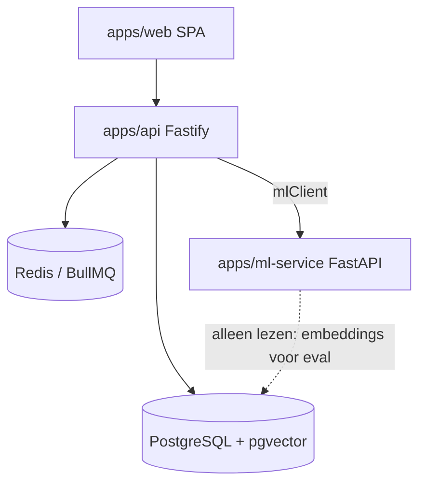
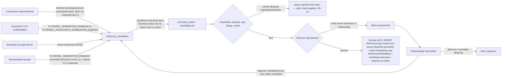
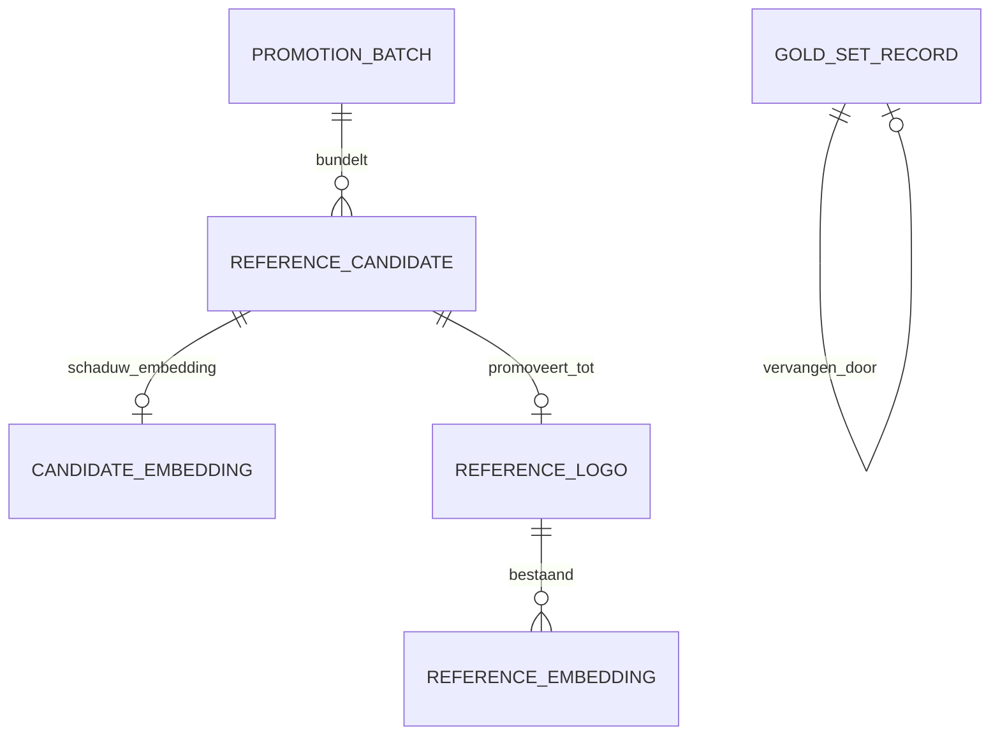

# Architecture Spine — Referentie-vliegwiel zonder review

## Design Paradigm

**Idempotente batch-pipeline met poortwachter**: nominate → batch → gate → promote. Volledig gescheiden van de live-detectiestroom; geen event-sourcing, geen streaming. Laag-mapping:

| Laag | Woont in |
| --- | --- |
| Nominatie (hooks in bestaande flows) | `apps/api/src/services/artwork-crosscheck.ts` (import/detectie), kruischeck-pad (12.8), bootstrap-job |
| Vliegwiel-state & orkestratie | `apps/api/src/services/flywheel/` + `apps/api/src/services/pipeline/` (BullMQ) |
| Stateless compute (pHash, centroid, regressie-eval) | `apps/ml-service/app/` (api/ + services/) |
| Besturing (dashboard) | `apps/web/src/pages/` — route `/flywheel` |

## Invariants & Rules

Afhankelijkheidsrichting (wie mag van wie afhangen):



`ml-service` schrijft nooit vliegwiel-tabellen; `web` praat nooit rechtstreeks met `ml-service` of de database.

*Voetnoot bij "ML -.-> PG alleen lezen":* dit geldt bij `FLYWHEEL_NOMINATION_ENABLED=true`. Er bestaat een gedocumenteerd legacy-schrijfpad: zolang de vlag uit staat schrijft ml-service (`similarity.py::register_crop_as_reference`, Story 12.3) bij reviewstation-accepts nog rechtstreeks `reference_logos`/`reference_embeddings` (zie AD-1/AD-2).

### AD-1 — Batch-pipeline met poortwachter als paradigma

- **Binds:** all
- **Prevents:** realtime-koppelingen van vliegwiel-logica op de live-detectieflow; per-detectie-promoties.
- **Rule:** Alle vliegwiel-verwerking loopt via de keten nominate → batch → gate → promote; de batch is de enige eenheid van promotie, quarantaine en rollback. Er bestaat geen pad van detectie rechtstreeks naar actieve referentie zodra de hoofdvlag aan staat. **Bestaande werkelijkheid (legacy-pad 12.3):** vandaag schrijft ml-service (`similarity.py::register_crop_as_reference`, Story 12.3) bij een reviewstation-accept rechtstreeks `reference_logos`/`reference_embeddings` — buiten elke poort om. Met `FLYWHEEL_NOMINATION_ENABLED=true` wordt dit pad omgebogen: een reviewstation-accept nomineert (kandidaat-referentie met herkomst `review`) in plaats van direct te registreren. Met de vlag uit blijft het legacy-gedrag ongewijzigd (geleidelijke migratie).

### AD-2 — API bezit alle vliegwiel-state [ADOPTED]

- **Binds:** all
- **Prevents:** twee schrijvers op één entiteit; state-logica verspreid over services.
- **Rule:** `apps/api` (Fastify + Prisma) is exclusieve eigenaar van alle vliegwiel-state in PostgreSQL. `apps/ml-service` is stateless compute (embeddings, gate, pHash, centroid/outlier, regressie-meting) en schrijft nooit vliegwiel-tabellen. Bestaande realiteit (API-owns-Postgres) geratificeerd, met één gedocumenteerde legacy-uitzondering op de referentie-tabellen: het 12.3-pad waarin ml-service bij reviewstation-accepts rechtstreeks `reference_logos`/`reference_embeddings` schrijft. Met `FLYWHEEL_NOMINATION_ENABLED=true` is dat pad omgebogen naar nominatie (herkomst `review`) en schrijft ml-service geen referentie-tabellen meer; met de vlag uit blijft het legacy-gedrag ongewijzigd (AD-1).

### AD-3 — ReferenceLogo blijft de enige bron van actieve referenties

- **Binds:** FR-1, FR-2, FR-4, FR-6, datamodel
- **Prevents:** status-vlaggen verspreid over bestaande tabellen; een tweede "actieve referenties"-administratie; promotie-, rollback- en detectie-stories die elk een eigen mechaniek verzinnen (adversarial F2, rubric B-2).
- **Rule:** Actieve referenties (gecureerd én gepromoveerd) leven uitsluitend in `ReferenceLogo`. Kandidaat-lifecycle leeft uitsluitend in nieuwe tabellen: `reference_candidates` (status-machine, zie AD-16; evidence JSONB, herkomst crosscheck/kruischeck/bootstrap/review), `promotion_batches` (status pending/passed/quarantined/rolled_back, poort-uitkomsten JSONB, baseline-meting), `hard_negatives` (inhouds-hash uniek), `gold_set_records` (immutable, vervangings-verwijzing).
- **Promotie-mechaniek (geratificeerd op de echte tabel — `ReferenceLogo` heeft géén status-kolom en krijgt er geen):** promotie is één atomaire transactie: (1) INSERT `ReferenceLogo` met `active=true` en `source='flywheel-promotion'`, variantLabel-conventie `auto-{batchShortId}-{seq}` — let op: `{batchShortId}` en `{seq}` zijn hier bewuste naamconventie-placeholders (korte batch-id + volgnummer), géén template-tokens in code; botsingsvrij binnen bestaande `@@unique([t3777Code, variantLabel])` — (2) INSERT `ReferenceEmbedding` als kopie van de embedding-vector uit `candidate_embeddings` — géén herberekening, zodat de poort exact meet wat live gaat; de embedding-modelversie wordt in de evidence vastgelegd — (3) kandidaat-status → `promoted` via conditional update (AD-16). Zonder alle drie de stappen bestaat er geen promotie.
- **Rollback-mechaniek:** rollback = `active=false` op de gepromoveerde referenties van de batch (bestaand soft-delete-patroon dat de matcher-queries in ml-service en API al filteren); nooit DELETE. Her-promotie na rollback krijgt een nieuw variantLabel (uniek per batch), zodat `@@unique([t3777Code, variantLabel])` nooit botst met inactieve rijen.

### AD-4 — Gold-set in PostgreSQL

- **Binds:** FR-3, FR-10, FR-11
- **Prevents:** een groeiende meetset in statische repo-bestanden; twee resoluties van "de actieve gold-set" (tombstone-traversal vs. nieuwste-per-sleutel) die de poortmeting niet-reproduceerbaar maken (adversarial F7).
- **Rule:** Gold-set-opslag is PostgreSQL (`gold_set_records`), met eenmalige seed-import van de 91 bestaande JSON-samples plus de declaratie-goudstandaard (74 GTINs). De repo-bestanden worden read-only legacy met verwijzing. **Ketenresolutie:** de actieve gold-set heeft exact één canonieke definitie — uitsluitend records zónder opvolger (`replacedById IS NULL`); vervanging zet `replacedById` op het oude record (de enige toegestane mutatie op een verder immutable record, dus geen keten-traversal nodig). De resolutie gebeurt in `apps/api` (`services/flywheel/gold-set.ts`); ml-service ontvangt de geresolvede set als request-payload van `/ml/regression-eval` en leest de gold-set-tabellen nooit zelf.

### AD-5 — Regressietest als schaduw-evaluatie

- **Binds:** FR-3, FR-4
- **Prevents:** mutatie van de actieve referentieset tijdens meting; "tijdelijk activeren en terugrollen"; dubbeltelling van gepromoveerde embeddings in de eval (adversarial F2); een stuurloze baseline na rollback (adversarial F6).
- **Rule:** Kandidaat-embeddings staan in eigen tabel `candidate_embeddings` (pgvector, via API geschreven). De regressie-eval in ml-service bevraagt actieve `ReferenceEmbedding` UNION de schaduwset, zonder mutatie van de actieve set. **Schaduwset-definitie:** uitsluitend de `candidate_embeddings` van kandidaten in de batch-onder-meting die nog niet zijn afgehandeld (status `in_batch`, AD-16) — nooit gepromoveerde of afgewezen kandidaten, zodat een embedding nooit tegelijk als actief én als schaduw meetelt. Meting per batch vastgelegd op `promotion_batches`. **Baseline-eigenaarschap:** de baseline-meting is een veld op de gepasseerde batch (`promotion_batches.baselineMeasurement`); de vergelijkings-baseline voor een nieuwe batch is die van de meest recente batch met status `passed`. Rollback van een batch herstelt de baseline daarmee automatisch naar die van de laatst overgebleven gepasseerde batch (`rolled_back`-batches tellen nooit mee als baseline-bron). **Baseline-invalidatie:** élke mutatie van de actieve referentieset buiten batch-promotie om — handmatige curatie/upload, outlier-deactivatie, rollback (óók van een niet-recente batch), en legacy-12.3-registratie zolang de hoofdvlag uit staat — markeert de baseline als verouderd; de eerstvolgende poortrun begint dan met een verse nulmeting op de actuele actieve set vóór hij batches meet. **Self-match-guard:** de regressie-eval sluit per query-crop referenties én schaduw-kandidaten met dezélfde inhouds-hash uit (leave-one-out), zodat een gold-set-crop die (later) referentie wordt nooit tegen zichzelf matcht. **Versie-guard:** kandidaten met een embedding-modelversie ≠ de actieve modelversie worden niet gemeten; ze gaan terug naar status `candidate` met een her-embed-taak, en modelactivatie (Epic 9-mechanisme) invalideert openstaande `candidate_embeddings`. [ASSUMPTION: meting = precisie@drempel over de volledige gold-set. Tolerantie is sample-gebaseerd zolang de set klein is: quarantaine bij ≥2 netto verslechterde gold-set-samples; de 1pp-drempel uit de PRD geldt pas vanaf een actieve gold-set ≥200 samples.]

### AD-6 — Orkestratie via BullMQ in de bestaande API-worker [ADOPTED]

- **Binds:** FR-2, FR-8, FR-12, orkestratie
- **Prevents:** een tweede scheduler naast BullMQ (Coolify scheduled task, cron in ml-service); cap-races tussen bootstrap- en promotie-job op dezelfde klasse (adversarial F5).
- **Rule:** De promotielus is een BullMQ repeatable job (nachtelijk) in de bestaande API-worker, naast de bestaande pipeline-queues (`training`, `artwork-detection`; patroon: `createPipelineQueues`). ml-service-aanroepen uitsluitend via de bestaande `MLClient`. Bootstrap-runs en outlier-audit zijn aparte BullMQ jobs met eigen cadans. Geen nieuwe Coolify scheduled task: wie de state bezit, bezit de orkestratie. **Scheduler-API:** nieuwe repeatable jobs gebruiken BullMQ Job Schedulers (`queue.upsertJobScheduler`) — het bestaande `repeat: { pattern }`-patroon (retraining-check) is op de werkelijk geïnstalleerde BullMQ 5.63 gedeprecieerd; bestaande jobs blijven ongemoeid. **Concurrency:** de queue `flywheel` draait met worker-concurrency 1, zodat promotielus, bootstrap en outlier-audit elkaar per definitie uitsluiten (seriële uitvoering volstaat ruim bij deze volumes). De per-klasse cap wordt bovendien ín de promotie-transactie afgedwongen (cap-check + `ReferenceLogo`-INSERT atomair, `SELECT ... FOR UPDATE` of equivalent), zodat ook toekomstige parallellisatie de cap niet kan breken. **Cadans:** `FLYWHEEL_PROMOTION_CRON` default 01:00 Europe/Amsterdam — bewust vóór/buiten het bestaande harvest-venster (~03:23) om ml-service-CPU-concurrentie te vermijden.

### AD-7 — GLN-backfill via batch-export uit prod tradeItems

- **Binds:** FR-21
- **Prevents:** per-GTIN externe API-lookups (traag, belastend) als primaire route.
- **Rule:** Route (a): eenmalige batch-export GTIN→GLN uit prod tradeItems (MongoDB read-only, off-peak) naar `artwork_imports.gln` + Redis-preload van declaraties; terugval (b): re-import via mediaserver-backfill voor het restant. [ASSUMPTION: prod-read governance akkoord — expliciet af te stemmen vóór uitvoering; go/no-go-moment in de betreffende story.]

### AD-8 — 12.8-uitbreiding achter een vlag, verdict-pad ongewijzigd

- **Binds:** FR-1, FR-20
- **Prevents:** dat vliegwiel-implementatie en het 12.8-contract elkaar breken; één vlag die de PRD-uitrolstrategie onmogelijk maakt (kruischeck-voeding hoort pas aan te kunnen ná bewezen promotielus op de importstroom).
- **Rule:** Twee vlaggen. `FLYWHEEL_NOMINATION_ENABLED` (hoofdvlag, default `false`) bestuurt nominaties uit crosscheck/import- én bootstrap-herkomst. `FLYWHEEL_KRUISCHECK_NOMINATION_ENABLED` (aparte vlag, default `false`) bestuurt aanvullend de kruischeck-herkomst en gaat pas aan ná bewezen promotielus op de importstroom (PRD FR-20-uitrolstrategie); kruischeck-nominatie vereist dus beide vlaggen. Het verdict-response-pad blijft volledig ongewijzigd. **Mismatch-registratie volgt dezelfde vlag-scoping:** het crosscheck-pad registreert mismatch-events onder de hoofdvlag; mismatch-registratie op het kruischeck-pad valt onder `FLYWHEEL_KRUISCHECK_NOMINATION_ENABLED` — met die vlag uit schrijft het kruischeck-pad niets (het verdict-pad blijft contract-conform).

### AD-9 — Beeld- en vectorberekeningen alleen in ml-service

- **Binds:** FR-7, FR-8, FR-9, FR-12
- **Prevents:** gedupliceerde vectorlogica in Node.
- **Rule:** Alle beeld- en vectorberekeningen (imagehash/pHash, pgvector-cosine, klasse-centroid) draaien in ml-service; de API roept aan en beslist op de geretourneerde scores. Drempels als env-config met PRD-startwaarden (promotie 0,90; bootstrap 0,93; dedup Hamming strak / cosine ≥ 0,97; outlier top-5%-percentiel).

### AD-10 — Dashboard binnen de bestaande SPA met antd 5 [ADOPTED]

- **Binds:** FR-17, FR-18, FR-19, UX Foundation
- **Prevents:** shadcn-migratie of een aparte frontend voor één scherm.
- **Rule:** Route `/flywheel` in de bestaande SPA; antd 5 + `ConfigProvider`-theming met XXtract-tokens; data uitsluitend via de nieuwe read-endpoints `/api/v1/flywheel/*`.

### AD-11 — Fail-closed poort en persistente pauze

- **Binds:** FR-3, FR-19, NFR fail-closed
- **Prevents:** "bij twijfel door" wanneer een meting of dienst faalt; pauze die bij herstart verdampt; een pauze die de ene job wél en de andere níet gehoorzaamt (adversarial F8).
- **Rule:** Elke poortstap die niet kan meten of bereiken blokkeert de batch (status `quarantined`, reden `systeem-fout`). De pauzestand is persistent in de database zodat herstart de pauze niet opheft. **Pauze-scope:** de pauzestand blokkeert nominatie-inserts én batch-verwerking — dus zowel `flywheel-promotion` als `flywheel-bootstrap` (check bij job-start) als de nominatie-hooks. Read-only werk draait door: de outlier-audit en alle dashboard-reads. Het dashboard toont deze scope expliciet. **Stilstand-notificatie (FR-19):** automatische stilstand (quarantaine of pauze door de poort) produceert een notificatie via het bestaande `RetrainingNotification`-patroon (Story 9.2: persistente notificatie-tabel + Socket.IO) plus een dashboard-banner. [ASSUMPTION uit memlog geratificeerd tegen de code: er bestaat géén `system_settings`-tabel in `apps/api/prisma/schema.prisma`; deze wordt als nieuwe, minimale key/value-tabel `system_settings` geseed — zie Structural Seed.]

### AD-12 — Idempotentie via inhouds-hash en batch-status-machine

- **Binds:** FR-1, FR-2, FR-9, NFR idempotentie
- **Prevents:** dubbele nominaties bij herverwerking; dubbele promoties bij job-retries.
- **Rule:** Nominatie-uniciteit op `(inhouds-hash, t3777Code)`. De inhouds-hash is uitsluitend de canonieke ml-service-hash van AD-14 (de bestaande opslagsleutel hasht bron+bbox en is hier ongeschikt). Batch-runs zijn herstart-veilig via de batch-status-machine; herverwerking van dezelfde GTIN levert geen duplicaat-nominaties. **Afwijzingsredenen gesplitst:** zachte afwijzing (`cap-bereikt`, `duplicaat`, `outlier`) zet de kandidaat op status `rejected` mét reden en schrijft GÉÉN `hard_negatives`-rij; hernominatie is toegestaan via status-reset van de bestáánde rij naar `candidate` (geen nieuwe insert — de `@@unique([contentHash, t3777Code])` blijft kloppen). Een hard-negative ontstaat uitsluitend bij menselijke afkeuring: quarantaine-afkeuring (Story 15.3) en reviewstation-reject wegens "geen keurmerk" (Story 14.1). **Crash-recovery:** de `flywheel-promotion`-job pakt bij start éérst bestaande `pending`-batches op en hervat de poort idempotent per fase (via `gateResults`); pas daarna bundelt hij nieuwe kandidaten.

### AD-13 — Herleidbaarheid via evidence JSONB en flat audit-tabellen

- **Binds:** FR-1, FR-4, FR-5, FR-18, NFR herleidbaarheid/observability
- **Prevents:** referenties zonder herkomst; ongelogde drempelwijzigingen.
- **Rule:** Evidence JSONB per kandidaat (bron-GTIN, bronbestand, bbox, methode, scores, declaratie-uitkomst) en per batch (poort-uitkomsten, metingen, wie/wanneer bij handmatige acties). Drempelwijzigingen in eigen tabel `threshold_changes`. **Memlog-vraag beantwoord (code-sweep):** er bestaat geen generiek audit- of settings-patroon; het bestaande audit-patroon is de per-domein flat audit-log-tabel `ModelActivationLog`/`model_activation_logs` (Epic 9, Story 9.5: entiteit-FK, `userId`, tijdstempel, actie-kolommen, index op tijdstempel Desc). `threshold_changes` volgt exact dat patroon i.p.v. een nieuw generiek mechanisme.

### AD-14 — Eén canonieke inhouds-hash, berekend in ml-service

- **Binds:** FR-1, FR-7, FR-9, NFR idempotentie
- **Prevents:** twee hash-definities (byte-hash in Node vs. pixel-hash in Python) waardoor dedup, idempotentie en hard-negative-blokkade stil falen (adversarial F1 — de spanning AD-9 × AD-12).
- **Rule:** De inhouds-hash heeft exact één implementatie: ml-service `/ml/phash` (`app/services/phash.py::content_hash`), gedefinieerd als SHA-256 over de pixel-buffer na gepinde normalisatie (RGB, vaste resize N×N met vastgelegde interpolatie, vastgelegde bibliotheek + versie — Pillow/ImageHash conform Stack). De API berekent nóóit zelf een inhouds-hash. Nominatie roept `/ml/phash` **synchroon** aan vóór de INSERT en slaat de geretourneerde hash op; alle tabellen (`reference_candidates`, `hard_negatives`) gebruiken uitsluitend deze hash. Is `/ml/phash` onbereikbaar of faalt de berekening, dan wordt de nominatie geweigerd (fail-closed, conform AD-11) — er bestaat geen fallback-hash in Node.

### AD-15 — Uitsluitend de flywheel-worker instantieert promotiebatches

- **Binds:** FR-2, FR-4, FR-17, FR-19
- **Prevents:** poortlogica in het HTTP-request-pad; dezelfde kandidaat in twee batches tegelijk; racende poort-executies tussen dashboard-vrijgave en de nachtelijke sweep (adversarial F3).
- **Rule:** Promotiebatches worden uitsluitend geïnstantieerd en door de poort gevoerd door de BullMQ-worker (queue `flywheel`). API-endpoints — inclusief `candidates/:id/decision` en quarantaine-vrijgave — muteren alleen kandidaat-status en enqueue-en hoogstens werk; ze draaien nooit poortlogica in het request-pad. **Claim-semantiek via `promotionBatchId`:** een kandidaat kan alleen gebundeld worden als hij in geen enkele niet-afgesloten batch zit; bundeling zet de FK in dezelfde transactie als de batch-toewijzing. Een kandidaat zit daarmee in hoogstens één niet-afgesloten batch. **Verduidelijking rollback:** het verbod betreft poort-executie (guardrails/regressietest) in het request-pad; rollback (AD-3-mechaniek: `active=false` + batch-status + baseline-terugval) is een toegestane, gelogde statusmutatie via endpoint (`batches/:id/rollback`) — géén poort-executie.

### AD-16 — Kandidaat-status-machine met conditional updates

- **Binds:** FR-1, FR-2, FR-4, NFR herleidbaarheid
- **Prevents:** dashboard-decision en batch-job die dezelfde kandidaat overschrijven — een kandidaat die tegelijk hard-negative én actieve referentie wordt, met een genegeerde menselijke beslissing (adversarial F4).
- **Rule:** `reference_candidates.status` volgt een expliciete status-machine: `candidate → in_batch → promoted | rejected`, plus twee terugkeer-overgangen: `in_batch → candidate` (vrijgave, o.a. quarantaine-vrijgave en versie-guard AD-5) en `rejected → candidate` (hernominatie-reset, uitsluitend bij zachte afwijzingsredenen — AD-12). Een batch geldt als **afgesloten** zodra zijn status ≠ `pending`. Elke overgang is een conditional update (optimistic: `UPDATE ... WHERE status = <verwachte status>`; 0 rows affected = kandidaat overslaan, nooit overschrijven). Het decision-endpoint geeft HTTP 409 op kandidaten in een batch in verwerking (status `in_batch`, batch `pending`). Elke statusovergang logt oude + nieuwe status in evidence (AD-13).

## Constraints (bindende randvoorwaarden)

1. **Migratie-toestemming (teamregel).** DB-migraties alleen met expliciete toestemming per geval. Alle schemawijzigingen worden per story gebundeld als Prisma-migratie die de gebruiker zelf goedkeurt/draait; stories nemen dit als expliciete taak op. Nooit auto-migrate.
2. **ml-service Docker kopieert alleen `app/`.** Alle nieuwe ml-service-code onder `apps/ml-service/app/` (api/ en services/, nooit scripts/) — les uit het queue-harvester-incident.

## Operationele envelope

Expliciet beslist (rubric B-1 — deze dimensie mag niet stil door stories worden ingevuld):

1. **Deployment (ACC):** ACC draait pre-built ghcr-images uit de GitHub Actions-workflow "Build and Push Docker Images". Elke deploy wacht op het succesvol afronden van die workflow vóórdat de Coolify-deploy start — anders draait oude code. Bestaande teampraktijk, hier geratificeerd; geldt voor api-, web- én ml-service-wijzigingen (ml-service-image rebuildt bij `app/`-wijzigingen, constraint 2).
2. **Migratie-uitvoerpad:** Prisma-migraties landen per release en worden **handmatig** uitgevoerd (`prisma migrate deploy`) ná expliciete toestemming per geval (constraint 1, teamregel). NOOIT via container-startup of auto-migrate.
3. **Eenmalige seeds:** de gold-set-import (AD-4: 91 samples + 74 GTINs) en de GLN-export (AD-7) zijn idempotente, handmatig gestarte scripts met een droge-run-optie; nooit automatisch bij deploy of migratie.
4. **Operationele bewaking (watchdog):** het overview-endpoint toont de "laatste succesvolle run" van de flywheel-promotion-job; een lichte repeatable check produceert een notificatie via het bestaande `RetrainingNotification`-patroon (Story 9.2: persistente notificatie-tabel + Socket.IO) plus een dashboard-banner zodra die laatste succesvolle run >26 uur oud is — een stil gestorven promotielus is daarmee zichtbaar buiten het dashboard om (zelfde mechanisme als de FR-19-stilstand-notificatie in AD-11).
5. **Deploy-volgorde per story:** wanneer een story meerdere apps raakt is de uitrolvolgorde ml-service → api → web, zodat nieuwe endpoints bestaan vóórdat hun aanroepers live gaan.

## Consistency Conventions

| Concern | Convention |
| --- | --- |
| Prisma-modellen | PascalCase model + `@@map` snake_case tabel; kolommen camelCase + `@map` snake_case; `@db.Uuid` met `gen_random_uuid()`; `@db.Timestamptz`; index `createdAt(sort: Desc)` (bestaand patroon) |
| Statusvelden | `String @db.VarChar(20)` met vaste waardenset, geen Prisma-enum (patroon `ArtworkReviewItem.status`) |
| API-routes | Nieuw routebestand `apps/api/src/api/v1/flywheel.ts` → `/api/v1/flywheel/*` (bestaand v1-patroon) |
| ml-service-routes | Nieuwe router `apps/ml-service/app/api/flywheel.py`, geregistreerd in `main.py` met prefix `/ml` (bestaand patroon) |
| ml-aanroepen vanuit API | Uitsluitend via methoden op de bestaande `MLClient` (`apps/api/src/services/ml-client.ts`) |
| Env-config | Vlaggen en drempels met prefix `FLYWHEEL_` (bijv. `FLYWHEEL_NOMINATION_ENABLED`, `FLYWHEEL_PROMOTION_THRESHOLD`) |
| Evidence/JSON | `Json`-kolommen met `@default("{}")` (bestaand patroon `ArtworkImport.pages`) |
| Dashboard-teksten | NL-only via i18next-keys; glossary-termen exact conform PRD §3 |
| GS1-gidsbeelden | Uitsluitend in het bootstrap-zoekpad; nooit in exports, API-responses of rapporten (FR-16) — exports en rapporten bevatten uitsluitend eigen crop-paden |

## Stack

Versies zijn de **geïnstalleerde lockfile-werkelijkheid** (`pnpm-lock.yaml` / `requirements.txt`), niet manifest-ranges (reality-check F-1).

| Name | Version (lockfile) |
| --- | --- |
| TypeScript (api / web) | 5.7.2 |
| Fastify | 4.29.1 |
| Prisma / @prisma/client | 5.22.0 |
| BullMQ / ioredis | 5.63.0 / 5.8.2 |
| PostgreSQL + pgvector | vector(512), bestaand |
| FastAPI / uvicorn | 0.109.0 / 0.27.0 |
| torch / torchvision | 2.1.2 / 0.16.2 |
| antd / react | 5.22.5 / 18.3.1 |
| ImageHash (pHash) | nieuw — pinnen als `ImageHash==4.3.2` (puur-Python op numpy/scipy/Pillow, alle al aanwezig) |

## Structural Seed

### Promotielus (kernflow)



### Nieuwe tabellen (sleutel-kolommen en relaties, meer niet)



| Tabel | Sleutel-kolommen |
| --- | --- |
| `reference_candidates` | id, t3777Code, status (candidate/in_batch/promoted/rejected — status-machine AD-16), origin (crosscheck/kruischeck/bootstrap/review), contentHash (canonieke hash AD-14), cropPath, evidence Json, promotionBatchId FK? (claim-semantiek AD-15: hoogstens één niet-afgesloten batch; kolom nullable, in 13.2 zonder FK-constraint — de constraint volgt in de 13.4-migratie), referenceLogoId FK?, createdAt — `@@unique([contentHash, t3777Code])` |
| `candidate_embeddings` | id, referenceCandidateId FK, embedding vector(512) — bij promotie gekopieerd naar `ReferenceEmbedding`, nooit herberekend (AD-3) |
| `promotion_batches` | id, status (pending/passed/quarantined/rolled_back), gateResults Json, baselineMeasurement Json (baseline-bron zolang laatst gepasseerde batch, AD-5), createdAt, closedAt? |
| `hard_negatives` | id, contentHash (uniek, canonieke hash AD-14), t3777Code, cropPath, reason, evidence Json, createdAt — uitsluitend gevuld door menselijke afkeuring (AD-12) |
| `gold_set_records` | id, label (ECHT/VALS), t3777Code, cropPath, source, decidedBy, replacedById FK→self? (gezet op het oude record bij vervanging — de enige toegestane mutatie), createdAt — records verder immutable (AD-13, FR-10); actieve set = `replacedById IS NULL` (AD-4) |
| `threshold_changes` | id, thresholdKey, oldValue, newValue, reason, userId, changedAt — patroon `model_activation_logs` (AD-13) |
| `system_settings` | key PK, value Json, updatedAt, updatedBy — nieuw minimaal (AD-11: persistente pauze) |
| `mismatch_events` | id, gtin, gln, t3777Code, type (confirmed/declared-not-found/not-supported/found-not-declared — volledige uitkomst-typeset zodat de FR-14-ratio bevestigd/niet-gevonden berekenbaar is), confidence, origin/runId, createdAt — eigenaar API (AD-2); geschreven door het crosscheck- én het kruischeck-pad; één gedeeld contract voor registratie (FR-14), werkvoorraad (FR-15), export (FR-16) en dashboard (FR-17) |
| `outlier_findings` | id, auditRunAt, referenceLogoId FK, distance, percentile, status (open/behouden/gedeactiveerd), decidedBy?, decidedAt?, createdAt — eigenaar API (AD-2) |
| `bootstrap_queue` | id, t3777Code (uniek), declarationFrequency, status (wachtend/gedraaid/gevuld/leeg/uitgesloten), priorityOverride?, excluded bool, lastRunAt?, createdAt — eigenaar API (AD-2) |

### Nieuwe API-endpoints

`/api/v1/flywheel/` — `overview` · `batches` · `batches/:id` · `batches/:id/rollback` (toegestane, gelogde statusmutatie — AD-15-verduidelijking) · `candidates/:id/decision` (409 op kandidaten in verwerking, AD-16; muteert alleen status en enqueue-t hoogstens werk, AD-15) · `outliers/:id/decision` · `bootstrap-queue` (GET + mutaties: volgorde/uitsluiten/toevoegen) · `reports/data-quality` (FR-16-export) · `thresholds` · `pause` (routebestand `apps/api/src/api/v1/flywheel.ts`).

### Nieuwe BullMQ jobs (queue `flywheel`, naast `training` en `artwork-detection`)

| Job | Cadans |
| --- | --- |
| `flywheel-promotion` | repeatable, nachtelijk |
| `flywheel-bootstrap` | on-demand / gequeued per lege klasse |
| `flywheel-outlier-audit` | repeatable, wekelijks |

### Nieuwe ml-service-endpoints (router `app/api/flywheel.py`, prefix `/ml`)

`/ml/phash` (inhouds-hash + perceptual hash — de enige inhouds-hash-implementatie, AD-14) · `/ml/outlier-audit` (klasse-centroid + afstanden) · `/ml/regression-eval` (gold-set-meting: actief UNION schaduwset; ontvangt de geresolvede gold-set als payload, AD-4).

### Source-tree (alleen nieuw)

```text
apps/
  api/src/
    api/v1/flywheel.ts            # /api/v1/flywheel/*
    services/flywheel/            # nominatie, batch-status-machine, poort, rollback, gold-set
    services/pipeline/            # bestaand — queue 'flywheel' + workers toevoegen
  ml-service/app/
    api/flywheel.py               # /ml/phash, /ml/outlier-audit, /ml/regression-eval
    services/                     # phash.py, outlier.py, regression_eval.py (onder app/! — constraint 2)
  web/src/pages/
    FlywheelPage.tsx              # /flywheel overzicht (flat-page-conventie)
    FlywheelBatchDetailPage.tsx   # /flywheel/batches/:id
```

## Capability → Architecture Map

| Capability | Lives in | Governed by |
| --- | --- | --- |
| FR-1/FR-20 nominatie | crosscheck-hook + kruischeck-pad → `services/flywheel/` | AD-1, AD-2, AD-8, AD-12, AD-14, AD-16 |
| FR-2/FR-3/FR-4 batch, poort, rollback | `services/flywheel/` + job `flywheel-promotion` + `/ml/regression-eval` | AD-1, AD-3, AD-5, AD-6, AD-11, AD-13, AD-15, AD-16 |
| FR-5/FR-6 drempels en caps | env-config + `threshold_changes` + poortlogica (cap ín de promotie-transactie) | AD-6, AD-9, AD-13 |
| FR-7/FR-8/FR-9 dedup, outlier, hard-negatives | `/ml/phash`, `/ml/outlier-audit` + `hard_negatives` | AD-9, AD-12, AD-14 |
| FR-10/FR-11 gold-set | reviewstation-hook → `gold_set_records` | AD-4, AD-13 |
| FR-12/FR-13 bootstrap | job `flywheel-bootstrap` | AD-6, AD-8, AD-9 |
| FR-14 t/m FR-16 mismatch-stromen | crosscheck- + kruischeck-pad → `mismatch_events` (Structural Seed) + `services/flywheel/` | AD-2, AD-13 |
| FR-17 t/m FR-19 dashboard/besturing | `/flywheel`-pagina's + `/api/v1/flywheel/*` | AD-10, AD-11 |
| FR-21 GLN-backfill | eenmalige batch-export → `artwork_imports.gln` | AD-7 |

## Deferred

Bewust niet beslist op dit altitude (memlog-direction + spine-keuzes):

- **DINOv2-backbone-migratie** — aparte spike (PRD OQ-4), geen voorwaarde voor de lus.
- **Zero-shot region proposer** — vervolgtraject voor de lokalisatie-bottleneck (PRD OQ-5).
- **Externe leverancier-terugkoppeling** — FR-16 blijft intern rapport; productisering pas na intern bewijs.
- **Automatische drempel-adaptatie** — v1 is handmatig regime met logging.
- **39k-bulk-run-capaciteitsplanning** — operationeel vervolgwerk zodra GLN-dekking er is.
- **Endpoint-payloadcontracten** — request/response-schema's per story; de spine fixeert alleen paden en eigenaarschap.
- **Batch-cadans/-grootte-optimum en per-klasse regressiemeting** — PRD OQ-1/OQ-2, kalibreren in de eerste draai-weken.
- **Referentie-veroudering en notificatiekanalen buiten het dashboard** — PRD OQ-6 resp. v2.

## Open Questions

1. **Governance-akkoord prod-read (AD-7):** de eenmalige MongoDB-read op prod tradeItems vergt expliciete goedkeuring; niet uit code of documenten te beantwoorden — go/no-go-moment in de GLN-backfill-story.
