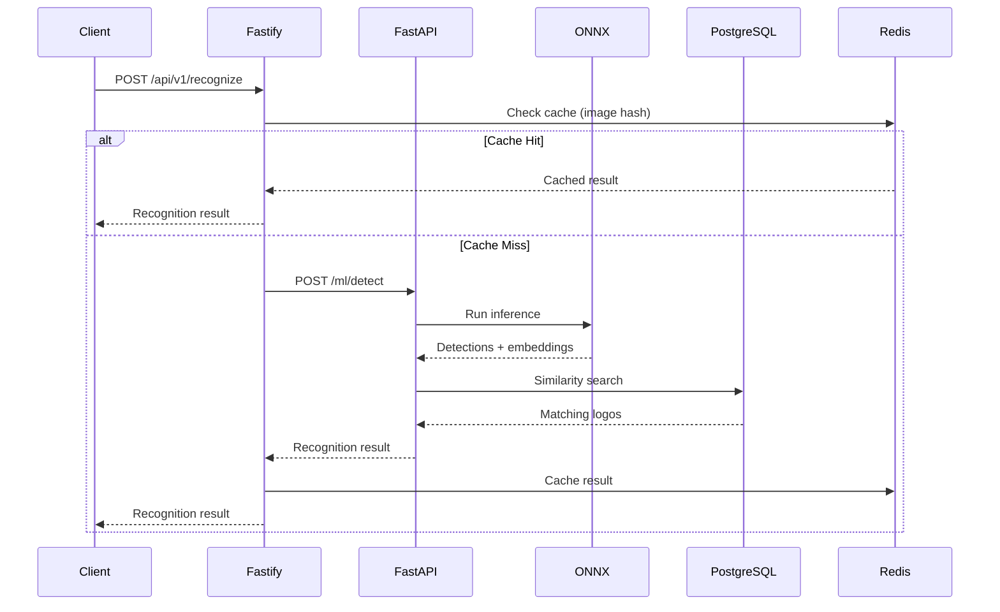
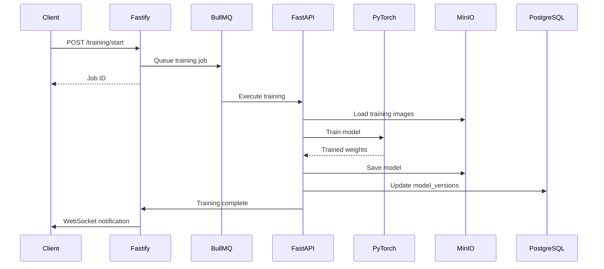

# Logo Recognition System - Current Architecture

**Version:** 2.0.0
**Date:** 2025-12-05
**Status:** Active Development (Refactor Branch)
**Author:** Winston (System Architect)

---

## 1. Executive Summary

This document reflects the **actual current state** of the Logo Recognition System architecture after the refactor that removed the legacy Python backend. It serves as the source of truth for development decisions.

### 1.1 Architecture Overview

```
┌─────────────────────────────────────────────────────────────────────┐
│                         CLIENT LAYER                                │
├─────────────────────────────────────────────────────────────────────┤
│  React 18.3 + TypeScript + Vite    │    External API Clients        │
│  (Zustand + TanStack Query)        │    (REST / WebSocket)          │
└────────────────┬───────────────────┴────────────────┬───────────────┘
                 │                                    │
                 ▼                                    ▼
┌─────────────────────────────────────────────────────────────────────┐
│                       API GATEWAY LAYER                             │
├─────────────────────────────────────────────────────────────────────┤
│  Fastify (Node.js)                                                  │
│  - REST API endpoints                                               │
│  - WebSocket connections                                            │
│  - Rate limiting + CORS + Helmet                                    │
│  - Request routing to ML Service                                    │
└────────────────┬───────────────────┬────────────────────────────────┘
                 │                   │
                 ▼                   ▼
┌────────────────────────┐  ┌────────────────────────────────────────┐
│    ML SERVICE LAYER    │  │           DATA LAYER                   │
│    (Python/FastAPI)    │  ├────────────────────────────────────────┤
├────────────────────────┤  │  PostgreSQL 16 + pgvector              │
│  - Logo Detection      │  │  - Vector embeddings (512-dim)         │
│  - Training Pipeline   │  │  - Training data                       │
│  - ONNX Inference      │  │  - Model versions                      │
│  - Few-shot Learning   │  ├────────────────────────────────────────┤
└────────────────────────┘  │  Redis 7                               │
         │                  │  - Session cache                       │
         ▼                  │  - Job queue (BullMQ)                  │
┌────────────────────────┐  ├────────────────────────────────────────┤
│  Background Workers    │  │  MinIO/S3                              │
│  (BullMQ + Python)     │  │  - Image storage                       │
│  - Training jobs       │  │  - Model artifacts                     │
│  - Batch processing    │  │  - Embeddings cache                    │
└────────────────────────┘  └────────────────────────────────────────┘
```

---

## 2. Technology Stack

### 2.1 Current Implementation

| Layer | Technology | Version | Status |
|-------|-----------|---------|--------|
| **Frontend** | React | 18.3.1 | ✅ Active |
| | TypeScript | 5.7.2 | ✅ Active |
| | Vite | 6.0.3 | ✅ Active |
| | Zustand | 5.0.2 | ✅ Active |
| | TanStack Query | 5.62.0 | ✅ Active |
| | Ant Design | 5.22.5 | ✅ Active |
| | Konva | 9.3.2 | ✅ Active |
| **API Gateway** | Fastify | 4.24.3 | ✅ Active |
| | Node.js | 22.x | ✅ Active |
| | BullMQ | 5.1.9 | ⚠️ Configured |
| | Prisma | 5.9.1 | ⚠️ Needs Schema |
| **ML Service** | FastAPI | 0.100+ | 🔴 To Build |
| | PyTorch | 2.0+ | 🔴 To Build |
| | ONNX Runtime | 1.16+ | 🔴 To Build |
| **Data** | PostgreSQL | 16 | ✅ Schema Ready |
| | pgvector | 0.5+ | ✅ Configured |
| | Redis | 7.x | ⚠️ Needs Docker |
| | MinIO | latest | ⚠️ Needs Docker |
| **Monitoring** | Prometheus | latest | ✅ Config Ready |
| | Grafana | latest | ⚠️ Needs Docker |

### 2.2 Monorepo Structure

```
logoRecognition/
├── apps/
│   ├── api/                 # Fastify API Gateway (Node.js)
│   │   ├── src/
│   │   │   ├── api/v1/      # REST endpoints
│   │   │   ├── core/        # Logger, telemetry
│   │   │   ├── middleware/  # Auth, tracing
│   │   │   ├── services/    # Business logic
│   │   │   └── main.ts      # Entry point
│   │   └── package.json
│   │
│   ├── web/                 # React Frontend
│   │   ├── src/
│   │   │   ├── components/
│   │   │   ├── pages/
│   │   │   ├── stores/
│   │   │   ├── services/
│   │   │   └── hooks/
│   │   └── package.json
│   │
│   └── ml-service/          # Python ML Service (TO BUILD)
│       ├── app/
│       │   ├── api/
│       │   ├── ml/
│       │   ├── services/
│       │   └── main.py
│       ├── requirements.txt
│       └── Dockerfile
│
├── packages/
│   ├── shared/              # Shared TypeScript types
│   ├── ui/                  # Shared UI components
│   └── ml/                  # ML utilities (TypeScript)
│
├── infrastructure/
│   ├── docker/              # Service configurations
│   ├── kubernetes/          # K8s manifests
│   └── monitoring/          # Prometheus/Grafana
│
└── docs/
    ├── 01-product/
    ├── 02-architecture/     # This document
    └── 03-development/
```

---

## 3. Service Architecture

### 3.1 API Gateway (Fastify)

The API Gateway handles all external communication and routes requests to appropriate services.

**Responsibilities:**
- REST API endpoints for clients
- WebSocket connections for real-time updates
- Authentication and authorization
- Rate limiting and security headers
- Request routing to ML Service
- Response aggregation

**Current Endpoints:**
```
GET  /health                    # Health check
POST /api/v1/recognize          # Logo recognition (→ ML Service)
POST /api/v1/training/upload    # Upload training images
POST /api/v1/training/annotate  # Save annotations
POST /api/v1/training/start     # Start training job
WS   /api/v1/ws                 # Real-time updates
```

### 3.2 ML Service (FastAPI) - TO BUILD

The ML Service handles all machine learning operations.

**Responsibilities:**
- Logo detection using EfficientDet-D4
- Few-shot learning for new logos
- ONNX model inference
- Vector embedding generation
- Training pipeline execution

**Proposed Endpoints:**
```
POST /ml/detect                 # Detect logos in image
POST /ml/embed                  # Generate embeddings
POST /ml/train                  # Train on new data
GET  /ml/models                 # List available models
POST /ml/models/{id}/activate   # Activate model version
GET  /ml/health                 # ML service health
```

### 3.3 Communication Patterns

```
┌──────────┐     REST      ┌──────────┐     REST      ┌──────────┐
│  Client  │──────────────▶│ Fastify  │──────────────▶│ FastAPI  │
└──────────┘               └──────────┘               └──────────┘
     │                          │                          │
     │      WebSocket           │                          │
     │◀─────────────────────────│                          │
     │                          │                          │
                                │      BullMQ              │
                                │─────────────────────────▶│
                                │   (async jobs)           │
```

---

## 4. Data Architecture

### 4.1 Database Schema (PostgreSQL)

Based on `infrastructure/docker/postgres/init.sql`:

```sql
-- Schema: logos
├── logo_images           # Main image storage with embeddings
│   ├── id (UUID)
│   ├── filename
│   ├── storage_path
│   ├── embedding (vector 512)
│   ├── metadata (JSONB)
│   ├── brand_name
│   └── confidence_score
│
├── training_data         # Training annotations
│   ├── id (UUID)
│   ├── image_id (FK)
│   ├── label
│   ├── confidence
│   └── validated
│
├── model_versions        # ML model tracking
│   ├── id (UUID)
│   ├── version
│   ├── model_type
│   ├── accuracy/precision/recall/f1
│   └── is_active
│
└── search_history        # Analytics

-- Schema: monitoring
├── query_stats           # Query performance
├── health_checks         # Service health
└── backup_history        # Backup tracking
```

### 4.2 Vector Search

Using pgvector for similarity search:

```sql
-- Similarity search function
SELECT * FROM logos.similarity_search(
    query_embedding := '[0.1, 0.2, ...]'::vector,
    limit_count := 10
);
```

### 4.3 Caching Strategy

| Data Type | Storage | TTL | Purpose |
|-----------|---------|-----|---------|
| Session data | Redis | 24h | User sessions |
| Recognition results | Redis | 1h | Avoid reprocessing |
| Embeddings | Redis | 7d | Fast similarity lookup |
| Model artifacts | MinIO | ∞ | Persistent storage |

---

## 5. ML Pipeline Architecture

### 5.1 Recognition Flow



### 5.2 Training Flow



---

## 6. Security Architecture

### 6.1 Authentication Flow

```
┌─────────┐    ┌─────────┐    ┌─────────┐    ┌─────────┐
│ Client  │───▶│ Fastify │───▶│  Auth   │───▶│  Redis  │
│         │    │         │    │ Service │    │(session)│
└─────────┘    └─────────┘    └─────────┘    └─────────┘
                    │
                    ▼
              JWT in httpOnly
              cookie
```

### 6.2 Security Measures

| Layer | Measure | Implementation |
|-------|---------|----------------|
| Transport | TLS 1.3 | Nginx/Traefik |
| API | Rate limiting | @fastify/rate-limit |
| API | CORS | @fastify/cors |
| API | Security headers | @fastify/helmet |
| Auth | JWT | httpOnly cookies |
| Data | Encryption at rest | PostgreSQL TDE |
| Storage | Pre-signed URLs | MinIO policies |

---

## 7. Deployment Architecture

### 7.1 Development Environment

```yaml
# docker-compose.yml
services:
  web:        # React frontend (:3000)
  api:        # Fastify gateway (:8000)
  ml-service: # FastAPI ML (:8001)
  postgres:   # Database (:5432)
  redis:      # Cache (:6379)
  minio:      # Storage (:9000)
  prometheus: # Metrics (:9090)
  grafana:    # Dashboards (:3001)
```

### 7.2 Production Environment

```
┌─────────────────────────────────────────────────────┐
│                    Load Balancer                     │
│                   (Nginx/Traefik)                    │
└─────────────────────────┬───────────────────────────┘
                          │
          ┌───────────────┼───────────────┐
          ▼               ▼               ▼
    ┌──────────┐    ┌──────────┐    ┌──────────┐
    │ Fastify  │    │ Fastify  │    │ Fastify  │
    │ (pod 1)  │    │ (pod 2)  │    │ (pod 3)  │
    └────┬─────┘    └────┬─────┘    └────┬─────┘
         │               │               │
         └───────────────┼───────────────┘
                         ▼
              ┌─────────────────────┐
              │   ML Service Pool   │
              │  (GPU-enabled pods) │
              └─────────────────────┘
```

---

## 8. Gaps and Next Steps

### 8.1 Critical Gaps

| Gap | Priority | Effort | Impact |
|-----|----------|--------|--------|
| ML Service niet gebouwd | P0 | 2-3 weken | Core functionaliteit |
| Prisma schema ontbreekt | P1 | 1-2 dagen | Database integratie |
| Docker Compose incompleet | P1 | 1 dag | Dev environment |
| API routes niet compleet | P2 | 1 week | API functionaliteit |

### 8.2 Recommended Action Plan

1. **Week 1:** Volledige docker-compose + ML service skeleton
2. **Week 2:** Prisma schema + database migraties
3. **Week 3-4:** ML service implementatie (detection + inference)
4. **Week 5:** Training pipeline
5. **Week 6:** Integration testing + monitoring

---

## 9. Change Log

| Date | Version | Description | Author |
|------|---------|-------------|--------|
| 2025-12-05 | 2.0.0 | Complete rewrite reflecting actual state | Winston |
| 2025-09-14 | 1.0.0 | Original architecture (Python-based) | Winston |

---

**Document Status:** Active
**Next Review:** 2025-12-19
