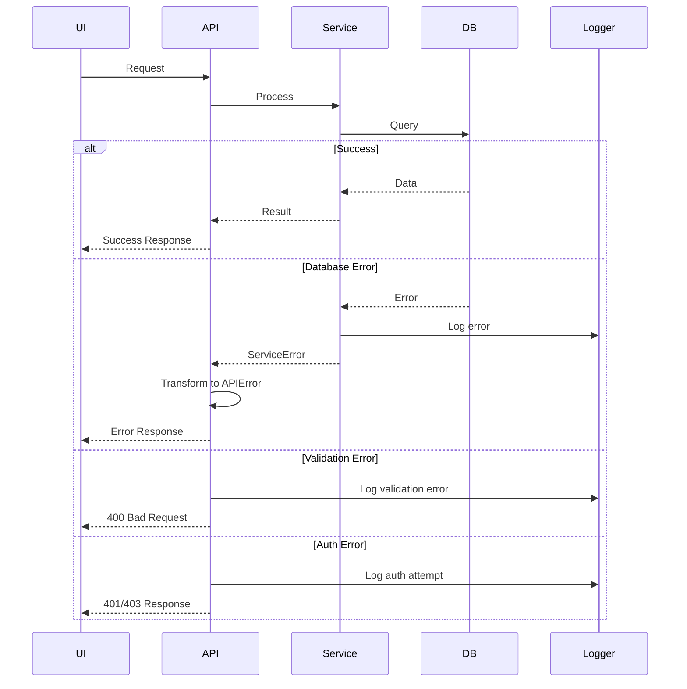

# 18. Error Handling Strategy

## 18.1 Error Flow



## 18.2 Error Response Format

```typescript
interface ApiError {
  error: {
    code: string;          // e.g., "VALIDATION_ERROR"
    message: string;       // User-friendly message
    details?: Record<string, any>;  // Additional context
    timestamp: string;     // ISO timestamp
    requestId: string;     // Correlation ID
  };
}
```

## 18.3 Frontend Error Handling

```typescript
// utils/errorHandler.ts
export class ApiErrorHandler {
  static handle(error: AxiosError): void {
    const apiError = error.response?.data as ApiError;

    switch (apiError?.error.code) {
      case 'VALIDATION_ERROR':
        notification.error({
          message: 'Validation Error',
          description: apiError.error.message
        });
        break;

      case 'AUTH_ERROR':
        // Redirect to login
        window.location.href = '/login';
        break;

      case 'RATE_LIMIT':
        notification.warning({
          message: 'Rate Limited',
          description: 'Please slow down your requests'
        });
        break;

      default:
        notification.error({
          message: 'Error',
          description: 'An unexpected error occurred'
        });
        console.error('Unhandled error:', apiError);
    }
  }
}
```

## 18.4 Backend Error Handling

```python