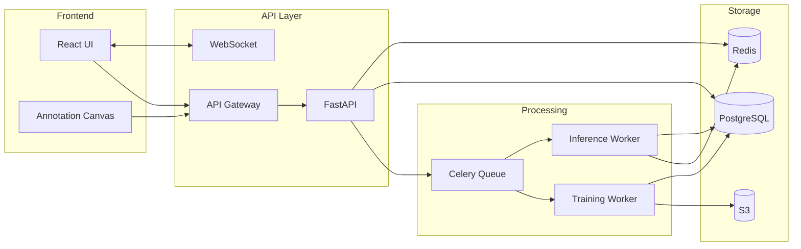

# 7. Component Interaction Diagram

```mermaid
graph LR
    subgraph "Frontend"
        UI[React UI]
        CANVAS[Annotation Canvas]
    end

    subgraph "API Layer"
        GW[API Gateway]
        WS[WebSocket]
        API[FastAPI]
    end

    subgraph "Processing"
        QUEUE[Celery Queue]
        TRAIN[Training Worker]
        INFER[Inference Worker]
    end

    subgraph "Storage"
        PG[(PostgreSQL)]
        REDIS[(Redis)]
        S3[(S3)]
    end

    UI --> GW
    CANVAS --> GW
    UI <--> WS
    GW --> API
    API --> QUEUE
    QUEUE --> TRAIN
    QUEUE --> INFER
    API --> PG
    API --> REDIS
    TRAIN --> S3
    TRAIN --> PG
    INFER --> REDIS
    INFER --> PG
```

---
