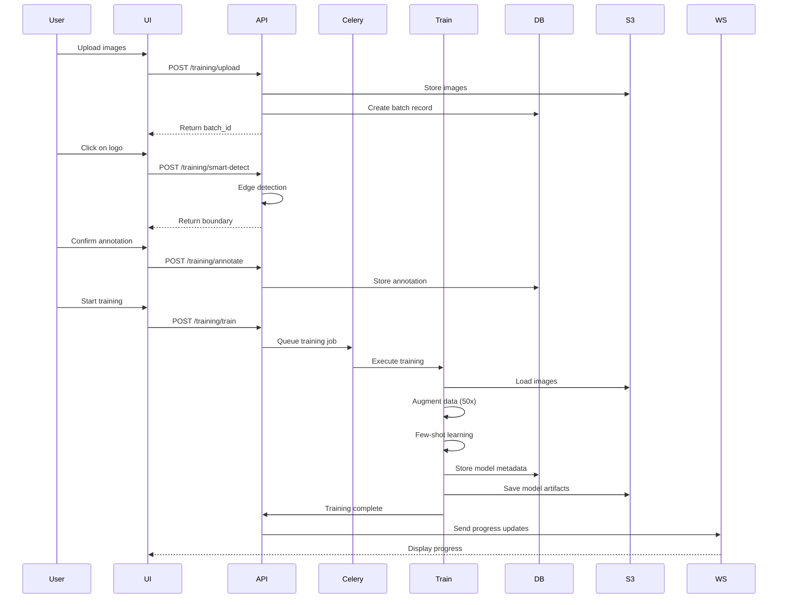
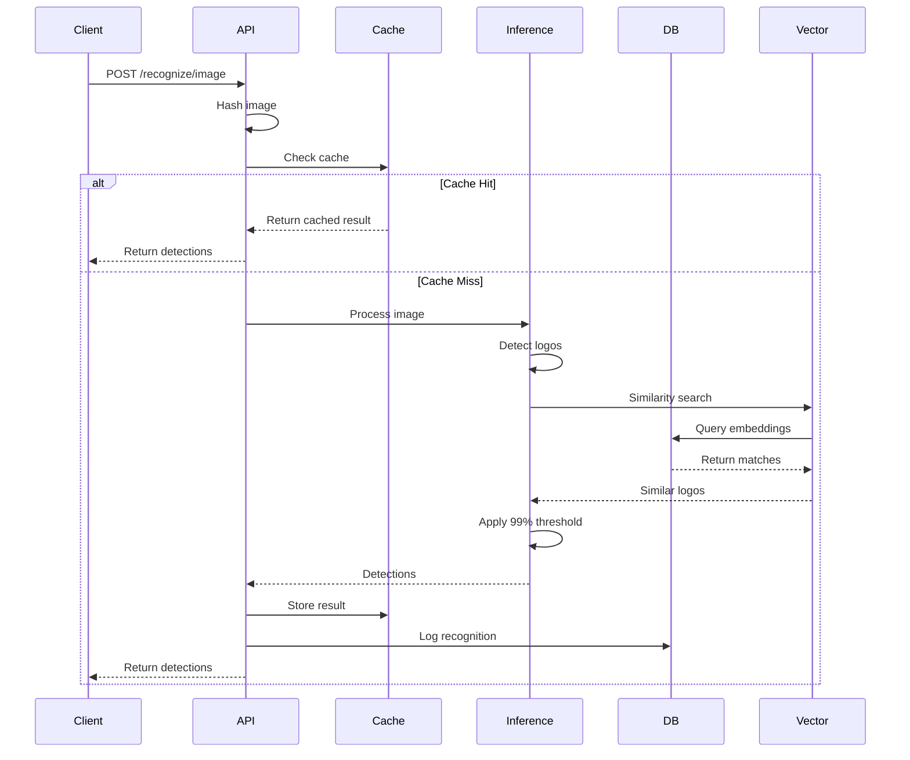
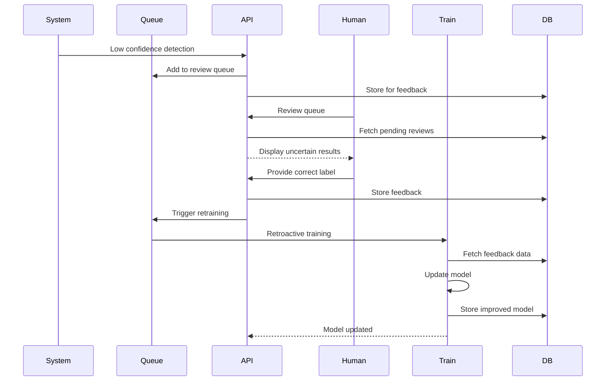

# 8. Core Workflows

## 8.1 Training Workflow

```mermaid
sequenceDiagram
    participant User
    participant UI
    participant API
    participant Celery
    participant Train
    participant DB
    participant S3

    User->>UI: Upload images
    UI->>API: POST /training/upload
    API->>S3: Store images
    API->>DB: Create batch record
    API-->>UI: Return batch_id

    User->>UI: Click on logo
    UI->>API: POST /training/smart-detect
    API->>API: Edge detection
    API-->>UI: Return boundary

    User->>UI: Confirm annotation
    UI->>API: POST /training/annotate
    API->>DB: Store annotation

    User->>UI: Start training
    UI->>API: POST /training/train
    API->>Celery: Queue training job
    Celery->>Train: Execute training
    Train->>S3: Load images
    Train->>Train: Augment data (50x)
    Train->>Train: Few-shot learning
    Train->>DB: Store model metadata
    Train->>S3: Save model artifacts
    Train->>API: Training complete
    API->>WS: Send progress updates
    WS-->>UI: Display progress
```

## 8.2 Recognition Workflow

```mermaid
sequenceDiagram
    participant Client
    participant API
    participant Cache
    participant Inference
    participant DB
    participant Vector

    Client->>API: POST /recognize/image
    API->>API: Hash image
    API->>Cache: Check cache

    alt Cache Hit
        Cache-->>API: Return cached result
        API-->>Client: Return detections
    else Cache Miss
        API->>Inference: Process image
        Inference->>Inference: Detect logos
        Inference->>Vector: Similarity search
        Vector->>DB: Query embeddings
        DB-->>Vector: Return matches
        Vector-->>Inference: Similar logos
        Inference->>Inference: Apply 99% threshold
        Inference-->>API: Detections
        API->>Cache: Store result
        API->>DB: Log recognition
        API-->>Client: Return detections
    end
```

## 8.3 Self-Learning Workflow

```mermaid
sequenceDiagram
    participant System
    participant Queue
    participant API
    participant Human
    participant Train
    participant DB

    System->>API: Low confidence detection
    API->>Queue: Add to review queue
    API->>DB: Store for feedback

    Human->>API: Review queue
    API->>DB: Fetch pending reviews
    API-->>Human: Display uncertain results

    Human->>API: Provide correct label
    API->>DB: Store feedback
    API->>Queue: Trigger retraining

    Queue->>Train: Retroactive training
    Train->>DB: Fetch feedback data
    Train->>Train: Update model
    Train->>DB: Store improved model
    Train-->>API: Model updated
```

---
