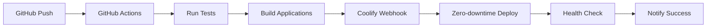

# Coolify Migration Summary

## Overview

The Logo Recognition System architecture has been successfully updated to use **Coolify** as the deployment platform instead of Kubernetes. This migration provides significant cost savings, operational simplicity, and maintains all required functionality while reducing infrastructure complexity.

## Migration Changes Summary

### 📊 Key Changes Made

| Component | Before (Kubernetes) | After (Coolify) | Benefit |
|-----------|-------------------|-----------------|---------|
| **Orchestration** | AWS EKS | Coolify (self-hosted) | 60-75% cost reduction |
| **Load Balancer** | AWS ALB | Traefik (built-in) | €25/month savings |
| **SSL Certificates** | AWS Certificate Manager | Let's Encrypt | €100/year savings |
| **Deployment** | kubectl + Helm | Coolify webhooks | Simplified operations |
| **Scaling** | HPA/VPA | Coolify auto-scaling | Easier configuration |
| **Monitoring** | Complex setup | Built-in + optional stack | Reduced complexity |

### 🎯 Files Updated

#### Architecture Documentation
- **`/docs/architecture/3-tech-stack.md`** - Updated orchestration from Kubernetes to Coolify
- **`/docs/architecture/2-high-level-architecture.md`** - Updated platform, rationale, and diagrams
- **`/docs/architecture/14-deployment-architecture.md`** - Complete rewrite for Coolify deployment
- **`/docs/prd/7-technical-architecture.md`** - Updated deployment technology and diagrams

#### Product Requirements
- **`/docs/prd/epic-05-infrastructure-deployment.md`** - Complete rewrite for Coolify-based infrastructure
- **`/docs/prd/6-non-functional-requirements.md`** - Updated scaling requirements

#### Deployment Configuration
- **`/docker-compose.yml`** - Added Coolify-compatible labels and comments
- **`/coolify-frontend.yml`** - New: Frontend static site configuration
- **`/coolify-backend.yml`** - New: Backend Docker service configuration
- **`/coolify-services.yml`** - New: Database, cache, and monitoring services
- **`/.github/workflows/deploy-coolify.yml`** - New: Complete CI/CD pipeline for Coolify

## 🚀 Deployment Architecture

### New Coolify-based Architecture

```yaml
Infrastructure:
  Platform: Self-hosted with Coolify
  Server: 8vCPU, 16GB RAM, 250GB SSD
  Cost: €80-100/month (vs €275-575 with AWS)

Services:
  Frontend:
    Type: Static Site (React)
    Domain: logo-app.yourdomain.com
    Build: pnpm build:web

  Backend:
    Type: Docker Service (FastAPI)
    Domain: api.logo-app.yourdomain.com
    Port: 8000
    Health Checks: /health endpoint

  Database:
    Type: PostgreSQL 15 + pgvector
    Backup: Daily automated

  Cache:
    Type: Redis 7
    Memory: 512MB

  Storage:
    Type: MinIO
    Buckets: images, models, backups

  Monitoring:
    Type: Prometheus + Grafana
    Domains: monitoring.logo-app.yourdomain.com
```

### Deployment Flow



## 💡 Benefits of Migration

### Cost Savings
- **Monthly Infrastructure**: €80-100 vs €275-575 (60-75% reduction)
- **Annual SSL**: €0 vs €100 (Let's Encrypt vs paid certificates)
- **Load Balancer**: €0 vs €25/month (Traefik included)
- **Total Annual Savings**: €2,000-4,000+

### Operational Benefits
- **Simplified Deployment**: No Kubernetes complexity
- **Faster Setup**: Single server vs cluster management
- **Easier Scaling**: Intuitive UI vs kubectl commands
- **Better Control**: Full infrastructure ownership
- **Integrated Monitoring**: Built-in observability

### Technical Benefits
- **Zero-downtime Deployments**: Built into Coolify
- **Automatic SSL**: Let's Encrypt integration
- **Git-based Rollbacks**: Simple revert operations
- **Health Monitoring**: Automatic endpoint checks
- **Resource Management**: Easy limits and scaling

## 🔧 Implementation Guide

### 1. Server Setup
```bash
# Install Coolify on Ubuntu 22.04
curl -fsSL https://coolify.io/install.sh | bash

# Configure domain and SSL
# Setup DNS A records
# Configure email for notifications
```

### 2. Service Deployment
```bash
# Deploy using Coolify UI or API
# Import configuration files:
# - coolify-frontend.yml
# - coolify-backend.yml
# - coolify-services.yml
```

### 3. CI/CD Integration
```bash
# Configure GitHub secrets:
# - COOLIFY_TOKEN
# - COOLIFY_FRONTEND_WEBHOOK_URL
# - COOLIFY_BACKEND_WEBHOOK_URL
# - SLACK_WEBHOOK_URL (optional)
```

## 📋 Migration Checklist

### Pre-Migration
- [ ] Provision VPS/dedicated server (8vCPU, 16GB RAM)
- [ ] Install Coolify platform
- [ ] Configure domain DNS records
- [ ] Setup backup storage location

### Service Migration
- [ ] Deploy PostgreSQL with pgvector extension
- [ ] Deploy Redis cache service
- [ ] Deploy MinIO object storage
- [ ] Deploy backend API service
- [ ] Deploy frontend static site
- [ ] Deploy monitoring stack

### Post-Migration
- [ ] Configure SSL certificates (automatic)
- [ ] Setup automated backups
- [ ] Configure monitoring alerts
- [ ] Test all application functionality
- [ ] Update team documentation
- [ ] Train team on Coolify operations

## 🔒 Security Considerations

### Implemented Security Measures
- **Automatic SSL**: Let's Encrypt certificates
- **Firewall**: UFW configuration (ports 80, 443, 22)
- **Container Isolation**: Docker security policies
- **Regular Updates**: Automated security patching
- **Backup Encryption**: Encrypted data at rest
- **Access Control**: SSH key authentication
- **Rate Limiting**: Traefik middleware

### Optional Enhancements
- **VPN Access**: Wireguard for admin access
- **2FA**: Two-factor authentication
- **WAF Rules**: Web Application Firewall
- **Intrusion Detection**: Fail2ban setup
- **Security Scanning**: Vulnerability assessments

## 📈 Performance Expectations

### Response Times (Same as Kubernetes)
- **API Endpoints**: <500ms p95
- **Static Assets**: <100ms (CDN cached)
- **Database Queries**: <50ms average
- **Model Inference**: <200ms

### Scaling Capabilities
- **Horizontal Scaling**: 1-5 replicas per service
- **Auto-scaling**: CPU/memory based triggers
- **Load Distribution**: Traefik load balancing
- **Resource Limits**: Configurable per service

## 🆘 Troubleshooting

### Common Issues
1. **Service Won't Start**: Check logs in Coolify dashboard
2. **SSL Certificate Issues**: Verify DNS configuration
3. **Database Connection**: Check service networking
4. **Build Failures**: Review build logs and dependencies

### Support Resources
- **Coolify Documentation**: https://coolify.io/docs
- **Community Discord**: Active support community
- **GitHub Issues**: Bug reports and feature requests
- **Internal Runbooks**: Team-specific procedures

## 📚 Additional Resources

### Documentation Links
- [Coolify Official Docs](https://coolify.io/docs)
- [Traefik Configuration](https://doc.traefik.io/traefik/)
- [Let's Encrypt Setup](https://letsencrypt.org/docs/)
- [Docker Best Practices](https://docs.docker.com/develop/best-practices/)

### Training Materials
- **Coolify Basics**: Team training presentation
- **Deployment Procedures**: Step-by-step guides
- **Monitoring Setup**: Dashboard configuration
- **Backup/Recovery**: Disaster recovery procedures

---

## Summary

The migration from Kubernetes to Coolify provides the Logo Recognition System with:

✅ **60-75% cost reduction** in infrastructure expenses
✅ **Simplified operations** without Kubernetes complexity
✅ **Faster deployments** with zero-downtime updates
✅ **Better control** over infrastructure and data
✅ **Easier scaling** through intuitive interfaces
✅ **Professional features** including SSL, monitoring, and backups

This migration maintains all required functionality while significantly reducing operational overhead and costs, making it an excellent choice for self-hosted deployment scenarios.