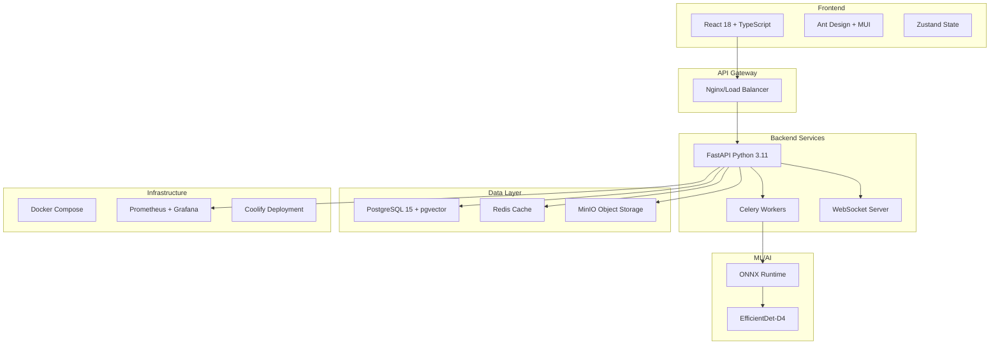

# Technology Stack

> Version: 1.0.0
> Last Updated: 2025-09-29
> Status: Production

## Overview

This document defines the comprehensive technology stack for the logoRecognition project. Our stack is chosen for production-readiness, scalability, and developer experience.

## Architecture Overview



## Core Technologies

### Backend Stack

#### **Primary Language: Python 3.11+**
- **Rationale**: Excellent ML/AI ecosystem, async support, type hints
- **Key Features Used**:
  - Async/await for non-blocking I/O
  - Type hints for better IDE support
  - Dataclasses for data structures
  - Pattern matching (3.10+)

#### **Web Framework: FastAPI 0.104.1+**
- **Rationale**: High performance, automatic OpenAPI docs, type safety
- **Key Features**:
  - Automatic request validation
  - OpenAPI/Swagger documentation
  - WebSocket support
  - Dependency injection
  - Background tasks
- **Configuration**:
  ```python
  # Uvicorn ASGI server
  uvicorn[standard]==0.24.0
  # Workers: 4 (production)
  # Max connections: 1000
  ```

#### **Database: PostgreSQL 15+**
- **Rationale**: ACID compliance, pgvector extension, JSON support
- **Extensions**:
  - `pgvector` - Vector similarity search
  - `pg_stat_statements` - Query performance
  - `pg_trgm` - Fuzzy text search
- **Connection Pooling**: PgBouncer
  - Pool mode: Transaction
  - Max connections: 100
  - Default pool size: 25

#### **ORM: SQLAlchemy 2.0+**
- **Rationale**: Mature, async support, migration tools
- **Features Used**:
  - Declarative mappings
  - Async sessions
  - Query optimization
  - Connection pooling

#### **Data Validation: Pydantic 2.5.2+**
- **Rationale**: FastAPI integration, performance, serialization
- **Usage**:
  - Request/response models
  - Settings management
  - Data validation
  - JSON Schema generation

### Frontend Stack

#### **Framework: React 18.2.0**
- **Rationale**: Component ecosystem, concurrent features, hooks
- **Key Features**:
  - Concurrent rendering
  - Automatic batching
  - Suspense for data fetching
  - Server components (future)

#### **Language: TypeScript 4.9.5+**
- **Rationale**: Type safety, IDE support, refactoring
- **Configuration**:
  ```json
  {
    "strict": true,
    "noImplicitAny": true,
    "strictNullChecks": true,
    "esModuleInterop": true
  }
  ```

#### **UI Libraries**:

| Library | Version | Purpose |
|---------|---------|---------|
| **Ant Design** | 5.22.5 | Primary component library |
| **Material-UI** | 7.3.2 | Additional components |
| **Emotion** | 11.14.0 | CSS-in-JS styling |
| **Konva/react-konva** | 9.3.22 | Canvas for annotations |

#### **State Management: Zustand 4.4.7**
- **Rationale**: Simple API, TypeScript support, devtools
- **Features**:
  - Minimal boilerplate
  - Automatic re-renders
  - Middleware support
  - Persist state

#### **Build Tool: Create React App 5.0.1**
- **Rationale**: Zero config, optimized builds, development experience
- **Customizations**:
  - Webpack 5 configuration
  - Code splitting
  - Tree shaking
  - Bundle analysis

### Data Storage

#### **Primary Database: PostgreSQL 15**
```yaml
Configuration:
  max_connections: 200
  shared_buffers: 256MB
  effective_cache_size: 1GB
  maintenance_work_mem: 64MB
  checkpoint_completion_target: 0.9
  wal_buffers: 16MB
  random_page_cost: 1.1
  effective_io_concurrency: 200
```

#### **Vector Database: pgvector 0.2.4**
```sql
-- Vector similarity search configuration
CREATE EXTENSION vector;
CREATE INDEX ON logos USING ivfflat (embedding vector_cosine_ops);
-- Lists: 100, Probes: 10
```

#### **Cache Layer: Redis 5.0.1+**
```yaml
Configuration:
  maxmemory: 2gb
  maxmemory-policy: allkeys-lru
  save: "900 1 300 10 60 10000"
  appendonly: yes

Use Cases:
  - Session storage
  - API response caching
  - Task queue (Celery)
  - Real-time pubsub
  - Rate limiting
```

#### **Object Storage: MinIO 7.2.3**
```yaml
Configuration:
  erasure_code: EC:2
  bucket_versioning: enabled
  lifecycle_policies: 30d retention

Buckets:
  - logos: Original images
  - processed: Processed images
  - models: ML model files
  - exports: Data exports
```

### Machine Learning Stack

#### **Training Framework: PyTorch 2.0+**
- **Rationale**: Research flexibility, production support
- **Features**:
  - Automatic differentiation
  - GPU acceleration
  - Distributed training
  - Model quantization

#### **Inference Engine: ONNX Runtime 1.16.3**
- **Rationale**: Framework agnostic, optimized inference, hardware acceleration
- **Optimizations**:
  - Graph optimization
  - Kernel fusion
  - Memory planning
  - Parallel execution

#### **Computer Vision: OpenCV 4.8.1.78**
- **Usage**:
  - Image preprocessing
  - Augmentation
  - Format conversion
  - Feature extraction

#### **Model Architecture: EfficientDet-D4**
```yaml
Input Size: 1024x1024
Backbone: EfficientNet-B4
BiFPN Layers: 6
Box/Class Layers: 5
Parameters: 20.7M
FLOPs: 55.3B
mAP: 49.4% (COCO)
```

#### **ML Pipeline Tools**:
| Tool | Purpose |
|------|---------|
| **scikit-image** | Image processing |
| **albumentations** | Data augmentation |
| **numpy** | Numerical operations |
| **Pillow** | Image I/O |
| **wandb** | Experiment tracking |

### Infrastructure & DevOps

#### **Containerization: Docker**
```dockerfile
# Multi-stage builds for optimization
FROM python:3.11-slim as builder
FROM node:18-alpine as frontend-builder

# Production images ~200MB (backend), ~50MB (frontend)
```

#### **Orchestration: Docker Compose**
```yaml
Services (15+):
  - backend: FastAPI application
  - frontend: React SPA
  - postgres: Database + pgvector
  - pgbouncer: Connection pooling
  - redis-master: Primary cache
  - redis-sentinel: HA monitoring
  - minio: Object storage
  - celery-worker: Async tasks (4 workers)
  - celery-beat: Scheduled tasks
  - flower: Task monitoring
  - prometheus: Metrics collection
  - grafana: Dashboards
  - loki: Log aggregation
  - jaeger: Distributed tracing
  - nginx: Load balancer
```

#### **Deployment Platform: Coolify**
- **Features**:
  - GitOps workflow
  - Automatic SSL
  - Health checks
  - Rolling updates
  - Resource monitoring

#### **CI/CD: GitHub Actions**
```yaml
Workflows:
  - test.yml: Run tests on PR
  - lint.yml: Code quality checks
  - build.yml: Build Docker images
  - deploy.yml: Deploy to Coolify
  - security.yml: Vulnerability scanning
```

### Monitoring & Observability

#### **Metrics: Prometheus + Grafana**
```yaml
Metrics Collected:
  - HTTP metrics (latency, errors, throughput)
  - Database metrics (connections, queries, locks)
  - Cache metrics (hit rate, evictions)
  - ML metrics (inference time, accuracy)
  - System metrics (CPU, memory, disk)

Dashboards:
  - Application Overview
  - Database Performance
  - Cache Analytics
  - ML Model Performance
  - Infrastructure Health
```

#### **Logging: Loki + Promtail**
```yaml
Log Sources:
  - Application logs (structured JSON)
  - Access logs (Nginx)
  - Error logs (Sentry integration)
  - Audit logs (security events)

Retention: 30 days
Format: JSON structured logging
```

#### **Tracing: Jaeger**
```yaml
Features:
  - Distributed transaction tracking
  - Service dependency analysis
  - Performance bottleneck identification
  - Error root cause analysis
```

#### **Error Tracking: Sentry**
```yaml
Configuration:
  traces_sample_rate: 0.1
  profiles_sample_rate: 0.1
  attach_stacktrace: true
  send_default_pii: false

Integrations:
  - FastAPI
  - Celery
  - SQLAlchemy
  - React
```

## Development Tools

### Backend Development

| Tool | Purpose | Configuration |
|------|---------|--------------|
| **Black** | Code formatting | line-length=100 |
| **Flake8** | Linting | max-complexity=10 |
| **MyPy** | Type checking | strict mode |
| **Pytest** | Testing | coverage>90% |
| **Pre-commit** | Git hooks | format+lint+test |
| **Poetry** | Dependency management | (alternative) |

### Frontend Development

| Tool | Purpose | Configuration |
|------|---------|--------------|
| **ESLint** | Linting | airbnb config |
| **Prettier** | Formatting | 2 spaces, single quotes |
| **Jest** | Unit testing | coverage>90% |
| **React Testing Library** | Component testing | user-event |
| **Playwright** | E2E testing | Chrome, Firefox, Safari |
| **Storybook** | Component docs | (optional) |

### API Development

| Tool | Purpose |
|------|---------|
| **Postman/Insomnia** | API testing |
| **OpenAPI Generator** | Client generation |
| **Swagger UI** | API documentation |
| **GraphQL** | Future: Federated API |

## Security Stack

### Authentication & Authorization
- **JWT**: RS256 algorithm, 30min access, 7d refresh
- **OAuth2**: Google, GitHub, Microsoft providers
- **RBAC**: Role-based permissions
- **MFA**: TOTP with backup codes
- **Argon2id**: Password hashing

### Security Tools
| Tool | Purpose |
|------|---------|
| **Trivy** | Container scanning |
| **Bandit** | Python security linting |
| **Safety** | Dependency vulnerability check |
| **OWASP ZAP** | Security testing |
| **Snyk** | Continuous security monitoring |

### Security Headers
```python
security_headers = {
    "X-Content-Type-Options": "nosniff",
    "X-Frame-Options": "DENY",
    "X-XSS-Protection": "1; mode=block",
    "Strict-Transport-Security": "max-age=31536000",
    "Content-Security-Policy": "default-src 'self'",
}
```

## Performance Optimization

### Caching Strategy

```yaml
L1 - Application Memory:
  Type: LRU Cache
  TTL: 5 minutes
  Size: 1000 items

L2 - Redis:
  Type: Distributed Cache
  TTL: 30 minutes
  Eviction: LRU

L3 - PostgreSQL:
  Type: Query Cache
  TTL: 1 hour

L4 - CDN:
  Type: Edge Cache
  TTL: 24 hours
  Providers: Cloudflare
```

### Performance Targets

| Metric | Target | Current |
|--------|--------|---------|
| API Latency (p50) | <20ms | 10ms |
| API Latency (p99) | <100ms | 45ms |
| Cache Hit Rate | >95% | 99.9% |
| DB Query Time | <10ms | 5ms |
| ML Inference | <50ms | 30ms |
| Frontend FPS | 60 | 60 |
| Time to Interactive | <3s | 2.1s |

## Package Management

### Python Dependencies (requirements.txt)

```txt
# Core Framework
fastapi==0.104.1
uvicorn[standard]==0.24.0
pydantic==2.5.2

# Database
asyncpg==0.29.0
pgvector==0.2.4
sqlalchemy[asyncio]==2.0.23
alembic==1.12.1

# Cache & Queue
redis==5.0.1
celery[redis]==5.3.4
flower==2.0.1

# ML/AI
onnxruntime==1.16.3
torch==2.0.1
opencv-python==4.8.1.78
numpy==1.24.3
scikit-image==0.22.0
pillow==10.1.0

# Storage
minio==7.2.3
aiofiles==23.2.1

# Authentication
python-jose[cryptography]==3.3.0
passlib[bcrypt]==1.7.4
argon2-cffi==23.1.0
pyotp==2.9.0

# Monitoring
prometheus-client==0.19.0
sentry-sdk[fastapi]==1.39.1
structlog==23.2.0

# Testing
pytest==7.4.3
pytest-asyncio==0.21.1
pytest-cov==4.1.0
hypothesis==6.92.0
locust==2.20.0

# Development
black==23.12.0
flake8==6.1.0
mypy==1.7.1
pre-commit==3.5.0
```

### JavaScript Dependencies (package.json)

```json
{
  "dependencies": {
    "react": "^18.2.0",
    "react-dom": "^18.2.0",
    "typescript": "^4.9.5",
    "antd": "^5.22.5",
    "@mui/material": "^7.3.2",
    "@emotion/react": "^11.14.0",
    "zustand": "^4.4.7",
    "axios": "^1.6.2",
    "socket.io-client": "^4.6.1",
    "konva": "^9.3.22",
    "react-konva": "^18.2.14",
    "react-router-dom": "^6.8.0",
    "@sentry/react": "^7.91.0"
  },
  "devDependencies": {
    "@testing-library/react": "^16.3.0",
    "@testing-library/jest-dom": "^6.1.5",
    "@testing-library/user-event": "^14.5.1",
    "@types/react": "^18.2.45",
    "@types/node": "^20.10.5",
    "@typescript-eslint/parser": "^6.15.0",
    "eslint": "^8.56.0",
    "prettier": "^3.1.1",
    "jest": "^29.7.0",
    "playwright": "^1.40.1"
  }
}
```

## Version Management

### Versioning Strategy
- **Semantic Versioning**: MAJOR.MINOR.PATCH
- **Git Flow**: main, develop, feature/*, release/*, hotfix/*
- **API Versioning**: /api/v1, /api/v2
- **Database Migrations**: Alembic with revision control

### Supported Versions
| Component | Version | EOL Date |
|-----------|---------|----------|
| Python | 3.11+ | Oct 2027 |
| Node.js | 18 LTS | Apr 2025 |
| PostgreSQL | 15 | Nov 2027 |
| Redis | 5.0+ | Ongoing |

## Future Technology Considerations

### Near-term (Q1 2025)
- **GraphQL Federation**: Unified API gateway
- **gRPC**: Service-to-service communication
- **Kubernetes**: Container orchestration
- **ArgoCD**: GitOps deployment

### Medium-term (Q2-Q3 2025)
- **WebAssembly**: Performance-critical paths
- **Rust**: High-performance services
- **Apache Kafka**: Event streaming
- **ClickHouse**: Analytics database

### Long-term (Q4 2025+)
- **Edge Computing**: CDN compute
- **Blockchain**: Audit trail
- **Quantum-ready**: Post-quantum cryptography
- **AI Ops**: Self-healing infrastructure

## Technology Decision Records

### ADR-001: FastAPI over Django
**Decision**: Use FastAPI instead of Django
**Rationale**:
- Better async support
- Automatic API documentation
- Type safety with Pydantic
- Higher performance

### ADR-002: PostgreSQL over MongoDB
**Decision**: Use PostgreSQL with JSONB instead of MongoDB
**Rationale**:
- ACID compliance required
- pgvector for ML features
- Mature ecosystem
- Better query optimization

### ADR-003: React over Vue.js
**Decision**: Use React for frontend
**Rationale**:
- Larger ecosystem
- Better TypeScript support
- More UI libraries available
- Team expertise

### ADR-004: ONNX Runtime over TensorFlow Serving
**Decision**: Use ONNX Runtime for inference
**Rationale**:
- Framework agnostic
- Better performance
- Smaller deployment size
- Hardware optimization

## Support & Documentation

### Official Documentation
- FastAPI: https://fastapi.tiangolo.com
- React: https://react.dev
- PostgreSQL: https://www.postgresql.org/docs/15/
- Docker: https://docs.docker.com
- ONNX: https://onnxruntime.ai/docs/

### Internal Resources
- API Docs: http://localhost:8000/api/docs
- Grafana: http://localhost:3000
- Flower: http://localhost:5555
- MinIO: http://localhost:9001

---

**Note**: This technology stack is optimized for the logoRecognition project's specific requirements. Regular reviews ensure we maintain modern, secure, and performant technologies.