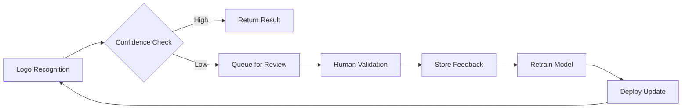

# Epic: Self-Learning System

**Epic ID:** EPIC-03
**Priority:** High
**Sprint:** 7-10
**Status:** 📋 Future

## Overview

The Self-Learning System enables continuous improvement through production feedback, automatic retraining, and human-in-the-loop validation, achieving +2% monthly accuracy improvements without manual intervention.

## Key Features

### 1. Retroactive Training Loop (TR-007)
- Failed recognition tracking
- Manual correction capture
- Automatic retraining triggers
- Image ID reference system

### 2. Human-in-the-Loop Feedback (RC-009)
- Low confidence queue
- Human validation interface
- Feedback incorporation
- Accuracy improvement tracking

### 3. Continuous Learning Pipeline
- Production data collection
- Automatic model updates
- A/B testing framework
- Performance monitoring

### 4. Feedback Analytics
- Recognition failure patterns
- Category-specific accuracy
- Improvement trends
- Training effectiveness metrics

## Implementation Flow



## User Stories

### Story 7: Retroactive Training
**As a** System Administrator
**I want** failed recognitions to improve the model
**So that** accuracy increases over time

**Acceptance Criteria:**
- [ ] Track all low-confidence predictions
- [ ] Link to manual corrections via image ID
- [ ] Automatic retraining scheduling
- [ ] Performance improvement metrics

### Story 8: Human Validation Queue
**As a** Data Manager
**I want to** review uncertain predictions
**So that** I can provide correct labels

**Acceptance Criteria:**
- [ ] Queue interface for low-confidence results
- [ ] Easy annotation tools
- [ ] Bulk validation support
- [ ] Feedback tracking

### Story 9: Continuous Improvement
**As a** Product Owner
**I want** the system to improve automatically
**So that** accuracy increases without manual effort

**Acceptance Criteria:**
- [ ] Monthly accuracy improvements
- [ ] Automatic model updates
- [ ] Performance regression prevention
- [ ] Improvement reporting

## Technical Architecture

### Components
- **Feedback Service** - Collects and processes feedback
- **Training Scheduler** - Manages retraining cycles
- **Model Versioning** - Tracks model iterations
- **A/B Testing** - Validates improvements

### Data Flow
1. Recognition attempt with confidence score
2. Low confidence → Human review queue
3. Human provides correct label
4. Feedback stored with image reference
5. Scheduled retraining incorporates feedback
6. New model validated and deployed
7. Metrics tracked for improvement

### Database Schema
```sql
CREATE TABLE feedback_queue (
    id UUID PRIMARY KEY,
    image_id UUID REFERENCES images(id),
    predicted_category VARCHAR(100),
    predicted_value VARCHAR(100),
    confidence FLOAT,
    correct_category VARCHAR(100),
    correct_value VARCHAR(100),
    validated_by UUID REFERENCES users(id),
    validated_at TIMESTAMP,
    incorporated BOOLEAN DEFAULT FALSE
);

CREATE TABLE model_improvements (
    id UUID PRIMARY KEY,
    model_version VARCHAR(50),
    accuracy_before FLOAT,
    accuracy_after FLOAT,
    samples_added INTEGER,
    improvement_date TIMESTAMP
);
```

## Feedback Collection Methods

### 1. Direct Feedback
- In-app correction buttons
- API feedback endpoint
- Batch correction uploads

### 2. Indirect Feedback
- Production system corrections
- Manual database updates
- External system synchronization

### 3. Active Learning
- Uncertainty sampling
- Query by committee
- Expected model change

## Success Metrics
- Monthly improvement: +2% accuracy
- Feedback processing: <24 hours
- Human validation time: <30 seconds/image
- Retraining frequency: Weekly
- Model deployment: Zero downtime

## Implementation Phases

### Phase 1: Basic Feedback Loop
- Capture low-confidence predictions
- Manual validation interface
- Store corrections

### Phase 2: Automatic Retraining
- Scheduled retraining jobs
- Model versioning
- Performance tracking

### Phase 3: Advanced Learning
- Active learning strategies
- A/B testing framework
- Automatic deployment

## Risks & Mitigations
- **Feedback quality** → Validation rules
- **Model regression** → A/B testing before deployment
- **Training costs** → Batch retraining schedules
- **Data drift** → Continuous monitoring

## Dependencies
- Human validators availability
- GPU resources for retraining
- Model versioning system
- A/B testing infrastructure

## Definition of Done
- [ ] Feedback collection implemented
- [ ] Human validation interface complete
- [ ] Automatic retraining pipeline working
- [ ] Model versioning in place
- [ ] A/B testing framework operational
- [ ] Metrics dashboard showing improvements
- [ ] Documentation complete

## Related Documents
- [Functional Requirements](./5-functional-requirements.md)
- [Implementation Roadmap](./8-implementation-roadmap.md)
- [ML Pipeline Architecture](../technical-design-document.md#4-ml-pipeline-architecture)