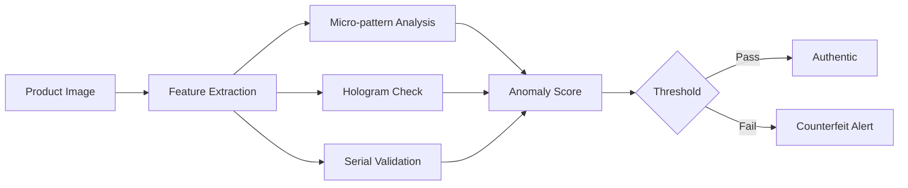

# Epic: Industrial Features

**Epic ID:** EPIC-07
**Priority:** Medium
**Sprint:** 17-20
**Status:** 📋 Future

## Overview

The Industrial Features epic extends the logo recognition system with specialized capabilities for manufacturing, packaging, and recycling industries. This includes advanced classification, counterfeit detection, and integration with existing industrial systems.

## Key Features

### 1. Packaging Type Classification
- Material type detection (plastic, paper, metal, glass)
- Package format recognition (bottle, box, bag, can)
- Size estimation algorithms
- Damage detection
- Multi-layer packaging analysis
- Batch identification

### 2. Recycling Symbol Recognition
- Standard recycling codes (1-7 plastics)
- Extended symbols (20+ types)
- Regional symbol variations
- Composite material identification
- Contamination detection
- Sorting recommendations

### 3. Counterfeit Detection Module
- Authenticity verification
- Micro-pattern analysis
- Hologram validation
- Serial number verification
- Anomaly detection
- Confidence scoring

### 4. Production Line Integration
- Speed synchronization (up to 600 items/min)
- Reject mechanism triggers
- PLC communication
- OPC UA protocol support
- SCADA integration
- Real-time quality metrics

### 5. MES/ERP System Integration
- SAP connector
- Oracle Manufacturing
- Microsoft Dynamics 365
- Custom API adapters
- Batch tracking
- Quality data synchronization

### 6. Batch Validation Workflows
- Multi-stage validation
- Sampling strategies
- Statistical process control
- Trend analysis
- Exception reporting
- Compliance documentation

## User Stories

### Story 22: Packaging Classification
**As a** Packaging Line Manager
**I want** automatic package type detection
**So that** sorting is automated

**Acceptance Criteria:**
- [ ] Identify 10+ package types
- [ ] 95% accuracy on materials
- [ ] Size estimation ±5%
- [ ] Damage detection working
- [ ] Speed: 10 packages/second
- [ ] Integration with sorting system

### Story 23: Recycling Symbols
**As a** Recycling Facility Operator
**I want** automatic recycling code detection
**So that** materials are properly sorted

**Acceptance Criteria:**
- [ ] Recognize all standard codes (1-7)
- [ ] Extended symbols support (20+)
- [ ] Multi-language symbols
- [ ] Contamination alerts
- [ ] Sorting recommendations
- [ ] Report generation

### Story 24: Counterfeit Detection
**As a** Brand Protection Manager
**I want** counterfeit product detection
**So that** fake products are identified

**Acceptance Criteria:**
- [ ] Micro-pattern verification
- [ ] Hologram authentication
- [ ] Serial number validation
- [ ] Anomaly detection
- [ ] Alert system
- [ ] Evidence collection

### Story 25: ERP Integration
**As an** IT Manager
**I want** ERP system integration
**So that** data flows automatically

**Acceptance Criteria:**
- [ ] SAP connector working
- [ ] Real-time data sync
- [ ] Batch tracking
- [ ] Quality metrics upload
- [ ] Error handling
- [ ] Audit trail

## Technical Specifications

### Packaging Classification Model
```python
class PackagingClassifier:
    def __init__(self):
        self.material_model = load_model("material_classifier.onnx")
        self.format_model = load_model("format_detector.onnx")
        self.damage_model = load_model("damage_inspector.onnx")

    def classify(self, image):
        return {
            'material': self.detect_material(image),  # plastic, paper, metal
            'format': self.detect_format(image),      # bottle, box, can
            'size': self.estimate_size(image),        # dimensions in mm
            'damage': self.inspect_damage(image),     # intact, damaged, severe
            'confidence': self.calculate_confidence()
        }
```

### Recycling Symbol Detection
```yaml
recycling_symbols:
  plastics:
    PET: { code: 1, recyclable: true, sorting_bin: "plastic" }
    HDPE: { code: 2, recyclable: true, sorting_bin: "plastic" }
    PVC: { code: 3, recyclable: false, sorting_bin: "waste" }
    LDPE: { code: 4, recyclable: limited, sorting_bin: "plastic" }
    PP: { code: 5, recyclable: true, sorting_bin: "plastic" }
    PS: { code: 6, recyclable: false, sorting_bin: "waste" }
    OTHER: { code: 7, recyclable: varies, sorting_bin: "manual" }

  extended:
    - { symbol: "♻️20", material: "cardboard", bin: "paper" }
    - { symbol: "♻️21", material: "mixed_paper", bin: "paper" }
    - { symbol: "♻️40", material: "steel", bin: "metal" }
    - { symbol: "♻️41", material: "aluminum", bin: "metal" }
```

### Counterfeit Detection Pipeline


### PLC Integration Protocol
```python
class PLCConnector:
    def __init__(self, plc_config):
        self.connection = ModbusTCP(plc_config.ip, plc_config.port)
        self.registers = plc_config.registers

    def send_reject_signal(self, position):
        # Send reject signal to PLC
        self.connection.write_register(
            self.registers.REJECT_GATE,
            position
        )

    def read_line_speed(self):
        # Read current line speed
        return self.connection.read_register(
            self.registers.LINE_SPEED
        )

    def sync_with_encoder(self):
        # Synchronize with line encoder
        position = self.connection.read_register(
            self.registers.ENCODER_POSITION
        )
        return position
```

### ERP Integration Adapters
```javascript
// SAP Integration
class SAPConnector {
    async syncQualityData(inspection) {
        const payload = {
            materialNumber: inspection.materialId,
            batch: inspection.batchNumber,
            inspectionLot: inspection.lotId,
            results: {
                logoDetected: inspection.logoFound,
                packageType: inspection.packaging,
                qualityScore: inspection.score,
                defects: inspection.defects
            },
            timestamp: new Date().toISOString()
        };

        await this.sapClient.post('/QM/InspectionResults', payload);
    }
}
```

## Industrial Standards Compliance

### Standards Support
- ISO 9001 (Quality Management)
- ISO 14001 (Environmental)
- GS1 (Barcoding/RFID)
- FDA 21 CFR Part 11 (Pharma)
- IEC 62264 (MES Integration)
- OPC UA (Industrial Communication)

### Validation Requirements
- IQ/OQ/PQ documentation
- Audit trail (21 CFR Part 11)
- Electronic signatures
- Data integrity checks
- Change control procedures
- Validation protocols

## Performance Requirements

| Feature | Throughput | Accuracy | Latency |
|---------|-----------|----------|---------|
| Packaging Classification | 600/min | 95% | <100ms |
| Recycling Symbols | 300/min | 98% | <150ms |
| Counterfeit Detection | 60/min | 99.5% | <500ms |
| PLC Communication | Real-time | N/A | <10ms |
| ERP Sync | Batch/hour | 100% | <5min |

## Industry-Specific Configurations

### Food & Beverage
- Expiry date verification
- Allergen label detection
- Nutritional panel reading
- Tamper evidence check

### Pharmaceutical
- Serialization compliance
- Tamper-evident verification
- Batch/lot tracking
- Temperature indicator reading

### Automotive
- Part number verification
- Assembly validation
- Supplier code checking
- Quality grade classification

### Electronics
- Component verification
- PCB inspection support
- Serial number tracking
- Warranty label detection

## Integration Architecture

```
┌─────────────────────────────────────────┐
│         Production Line                  │
├──────────────┬──────────────────────────┤
│   Cameras    │    PLC/SCADA             │
└──────┬───────┴───────┬──────────────────┘
       │               │
┌──────▼───────────────▼──────────────────┐
│      Logo Recognition System             │
├──────────────────────────────────────────┤
│  Industrial Feature Modules              │
│  - Packaging Classifier                  │
│  - Recycling Detector                    │
│  - Counterfeit Module                    │
└──────────────┬───────────────────────────┘
               │
       ┌───────▼────────┬─────────┐
       │                │         │
┌──────▼──────┐ ┌───────▼───┐ ┌──▼────┐
│     SAP     │ │   Oracle  │ │  MES  │
└─────────────┘ └───────────┘ └───────┘
```

## Dependencies
- Industrial camera setup
- PLC/SCADA connectivity
- ERP system access
- Industry-specific training data
- Compliance certifications
- Integration testing environment

## Success Metrics
- Classification accuracy: >95%
- Counterfeit detection rate: >99%
- Integration uptime: 99.5%
- Processing speed meets line rate
- ROI: 30% quality improvement
- Compliance: All audits passed

## Risks & Mitigations
- **Line speed variations** → Adaptive processing
- **Integration complexity** → Phased rollout
- **Compliance requirements** → Early validation
- **Legacy system compatibility** → Custom adapters
- **Training data scarcity** → Transfer learning

## Implementation Timeline
- **Week 17:** Packaging classification development
- **Week 18:** Recycling symbol recognition
- **Week 19:** Counterfeit detection module
- **Week 20:** System integration & testing

## Definition of Done
- [ ] All classification models trained
- [ ] Recycling symbols database complete
- [ ] Counterfeit detection validated
- [ ] PLC integration tested
- [ ] ERP connectors functional
- [ ] Compliance documentation complete
- [ ] Performance benchmarks met
- [ ] User training delivered
- [ ] Go-live support provided

## Related Documents
- [Recognition System](./epic-02-recognition-system.md)
- [Real-time Processing](./epic-06-real-time-processing.md)
- [Implementation Roadmap](./8-implementation-roadmap.md)
- [Technical Architecture](./7-technical-architecture.md)