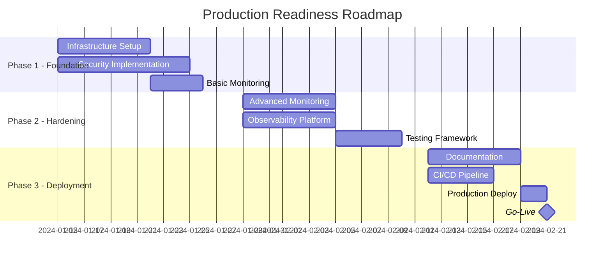

# 🗺️ Production Readiness Roadmap

## Executive Summary

**Project**: Logo Recognition System - Production Deployment  
**Timeline**: 6 Weeks (January 15 - February 23, 2024)  
**Goal**: Deploy a fully production-ready logo recognition system with enterprise-grade reliability  

## Visual Timeline



## Phase 1: Foundation (Weeks 1-2)
### Sprint 07: January 15-26

#### Infrastructure & Security
- ✅ **Week 1**: Core Infrastructure
  - [ ] AWS/Cloud setup
  - [ ] Kubernetes configuration
  - [ ] Database provisioning
  - [ ] Network architecture

- 🔒 **Week 2**: Security Baseline
  - [ ] Authentication system
  - [ ] API security
  - [ ] Data encryption
  - [ ] Security scanning

**Deliverables**:
- Production infrastructure ready
- Security measures implemented
- Basic monitoring active

## Phase 2: Hardening (Weeks 3-4)
### Sprint 08: January 29 - February 9

#### Monitoring & Testing
- 📊 **Week 3**: Observability
  - [ ] APM integration
  - [ ] Distributed tracing
  - [ ] Centralized logging
  - [ ] Custom dashboards

- 🧪 **Week 4**: Quality Assurance
  - [ ] Load testing
  - [ ] Performance testing
  - [ ] Security testing
  - [ ] UAT preparation

**Deliverables**:
- Full observability stack
- Test results documented
- Performance validated

## Phase 3: Deployment (Weeks 5-6)
### Sprint 09: February 12-23

#### Documentation & Go-Live
- 📚 **Week 5**: Finalization
  - [ ] User documentation
  - [ ] API documentation
  - [ ] Runbooks
  - [ ] Training materials

- 🚀 **Week 6**: Production Launch
  - [ ] Deployment pipeline
  - [ ] Production deployment
  - [ ] Go-live checklist
  - [ ] Launch communication

**Deliverables**:
- Complete documentation
- Production deployment
- System go-live

## Key Milestones

| Milestone | Date | Description | Success Criteria |
|-----------|------|-------------|------------------|
| M1: Infrastructure Ready | Jan 22 | All infrastructure provisioned | 100% environments active |
| M2: Security Baseline | Jan 26 | Core security implemented | Zero critical vulnerabilities |
| M3: Monitoring Complete | Feb 5 | Full observability | All metrics tracked |
| M4: Testing Complete | Feb 9 | All tests passed | 100% test coverage |
| M5: Documentation Ready | Feb 16 | All docs complete | Stakeholder approval |
| M6: Production Deployment | Feb 20 | System deployed | Deployment successful |
| M7: Go-Live | Feb 21 | Official launch | System operational |

## Resource Allocation

### Team Structure
```
Product Manager
├── Development Team (4)
│   ├── Backend (2)
│   └── Frontend (2)
├── DevOps Team (3)
├── QA Team (2)
├── Security Team (1)
└── Support Team (2)
```

### Sprint Capacity
- **Sprint 07**: 120 story points
- **Sprint 08**: 120 story points
- **Sprint 09**: 120 story points
- **Total Capacity**: 360 story points

## Risk Timeline

### Critical Path Items
1. **Infrastructure setup** - Must complete by Jan 22
2. **Security implementation** - Must complete by Jan 26
3. **Testing completion** - Must complete by Feb 9
4. **Stakeholder sign-off** - Must receive by Feb 19

### Risk Mitigation Schedule
- **Week 1**: Infrastructure risks
- **Week 2**: Security risks
- **Week 3**: Integration risks
- **Week 4**: Performance risks
- **Week 5**: Deployment risks
- **Week 6**: Launch risks

## Dependencies & Prerequisites

### External Dependencies
- AWS account and limits approval
- SSL certificates
- Third-party service contracts
- Security compliance approval
- Legal/regulatory clearance

### Internal Dependencies
- Stakeholder availability
- Team training completion
- Documentation review
- Budget approval
- Marketing materials

## Success Metrics

### Technical Metrics
- **Availability**: 99.9% uptime
- **Performance**: < 200ms response time (p95)
- **Security**: Zero critical vulnerabilities
- **Test Coverage**: > 80%
- **Documentation**: 100% complete

### Business Metrics
- **On-Time Delivery**: 100%
- **Budget Adherence**: ± 5%
- **Stakeholder Satisfaction**: > 4/5
- **Team Velocity**: > 90% planned
- **Quality**: < 5 production incidents in first month

## Communication Plan

### Weekly Updates
- **Monday**: Sprint status report
- **Wednesday**: Risk review
- **Friday**: Progress summary

### Stakeholder Touchpoints
- **Sprint Reviews**: Bi-weekly
- **Steering Committee**: Weekly
- **Executive Briefing**: Before each phase

## Contingency Planning

### Schedule Buffers
- **Infrastructure**: 2 days buffer
- **Testing**: 3 days buffer
- **Deployment**: 1 day buffer
- **Total Buffer**: 6 days

### Fallback Options
1. **Delayed features**: Non-critical features can be postponed
2. **Phased rollout**: Can deploy to limited users first
3. **Extended support**: Can increase support coverage if needed

## Post-Launch Plan

### Week 1 Post-Launch (Feb 26 - Mar 1)
- Daily monitoring meetings
- Immediate issue resolution
- Performance optimization
- User feedback collection

### Week 2-4 Post-Launch
- Weekly reviews
- Continuous optimization
- Documentation updates
- Knowledge transfer

## Success Celebration 🎉

**Launch Day**: February 21, 2024
- Team celebration
- Stakeholder appreciation
- Lessons learned session
- Success metrics review

---

**Document Status**: 🟢 Active  
**Last Updated**: January 15, 2024  
**Owner**: Product Management Team  
**Next Review**: Weekly