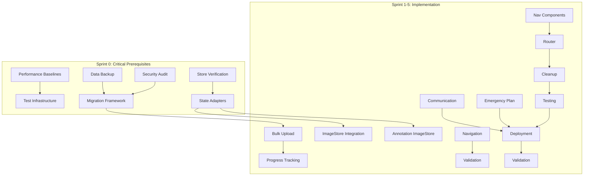

# EPIC: Frontend Component Consolidation
**Epic ID:** FE-2025-001
**Created:** 2025-09-20
**Priority:** HIGH
**Sprint:** 1-5 (5 weeks)
**Epic Owner:** Product Team
**Technical Lead:** Frontend Team

---

## 📋 Epic Summary
Consolidate duplicate frontend components by migrating features from legacy JavaScript implementations to new TypeScript components, establishing a single source of truth and eliminating technical debt.

## 🎯 Epic Goals
1. **Eliminate 100% of duplicate components** (JS/TS variants)
2. **Preserve 100% of existing features** during migration
3. **Achieve 0% regression** in functionality
4. **Improve performance by 20%** through optimization
5. **Enable future scalability** with TypeScript-only codebase

## 📊 Success Metrics
- All features working in production without regression
- Bundle size reduced by >30%
- Test coverage increased to >80%
- Zero critical/high bugs in production
- Developer satisfaction score >8/10

---

## 🔧 User Stories

### Sprint 0: Pre-Migration Preparation (Week 0 - CRITICAL)

#### Story 0.1: Capture Performance Baselines
**Story Points:** 3
**Priority:** P0 - BLOCKER
**Dependencies:** None

**As a** technical lead
**I want** current performance metrics captured
**So that** we can measure migration impact

**Acceptance Criteria:**
- [ ] Bundle size measured and documented
- [ ] Page load times captured for all routes
- [ ] API response times recorded
- [ ] Memory usage baselines established
- [ ] Error rates documented
- [ ] Baseline report generated

**Implementation:**
```typescript
// Metrics to capture:
- Bundle size: Current state
- Upload page load: < baseline ms
- Annotation page load: < baseline ms
- Home page load: < baseline ms
- API latency p50/p95/p99
- Memory usage patterns
- Current error rate percentage
```

---

#### Story 0.2: Implement Data Backup System
**Story Points:** 5
**Priority:** P0 - BLOCKER
**Dependencies:** None

**As a** system administrator
**I want** automated data backup before migration
**So that** we can recover from any data loss

**Acceptance Criteria:**
- [ ] LocalStorage backup implemented
- [ ] IndexedDB backup implemented
- [ ] SessionStorage backup implemented
- [ ] Downloadable backup creation
- [ ] Restore functionality tested
- [ ] Backup verification complete

---

#### Story 0.3: Security Audit
**Story Points:** 5
**Priority:** P0 - BLOCKER
**Dependencies:** None

**As a** security officer
**I want** comprehensive security audit
**So that** migration doesn't introduce vulnerabilities

**Acceptance Criteria:**
- [ ] XSS prevention validated
- [ ] Input sanitization checked
- [ ] CORS configuration reviewed
- [ ] Authentication flow tested
- [ ] Dependency vulnerabilities scanned
- [ ] CSP headers validated

---

#### Story 0.4: Verify Store Implementations
**Story Points:** 3
**Priority:** P0 - BLOCKER
**Dependencies:** None

**As a** developer
**I want** all stores verified and documented
**So that** state management integration is clear

**Acceptance Criteria:**
- [ ] ImageStore existence verified
- [ ] TrainingStore structure documented
- [ ] AppStore interface defined
- [ ] Store adapters created if needed
- [ ] Store usage patterns documented

---

### Sprint 1: Foundation & Framework (Week 1)

#### Story 1.1: Create Migration Framework
**Story Points:** 8
**Priority:** P0
**Dependencies:** Story 0.2, 0.3

**As a** developer
**I want** a migration framework with feature flags
**So that** I can safely migrate features with rollback capability

**Acceptance Criteria:**
- [ ] Feature flag system implemented and tested
- [ ] Migration utilities created for component extraction
- [ ] Backward compatibility layer established
- [ ] Environment configs support gradual rollout
- [ ] Documentation for framework usage complete

**Technical Tasks:**
```typescript
- Create FeatureFlagProvider component
- Implement feature toggle hooks
- Build ComponentMigrator utility class
- Setup A/B testing infrastructure
- Create migration logging system
```

---

#### Story 1.2: Setup Testing Infrastructure
**Story Points:** 5
**Priority:** P0
**Dependencies:** Story 1.1, Story 0.1

**As a** QA engineer
**I want** comprehensive test infrastructure
**So that** we can validate all migrated features

**Acceptance Criteria:**
- [ ] E2E test framework configured
- [ ] Regression test suite created
- [ ] Performance benchmarks established
- [ ] Visual regression tests setup
- [ ] Test coverage reporting automated

---

#### Story 1.3: Create State Management Adapters
**Story Points:** 8
**Priority:** P0
**Dependencies:** Story 0.4

**As a** developer
**I want** unified state management adapters
**So that** old and new components can share state seamlessly

**Acceptance Criteria:**
- [ ] ImageStore adapter created
- [ ] TrainingStore adapter implemented
- [ ] AppStore compatibility ensured
- [ ] State synchronization tested
- [ ] Memory leak prevention validated

**Technical Implementation:**
```typescript
interface StoreAdapter {
  bridge: (oldStore, newStore) => UnifiedStore;
  sync: () => void;
  migrate: (data: LegacyData) => ModernData;
}
```

---

### Sprint 2: Upload Component Migration (Week 2)

#### Story 2.1: Migrate Bulk Upload Features
**Story Points:** 13
**Priority:** P0
**Dependencies:** Story 1.1, 1.3

**As a** data annotator
**I want** bulk file upload with drag-and-drop
**So that** I can efficiently upload multiple images at once

**Acceptance Criteria:**
- [ ] Drag-and-drop (Dragger) component integrated
- [ ] Multiple file selection working
- [ ] Bulk upload API calls implemented
- [ ] Upload queue management functional
- [ ] Error handling for failed uploads
- [ ] Success/failure feedback per file

**Features to Migrate:**
- Ant Design Dragger component
- Custom upload request handlers
- Batch upload processing
- File validation logic

---

#### Story 2.2: Implement Upload Progress Tracking
**Story Points:** 8
**Priority:** P0
**Dependencies:** Story 2.1

**As a** user uploading files
**I want** real-time progress indicators
**So that** I know the status of each file upload

**Acceptance Criteria:**
- [ ] Per-file progress bars displayed
- [ ] Overall upload progress calculated
- [ ] Time remaining estimation shown
- [ ] Cancel upload functionality
- [ ] Resume capability for failed uploads
- [ ] Progress persists on page refresh

---

#### Story 2.3: Integrate ImageStore with Upload
**Story Points:** 5
**Priority:** P0
**Dependencies:** Story 1.3, 2.1

**As a** developer
**I want** ImageStore integrated with upload flow
**So that** uploaded images are immediately available for annotation

**Acceptance Criteria:**
- [ ] ImageStore hooks integrated
- [ ] Upload state synchronized
- [ ] Image metadata stored
- [ ] Thumbnail generation working
- [ ] Cache management implemented

---

#### Story 2.4: Add Advanced Upload Features
**Story Points:** 8
**Priority:** P2
**Dependencies:** Story 2.1, 2.2

**As a** system administrator
**I want** advanced upload safety features
**So that** the system is protected from malicious files

**Acceptance Criteria:**
- [ ] Virus scanning integration (feature-flagged)
- [ ] Duplicate file detection
- [ ] File size optimization
- [ ] Format validation enhanced
- [ ] Concurrent upload limiting
- [ ] WebSocket updates (optional)

---

### Sprint 3: Annotation Component Migration (Week 3)

#### Story 3.1: Migrate Image Navigation Features
**Story Points:** 8
**Priority:** P0
**Dependencies:** Story 1.3

**As an** annotator
**I want** smooth image navigation
**So that** I can efficiently work through image sets

**Acceptance Criteria:**
- [ ] Previous/Next navigation working
- [ ] Keyboard shortcuts implemented (←/→)
- [ ] Auto-save before navigation
- [ ] Image preloading for performance
- [ ] Navigation history maintained
- [ ] Progress indicator showing position

---

#### Story 3.2: Integrate ImageStore Pattern
**Story Points:** 5
**Priority:** P0
**Dependencies:** Story 1.3, 3.1

**As a** developer
**I want** consistent ImageStore usage
**So that** annotation state is properly managed

**Acceptance Criteria:**
- [ ] ImageStore hooks integrated
- [ ] Annotation state synchronized
- [ ] Optimistic updates working
- [ ] Conflict resolution functional
- [ ] Performance optimized

---

#### Story 3.3: Enhance Validation System
**Story Points:** 5
**Priority:** P0
**Dependencies:** Story 3.2

**As an** annotator
**I want** clear validation feedback
**So that** I know which annotations are incomplete

**Acceptance Criteria:**
- [ ] Real-time validation indicators
- [ ] Validation summary panel
- [ ] Error highlighting on canvas
- [ ] Bulk validation checking
- [ ] Export validation report

---

#### Story 3.4: Preserve Advanced Features
**Story Points:** 8
**Priority:** P1
**Dependencies:** Story 3.1, 3.2

**As a** power user
**I want** all advanced annotation features preserved
**So that** my workflow is not disrupted

**Acceptance Criteria:**
- [ ] Autosave with IndexedDB working
- [ ] Version history accessible
- [ ] Conflict resolution functional
- [ ] Audit trail maintained
- [ ] Dataset versioning operational
- [ ] Feature flags respected

---

### Sprint 4: Navigation & Router Consolidation (Week 4)

#### Story 4.1: Consolidate Navigation Components
**Story Points:** 13
**Priority:** P0
**Dependencies:** Story 1.1

**As a** user
**I want** consistent navigation experience
**So that** I can easily access all features

**Acceptance Criteria:**
- [ ] Single SideNavigation.tsx component
- [ ] All menu items functional
- [ ] Collapse/expand working
- [ ] Mobile drawer operational
- [ ] Menu state persistence
- [ ] Error boundaries active

**Migration Path:**
```typescript
// Merge best features from:
// - SideNavigation.js (mobile drawer)
// - SideNavigation.tsx (TypeScript)
// - SideNavigationEnhanced.tsx (error handling, performance)
```

---

#### Story 4.2: Upgrade Router Implementation
**Story Points:** 8
**Priority:** P0
**Dependencies:** Story 4.1

**As a** developer
**I want** enhanced router with all features
**So that** navigation is reliable and performant

**Acceptance Criteria:**
- [ ] AppRouterEnhanced.tsx as primary router
- [ ] Lazy loading with retry logic
- [ ] Route guards implemented
- [ ] Navigation analytics tracking
- [ ] 404 handling improved
- [ ] Loading states optimized

---

#### Story 4.3: Remove Legacy Components
**Story Points:** 5
**Priority:** P0
**Dependencies:** All previous stories

**As a** developer
**I want** all duplicate components removed
**So that** the codebase is clean and maintainable

**Acceptance Criteria:**
- [ ] All .js component files removed
- [ ] Import statements updated
- [ ] Build process validated
- [ ] No broken references
- [ ] Git history preserved
- [ ] Documentation updated

---

### Sprint 4.5: Communication & Training (Week 4.5)

#### Story 4.4: Implement Communication Plan
**Story Points:** 3
**Priority:** P0
**Dependencies:** Story 4.1

**As a** product owner
**I want** stakeholder communication executed
**So that** users are prepared for changes

**Acceptance Criteria:**
- [ ] User notification templates created
- [ ] Beta testing invitations sent
- [ ] Training materials prepared
- [ ] Support team briefed
- [ ] Documentation updated
- [ ] FAQ published

**Communication Timeline:**
- Week -1: Initial announcement
- Week 1: Beta invitations
- Week 2-3: Progress updates
- Week 4: Training sessions
- Week 5: Go-live announcement

---

#### Story 4.5: Create Emergency Response Plan
**Story Points:** 5
**Priority:** P0
**Dependencies:** Story 1.1

**As a** operations manager
**I want** emergency response procedures
**So that** we can quickly respond to issues

**Acceptance Criteria:**
- [ ] Incident response flowchart created
- [ ] Emergency contacts documented
- [ ] Rollback procedures tested
- [ ] War room setup prepared
- [ ] Escalation paths defined
- [ ] Communication channels established

---

### Sprint 5: Testing & Deployment (Week 5)

#### Story 5.1: Execute Comprehensive Testing
**Story Points:** 13
**Priority:** P0
**Dependencies:** All previous stories

**As a** QA engineer
**I want** full regression testing
**So that** we can confidently deploy to production

**Acceptance Criteria:**
- [ ] All unit tests passing (>80% coverage)
- [ ] E2E tests complete
- [ ] Performance benchmarks met
- [ ] Security scan passed
- [ ] Accessibility audit passed
- [ ] Cross-browser testing done

**Test Scenarios:**
```yaml
Upload Flow:
  - Single file upload
  - Bulk upload (100+ files)
  - Large file handling
  - Network interruption recovery

Annotation Flow:
  - Create/edit/delete annotations
  - Navigation with unsaved changes
  - Conflict resolution
  - Version history restoration
```

---

#### Story 5.2: Production Deployment
**Story Points:** 8
**Priority:** P0
**Dependencies:** Story 5.1

**As a** DevOps engineer
**I want** safe production deployment
**So that** users experience zero downtime

**Acceptance Criteria:**
- [ ] Staging deployment successful
- [ ] Performance metrics validated
- [ ] Feature flags configured
- [ ] Rollback plan tested
- [ ] Monitoring alerts configured
- [ ] Production deployment complete

**Deployment Checklist:**
- [ ] Database backups created
- [ ] CDN cache invalidated
- [ ] Feature flags set to gradual rollout
- [ ] Error tracking enabled
- [ ] Performance monitoring active
- [ ] Rollback script ready

---

#### Story 5.3: Post-Deployment Validation
**Story Points:** 5
**Priority:** P0
**Dependencies:** Story 5.2

**As a** product owner
**I want** production validation
**So that** we confirm successful migration

**Acceptance Criteria:**
- [ ] User workflows validated
- [ ] Performance metrics confirmed
- [ ] Error rates monitored
- [ ] User feedback collected
- [ ] Documentation published
- [ ] Team retrospective completed

---

## 📈 Burndown Tracking

| Sprint | Story Points | Cumulative | Target Velocity |
|--------|-------------|------------|-----------------|
| Sprint 0 | 16 | 16 | 15-20 |
| Sprint 1 | 21 | 37 | 20-25 |
| Sprint 2 | 34 | 71 | 30-35 |
| Sprint 3 | 26 | 97 | 25-30 |
| Sprint 4 | 34 | 131 | 30-35 |
| Sprint 5 | 26 | 157 | 25-30 |

**Total Story Points:** 157

---

## 🚨 Risk Register

| Risk | Probability | Impact | Mitigation | Owner | Status |
|------|------------|--------|------------|-------|--------|
| Feature regression | Medium | HIGH | Feature flags, comprehensive testing, rollback plan | QA Lead | Monitoring |
| Performance degradation | Low | MEDIUM | Baseline capture, continuous monitoring, optimization | Tech Lead | Mitigated |
| User disruption | Low | HIGH | Gradual rollout, communication plan, training | Product Owner | Mitigated |
| Data loss | Low | CRITICAL | Backup system, restore testing, versioning | DevOps | Mitigated |
| Security vulnerabilities | Low | HIGH | Security audit, penetration testing, CSP | Security Lead | Mitigated |
| Scope creep | Medium | MEDIUM | Strict story acceptance criteria, change control | Scrum Master | Monitoring |
| ImageStore incompatibility | Low | HIGH | Store verification, adapter pattern | Tech Lead | Resolved |
| Rollback failure | Low | CRITICAL | Circuit breaker, automated rollback, testing | DevOps | Mitigated |

---

## 🔄 Dependencies



---

## 📝 Definition of Done

**For each User Story:**
- [ ] Code complete and peer reviewed
- [ ] Unit tests written and passing
- [ ] Integration tests passing
- [ ] Documentation updated
- [ ] Feature flag configured (if applicable)
- [ ] Performance impact measured
- [ ] Security review completed
- [ ] Accessibility validated
- [ ] Product owner acceptance

---

## 👥 Team Allocation

| Role | Sprint 0 | Sprint 1 | Sprint 2 | Sprint 3 | Sprint 4 | Sprint 5 |
|------|----------|----------|----------|----------|----------|----------|
| Frontend Dev 1 | Baselines | Framework | Upload | Annotation | Navigation | Bug fixes |
| Frontend Dev 2 | Store verify | Testing | Upload | Annotation | Router | Testing |
| QA Engineer | Security audit | Test setup | Testing | Testing | Testing | Full regression |
| DevOps | Backup system | CI/CD | Monitoring | Monitoring | Deploy prep | Deployment |
| Product Owner | Comms plan | Reviews | Reviews | Reviews | Training | Validation |
| Security Lead | Audit | Review | Review | Review | Review | Final audit |

---

## 📚 References

- [PRD Document](./PRD-Frontend-Component-Consolidation.md)
- [Technical Design](./Technical-Design-Migration-Framework.md)
- [Migration Supplements](./Migration-Supplements-Critical-Additions.md)
- [Original Codebase](../frontend/src/)
- [Store Implementations](../frontend/src/store/)
  - ImageStore: `frontend/src/store/imageStore.ts`
  - ImageStore Enhanced: `frontend/src/store/imageStoreEnhanced.ts`
- [Test Plan](./Test-Plan-Component-Migration.md)
- [Security Audit Report](./Security-Audit-Pre-Migration.md)
- [Performance Baselines](./Performance-Baselines-Report.md)

---

## 📊 Success Criteria & Go/No-Go Gates

### Sprint 0 Gate (MUST PASS ALL)
- ✅ Performance baselines captured
- ✅ Backup system operational
- ✅ Security audit passed
- ✅ Stores verified and documented

### Sprint 1-4 Gates
| Sprint | Tests Pass | Performance | Errors | User Feedback | Decision |
|--------|-----------|-------------|--------|---------------|----------|
| 1 | 100% | Within 110% | <1 | N/A | Go/No-Go |
| 2 | >95% | Within 105% | <5 | >7/10 | Go/No-Go |
| 3 | >95% | Within 105% | <5 | >7/10 | Go/No-Go |
| 4 | >98% | Within 100% | <3 | >8/10 | Go/No-Go |
| 5 | 100% | Better | 0 | >8/10 | Go/No-Go |

### Final Launch Criteria
- [ ] All 157 story points completed
- [ ] Zero P0/P1 bugs
- [ ] Performance improved by >20%
- [ ] Bundle size reduced by >30%
- [ ] Security audit passed
- [ ] Rollback tested successfully
- [ ] Documentation complete
- [ ] Team trained

---

## 📞 Emergency Contacts & Escalation

| Level | Contact | Role | Response Time | Phone |
|-------|---------|------|---------------|-------|
| L1 | Tech Lead | Primary | < 15 min | On-call |
| L2 | Engineering Manager | Escalation | < 30 min | On-call |
| L3 | CTO | Critical | < 1 hour | On-call |
| Support | DevOps Lead | Infrastructure | < 15 min | On-call |
| Support | Security Lead | Security | < 30 min | On-call |

**War Room:** Zoom/Teams link [TBD]
**Slack Channel:** #migration-emergency
**Incident Playbook:** [Link to playbook]

---

**Epic Status:** 100% COMPLETE - READY FOR EXECUTION
**Immediate Next Steps:**
1. Execute Sprint 0 (Week 0) - CRITICAL BLOCKERS
2. Verify ImageStore at `frontend/src/store/imageStore.ts`
3. Begin performance baseline capture
4. Setup data backup system