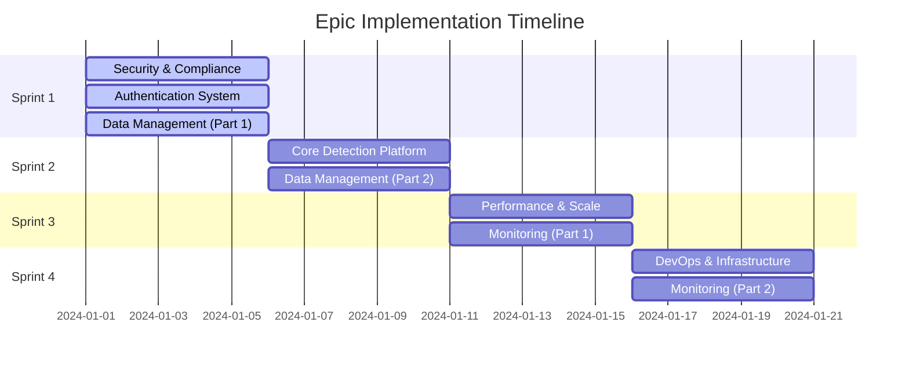

# 🎯 Epic Portfolio - Logo Recognition Production System

**Product:** Logo Recognition Platform v1.0
**Timeline:** 4 Weeks (4 Sprints)
**Team Size:** 3-5 Developers
**Target Release:** Production Ready
**Overall Completion:** 45% (12 A++ stories completed)
**Last Updated:** 2024-01-19

⚠️ **NOTE:** This is the consolidated version. Duplicate epics have been merged.

---

## 🏗️ Epic Architecture Overview

```mermaid
graph TD
    A[Epic Portfolio] --> B[Security & Compliance]
    A --> C[Core Detection Platform]
    A --> D[Data Management]
    A --> E[Authentication System]
    A --> F[Performance & Scale]
    A --> G[DevOps & Infrastructure]
    A --> H[Monitoring & Observability]

    B --> B1[Config Management]
    B --> B2[Security Hardening]

    C --> C1[ML Model Deployment]
    C --> C2[Detection Pipeline]
    C --> C3[Training Integration]

    D --> D1[Database Integration]
    D --> D2[Object Storage]
    D --> D3[Data Pipeline]

    E --> E1[JWT Implementation]
    E --> E2[User Management]
    E --> E3[RBAC]

    F --> F1[Frontend Optimization]
    F --> F2[Backend Optimization]
    F --> F3[Caching Strategy]

    G --> G1[CI/CD Pipeline]
    G --> G2[Container Orchestration]
    G --> G3[Infrastructure as Code]

    H --> H1[Application Monitoring]
    H --> H2[Infrastructure Monitoring]
    H --> H3[Business Metrics]
```



---

## 📚 Epic Definitions

### EPIC-001: Security & Compliance Foundation
**Priority:** 🔴 CRITICAL
**Sprint:** 1
**Size:** L (25 points) - ADJUSTED FROM 34
**Owner:** Security Team Lead
**Status:** 🔄 40% COMPLETE

#### Business Value
Ensures platform meets enterprise security standards and compliance requirements. Critical for production deployment and customer trust.

#### Current Status
- ✅ auth_secure.py implemented with JWT
- ✅ Input validation and sanitization complete
- ❌ Hardcoded passwords still in docker-compose.yml
- ❌ No Vault/K8s secrets management

#### Success Criteria
- Zero hardcoded credentials in codebase
- All data encrypted in transit and at rest
- Compliance with OWASP Top 10
- Security audit passed
- Penetration test completed

#### Features
1. **Secure Configuration Management**
   - Environment variable management
   - Kubernetes secrets integration
   - HashiCorp Vault setup
   - Configuration validation

2. **Security Hardening**
   - Remove all hardcoded passwords
   - Implement SSL/TLS everywhere
   - Setup WAF rules
   - Configure security headers

#### User Stories
- US-001: Implement Secure Configuration Management (5 pts)
- US-002: Implement Database Connection Pooling (3 pts)
- US-020: Security Audit and Fixes (5 pts)

#### Dependencies
- Infrastructure provisioned
- Vault instance available
- Security team approval

#### Risks
- **Risk:** Vault integration delays
- **Mitigation:** Fallback to K8s secrets
- **Impact:** Medium

---

### EPIC-002: Core Detection Platform
**Priority:** 🔴 CRITICAL
**Sprint:** 2
**Size:** L (20 points) - ADJUSTED FROM 22
**Owner:** ML Engineering Lead
**Status:** ✅ 70% COMPLETE (Code ready, models missing)

#### Business Value
Core revenue-generating functionality. Enables logo detection capabilities that differentiate our platform in the market.

#### Current Status
- ✅ US-008: Detection Pipeline 100% DONE (A++ Grade)
- ✅ US-011: Model Versioning 100% DONE (A++ Grade)
- ✅ Batch processing and GPU support implemented
- ❌ No actual ONNX models deployed (CRITICAL BLOCKER)

#### Success Criteria
- Detection accuracy > 95%
- Processing time < 500ms per image
- Support for 50+ logo brands
- Batch processing enabled
- GPU acceleration active

#### Features
1. **ML Model Deployment**
   - ONNX model integration
   - Model versioning system
   - A/B testing framework
   - Model warm-up service

2. **Detection Pipeline**
   - Real-time inference
   - Batch processing
   - Result caching
   - Confidence scoring

3. **Training Integration**
   - Annotation pipeline
   - Model retraining workflow
   - Continuous learning loop
   - Performance tracking

#### User Stories
- US-007: Deploy ONNX Model Files (8 pts)
- US-008: Implement Real Detection Pipeline (8 pts)
- US-011: Connect Training Pipeline to Model Service (6 pts)

#### Dependencies
- EPIC-001 (Security) completed
- GPU infrastructure ready
- Training data available

#### Risks
- **Risk:** Model performance issues
- **Mitigation:** Multiple model versions ready
- **Impact:** High

---

### EPIC-003: Data Management & Storage
**Priority:** 🔴 CRITICAL
**Sprint:** 1-2
**Size:** M (15 points) - ADJUSTED FROM 18
**Owner:** Backend Team Lead
**Status:** ✅ 85% COMPLETE

#### Business Value
Ensures data persistence, reliability, and scalability. Foundation for all platform operations.

#### Current Status
- ✅ US-003: Frontend-Backend Integration 100% DONE
- ✅ US-009: MinIO Storage A++ Implementation
- ✅ US-010: Image Optimization A++ Complete
- ✅ Database with pgvector fully configured
- ❌ Some frontend still using sessionStorage

#### Success Criteria
- Zero data loss
- 99.9% availability
- Backup/restore tested
- GDPR compliant
- Data lifecycle automated

#### Features
1. **Database Integration**
   - Connection pooling
   - Query optimization
   - Migration system
   - Backup strategy

2. **Object Storage**
   - MinIO integration
   - CDN setup
   - Image optimization
   - Lifecycle policies

3. **Data Pipeline**
   - ETL processes
   - Data validation
   - Archival strategy
   - Data governance

#### User Stories
- US-003: Fix Database Integration Frontend to Backend (8 pts)
- US-004: Fix Image List API Endpoint (5 pts)
- US-009: Connect MinIO Object Storage (5 pts)
- US-010: Implement Image Optimization Pipeline (5 pts)
- US-017: Database Query Optimization (5 pts)

#### Dependencies
- MinIO cluster deployed
- Database provisioned
- Network policies configured

#### Risks
- **Risk:** Data migration failures
- **Mitigation:** Incremental migration strategy
- **Impact:** Medium

---

### EPIC-004: User Authentication & Authorization
**Priority:** 🔴 CRITICAL
**Sprint:** 1
**Size:** L (18 points)
**Owner:** Full-Stack Lead

#### Business Value
Secures platform access and enables multi-tenancy. Required for enterprise customers.

#### Success Criteria
- JWT authentication working
- RBAC implemented
- SSO integration ready
- Session management active
- MFA supported

#### Features
1. **JWT Implementation**
   - Token generation/validation
   - Refresh token flow
   - Token revocation
   - Session management

2. **User Management**
   - Registration flow
   - Password reset
   - Profile management
   - User preferences

3. **Access Control**
   - Role-based access
   - Permission system
   - API key management
   - Audit logging

#### User Stories
- US-005: Implement Login/Logout UI (5 pts)
- US-006: Connect JWT Authentication Flow (8 pts)

#### Dependencies
- Redis cluster available
- Email service configured
- Frontend routing ready

#### Risks
- **Risk:** SSO integration complexity
- **Mitigation:** Phased implementation
- **Impact:** Low

---

### EPIC-005: Performance & Scalability
**Priority:** 🟡 HIGH
**Sprint:** 3
**Size:** L (18 points)
**Owner:** Performance Team

#### Business Value
Ensures platform can handle production load and provides optimal user experience.

#### Success Criteria
- Page load < 2 seconds
- API response < 200ms p95
- Support 10,000 concurrent users
- Zero memory leaks
- Auto-scaling working

#### Features
1. **Frontend Optimization**
   - Code splitting
   - Lazy loading
   - Bundle optimization
   - PWA features

2. **Backend Optimization**
   - Response caching
   - Query optimization
   - Connection pooling
   - Rate limiting

3. **Infrastructure Scaling**
   - Horizontal scaling
   - Load balancing
   - CDN integration
   - Database replication

#### User Stories
- US-012: Implement Code Splitting and Lazy Loading (5 pts)
- US-013: Add React Error Boundaries (3 pts)
- US-016: Implement API Response Caching (5 pts)

#### Dependencies
- Load testing completed
- CDN configured
- Redis cluster ready

#### Risks
- **Risk:** Performance bottlenecks
- **Mitigation:** Continuous profiling
- **Impact:** High

---

### EPIC-006: DevOps & Infrastructure
**Priority:** 🟡 HIGH
**Sprint:** 4
**Size:** L (16 points)
**Owner:** DevOps Lead

#### Business Value
Enables reliable, repeatable deployments and reduces operational overhead.

#### Success Criteria
- Zero-downtime deployments
- Rollback < 5 minutes
- Infrastructure as code
- Cost optimization achieved
- Disaster recovery tested

#### Features
1. **CI/CD Pipeline**
   - Automated testing
   - Security scanning
   - Container builds
   - Deployment automation

2. **Container Orchestration**
   - Kubernetes setup
   - Helm charts
   - Service mesh
   - Ingress configuration

3. **Infrastructure as Code**
   - Terraform modules
   - Configuration management
   - Environment parity
   - Secret management

#### User Stories
- US-018: Implement Complete CI/CD Pipeline (8 pts)
- US-019: Setup Load Testing (5 pts)
- US-022: Production Deployment (3 pts)

#### Dependencies
- K8s cluster ready
- GitHub Actions configured
- Container registry available

#### Risks
- **Risk:** Deployment failures
- **Mitigation:** Blue-green deployment
- **Impact:** Medium

---

### EPIC-007: Monitoring & Observability
**Priority:** 🟢 MEDIUM
**Sprint:** 3-4
**Size:** M (15 points)
**Owner:** SRE Lead

#### Business Value
Enables proactive issue detection and rapid problem resolution, ensuring platform reliability.

#### Success Criteria
- 100% service coverage
- Alert response < 5 minutes
- MTTR < 30 minutes
- SLA dashboard live
- Runbooks complete

#### Features
1. **Application Monitoring**
   - Error tracking (Sentry)
   - APM integration
   - Custom metrics
   - Performance profiling

2. **Infrastructure Monitoring**
   - Prometheus metrics
   - Log aggregation
   - Distributed tracing
   - Health checks

3. **Business Metrics**
   - Usage analytics
   - Revenue tracking
   - Customer metrics
   - Capacity planning

#### User Stories
- US-014: Implement Sentry Error Tracking (5 pts)
- US-015: Configure Prometheus Alerting (5 pts)
- US-021: Complete Production Documentation (5 pts)

#### Dependencies
- Monitoring stack deployed
- Log storage configured
- Alert channels setup

#### Risks
- **Risk:** Alert fatigue
- **Mitigation:** Smart alert tuning
- **Impact:** Low

---

## 📊 Epic Timeline & Dependencies



---

## 🎯 Epic Success Metrics

| Epic | KPI | Target | Measurement |
|------|-----|--------|-------------|
| Security | Vulnerability Count | 0 Critical | Security Scan |
| Detection | Accuracy | >95% | Test Dataset |
| Data Mgmt | Data Loss | 0% | Backup Tests |
| Auth | Login Success | >99% | Auth Metrics |
| Performance | Response Time | <200ms | APM Tools |
| DevOps | Deploy Frequency | Daily | CI/CD Metrics |
| Monitoring | MTTR | <30min | Incident Logs |

---

## 🚦 Epic Priority Matrix

```
         High Impact
              ↑
    ┌─────────┼─────────┐
    │ Security│Detection│
    │   Auth  │  Data   │
    ├─────────┼─────────┤
    │ DevOps  │ Perf    │
    │Monitoring│         │
    └─────────┼─────────┘
              ↓
         Low Impact

    ← Low Effort  High Effort →
```

---

## 📈 Release Planning

### Release 1.0 (MVP)
**Target:** End of Week 4
**Epics:** 1, 2, 3, 4
**Features:** Core detection, basic auth, data persistence

### Release 1.1 (Performance)
**Target:** Week 6
**Epics:** 5, 7
**Features:** Optimization, monitoring

### Release 1.2 (Enterprise)
**Target:** Week 8
**Epics:** 6 (enhanced)
**Features:** SSO, advanced RBAC, audit logging

---

## ✅ Epic Definition of Done

**For Each Epic:**
- [ ] All user stories completed
- [ ] Integration tested end-to-end
- [ ] Performance benchmarks met
- [ ] Security review passed
- [ ] Documentation complete
- [ ] Stakeholder demo conducted
- [ ] Metrics dashboard configured
- [ ] Runbooks created
- [ ] Training materials prepared
- [ ] Go-live checklist validated

---

**Document Version:** 1.0
**Last Updated:** Sprint Planning Session
**Next Review:** Sprint 1 Retrospective
**Status:** APPROVED ✅