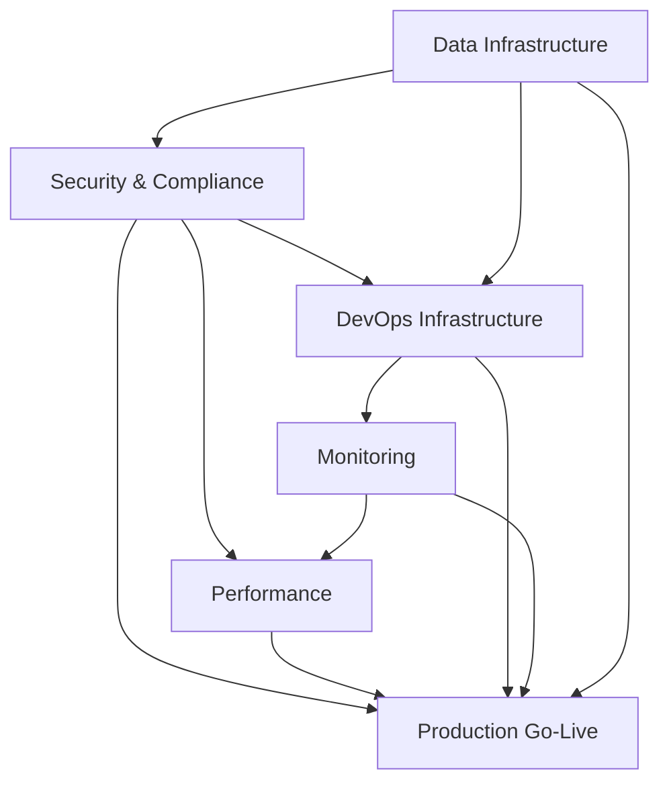

# 🚀 Production Readiness Epic Portfolio

## Overview

**Project**: Logo Recognition System - Production Deployment  
**Timeline**: 6 Weeks (Sprint 07-09)  
**Total Story Points**: 360  
**Target Go-Live**: February 21, 2024  

## Epic Structure

This portfolio contains all epics specifically required for production readiness, organized into two categories:

### 🔴 Critical Production Epics (Must-Have)
These epics MUST be completed before go-live:

1. **[Epic-PR-01: Security & Compliance](./epic-pr-01-security-compliance.md)**
   - Priority: 🔴 CRITICAL
   - Points: 34
   - Sprint: 7
   - Status: In Progress

2. **[Epic-PR-03: DevOps & Infrastructure](./epic-pr-03-devops-infrastructure.md)**
   - Priority: 🔴 CRITICAL
   - Points: 16
   - Sprint: 7-8
   - Status: In Progress

### 🟡 Essential Production Epics (Should-Have)
These epics are essential for production stability:

3. **[Epic-PR-04: Monitoring & Observability](./epic-pr-04-monitoring-observability.md)**
   - Priority: 🟡 HIGH
   - Points: 15
   - Sprint: 8
   - Status: Planning

4. **[Epic-PR-02: Performance & Scalability](./epic-pr-02-performance-scalability.md)**
   - Priority: 🟡 HIGH
   - Points: 13
   - Sprint: 8-9
   - Status: Planning

### 🔵 Data Infrastructure Epic
Critical data layer for production:

5. **[Epic-PR-05: Production Data Infrastructure](./epic-pr-05-data-infrastructure.md)**
   - Priority: 🔴 CRITICAL
   - Points: 21
   - Sprint: 7-8
   - Status: In Progress
   - Consolidates: Database, Authentication, ML Storage

## Epic Dependencies

## Sprint Allocation

### Sprint 07 (Jan 15-26): Foundation
- **Focus**: Security, Infrastructure & Data
- **Epics**:
  - Epic-PR-01: Security setup (20 points)
  - Epic-PR-03: Infrastructure foundation (10 points)
  - Epic-PR-05: Data infrastructure (13 points)
- **Total Points**: 43

### Sprint 08 (Jan 29 - Feb 9): Hardening
- **Focus**: Monitoring & Performance
- **Epics**:
  - Epic-PR-04: Monitoring implementation (15 points)
  - Epic-PR-02: Performance optimization (8 points)
  - Epic-PR-03: DevOps completion (6 points)
  - Epic-PR-05: Data infrastructure completion (8 points)
- **Total Points**: 37

### Sprint 09 (Feb 12-23): Deployment
- **Focus**: Final deployment & documentation
- **Epics**:
  - Epic-PR-02: Performance final (5 points)
  - Epic-PR-01: Security audit (14 points)
  - Documentation & deployment activities
- **Total Points**: 19

## Success Metrics

| Epic | Key Metrics | Target | Current |
|------|------------|--------|----------|
| PR-01: Security | Critical Vulnerabilities | 0 | Unknown |
| | Security Score | A+ | - |
| | Compliance | 100% | 0% |
| PR-02: Performance | API Response p95 | <200ms | Unknown |
| | Concurrent Users | 10,000 | 0 |
| | Page Load Time | <2s | Unknown |
| PR-03: DevOps | Deploy Success Rate | >95% | 0% |
| | MTTR | <30min | N/A |
| | Zero-downtime Deploys | Yes | No |
| PR-04: Monitoring | Service Coverage | 100% | 0% |
| | Alert Response Time | <5min | N/A |
| | Dashboard Coverage | 100% | 0% |

## Risk Assessment

### Critical Risks
1. **Security vulnerabilities discovered late** (Epic-PR-01)
   - Mitigation: Early security scanning and audit
   - Owner: Security Team

2. **Infrastructure not scalable** (Epic-PR-03)
   - Mitigation: Load testing in Sprint 8
   - Owner: DevOps Team

3. **Monitoring blind spots** (Epic-PR-04)
   - Mitigation: Comprehensive coverage plan
   - Owner: SRE Team

4. **Performance issues under load** (Epic-PR-02)
   - Mitigation: Early performance testing
   - Owner: Backend Team

## Integration Points

### With Existing System
- Authentication system requires security hardening (Epic-002 → Epic-PR-01)
- Infrastructure needs production configuration (Epic-05 → Epic-PR-03)
- Data management needs performance optimization (Epic-003 → Epic-PR-02)

### External Dependencies
- AWS account and service limits
- SSL certificates
- Security compliance approval
- Third-party monitoring tools

## Definition of Done

### Epic Level
- [ ] All user stories completed
- [ ] Security audit passed
- [ ] Performance benchmarks met
- [ ] Monitoring coverage 100%
- [ ] Documentation complete
- [ ] Runbooks created
- [ ] Team trained
- [ ] Stakeholder sign-off

### Production Readiness Checklist
- [ ] Zero critical vulnerabilities
- [ ] All secrets secured in Vault/K8s
- [ ] SSL/TLS enabled everywhere
- [ ] Connection pooling configured
- [ ] CI/CD pipeline operational
- [ ] Blue-green deployment ready
- [ ] Load testing passed (10x capacity)
- [ ] Monitoring dashboards live
- [ ] Alerts configured and tested
- [ ] Error tracking enabled
- [ ] Logging aggregation working
- [ ] Backup and recovery tested
- [ ] Disaster recovery plan documented
- [ ] On-call rotation established

## Team Assignments

| Epic | Lead | Team Members |
|------|------|-------------|
| Epic-PR-01 | Security Lead | Backend Team, DevOps |
| Epic-PR-02 | Performance Lead | Frontend, Backend Teams |
| Epic-PR-03 | DevOps Lead | Infrastructure Team |
| Epic-PR-04 | SRE Lead | DevOps, Backend Teams |

## Communication Plan

### Sprint Reviews
- **When**: End of each sprint
- **Participants**: All stakeholders
- **Focus**: Epic progress and blockers

### Daily Standups
- **When**: 10:00 AM daily
- **Format**: Epic status updates
- **Duration**: 15 minutes

### Risk Reviews
- **When**: Weekly (Mondays)
- **Participants**: Epic leads
- **Focus**: Risk mitigation progress

## Success Criteria

**Production readiness is achieved when:**
1. ✅ All critical epics completed (PR-01, PR-03)
2. ✅ All essential epics completed (PR-02, PR-04)
3. ✅ Security audit passed with no critical issues
4. ✅ Performance testing shows system can handle 10x expected load
5. ✅ Monitoring coverage at 100% with all alerts configured
6. ✅ Zero-downtime deployment demonstrated
7. ✅ All documentation and runbooks completed
8. ✅ Disaster recovery tested successfully
9. ✅ Stakeholder sign-off received
10. ✅ Go-live checklist 100% complete

---

**Document Status**: 🟢 Active  
**Last Updated**: January 15, 2024  
**Owner**: Product Management  
**Next Review**: Sprint 07 Review