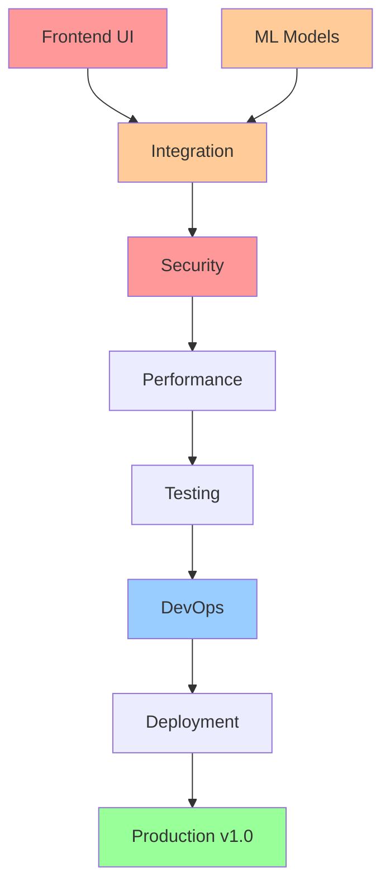

# 📁 Production v1.0 - Complete Epic Index

## Overview

**Total Scope for v1.0**: 267 story points  
**Completed**: 77 points (29%)  
**Remaining**: 190 points (71%)  
**Timeline**: 6 additional sprints (12 weeks)  

## Epic Organization by Category

### 🟥 Category A: Frontend Development (55 points - 0% complete)
**Status**: NOT STARTED - CRITICAL PATH  
**Sprint**: 4-5  

#### Epics:
1. **[Epic-04: UI/UX Design System](./epic-04-ui-ux-design-system.md)**
   - Design system implementation
   - Component library
   - Responsive layouts
   - Points: 20

2. **[Epic-F01: Core User Interfaces](./epic-f01-core-ui.md)** (TO CREATE)
   - Upload interface
   - Detection display
   - Annotation canvas
   - User management screens
   - Points: 35

### 🔵 Category B: ML & Detection (45 points - 40% complete)
**Status**: PARTIALLY COMPLETE - NEEDS REAL MODELS  
**Sprint**: 4-5  

#### Epics:
3. **[Epic-01: Training System](./epic-01-training-system.md)**
   - Training pipeline
   - Data management
   - Model versioning
   - Points: 15 (partially complete)

4. **[Epic-02: Recognition System](./epic-02-recognition-system.md)**
   - Detection pipeline
   - Inference engine
   - Results processing
   - Points: 15 (mocked only)

5. **[Epic-002: Core Detection Platform](./epic-002-core-detection.md)**
   - ONNX model deployment
   - Real inference implementation
   - Performance optimization
   - Points: 15 (needs completion)

### 🟠 Category C: Backend & Integration (42 points - 70% complete)
**Status**: MOSTLY COMPLETE - NEEDS INTEGRATION  
**Sprint**: 5  

#### Epics:
6. **[Epic-003: Data Management](./epic-003-data-management.md)**
   - Database operations
   - Storage integration
   - API endpoints
   - Points: 20 (needs MinIO connection)

7. **[Epic-004: Authentication System](./epic-004-authentication.md)**
   - JWT implementation (DONE)
   - User management
   - Frontend integration needed
   - Points: 12 (backend complete)

8. **[Epic-B01: Frontend-Backend Integration](./epic-b01-integration.md)** (TO CREATE)
   - API connections
   - WebSocket setup
   - State synchronization
   - Points: 10

### 🔴 Category D: Security & Infrastructure (55 points - 30% complete)
**Status**: CRITICAL GAPS - HARDCODED SECRETS  
**Sprint**: 6-7  

#### Epics:
9. **[Epic-PR-01: Security & Compliance](./epic-pr-01-security-compliance.md)**
   - Remove hardcoded credentials
   - Implement secrets management
   - Security audit
   - Points: 25

10. **[Epic-PR-05: Data Infrastructure](./epic-pr-05-data-infrastructure.md)**
    - Production database setup
    - Backup & recovery
    - Data migration
    - Points: 15

11. **[Epic-05: Infrastructure Deployment](./epic-05-infrastructure-deployment.md)**
    - Cloud infrastructure
    - Container orchestration
    - Load balancing
    - Points: 15

### 🟣 Category E: Performance & Quality (35 points - 0% complete)
**Status**: NOT STARTED  
**Sprint**: 6-7  

#### Epics:
12. **[Epic-PR-02: Performance & Scalability](./epic-pr-02-performance-scalability.md)**
    - Frontend optimization
    - Backend optimization
    - Caching strategy
    - Points: 15

13. **[Epic-Q01: Testing & Quality](./epic-q01-testing.md)** (TO CREATE)
    - Unit tests (80% coverage)
    - Integration tests
    - E2E tests
    - Performance tests
    - Points: 20

### 🟢 Category F: DevOps & Monitoring (35 points - 40% complete)
**Status**: INFRASTRUCTURE EXISTS - NEEDS CONFIGURATION  
**Sprint**: 8  

#### Epics:
14. **[Epic-PR-03: DevOps & CI/CD](./epic-pr-03-devops-infrastructure.md)**
    - CI/CD pipeline
    - Automated deployment
    - Infrastructure as Code
    - Points: 20

15. **[Epic-PR-04: Monitoring & Observability](./epic-pr-04-monitoring-observability.md)**
    - Metrics configuration
    - Alert setup
    - Dashboard creation
    - Points: 15

## Sprint Allocation Matrix

| Sprint | Focus | Epics | Points | Critical Path |
|--------|-------|-------|--------|---------------|
| 4 | Frontend Core | Epic-04, Epic-F01 | 45 | YES - UI |
| 5 | Integration | Epic-002, Epic-B01, Epic-003 | 45 | YES - Connection |
| 6 | Security | Epic-PR-01, Epic-PR-05 | 40 | YES - Security |
| 7 | Quality | Epic-PR-02, Epic-Q01 | 35 | NO |
| 8 | DevOps | Epic-PR-03, Epic-PR-04 | 35 | YES - Deployment |
| 9 | Polish | Documentation, Final fixes | 30 | NO |

## Dependency Graph



## Risk Assessment by Epic

| Epic Category | Risk Level | Main Risk | Mitigation |
|---------------|------------|-----------|------------|
| Frontend | 🔴 CRITICAL | No UI exists | Add 2 developers immediately |
| ML Models | 🟠 HIGH | Using mocks | Deploy real models ASAP |
| Integration | 🟠 HIGH | Not connected | Daily integration tests |
| Security | 🔴 CRITICAL | Hardcoded secrets | Fix in Sprint 6 |
| Performance | 🟡 MEDIUM | Not optimized | Can optimize later |
| DevOps | 🟠 HIGH | No CI/CD | Setup in Sprint 8 |

## Definition of Done for v1.0

### Epic Level
- [ ] All user stories complete
- [ ] Test coverage > 80%
- [ ] Documentation complete
- [ ] Security review passed
- [ ] Performance benchmarks met

### Release Level
- [ ] All epics complete
- [ ] E2E tests passing
- [ ] Load test passed (100 users)
- [ ] Security audit clean
- [ ] Production deployed
- [ ] Monitoring active
- [ ] Team trained
- [ ] Stakeholder sign-off

## Quick Status Summary

```
Frontend:     [##........] 20% (Bootstrap done, no features)
Backend:      [#######...] 70% (APIs ready, needs integration)
ML/AI:        [####......] 40% (Framework ready, no models)
Infrastructure:[######....] 60% (Docker ready, no K8s)
Security:     [###.......] 30% (Auth done, secrets exposed)
Testing:      [#.........] 10% (Some unit tests only)
Documentation:[##........] 20% (Technical docs only)

OVERALL:      [###.......] 29% Complete
```

## Next Immediate Actions

1. **TODAY**: Deploy real ONNX models
2. **THIS WEEK**: Start frontend development (Epic-04, Epic-F01)
3. **THIS WEEK**: Connect frontend to backend
4. **NEXT WEEK**: Fix security issues
5. **SPRINT 5**: Complete integration

---

**Status**: 🟡 ACTIVE DEVELOPMENT  
**Last Updated**: January 2024  
**Next Review**: Sprint 4 Planning  
**Critical Decision**: Need 2 more frontend developers NOW