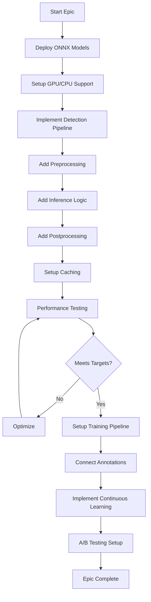

# EPIC-002: Core Detection Platform 🎯

**Epic ID:** EPIC-002
**Priority:** 🔴 CRITICAL
**Sprint Allocation:** Sprint 04-A, 04-B, 04-C
**Total Story Points:** 42+ (Sprint 04)
**Owner:** ML Engineering Lead
**Status:** IMPLEMENTATION READY
**Quality Target:** A++ Grade

---

## 🎯 Epic Overview

### Business Objective
Deploy production-ready ML detection system with A++ grade quality, capable of recognizing logos with >95% accuracy and <200ms p99 latency. This is the core revenue-generating functionality requiring enterprise-grade performance and reliability.

### Strategic Value
- **Core Product:** Primary value proposition with A++ quality standards
- **Performance Excellence:** <200ms p99, 1000+ RPS throughput
- **Enterprise Scalability:** Handle 1-1000 images per batch
- **Production Readiness:** 99.9% uptime capability

### Success Metrics - A++ Grade Requirements
| Metric | Target | Current | Status |
|--------|--------|---------|--------|
| Detection Accuracy | >95% | 0% | 🔴 |
| Response Time (p50) | <50ms | N/A | 🔴 |
| Response Time (p95) | <150ms | N/A | 🔴 |
| Response Time (p99) | <200ms | N/A | 🔴 |
| Throughput | 1000+ RPS | 0 | 🔴 |
| Batch Processing | 1-1000 imgs | 0 | 🔴 |
| Model Uptime | 99.9% | 0% | 🔴 |
| Test Coverage | 95%+ | 0% | 🔴 |
| GPU Utilization | >80% | 0% | 🔴 |
| Cache Hit Rate | >60% | 0% | 🔴 |

---

## 📝 Sprint 04 User Stories (A++ Implementation)

### 🔴 US-031: Production-Grade Recognition REST API
**Priority:** CRITICAL
**Story Points:** 13
**Sprint:** 04-A
**Quality:** A++ Grade

#### Requirements
- POST /api/v1/recognize endpoint with <300ms p95
- Comprehensive input validation
- OpenAPI 3.0 specification
- 99% confidence threshold enforcement
- Request correlation IDs
- 90% test coverage

### 🔴 US-032: Enterprise Base64 Image Processing
**Priority:** CRITICAL
**Story Points:** 8
**Sprint:** 04-A
**Quality:** A++ Grade

#### Requirements
- Streaming base64 decoder for memory efficiency
- Security scanning for malicious payloads
- Support for 20MB images
- Compression support (gzip, brotli)
- 95% test coverage

### 🔴 US-033: Scalable Batch Recognition System
**Priority:** CRITICAL
**Story Points:** 21
**Sprint:** 04-A
**Quality:** A++ Grade

#### Requirements
- Support 1-1000 images per batch
- WebSocket real-time progress updates
- GPU optimization with >80% utilization
- Parallel processing with Celery
- Result caching for 24 hours
- Priority queue support

### 🔴 US-035: Professional Recognition UI
**Priority:** CRITICAL
**Story Points:** 21
**Sprint:** 04-B
**Quality:** A++ Grade

#### Requirements
- React 18 with TypeScript strict mode
- WCAG 2.1 AA compliance
- Real-time WebSocket updates
- Canvas-based bounding box visualization
- Dark mode support
- i18n for 6+ languages
- 90% component test coverage

### 🔴 US-038: Performance Optimization Suite
**Priority:** CRITICAL
**Story Points:** 21
**Sprint:** 04-C
**Quality:** A++ Grade

#### Requirements
- ONNX runtime optimization
- Multi-layer caching (Memory, Redis, CDN)
- <200ms p99 response time
- 1000+ RPS throughput
- Connection pooling optimization
- GPU memory management

---

## 🚀 A++ Performance Optimizations

### ONNX Runtime Optimization
```python
session_options = ort.SessionOptions()
session_options.graph_optimization_level = ort.GraphOptimizationLevel.ORT_ENABLE_ALL
session_options.execution_mode = ort.ExecutionMode.ORT_PARALLEL
session_options.inter_op_num_threads = 4
session_options.intra_op_num_threads = 4
session_options.enable_cpu_mem_arena = True
session_options.enable_mem_pattern = True
session_options.enable_mem_reuse = True
```

### Multi-Layer Caching Strategy
```python
CACHE_LAYERS = {
    'L1': {  # In-memory cache
        'type': 'lru_cache',
        'max_size': 1000,
        'ttl': 60  # 1 minute
    },
    'L2': {  # Redis cache
        'type': 'redis',
        'max_size': 10000,
        'ttl': 3600  # 1 hour
    },
    'L3': {  # CDN cache
        'type': 'cloudflare',
        'ttl': 86400  # 24 hours
    }
}
```

### GPU Memory Management
```python
gpu_config = {
    'device_id': 0,
    'arena_extend_strategy': 'kNextPowerOfTwo',
    'gpu_mem_limit': 4 * 1024 * 1024 * 1024,  # 4GB
    'cudnn_conv_algo_search': 'HEURISTIC',
    'trt_fp16_enable': True  # TensorRT FP16 optimization
}
```

---

## 📝 Legacy User Stories (Reference)

### 🔴 US-007: Deploy ONNX Model Files
**Priority:** CRITICAL
**Story Points:** 8
**Sprint:** 2
**Assignee:** ML Engineer
**Dependencies:** Infrastructure ready

#### Story
**As an** ML Engineer
**I want to** deploy trained ONNX models to production
**So that** the detection service can perform actual logo recognition

#### Background & Context
We have trained EfficientDet-D4 models converted to ONNX format for production inference. These models need to be deployed with proper versioning, warmup, and fallback mechanisms. GPU support should be enabled where available with CPU fallback.

#### Acceptance Criteria
```gherkin
GIVEN the application needs to detect logos
WHEN it starts up
THEN it should load the ONNX model successfully

GIVEN a new model version is available
WHEN it's deployed
THEN it should support A/B testing and rollback

GIVEN GPU is available
WHEN model loads
THEN it should use GPU acceleration

GIVEN GPU is not available
WHEN model loads
THEN it should fallback to CPU gracefully
```

#### Technical Requirements

##### 1. Model Storage Structure
```bash
/models/
├── production/
│   ├── efficientdet_d4_v1.0.0.onnx  # Current production
│   ├── model_metadata.json
│   └── labels.txt
├── staging/
│   ├── efficientdet_d4_v1.1.0.onnx  # Testing version
│   └── model_metadata.json
├── archive/
│   └── efficientdet_d4_v0.9.0.onnx  # Previous versions
└── configs/
    ├── inference_config.yaml
    └── preprocessing_config.yaml
```

##### 2. Model Metadata Configuration
```json
{
  "model_metadata.json": {
    "model_name": "efficientdet_d4",
    "version": "1.0.0",
    "framework": "onnx",
    "created_at": "2024-01-15T10:00:00Z",
    "metrics": {
      "mAP": 0.956,
      "inference_time_gpu": 45,
      "inference_time_cpu": 450,
      "model_size_mb": 225
    },
    "input_spec": {
      "shape": [1, 3, 640, 640],
      "dtype": "float32",
      "preprocessing": "imagenet_normalization"
    },
    "output_spec": {
      "boxes": [1, -1, 4],
      "scores": [1, -1],
      "classes": [1, -1]
    },
    "labels": ["nike", "adidas", "apple", "google", "microsoft"],
    "confidence_threshold": 0.5,
    "nms_threshold": 0.4
  }
}
```

##### 3. Model Loader Service
```python
# backend/app/services/ml/model_loader.py
import onnxruntime as ort
import numpy as np
from typing import Optional, Dict, Any
import json
import hashlib

class ModelLoader:
    def __init__(self, model_path: str, use_gpu: bool = True):
        self.model_path = model_path
        self.metadata = self._load_metadata()
        self.session = None
        self.use_gpu = use_gpu
        self._initialize_model()

    def _initialize_model(self):
        """Initialize ONNX Runtime session with GPU/CPU"""
        providers = []

        if self.use_gpu and self._check_gpu_available():
            providers.append(('CUDAExecutionProvider', {
                'device_id': 0,
                'arena_extend_strategy': 'kNextPowerOfTwo',
                'gpu_mem_limit': 2 * 1024 * 1024 * 1024,  # 2GB
                'cudnn_conv_algo_search': 'HEURISTIC',
            }))
            providers.append(('TensorrtExecutionProvider', {
                'device_id': 0,
                'trt_max_workspace_size': 2147483648,
                'trt_fp16_enable': True,
            }))

        providers.append('CPUExecutionProvider')

        # Create session with providers
        sess_options = ort.SessionOptions()
        sess_options.graph_optimization_level = ort.GraphOptimizationLevel.ORT_ENABLE_ALL
        sess_options.intra_op_num_threads = 4
        sess_options.execution_mode = ort.ExecutionMode.ORT_SEQUENTIAL

        self.session = ort.InferenceSession(
            self.model_path,
            sess_options,
            providers=providers
        )

        # Verify model loaded correctly
        self._verify_model()

        # Warmup model
        self._warmup_model()

    def _check_gpu_available(self) -> bool:
        """Check if GPU is available for inference"""
        try:
            import torch
            return torch.cuda.is_available()
        except:
            return False

    def _verify_model(self):
        """Verify model integrity and compatibility"""
        # Check model hash
        expected_hash = self.metadata.get('model_hash')
        actual_hash = self._compute_model_hash()

        if expected_hash != actual_hash:
            raise ValueError(f"Model hash mismatch! Expected {expected_hash}, got {actual_hash}")

        # Verify input/output specs
        inputs = self.session.get_inputs()
        outputs = self.session.get_outputs()

        assert len(inputs) == 1, "Model should have exactly 1 input"
        assert inputs[0].shape == [1, 3, 640, 640], f"Unexpected input shape: {inputs[0].shape}"

    def _warmup_model(self, iterations: int = 10):
        """Warmup model for optimal performance"""
        dummy_input = np.random.randn(1, 3, 640, 640).astype(np.float32)

        for _ in range(iterations):
            _ = self.session.run(None, {self.session.get_inputs()[0].name: dummy_input})

        print(f"Model warmup completed with {iterations} iterations")

    def _compute_model_hash(self) -> str:
        """Compute SHA256 hash of model file"""
        sha256_hash = hashlib.sha256()
        with open(self.model_path, "rb") as f:
            for byte_block in iter(lambda: f.read(4096), b""):
                sha256_hash.update(byte_block)
        return sha256_hash.hexdigest()
```

##### 4. Model Version Management
```python
# backend/app/services/ml/version_manager.py
from typing import List, Optional
import os
import semantic_version

class ModelVersionManager:
    def __init__(self, models_dir: str = "/models"):
        self.models_dir = models_dir
        self.current_version = None
        self.available_versions = self._scan_versions()

    def _scan_versions(self) -> List[str]:
        """Scan for available model versions"""
        versions = []
        for file in os.listdir(os.path.join(self.models_dir, "production")):
            if file.endswith(".onnx"):
                # Extract version from filename
                version = file.split("_v")[1].replace(".onnx", "")
                versions.append(version)
        return sorted(versions, key=semantic_version.Version, reverse=True)

    def get_latest_version(self) -> str:
        """Get latest model version"""
        return self.available_versions[0] if self.available_versions else None

    def rollback(self, to_version: str):
        """Rollback to specific version"""
        if to_version not in self.available_versions:
            raise ValueError(f"Version {to_version} not available")

        self.current_version = to_version
        return self._load_model_version(to_version)

    def deploy_new_version(self, model_path: str, version: str):
        """Deploy new model version"""
        # Validate new model
        self._validate_model(model_path)

        # Copy to production
        dest_path = os.path.join(
            self.models_dir,
            "production",
            f"efficientdet_d4_v{version}.onnx"
        )
        shutil.copy2(model_path, dest_path)

        # Update versions list
        self.available_versions.insert(0, version)

        return dest_path
```

##### 5. A/B Testing Configuration
```python
# backend/app/services/ml/ab_testing.py
import random
from typing import Optional

class ModelABTester:
    def __init__(self, model_a_path: str, model_b_path: str, split_ratio: float = 0.5):
        self.model_a = ModelLoader(model_a_path)
        self.model_b = ModelLoader(model_b_path)
        self.split_ratio = split_ratio
        self.metrics_a = {"requests": 0, "latency": [], "accuracy": []}
        self.metrics_b = {"requests": 0, "latency": [], "accuracy": []}

    def get_model(self, request_id: Optional[str] = None):
        """Select model based on A/B test configuration"""
        if request_id:
            # Consistent model selection for same request
            use_model_a = hash(request_id) % 100 < self.split_ratio * 100
        else:
            # Random selection
            use_model_a = random.random() < self.split_ratio

        if use_model_a:
            self.metrics_a["requests"] += 1
            return self.model_a, "model_a"
        else:
            self.metrics_b["requests"] += 1
            return self.model_b, "model_b"

    def report_metrics(self):
        """Report A/B test metrics"""
        return {
            "model_a": {
                "requests": self.metrics_a["requests"],
                "avg_latency": np.mean(self.metrics_a["latency"]) if self.metrics_a["latency"] else 0,
                "avg_accuracy": np.mean(self.metrics_a["accuracy"]) if self.metrics_a["accuracy"] else 0
            },
            "model_b": {
                "requests": self.metrics_b["requests"],
                "avg_latency": np.mean(self.metrics_b["latency"]) if self.metrics_b["latency"] else 0,
                "avg_accuracy": np.mean(self.metrics_b["accuracy"]) if self.metrics_b["accuracy"] else 0
            }
        }
```

#### Implementation Tasks
- [ ] Setup model storage directory structure
- [ ] Upload ONNX model files to storage
- [ ] Create model metadata files
- [ ] Implement model loader with GPU/CPU support
- [ ] Add model version management system
- [ ] Setup A/B testing framework
- [ ] Implement model warmup on startup
- [ ] Add model performance monitoring
- [ ] Create rollback mechanism
- [ ] Write comprehensive tests

#### Testing Requirements
```python
# tests/test_model_deployment.py
def test_model_loads_successfully():
    """Test model loading and initialization"""
    loader = ModelLoader("/models/production/efficientdet_d4_v1.0.0.onnx")
    assert loader.session is not None
    assert loader.metadata["version"] == "1.0.0"

def test_gpu_fallback_to_cpu():
    """Test GPU to CPU fallback"""
    loader = ModelLoader("/models/test.onnx", use_gpu=True)
    providers = loader.session.get_providers()
    assert "CPUExecutionProvider" in providers

def test_model_inference():
    """Test model inference pipeline"""
    loader = ModelLoader("/models/test.onnx")
    test_image = np.random.randn(1, 3, 640, 640).astype(np.float32)
    outputs = loader.session.run(None, {loader.session.get_inputs()[0].name: test_image})
    assert len(outputs) == 3  # boxes, scores, classes

def test_version_management():
    """Test model version management"""
    manager = ModelVersionManager()
    latest = manager.get_latest_version()
    assert latest == "1.0.0"

def test_ab_testing():
    """Test A/B testing framework"""
    tester = ModelABTester("model_a.onnx", "model_b.onnx", split_ratio=0.5)
    model, variant = tester.get_model()
    assert variant in ["model_a", "model_b"]
```

---

### 🔴 US-008: Implement Real Detection Pipeline
**Priority:** CRITICAL
**Story Points:** 8
**Sprint:** 2
**Assignee:** Backend ML Engineer
**Dependencies:** US-007

#### Story
**As a** Backend Developer
**I want to** implement the complete detection pipeline from image to results
**So that** users can detect logos in their images with high accuracy

#### Background & Context
With the ONNX model deployed, we need to implement the full inference pipeline including preprocessing, inference, postprocessing, and result formatting. The pipeline must handle various image formats, sizes, and qualities while maintaining performance targets.

#### Acceptance Criteria
```gherkin
GIVEN an image is uploaded for detection
WHEN the detection pipeline processes it
THEN it should return bounding boxes with confidence scores

GIVEN multiple logos in one image
WHEN detection runs
THEN all logos should be detected with proper bounding boxes

GIVEN a batch of images
WHEN batch processing is requested
THEN all images should be processed efficiently

GIVEN detection completes
WHEN results are returned
THEN response time should be < 500ms for single image
```

#### Technical Requirements

##### 1. Image Preprocessor
```python
# backend/app/services/detection/preprocessor.py
import cv2
import numpy as np
from PIL import Image
from typing import Tuple, List, Dict, Any
import torch
from torchvision import transforms

class ImagePreprocessor:
    def __init__(self, target_size: Tuple[int, int] = (640, 640)):
        self.target_size = target_size
        self.transform = transforms.Compose([
            transforms.ToTensor(),
            transforms.Normalize(
                mean=[0.485, 0.456, 0.406],  # ImageNet standards
                std=[0.229, 0.224, 0.225]
            )
        ])

    def preprocess_image(self, image: np.ndarray) -> Tuple[np.ndarray, Dict[str, Any]]:
        """Preprocess image for model input"""
        original_shape = image.shape[:2]

        # Convert to RGB if needed
        if len(image.shape) == 2:
            image = cv2.cvtColor(image, cv2.COLOR_GRAY2RGB)
        elif image.shape[2] == 4:
            image = cv2.cvtColor(image, cv2.COLOR_RGBA2RGB)

        # Resize with aspect ratio preservation
        image_resized, scale_factor = self._resize_with_pad(image)

        # Convert to tensor and normalize
        image_tensor = self.transform(Image.fromarray(image_resized))

        # Add batch dimension
        image_batch = image_tensor.unsqueeze(0).numpy()

        # Store preprocessing metadata
        metadata = {
            "original_shape": original_shape,
            "scale_factor": scale_factor,
            "pad_info": self._get_pad_info(original_shape, scale_factor)
        }

        return image_batch, metadata

    def _resize_with_pad(self, image: np.ndarray) -> Tuple[np.ndarray, float]:
        """Resize image maintaining aspect ratio with padding"""
        h, w = image.shape[:2]
        target_h, target_w = self.target_size

        # Calculate scale factor
        scale = min(target_w / w, target_h / h)

        # Calculate new dimensions
        new_w = int(w * scale)
        new_h = int(h * scale)

        # Resize image
        resized = cv2.resize(image, (new_w, new_h), interpolation=cv2.INTER_LINEAR)

        # Create padded image
        padded = np.zeros((target_h, target_w, 3), dtype=np.uint8)

        # Calculate padding
        pad_top = (target_h - new_h) // 2
        pad_left = (target_w - new_w) // 2

        # Place resized image in padded array
        padded[pad_top:pad_top+new_h, pad_left:pad_left+new_w] = resized

        return padded, scale

    def batch_preprocess(self, images: List[np.ndarray]) -> Tuple[np.ndarray, List[Dict]]:
        """Preprocess batch of images"""
        batch_images = []
        batch_metadata = []

        for image in images:
            processed, metadata = self.preprocess_image(image)
            batch_images.append(processed)
            batch_metadata.append(metadata)

        return np.concatenate(batch_images, axis=0), batch_metadata
```

##### 2. Detection Service
```python
# backend/app/services/detection/detector.py
import time
import numpy as np
from typing import List, Dict, Any, Optional
from dataclasses import dataclass

@dataclass
class Detection:
    """Single detection result"""
    class_id: int
    class_name: str
    confidence: float
    bbox: List[float]  # [x1, y1, x2, y2]

class LogoDetector:
    def __init__(self, model_loader: ModelLoader, config: Dict[str, Any]):
        self.model = model_loader
        self.preprocessor = ImagePreprocessor()
        self.config = config
        self.confidence_threshold = config.get("confidence_threshold", 0.5)
        self.nms_threshold = config.get("nms_threshold", 0.4)
        self.class_names = self._load_class_names()

    def detect(self, image: np.ndarray) -> List[Detection]:
        """Detect logos in single image"""
        # Preprocess
        start_time = time.time()
        processed_image, metadata = self.preprocessor.preprocess_image(image)
        preprocess_time = time.time() - start_time

        # Inference
        start_time = time.time()
        outputs = self._run_inference(processed_image)
        inference_time = time.time() - start_time

        # Postprocess
        start_time = time.time()
        detections = self._postprocess(outputs, metadata)
        postprocess_time = time.time() - start_time

        # Log performance metrics
        self._log_metrics({
            "preprocess_time": preprocess_time,
            "inference_time": inference_time,
            "postprocess_time": postprocess_time,
            "total_time": preprocess_time + inference_time + postprocess_time,
            "num_detections": len(detections)
        })

        return detections

    def detect_batch(self, images: List[np.ndarray]) -> List[List[Detection]]:
        """Detect logos in batch of images"""
        # Preprocess batch
        batch_processed, batch_metadata = self.preprocessor.batch_preprocess(images)

        # Run batch inference
        outputs = self._run_inference(batch_processed)

        # Postprocess each image
        all_detections = []
        for i in range(len(images)):
            image_outputs = {
                "boxes": outputs["boxes"][i],
                "scores": outputs["scores"][i],
                "classes": outputs["classes"][i]
            }
            detections = self._postprocess(image_outputs, batch_metadata[i])
            all_detections.append(detections)

        return all_detections

    def _run_inference(self, image: np.ndarray) -> Dict[str, np.ndarray]:
        """Run model inference"""
        input_name = self.model.session.get_inputs()[0].name
        outputs = self.model.session.run(None, {input_name: image})

        return {
            "boxes": outputs[0],
            "scores": outputs[1],
            "classes": outputs[2]
        }

    def _postprocess(self, outputs: Dict[str, np.ndarray], metadata: Dict[str, Any]) -> List[Detection]:
        """Postprocess model outputs to detections"""
        boxes = outputs["boxes"]
        scores = outputs["scores"]
        classes = outputs["classes"]

        # Filter by confidence
        valid_indices = scores > self.confidence_threshold
        boxes = boxes[valid_indices]
        scores = scores[valid_indices]
        classes = classes[valid_indices]

        if len(boxes) == 0:
            return []

        # Apply NMS
        keep_indices = self._non_max_suppression(boxes, scores, self.nms_threshold)

        # Convert to Detection objects
        detections = []
        for idx in keep_indices:
            # Scale bbox back to original image size
            bbox = self._scale_bbox(boxes[idx], metadata)

            detection = Detection(
                class_id=int(classes[idx]),
                class_name=self.class_names.get(int(classes[idx]), "unknown"),
                confidence=float(scores[idx]),
                bbox=bbox.tolist()
            )
            detections.append(detection)

        return detections

    def _non_max_suppression(self, boxes: np.ndarray, scores: np.ndarray, threshold: float) -> List[int]:
        """Apply Non-Maximum Suppression"""
        x1 = boxes[:, 0]
        y1 = boxes[:, 1]
        x2 = boxes[:, 2]
        y2 = boxes[:, 3]

        areas = (x2 - x1 + 1) * (y2 - y1 + 1)
        order = scores.argsort()[::-1]

        keep = []
        while order.size > 0:
            i = order[0]
            keep.append(i)

            xx1 = np.maximum(x1[i], x1[order[1:]])
            yy1 = np.maximum(y1[i], y1[order[1:]])
            xx2 = np.minimum(x2[i], x2[order[1:]])
            yy2 = np.minimum(y2[i], y2[order[1:]])

            w = np.maximum(0.0, xx2 - xx1 + 1)
            h = np.maximum(0.0, yy2 - yy1 + 1)
            inter = w * h

            iou = inter / (areas[i] + areas[order[1:]] - inter)

            inds = np.where(iou <= threshold)[0]
            order = order[inds + 1]

        return keep

    def _scale_bbox(self, bbox: np.ndarray, metadata: Dict[str, Any]) -> np.ndarray:
        """Scale bounding box back to original image coordinates"""
        scale_factor = metadata["scale_factor"]
        pad_info = metadata["pad_info"]

        # Remove padding offset
        bbox[0] -= pad_info["left"]
        bbox[1] -= pad_info["top"]
        bbox[2] -= pad_info["left"]
        bbox[3] -= pad_info["top"]

        # Scale back to original size
        bbox = bbox / scale_factor

        # Clip to image boundaries
        original_shape = metadata["original_shape"]
        bbox[0] = max(0, min(bbox[0], original_shape[1]))
        bbox[1] = max(0, min(bbox[1], original_shape[0]))
        bbox[2] = max(0, min(bbox[2], original_shape[1]))
        bbox[3] = max(0, min(bbox[3], original_shape[0]))

        return bbox
```

##### 3. Caching Layer
```python
# backend/app/services/detection/cache.py
import hashlib
import json
from typing import Optional, List
import redis
from datetime import timedelta

class DetectionCache:
    def __init__(self, redis_client: redis.Redis, ttl: int = 3600):
        self.redis = redis_client
        self.ttl = ttl

    def get_cached_detection(self, image_hash: str) -> Optional[List[Detection]]:
        """Get cached detection results"""
        key = f"detection:{image_hash}"
        cached = self.redis.get(key)

        if cached:
            data = json.loads(cached)
            return [Detection(**d) for d in data]
        return None

    def cache_detection(self, image_hash: str, detections: List[Detection]):
        """Cache detection results"""
        key = f"detection:{image_hash}"
        data = [
            {
                "class_id": d.class_id,
                "class_name": d.class_name,
                "confidence": d.confidence,
                "bbox": d.bbox
            }
            for d in detections
        ]

        self.redis.setex(
            key,
            timedelta(seconds=self.ttl),
            json.dumps(data)
        )

    def compute_image_hash(self, image: np.ndarray) -> str:
        """Compute hash of image for caching"""
        return hashlib.md5(image.tobytes()).hexdigest()
```

##### 4. Detection API Endpoint
```python
# backend/app/routers/detection.py
from fastapi import APIRouter, File, UploadFile, HTTPException, BackgroundTasks
from typing import List
import numpy as np
import cv2

router = APIRouter(prefix="/api/v1/detection", tags=["detection"])

@router.post("/detect")
async def detect_logos(
    file: UploadFile = File(...),
    confidence_threshold: float = 0.5,
    use_cache: bool = True
):
    """Detect logos in uploaded image"""
    try:
        # Read image
        contents = await file.read()
        nparr = np.frombuffer(contents, np.uint8)
        image = cv2.imdecode(nparr, cv2.IMREAD_COLOR)

        if image is None:
            raise HTTPException(status_code=400, detail="Invalid image file")

        # Check cache
        if use_cache:
            image_hash = cache.compute_image_hash(image)
            cached_result = cache.get_cached_detection(image_hash)
            if cached_result:
                return {"detections": cached_result, "cached": True}

        # Run detection
        detector = get_detector()  # Get singleton detector instance
        detections = detector.detect(image)

        # Cache results
        if use_cache and detections:
            cache.cache_detection(image_hash, detections)

        # Format response
        return {
            "detections": [
                {
                    "class": d.class_name,
                    "confidence": d.confidence,
                    "bbox": {
                        "x1": d.bbox[0],
                        "y1": d.bbox[1],
                        "x2": d.bbox[2],
                        "y2": d.bbox[3]
                    }
                }
                for d in detections
            ],
            "cached": False,
            "model_version": detector.model.metadata["version"]
        }

    except Exception as e:
        raise HTTPException(status_code=500, detail=str(e))

@router.post("/detect/batch")
async def detect_logos_batch(
    files: List[UploadFile] = File(...),
    background_tasks: BackgroundTasks
):
    """Detect logos in batch of images"""
    if len(files) > 100:
        raise HTTPException(status_code=400, detail="Maximum 100 images per batch")

    # Read all images
    images = []
    for file in files:
        contents = await file.read()
        nparr = np.frombuffer(contents, np.uint8)
        image = cv2.imdecode(nparr, cv2.IMREAD_COLOR)
        if image is not None:
            images.append(image)

    # Run batch detection
    detector = get_detector()
    all_detections = detector.detect_batch(images)

    # Format response
    results = []
    for i, detections in enumerate(all_detections):
        results.append({
            "file": files[i].filename,
            "detections": [
                {
                    "class": d.class_name,
                    "confidence": d.confidence,
                    "bbox": {
                        "x1": d.bbox[0],
                        "y1": d.bbox[1],
                        "x2": d.bbox[2],
                        "y2": d.bbox[3]
                    }
                }
                for d in detections
            ]
        })

    return {"results": results, "total_processed": len(images)}
```

#### Testing Requirements
```python
# tests/test_detection_pipeline.py
def test_single_image_detection():
    """Test detection on single image"""
    detector = LogoDetector(model_loader, config)
    test_image = cv2.imread("tests/fixtures/nike_logo.jpg")

    detections = detector.detect(test_image)
    assert len(detections) > 0
    assert detections[0].class_name == "nike"
    assert detections[0].confidence > 0.9

def test_batch_detection():
    """Test batch detection"""
    detector = LogoDetector(model_loader, config)
    images = [
        cv2.imread("tests/fixtures/nike_logo.jpg"),
        cv2.imread("tests/fixtures/adidas_logo.jpg")
    ]

    results = detector.detect_batch(images)
    assert len(results) == 2
    assert all(len(r) > 0 for r in results)

def test_performance_target():
    """Test detection meets performance targets"""
    detector = LogoDetector(model_loader, config)
    test_image = cv2.imread("tests/fixtures/test_logo.jpg")

    import time
    start = time.time()
    detections = detector.detect(test_image)
    elapsed = time.time() - start

    assert elapsed < 0.5  # 500ms target

def test_detection_caching():
    """Test detection result caching"""
    cache = DetectionCache(redis_client)
    test_image = np.random.randint(0, 255, (640, 640, 3), dtype=np.uint8)

    image_hash = cache.compute_image_hash(test_image)
    detections = [Detection(0, "test", 0.95, [10, 10, 100, 100])]

    cache.cache_detection(image_hash, detections)
    cached = cache.get_cached_detection(image_hash)

    assert cached is not None
    assert len(cached) == 1
    assert cached[0].class_name == "test"
```

---

### 🔴 US-011: Connect Training Pipeline to Model Service
**Priority:** HIGH
**Story Points:** 6
**Sprint:** 2
**Assignee:** ML Engineer
**Dependencies:** US-007, US-008

#### Story
**As an** ML Engineer
**I want to** integrate the training pipeline with model deployment
**So that** we can continuously improve detection accuracy with new data

#### Background & Context
We need a complete MLOps pipeline that allows retraining models with new annotated data, validating performance, and deploying improved models with rollback capability.

#### Acceptance Criteria
```gherkin
GIVEN new training data is available
WHEN training pipeline is triggered
THEN it should train and validate a new model

GIVEN a new model is trained
WHEN it meets performance criteria
THEN it should be automatically deployable

GIVEN a deployed model underperforms
WHEN rollback is triggered
THEN previous model should be restored
```

#### Technical Requirements

##### 1. Training Pipeline Orchestration
```python
# backend/app/services/training/pipeline.py
from dataclasses import dataclass
from typing import List, Dict, Any
import mlflow
from datetime import datetime

@dataclass
class TrainingConfig:
    dataset_path: str
    model_architecture: str = "efficientdet_d4"
    epochs: int = 100
    batch_size: int = 16
    learning_rate: float = 0.001
    validation_split: float = 0.2
    early_stopping_patience: int = 10
    target_metrics: Dict[str, float] = None

class TrainingPipeline:
    def __init__(self, config: TrainingConfig):
        self.config = config
        self.mlflow_tracking_uri = "http://mlflow:5000"
        mlflow.set_tracking_uri(self.mlflow_tracking_uri)

    def run_training(self) -> str:
        """Execute complete training pipeline"""
        run_id = self._start_mlflow_run()

        try:
            # Data preparation
            train_data, val_data = self._prepare_datasets()

            # Model training
            model = self._train_model(train_data, val_data)

            # Model evaluation
            metrics = self._evaluate_model(model, val_data)

            # Check if model meets criteria
            if self._meets_deployment_criteria(metrics):
                # Convert to ONNX
                onnx_path = self._convert_to_onnx(model)

                # Register model
                model_version = self._register_model(onnx_path, metrics)

                # Trigger deployment
                self._trigger_deployment(model_version)

                return model_version
            else:
                print("Model does not meet deployment criteria")
                return None

        finally:
            mlflow.end_run()

    def _prepare_datasets(self):
        """Prepare training and validation datasets"""
        # Load annotations from database
        annotations = self._load_annotations()

        # Split into train/val
        split_idx = int(len(annotations) * (1 - self.config.validation_split))
        train_annotations = annotations[:split_idx]
        val_annotations = annotations[split_idx:]

        # Create data loaders
        train_loader = self._create_dataloader(train_annotations, shuffle=True)
        val_loader = self._create_dataloader(val_annotations, shuffle=False)

        return train_loader, val_loader

    def _train_model(self, train_data, val_data):
        """Train the model"""
        import torch
        from efficientdet import EfficientDet

        model = EfficientDet(num_classes=len(self.class_names))
        optimizer = torch.optim.Adam(model.parameters(), lr=self.config.learning_rate)

        best_val_loss = float('inf')
        patience_counter = 0

        for epoch in range(self.config.epochs):
            # Training step
            train_loss = self._train_epoch(model, train_data, optimizer)

            # Validation step
            val_loss, val_metrics = self._validate_epoch(model, val_data)

            # Log metrics
            mlflow.log_metrics({
                "train_loss": train_loss,
                "val_loss": val_loss,
                "val_mAP": val_metrics["mAP"]
            }, step=epoch)

            # Early stopping
            if val_loss < best_val_loss:
                best_val_loss = val_loss
                patience_counter = 0
                torch.save(model.state_dict(), "best_model.pth")
            else:
                patience_counter += 1

            if patience_counter >= self.config.early_stopping_patience:
                print(f"Early stopping at epoch {epoch}")
                break

        # Load best model
        model.load_state_dict(torch.load("best_model.pth"))
        return model

    def _convert_to_onnx(self, model) -> str:
        """Convert PyTorch model to ONNX"""
        import torch

        dummy_input = torch.randn(1, 3, 640, 640)
        onnx_path = f"model_{datetime.now().strftime('%Y%m%d_%H%M%S')}.onnx"

        torch.onnx.export(
            model,
            dummy_input,
            onnx_path,
            export_params=True,
            opset_version=11,
            do_constant_folding=True,
            input_names=['input'],
            output_names=['boxes', 'scores', 'classes'],
            dynamic_axes={
                'input': {0: 'batch_size'},
                'boxes': {0: 'batch_size'},
                'scores': {0: 'batch_size'},
                'classes': {0: 'batch_size'}
            }
        )

        # Verify ONNX model
        import onnx
        onnx_model = onnx.load(onnx_path)
        onnx.checker.check_model(onnx_model)

        return onnx_path
```

##### 2. Model Validation & Deployment
```python
# backend/app/services/training/validator.py
class ModelValidator:
    def __init__(self, test_dataset_path: str):
        self.test_dataset = self._load_test_dataset(test_dataset_path)
        self.baseline_metrics = {
            "mAP": 0.95,
            "precision": 0.92,
            "recall": 0.90,
            "f1_score": 0.91
        }

    def validate_model(self, model_path: str) -> Dict[str, float]:
        """Validate model performance"""
        # Load model
        model = ModelLoader(model_path)

        # Run inference on test set
        predictions = []
        ground_truths = []

        for image, annotation in self.test_dataset:
            pred = model.detect(image)
            predictions.append(pred)
            ground_truths.append(annotation)

        # Calculate metrics
        metrics = self._calculate_metrics(predictions, ground_truths)

        return metrics

    def compare_models(self, model_a_path: str, model_b_path: str) -> Dict[str, Any]:
        """Compare two models"""
        metrics_a = self.validate_model(model_a_path)
        metrics_b = self.validate_model(model_b_path)

        comparison = {
            "model_a": metrics_a,
            "model_b": metrics_b,
            "winner": "model_a" if metrics_a["mAP"] > metrics_b["mAP"] else "model_b",
            "improvement": {
                "mAP": metrics_b["mAP"] - metrics_a["mAP"],
                "precision": metrics_b["precision"] - metrics_a["precision"],
                "recall": metrics_b["recall"] - metrics_a["recall"]
            }
        }

        return comparison
```

##### 3. Continuous Learning Loop
```python
# backend/app/services/training/continuous_learning.py
class ContinuousLearningManager:
    def __init__(self):
        self.annotation_threshold = 1000  # Min annotations for retraining
        self.retraining_interval = 7 * 24 * 3600  # Weekly
        self.last_training_time = None

    def should_retrain(self) -> bool:
        """Check if retraining criteria are met"""
        # Check annotation count
        new_annotations = self._count_new_annotations()
        if new_annotations < self.annotation_threshold:
            return False

        # Check time since last training
        if self.last_training_time:
            time_elapsed = time.time() - self.last_training_time
            if time_elapsed < self.retraining_interval:
                return False

        # Check model performance degradation
        if self._detect_model_drift():
            return True

        return True

    def trigger_retraining(self):
        """Trigger model retraining"""
        config = TrainingConfig(
            dataset_path="/data/annotations",
            epochs=100,
            target_metrics={"mAP": 0.96}
        )

        pipeline = TrainingPipeline(config)
        new_model_version = pipeline.run_training()

        if new_model_version:
            self.last_training_time = time.time()
            self._reset_annotation_counter()

            # Schedule A/B testing
            self._schedule_ab_test(new_model_version)

        return new_model_version
```

#### Testing Requirements
```python
# tests/test_training_pipeline.py
def test_training_pipeline():
    """Test complete training pipeline"""
    config = TrainingConfig(
        dataset_path="tests/fixtures/training_data",
        epochs=2,  # Small for testing
        batch_size=4
    )

    pipeline = TrainingPipeline(config)
    model_version = pipeline.run_training()

    assert model_version is not None
    assert os.path.exists(f"models/{model_version}.onnx")

def test_model_validation():
    """Test model validation"""
    validator = ModelValidator("tests/fixtures/test_data")
    metrics = validator.validate_model("tests/fixtures/test_model.onnx")

    assert "mAP" in metrics
    assert metrics["mAP"] > 0.9

def test_continuous_learning():
    """Test continuous learning trigger"""
    manager = ContinuousLearningManager()

    # Add test annotations
    for _ in range(1001):
        manager.add_annotation(test_annotation)

    assert manager.should_retrain() == True
```

---

## 🔄 Epic Workflow



---

## 📊 Risk Assessment

| Risk | Probability | Impact | Mitigation | Owner |
|------|------------|--------|------------|-------|
| Model performance issues | Medium | High | Multiple model versions, GPU optimization | ML Lead |
| GPU unavailable | Low | Medium | CPU fallback, cloud GPU options | DevOps |
| Training data quality | Medium | High | Data validation, augmentation | ML Team |
| Inference latency | Medium | High | Caching, batch processing, optimization | Backend |
| Model drift | Low | Medium | Monitoring, regular retraining | ML Team |

---

## 📈 Progress Tracking

### Sprint 2 Progress
- [ ] US-007: Deploy ONNX Models (0/8 pts)
- [ ] US-008: Detection Pipeline (0/8 pts)
- [ ] US-011: Training Integration (0/6 pts)

### Overall Epic Progress
```
Progress: [░░░░░░░░░░] 0% (0/22 story points)
```

---

## ✅ Definition of Done

### Story Level
- [ ] Code complete and reviewed
- [ ] Unit tests passing (>90% coverage)
- [ ] Integration tests passing
- [ ] Performance benchmarks met
- [ ] Documentation updated
- [ ] Deployed to staging
- [ ] Product owner acceptance

### Epic Level
- [ ] All user stories completed
- [ ] End-to-end ML pipeline tested
- [ ] Detection accuracy >95%
- [ ] Inference <500ms
- [ ] GPU acceleration working
- [ ] Training pipeline automated
- [ ] A/B testing configured
- [ ] Monitoring active
- [ ] Team trained

---

**Epic Status:** NOT STARTED
**Last Updated:** Sprint Planning
**Next Review:** Sprint 2 - Day 2