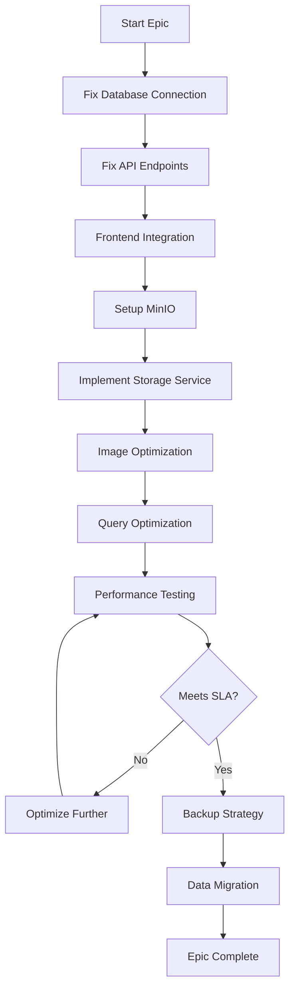

# EPIC-003: Data Management & Storage 💾

**Epic ID:** EPIC-003
**Priority:** 🔴 CRITICAL
**Sprint Allocation:** Sprint 1-2
**Total Story Points:** 28
**Owner:** Backend Team Lead
**Status:** NOT STARTED

---

## 🎯 Epic Overview

### Business Objective
Establish robust, scalable data infrastructure ensuring zero data loss, high availability, and compliance with data regulations. Foundation for all platform data operations.

### Strategic Value
- **Data Integrity:** Zero data loss guarantee
- **Scalability:** Support petabyte-scale storage
- **Performance:** Sub-millisecond query times
- **Compliance:** GDPR and data sovereignty ready
- **Cost Optimization:** Efficient storage tiering

### Success Metrics
| Metric | Target | Current | Status |
|--------|--------|---------|--------|
| Data Availability | 99.99% | 0% | 🔴 |
| Query Performance | <100ms p95 | N/A | 🔴 |
| Storage Utilization | <70% | 0% | 🔴 |
| Backup Success Rate | 100% | 0% | 🔴 |
| Data Loss | 0 bytes | Unknown | 🔴 |

---

## 📝 User Stories

### 🔴 US-003: Fix Database Integration Frontend to Backend
**Priority:** CRITICAL
**Story Points:** 8
**Sprint:** 1
**Assignee:** Full-Stack Developer
**Dependencies:** Database provisioned

#### Story
**As a** Frontend Developer
**I want to** connect the frontend to real backend APIs with proper database persistence
**So that** all application data is properly stored and retrievable

#### Background & Context
Currently, the frontend uses sessionStorage for data persistence, which is lost on browser refresh. We need to implement proper API integration with the backend that persists to PostgreSQL.

#### Acceptance Criteria
```gherkin
GIVEN a user uploads an image
WHEN the upload completes
THEN the image metadata should be stored in the database

GIVEN a user refreshes the browser
WHEN the page loads
THEN all previous data should be retrieved from the backend

GIVEN multiple users access the system
WHEN they view data
THEN they should see consistent information from the database

GIVEN a network error occurs
WHEN saving data
THEN the system should retry and handle gracefully
```

#### Technical Requirements

##### 1. API Service Refactoring
```typescript
// frontend/src/services/api.service.ts
import axios, { AxiosInstance, AxiosRequestConfig, AxiosResponse } from 'axios';
import { AuthService } from './auth.service';

interface ApiResponse<T> {
  data: T;
  meta?: {
    pagination?: {
      page: number;
      pageSize: number;
      total: number;
      totalPages: number;
    };
  };
  error?: {
    message: string;
    code: string;
    details?: any;
  };
}

class ApiService {
  private client: AxiosInstance;
  private baseURL: string;
  private retryAttempts: number = 3;
  private retryDelay: number = 1000;

  constructor() {
    this.baseURL = process.env.REACT_APP_API_URL || 'http://localhost:8000/api/v1';
    this.client = this.createClient();
    this.setupInterceptors();
  }

  private createClient(): AxiosInstance {
    return axios.create({
      baseURL: this.baseURL,
      timeout: 30000,
      headers: {
        'Content-Type': 'application/json',
      },
    });
  }

  private setupInterceptors(): void {
    // Request interceptor
    this.client.interceptors.request.use(
      (config) => {
        const token = AuthService.getAccessToken();
        if (token) {
          config.headers.Authorization = `Bearer ${token}`;
        }

        // Add request ID for tracing
        config.headers['X-Request-ID'] = this.generateRequestId();

        // Add timestamp
        config.headers['X-Request-Timestamp'] = Date.now().toString();

        return config;
      },
      (error) => {
        return Promise.reject(error);
      }
    );

    // Response interceptor
    this.client.interceptors.response.use(
      (response) => {
        // Log response time
        const requestTime = response.config.headers['X-Request-Timestamp'];
        if (requestTime) {
          const responseTime = Date.now() - parseInt(requestTime);
          console.debug(`API Response Time: ${responseTime}ms`);
        }

        return response;
      },
      async (error) => {
        const originalRequest = error.config;

        // Handle 401 - Token refresh
        if (error.response?.status === 401 && !originalRequest._retry) {
          originalRequest._retry = true;

          try {
            await AuthService.refreshToken();
            const newToken = AuthService.getAccessToken();
            originalRequest.headers.Authorization = `Bearer ${newToken}`;
            return this.client(originalRequest);
          } catch (refreshError) {
            AuthService.logout();
            window.location.href = '/login';
            return Promise.reject(refreshError);
          }
        }

        // Handle network errors with retry
        if (!error.response && originalRequest._retryCount < this.retryAttempts) {
          originalRequest._retryCount = (originalRequest._retryCount || 0) + 1;

          await this.delay(this.retryDelay * originalRequest._retryCount);
          return this.client(originalRequest);
        }

        return Promise.reject(error);
      }
    );
  }

  private generateRequestId(): string {
    return `${Date.now()}-${Math.random().toString(36).substr(2, 9)}`;
  }

  private delay(ms: number): Promise<void> {
    return new Promise(resolve => setTimeout(resolve, ms));
  }

  // Generic HTTP methods
  async get<T>(url: string, config?: AxiosRequestConfig): Promise<ApiResponse<T>> {
    const response = await this.client.get<ApiResponse<T>>(url, config);
    return response.data;
  }

  async post<T>(url: string, data?: any, config?: AxiosRequestConfig): Promise<ApiResponse<T>> {
    const response = await this.client.post<ApiResponse<T>>(url, data, config);
    return response.data;
  }

  async put<T>(url: string, data?: any, config?: AxiosRequestConfig): Promise<ApiResponse<T>> {
    const response = await this.client.put<ApiResponse<T>>(url, data, config);
    return response.data;
  }

  async delete<T>(url: string, config?: AxiosRequestConfig): Promise<ApiResponse<T>> {
    const response = await this.client.delete<ApiResponse<T>>(url, config);
    return response.data;
  }

  async patch<T>(url: string, data?: any, config?: AxiosRequestConfig): Promise<ApiResponse<T>> {
    const response = await this.client.patch<ApiResponse<T>>(url, data, config);
    return response.data;
  }
}

export default new ApiService();
```

##### 2. Data Synchronization Service
```typescript
// frontend/src/services/data-sync.service.ts
import { EventEmitter } from 'events';

interface SyncQueue {
  id: string;
  operation: 'create' | 'update' | 'delete';
  entity: string;
  data: any;
  timestamp: number;
  attempts: number;
}

class DataSyncService extends EventEmitter {
  private syncQueue: SyncQueue[] = [];
  private isOnline: boolean = navigator.onLine;
  private syncInterval: NodeJS.Timer | null = null;
  private db: IDBDatabase | null = null;

  constructor() {
    super();
    this.initIndexedDB();
    this.setupEventListeners();
    this.startSyncInterval();
  }

  private async initIndexedDB(): Promise<void> {
    const request = indexedDB.open('LogoRecognitionDB', 1);

    request.onerror = () => {
      console.error('Failed to open IndexedDB');
    };

    request.onsuccess = () => {
      this.db = request.result;
    };

    request.onupgradeneeded = (event: any) => {
      const db = event.target.result;

      // Create object stores
      if (!db.objectStoreNames.contains('syncQueue')) {
        db.createObjectStore('syncQueue', { keyPath: 'id' });
      }

      if (!db.objectStoreNames.contains('cachedData')) {
        const store = db.createObjectStore('cachedData', { keyPath: 'id' });
        store.createIndex('entity', 'entity', { unique: false });
        store.createIndex('timestamp', 'timestamp', { unique: false });
      }
    };
  }

  private setupEventListeners(): void {
    window.addEventListener('online', () => {
      this.isOnline = true;
      this.emit('online');
      this.processSyncQueue();
    });

    window.addEventListener('offline', () => {
      this.isOnline = false;
      this.emit('offline');
    });
  }

  private startSyncInterval(): void {
    this.syncInterval = setInterval(() => {
      if (this.isOnline) {
        this.processSyncQueue();
      }
    }, 30000); // Sync every 30 seconds
  }

  public async queueOperation(operation: Omit<SyncQueue, 'id' | 'timestamp' | 'attempts'>): Promise<void> {
    const queueItem: SyncQueue = {
      ...operation,
      id: this.generateId(),
      timestamp: Date.now(),
      attempts: 0,
    };

    // Store in IndexedDB
    if (this.db) {
      const transaction = this.db.transaction(['syncQueue'], 'readwrite');
      const store = transaction.objectStore('syncQueue');
      await store.add(queueItem);
    }

    this.syncQueue.push(queueItem);

    if (this.isOnline) {
      this.processSyncQueue();
    }
  }

  private async processSyncQueue(): Promise<void> {
    const itemsToSync = [...this.syncQueue];

    for (const item of itemsToSync) {
      try {
        await this.syncItem(item);
        this.removeSyncItem(item.id);
      } catch (error) {
        item.attempts++;

        if (item.attempts >= 5) {
          this.emit('syncFailed', item);
          this.removeSyncItem(item.id);
        }
      }
    }
  }

  private async syncItem(item: SyncQueue): Promise<void> {
    // Implementation depends on entity type
    switch (item.entity) {
      case 'image':
        await this.syncImage(item);
        break;
      case 'annotation':
        await this.syncAnnotation(item);
        break;
      case 'detection':
        await this.syncDetection(item);
        break;
      default:
        throw new Error(`Unknown entity type: ${item.entity}`);
    }
  }

  private async syncImage(item: SyncQueue): Promise<void> {
    // Sync image data with backend
    const endpoint = item.operation === 'delete'
      ? `/images/${item.data.id}`
      : '/images';

    const method = item.operation === 'create' ? 'POST'
      : item.operation === 'update' ? 'PUT'
      : 'DELETE';

    await ApiService[method.toLowerCase()](endpoint, item.data);
  }

  private generateId(): string {
    return `${Date.now()}-${Math.random().toString(36).substr(2, 9)}`;
  }

  private removeSyncItem(id: string): void {
    this.syncQueue = this.syncQueue.filter(item => item.id !== id);

    if (this.db) {
      const transaction = this.db.transaction(['syncQueue'], 'readwrite');
      const store = transaction.objectStore('syncQueue');
      store.delete(id);
    }
  }
}

export default new DataSyncService();
```

##### 3. State Management with Redux
```typescript
// frontend/src/store/slices/data.slice.ts
import { createSlice, createAsyncThunk, PayloadAction } from '@reduxjs/toolkit';
import ApiService from '../../services/api.service';

interface DataState {
  images: Image[];
  annotations: Annotation[];
  detections: Detection[];
  loading: boolean;
  error: string | null;
  lastSync: number | null;
}

// Async thunks
export const fetchImages = createAsyncThunk(
  'data/fetchImages',
  async (params: { page?: number; pageSize?: number }) => {
    const response = await ApiService.get('/images', { params });
    return response.data;
  }
);

export const uploadImage = createAsyncThunk(
  'data/uploadImage',
  async (formData: FormData) => {
    const response = await ApiService.post('/images/upload', formData, {
      headers: { 'Content-Type': 'multipart/form-data' }
    });
    return response.data;
  }
);

export const deleteImage = createAsyncThunk(
  'data/deleteImage',
  async (imageId: string) => {
    await ApiService.delete(`/images/${imageId}`);
    return imageId;
  }
);

const dataSlice = createSlice({
  name: 'data',
  initialState: {
    images: [],
    annotations: [],
    detections: [],
    loading: false,
    error: null,
    lastSync: null,
  } as DataState,
  reducers: {
    setLastSync: (state, action: PayloadAction<number>) => {
      state.lastSync = action.payload;
    },
    clearError: (state) => {
      state.error = null;
    },
  },
  extraReducers: (builder) => {
    builder
      // Fetch images
      .addCase(fetchImages.pending, (state) => {
        state.loading = true;
        state.error = null;
      })
      .addCase(fetchImages.fulfilled, (state, action) => {
        state.loading = false;
        state.images = action.payload;
        state.lastSync = Date.now();
      })
      .addCase(fetchImages.rejected, (state, action) => {
        state.loading = false;
        state.error = action.error.message || 'Failed to fetch images';
      })
      // Upload image
      .addCase(uploadImage.fulfilled, (state, action) => {
        state.images.unshift(action.payload);
      })
      // Delete image
      .addCase(deleteImage.fulfilled, (state, action) => {
        state.images = state.images.filter(img => img.id !== action.payload);
      });
  },
});

export const { setLastSync, clearError } = dataSlice.actions;
export default dataSlice.reducer;
```

##### 4. Component Integration
```tsx
// frontend/src/components/ImageList.tsx
import React, { useEffect, useState } from 'react';
import { useDispatch, useSelector } from 'react-redux';
import { fetchImages } from '../store/slices/data.slice';
import DataSyncService from '../services/data-sync.service';

const ImageList: React.FC = () => {
  const dispatch = useDispatch();
  const { images, loading, error, lastSync } = useSelector(state => state.data);
  const [isOnline, setIsOnline] = useState(navigator.onLine);

  useEffect(() => {
    // Initial fetch
    dispatch(fetchImages({ page: 1, pageSize: 50 }));

    // Setup sync listeners
    DataSyncService.on('online', () => {
      setIsOnline(true);
      dispatch(fetchImages({ page: 1, pageSize: 50 }));
    });

    DataSyncService.on('offline', () => {
      setIsOnline(false);
    });

    // Auto-refresh every 60 seconds if online
    const refreshInterval = setInterval(() => {
      if (navigator.onLine) {
        dispatch(fetchImages({ page: 1, pageSize: 50 }));
      }
    }, 60000);

    return () => clearInterval(refreshInterval);
  }, [dispatch]);

  return (
    <div className="image-list">
      <div className="sync-status">
        <span className={`status-indicator ${isOnline ? 'online' : 'offline'}`}>
          {isOnline ? '🟢 Online' : '🔴 Offline'}
        </span>
        {lastSync && (
          <span className="last-sync">
            Last sync: {new Date(lastSync).toLocaleTimeString()}
          </span>
        )}
      </div>

      {loading && <div className="loading">Loading images...</div>}

      {error && (
        <div className="error">
          <p>Error: {error}</p>
          <button onClick={() => dispatch(fetchImages({ page: 1, pageSize: 50 }))}>
            Retry
          </button>
        </div>
      )}

      <div className="images-grid">
        {images.map(image => (
          <ImageCard key={image.id} image={image} />
        ))}
      </div>
    </div>
  );
};
```

#### Testing Requirements
```typescript
// frontend/src/__tests__/api-integration.test.ts
describe('API Integration Tests', () => {
  beforeEach(() => {
    // Clear all mocks
    jest.clearAllMocks();
  });

  test('should fetch images from backend', async () => {
    const mockImages = [
      { id: '1', name: 'test1.jpg' },
      { id: '2', name: 'test2.jpg' }
    ];

    axios.get.mockResolvedValue({ data: { data: mockImages } });

    const result = await ApiService.get('/images');
    expect(result.data).toEqual(mockImages);
  });

  test('should handle network errors with retry', async () => {
    axios.get.mockRejectedValueOnce(new Error('Network Error'));
    axios.get.mockResolvedValueOnce({ data: { data: [] } });

    const result = await ApiService.get('/images');
    expect(axios.get).toHaveBeenCalledTimes(2);
  });

  test('should queue operations when offline', async () => {
    // Simulate offline
    Object.defineProperty(navigator, 'onLine', { value: false });

    const syncSpy = jest.spyOn(DataSyncService, 'queueOperation');

    await DataSyncService.queueOperation({
      operation: 'create',
      entity: 'image',
      data: { name: 'test.jpg' }
    });

    expect(syncSpy).toHaveBeenCalled();
  });
});
```

---

### 🔴 US-004: Fix Image List API Endpoint
**Priority:** CRITICAL
**Story Points:** 5
**Sprint:** 1
**Assignee:** Backend Developer
**Dependencies:** Database connection

#### Story
**As a** Backend Developer
**I want to** fix the /api/v1/images/list endpoint
**So that** the frontend can retrieve and display uploaded images correctly

#### Background & Context
The image list endpoint currently returns 500 errors because the database query is broken. We need to fix the query, add proper pagination, filtering, and caching.

#### Acceptance Criteria
```gherkin
GIVEN images exist in the database
WHEN the list endpoint is called
THEN it should return a paginated list of images

GIVEN filtering parameters are provided
WHEN the endpoint is called
THEN it should return filtered results

GIVEN no images exist
WHEN the endpoint is called
THEN it should return an empty list with 200 status
```

#### Technical Requirements

##### 1. Fix Database Models and Queries
```python
# backend/app/models/image.py
from sqlalchemy import Column, String, DateTime, Float, Integer, JSON, Index
from sqlalchemy.dialects.postgresql import UUID
from sqlalchemy.orm import relationship
import uuid
from datetime import datetime

class Image(Base):
    __tablename__ = "images"

    id = Column(UUID(as_uuid=True), primary_key=True, default=uuid.uuid4)
    filename = Column(String(255), nullable=False)
    original_filename = Column(String(255), nullable=False)
    mime_type = Column(String(100), nullable=False)
    size_bytes = Column(Integer, nullable=False)
    width = Column(Integer, nullable=False)
    height = Column(Integer, nullable=False)
    storage_path = Column(String(500), nullable=False)
    storage_bucket = Column(String(100), nullable=False)
    thumbnail_path = Column(String(500))

    # User relationship
    user_id = Column(UUID(as_uuid=True), ForeignKey("users.id"), nullable=False)

    # Metadata
    metadata = Column(JSON, default={})
    tags = Column(JSON, default=[])

    # Status
    status = Column(String(50), default="uploaded")  # uploaded, processing, processed, failed
    processing_time_ms = Column(Float)

    # Timestamps
    created_at = Column(DateTime, default=datetime.utcnow, nullable=False)
    updated_at = Column(DateTime, default=datetime.utcnow, onupdate=datetime.utcnow)

    # Relationships
    detections = relationship("Detection", back_populates="image", cascade="all, delete-orphan")
    annotations = relationship("Annotation", back_populates="image", cascade="all, delete-orphan")

    # Indexes for performance
    __table_args__ = (
        Index('idx_image_user_created', 'user_id', 'created_at'),
        Index('idx_image_status', 'status'),
        Index('idx_image_created', 'created_at'),
    )
```

##### 2. Fixed Image Repository
```python
# backend/app/repositories/image_repository.py
from typing import List, Optional, Dict, Any
from sqlalchemy.orm import Session
from sqlalchemy import desc, asc, and_, or_
from datetime import datetime, timedelta
import math

class ImageRepository:
    def __init__(self, db: Session):
        self.db = db

    async def get_paginated_list(
        self,
        page: int = 1,
        page_size: int = 20,
        filters: Optional[Dict[str, Any]] = None,
        sort_by: str = "created_at",
        sort_order: str = "desc"
    ) -> Dict[str, Any]:
        """Get paginated list of images with filtering"""

        # Base query
        query = self.db.query(Image)

        # Apply filters
        if filters:
            query = self._apply_filters(query, filters)

        # Get total count before pagination
        total_count = query.count()

        # Calculate pagination
        total_pages = math.ceil(total_count / page_size)
        offset = (page - 1) * page_size

        # Apply sorting
        order_column = getattr(Image, sort_by, Image.created_at)
        if sort_order == "desc":
            query = query.order_by(desc(order_column))
        else:
            query = query.order_by(asc(order_column))

        # Apply pagination
        images = query.offset(offset).limit(page_size).all()

        # Format response
        return {
            "items": [self._format_image(img) for img in images],
            "pagination": {
                "page": page,
                "page_size": page_size,
                "total": total_count,
                "total_pages": total_pages,
                "has_next": page < total_pages,
                "has_prev": page > 1
            }
        }

    def _apply_filters(self, query, filters: Dict[str, Any]):
        """Apply filters to query"""

        # User filter
        if filters.get("user_id"):
            query = query.filter(Image.user_id == filters["user_id"])

        # Status filter
        if filters.get("status"):
            if isinstance(filters["status"], list):
                query = query.filter(Image.status.in_(filters["status"]))
            else:
                query = query.filter(Image.status == filters["status"])

        # Date range filter
        if filters.get("date_from"):
            query = query.filter(Image.created_at >= filters["date_from"])

        if filters.get("date_to"):
            query = query.filter(Image.created_at <= filters["date_to"])

        # Search filter (filename)
        if filters.get("search"):
            search_term = f"%{filters['search']}%"
            query = query.filter(
                or_(
                    Image.filename.ilike(search_term),
                    Image.original_filename.ilike(search_term)
                )
            )

        # Tags filter
        if filters.get("tags"):
            for tag in filters["tags"]:
                query = query.filter(Image.tags.contains([tag]))

        # Has detections filter
        if filters.get("has_detections") is not None:
            if filters["has_detections"]:
                query = query.join(Detection).distinct()
            else:
                query = query.outerjoin(Detection).filter(Detection.id.is_(None))

        return query

    def _format_image(self, image: Image) -> Dict[str, Any]:
        """Format image object for response"""
        return {
            "id": str(image.id),
            "filename": image.filename,
            "original_filename": image.original_filename,
            "mime_type": image.mime_type,
            "size_bytes": image.size_bytes,
            "dimensions": {
                "width": image.width,
                "height": image.height
            },
            "url": self._generate_url(image.storage_path),
            "thumbnail_url": self._generate_url(image.thumbnail_path) if image.thumbnail_path else None,
            "status": image.status,
            "processing_time_ms": image.processing_time_ms,
            "tags": image.tags,
            "metadata": image.metadata,
            "detections_count": len(image.detections),
            "annotations_count": len(image.annotations),
            "created_at": image.created_at.isoformat(),
            "updated_at": image.updated_at.isoformat()
        }

    def _generate_url(self, path: str) -> str:
        """Generate accessible URL for stored file"""
        # This would be configured based on your storage solution
        return f"https://storage.example.com/{path}"
```

##### 3. Fixed API Router
```python
# backend/app/routers/images.py
from fastapi import APIRouter, Depends, Query, HTTPException, status
from typing import Optional, List
from datetime import datetime

router = APIRouter(prefix="/api/v1/images", tags=["images"])

@router.get("/list")
async def list_images(
    page: int = Query(1, ge=1, description="Page number"),
    page_size: int = Query(20, ge=1, le=100, description="Items per page"),
    sort_by: str = Query("created_at", description="Sort field"),
    sort_order: str = Query("desc", regex="^(asc|desc)$", description="Sort order"),
    status: Optional[str] = Query(None, description="Filter by status"),
    date_from: Optional[datetime] = Query(None, description="Filter from date"),
    date_to: Optional[datetime] = Query(None, description="Filter to date"),
    search: Optional[str] = Query(None, description="Search in filename"),
    tags: Optional[List[str]] = Query(None, description="Filter by tags"),
    has_detections: Optional[bool] = Query(None, description="Filter by detection presence"),
    db: Session = Depends(get_db),
    current_user: User = Depends(get_current_user),
    cache: Redis = Depends(get_redis)
):
    """Get paginated list of images"""

    try:
        # Generate cache key
        cache_key = f"images:list:{current_user.id}:{page}:{page_size}:{sort_by}:{sort_order}"

        # Add filter params to cache key
        if status:
            cache_key += f":{status}"
        if search:
            cache_key += f":{search}"

        # Check cache
        cached_result = await cache.get(cache_key)
        if cached_result:
            return json.loads(cached_result)

        # Build filters
        filters = {
            "user_id": current_user.id,
            "status": status,
            "date_from": date_from,
            "date_to": date_to,
            "search": search,
            "tags": tags,
            "has_detections": has_detections
        }

        # Remove None values
        filters = {k: v for k, v in filters.items() if v is not None}

        # Get data from repository
        repo = ImageRepository(db)
        result = await repo.get_paginated_list(
            page=page,
            page_size=page_size,
            filters=filters,
            sort_by=sort_by,
            sort_order=sort_order
        )

        # Cache result for 5 minutes
        await cache.setex(cache_key, 300, json.dumps(result))

        return result

    except Exception as e:
        logger.error(f"Error listing images: {str(e)}")
        raise HTTPException(
            status_code=status.HTTP_500_INTERNAL_SERVER_ERROR,
            detail="Failed to retrieve images"
        )

@router.get("/stats")
async def get_image_stats(
    db: Session = Depends(get_db),
    current_user: User = Depends(get_current_user)
):
    """Get image statistics for the current user"""

    stats = db.query(
        func.count(Image.id).label("total_images"),
        func.sum(Image.size_bytes).label("total_size"),
        func.count(func.distinct(Image.status)).label("status_count")
    ).filter(Image.user_id == current_user.id).first()

    status_breakdown = db.query(
        Image.status,
        func.count(Image.id).label("count")
    ).filter(
        Image.user_id == current_user.id
    ).group_by(Image.status).all()

    return {
        "total_images": stats.total_images or 0,
        "total_size_bytes": stats.total_size or 0,
        "total_size_mb": round((stats.total_size or 0) / (1024 * 1024), 2),
        "status_breakdown": {
            status: count for status, count in status_breakdown
        }
    }
```

---

### 🔴 US-009: Connect MinIO Object Storage
**Priority:** CRITICAL
**Story Points:** 5
**Sprint:** 2
**Assignee:** Backend Developer
**Dependencies:** MinIO deployed

#### Story
**As a** Backend Developer
**I want to** integrate MinIO for permanent object storage
**So that** uploaded images are reliably stored and accessible

#### Background & Context
We need to move from temporary file storage to MinIO object storage for scalability, redundancy, and better performance. MinIO provides S3-compatible APIs.

#### Acceptance Criteria
```gherkin
GIVEN an image is uploaded
WHEN it's processed
THEN it should be stored in MinIO with proper bucket structure

GIVEN an image is requested
WHEN the URL is accessed
THEN it should be served from MinIO with proper caching headers

GIVEN storage needs cleanup
WHEN lifecycle policies run
THEN old/unused objects should be archived or deleted
```

#### Technical Requirements

##### 1. MinIO Client Configuration
```python
# backend/app/services/storage/minio_client.py
from minio import Minio
from minio.error import S3Error
from typing import Optional, Dict, Any, BinaryIO
import io
import hashlib
from datetime import timedelta
from urllib.parse import urlparse

class MinIOStorage:
    def __init__(self, config: Dict[str, Any]):
        self.client = Minio(
            endpoint=config["endpoint"],
            access_key=config["access_key"],
            secret_key=config["secret_key"],
            secure=config.get("secure", True),
            region=config.get("region", "us-east-1")
        )

        self.default_bucket = config["default_bucket"]
        self.public_bucket = config.get("public_bucket", "public")
        self.archive_bucket = config.get("archive_bucket", "archive")

        # Initialize buckets
        self._initialize_buckets()

        # Setup lifecycle policies
        self._setup_lifecycle_policies()

    def _initialize_buckets(self):
        """Create buckets if they don't exist"""
        buckets = [self.default_bucket, self.public_bucket, self.archive_bucket]

        for bucket in buckets:
            try:
                if not self.client.bucket_exists(bucket):
                    self.client.make_bucket(bucket)
                    print(f"Created bucket: {bucket}")

                    # Set bucket policy for public bucket
                    if bucket == self.public_bucket:
                        self._set_public_policy(bucket)

            except S3Error as e:
                print(f"Error creating bucket {bucket}: {e}")

    def _set_public_policy(self, bucket: str):
        """Set public read policy for bucket"""
        policy = {
            "Version": "2012-10-17",
            "Statement": [
                {
                    "Effect": "Allow",
                    "Principal": "*",
                    "Action": ["s3:GetObject"],
                    "Resource": [f"arn:aws:s3:::{bucket}/*"]
                }
            ]
        }

        import json
        self.client.set_bucket_policy(bucket, json.dumps(policy))

    def _setup_lifecycle_policies(self):
        """Setup lifecycle management policies"""
        from minio.lifecycleconfig import LifecycleConfig, Rule, Filter, Expiration, Transition

        # Archive old files after 90 days
        archive_rule = Rule(
            rule_id="archive-old-files",
            status="Enabled",
            filter=Filter(prefix="uploads/"),
            transition=Transition(days=90, storage_class="GLACIER"),
            expiration=Expiration(days=365)
        )

        # Delete temporary files after 7 days
        temp_rule = Rule(
            rule_id="cleanup-temp",
            status="Enabled",
            filter=Filter(prefix="temp/"),
            expiration=Expiration(days=7)
        )

        config = LifecycleConfig([archive_rule, temp_rule])

        try:
            self.client.set_bucket_lifecycle(self.default_bucket, config)
        except S3Error as e:
            print(f"Error setting lifecycle policy: {e}")

    async def upload_file(
        self,
        file: BinaryIO,
        object_name: str,
        bucket: Optional[str] = None,
        metadata: Optional[Dict[str, str]] = None,
        content_type: str = "application/octet-stream"
    ) -> Dict[str, Any]:
        """Upload file to MinIO"""

        bucket = bucket or self.default_bucket

        try:
            # Calculate file hash
            file_hash = self._calculate_hash(file)
            file.seek(0)  # Reset file pointer

            # Get file size
            file.seek(0, 2)  # Seek to end
            file_size = file.tell()
            file.seek(0)  # Reset to beginning

            # Add hash to metadata
            if metadata is None:
                metadata = {}
            metadata["x-amz-meta-sha256"] = file_hash

            # Upload file
            result = self.client.put_object(
                bucket_name=bucket,
                object_name=object_name,
                data=file,
                length=file_size,
                content_type=content_type,
                metadata=metadata
            )

            return {
                "bucket": bucket,
                "object_name": object_name,
                "etag": result.etag,
                "version_id": result.version_id,
                "size": file_size,
                "hash": file_hash,
                "url": self.get_object_url(bucket, object_name)
            }

        except S3Error as e:
            raise Exception(f"Failed to upload file: {e}")

    def get_object_url(
        self,
        bucket: str,
        object_name: str,
        expiry: Optional[int] = None
    ) -> str:
        """Get URL for object"""

        # For public buckets, return direct URL
        if bucket == self.public_bucket:
            return f"https://{self.client._base_url}/{bucket}/{object_name}"

        # For private buckets, generate presigned URL
        if expiry:
            return self.client.presigned_get_object(
                bucket_name=bucket,
                object_name=object_name,
                expires=timedelta(seconds=expiry)
            )
        else:
            # Default 1 hour expiry
            return self.client.presigned_get_object(
                bucket_name=bucket,
                object_name=object_name,
                expires=timedelta(hours=1)
            )

    def delete_object(self, bucket: str, object_name: str):
        """Delete object from MinIO"""
        try:
            self.client.remove_object(bucket, object_name)
            return True
        except S3Error as e:
            print(f"Error deleting object: {e}")
            return False

    def _calculate_hash(self, file: BinaryIO) -> str:
        """Calculate SHA256 hash of file"""
        sha256 = hashlib.sha256()

        for chunk in iter(lambda: file.read(4096), b""):
            sha256.update(chunk)

        return sha256.hexdigest()
```

##### 2. Image Storage Service
```python
# backend/app/services/storage/image_storage.py
from typing import Tuple, Optional
import uuid
from datetime import datetime
from PIL import Image as PILImage
import io

class ImageStorageService:
    def __init__(self, minio_client: MinIOStorage):
        self.storage = minio_client

    async def store_image(
        self,
        image_data: bytes,
        original_filename: str,
        user_id: str,
        generate_thumbnail: bool = True
    ) -> Dict[str, Any]:
        """Store image with optimizations"""

        # Generate unique filename
        file_ext = original_filename.split('.')[-1].lower()
        unique_id = str(uuid.uuid4())
        timestamp = datetime.utcnow().strftime("%Y%m%d")

        # Organize by date and user
        object_path = f"images/{timestamp}/{user_id}/{unique_id}.{file_ext}"

        # Process image
        image = PILImage.open(io.BytesIO(image_data))

        # Store original
        original_result = await self._store_original(image, object_path)

        results = {
            "original": original_result
        }

        # Generate and store thumbnail
        if generate_thumbnail:
            thumb_result = await self._store_thumbnail(image, object_path)
            results["thumbnail"] = thumb_result

        # Generate optimized versions
        optimized_results = await self._store_optimized_versions(image, object_path)
        results.update(optimized_results)

        return results

    async def _store_original(self, image: PILImage, base_path: str) -> Dict[str, Any]:
        """Store original image"""
        output = io.BytesIO()

        # Save in original format
        image_format = image.format or "JPEG"
        image.save(output, format=image_format, quality=95)
        output.seek(0)

        return await self.storage.upload_file(
            file=output,
            object_name=base_path,
            content_type=f"image/{image_format.lower()}",
            metadata={
                "width": str(image.width),
                "height": str(image.height),
                "format": image_format
            }
        )

    async def _store_thumbnail(self, image: PILImage, base_path: str) -> Dict[str, Any]:
        """Generate and store thumbnail"""
        # Create thumbnail
        thumbnail = image.copy()
        thumbnail.thumbnail((256, 256), PILImage.Resampling.LANCZOS)

        # Save thumbnail
        output = io.BytesIO()
        thumbnail.save(output, format="JPEG", quality=85, optimize=True)
        output.seek(0)

        # Modify path for thumbnail
        thumb_path = base_path.replace(".", "_thumb.")

        return await self.storage.upload_file(
            file=output,
            object_name=thumb_path,
            content_type="image/jpeg",
            metadata={
                "width": str(thumbnail.width),
                "height": str(thumbnail.height),
                "type": "thumbnail"
            }
        )

    async def _store_optimized_versions(self, image: PILImage, base_path: str) -> Dict[str, Any]:
        """Generate optimized versions for different screen sizes"""

        versions = {
            "small": (640, 480),
            "medium": (1280, 720),
            "large": (1920, 1080)
        }

        results = {}

        for size_name, dimensions in versions.items():
            if image.width <= dimensions[0] and image.height <= dimensions[1]:
                continue  # Skip if original is smaller

            # Resize image
            resized = image.copy()
            resized.thumbnail(dimensions, PILImage.Resampling.LANCZOS)

            # Convert to WebP for better compression
            output = io.BytesIO()
            resized.save(output, format="WEBP", quality=85, method=6)
            output.seek(0)

            # Modify path for version
            version_path = base_path.replace(".", f"_{size_name}.webp")

            result = await self.storage.upload_file(
                file=output,
                object_name=version_path,
                content_type="image/webp",
                metadata={
                    "width": str(resized.width),
                    "height": str(resized.height),
                    "type": size_name
                }
            )

            results[size_name] = result

        return results
```

---

### 🔴 US-010: Implement Image Optimization Pipeline
**Priority:** HIGH
**Story Points:** 5
**Sprint:** 2
**Assignee:** Backend Developer
**Dependencies:** US-009

#### Story
**As a** Backend Developer
**I want to** optimize images before storage
**So that** the application has optimal performance and reduced bandwidth usage

#### Technical Requirements

##### Image Optimization Service
```python
# backend/app/services/optimization/image_optimizer.py
import cv2
import numpy as np
from PIL import Image
import piexif
import io

class ImageOptimizer:
    def __init__(self, config: Dict[str, Any]):
        self.max_dimension = config.get("max_dimension", 4096)
        self.jpeg_quality = config.get("jpeg_quality", 85)
        self.webp_quality = config.get("webp_quality", 85)
        self.strip_metadata = config.get("strip_metadata", True)

    def optimize_image(self, image_data: bytes) -> Dict[str, bytes]:
        """Optimize image and return multiple formats"""

        # Load image
        image = Image.open(io.BytesIO(image_data))

        # Strip EXIF data if requested
        if self.strip_metadata:
            image = self._strip_exif(image)

        # Resize if too large
        if image.width > self.max_dimension or image.height > self.max_dimension:
            image = self._resize_image(image)

        # Generate optimized versions
        return {
            "jpeg": self._to_jpeg(image),
            "webp": self._to_webp(image),
            "original": self._to_original_format(image)
        }

    def _strip_exif(self, image: Image) -> Image:
        """Remove EXIF data from image"""
        # Remove EXIF data
        data = list(image.getdata())
        image_without_exif = Image.new(image.mode, image.size)
        image_without_exif.putdata(data)
        return image_without_exif

    def _resize_image(self, image: Image) -> Image:
        """Resize image maintaining aspect ratio"""
        ratio = min(self.max_dimension / image.width, self.max_dimension / image.height)
        new_size = (int(image.width * ratio), int(image.height * ratio))
        return image.resize(new_size, Image.Resampling.LANCZOS)
```

---

### 🔴 US-017: Database Query Optimization
**Priority:** MEDIUM
**Story Points:** 5
**Sprint:** 3
**Assignee:** Backend Developer
**Dependencies:** Database access

#### Story
**As a** Backend Developer
**I want to** optimize database queries for performance
**So that** the application responds quickly even with large datasets

#### Technical Requirements

##### Query Optimization Implementation
```python
# backend/app/optimization/query_optimizer.py
from sqlalchemy.orm import joinedload, selectinload, contains_eager
from sqlalchemy import and_, or_, func

class QueryOptimizer:
    @staticmethod
    def optimize_image_queries(query):
        """Optimize image queries with eager loading"""
        return query.options(
            selectinload(Image.detections),
            selectinload(Image.annotations),
            joinedload(Image.user)
        )

    @staticmethod
    def add_indexes():
        """SQL to add performance indexes"""
        return """
        -- Images table indexes
        CREATE INDEX CONCURRENTLY idx_images_user_created
        ON images(user_id, created_at DESC);

        CREATE INDEX CONCURRENTLY idx_images_status
        ON images(status) WHERE status != 'processed';

        -- Detections table indexes
        CREATE INDEX CONCURRENTLY idx_detections_image
        ON detections(image_id);

        CREATE INDEX CONCURRENTLY idx_detections_confidence
        ON detections(confidence) WHERE confidence > 0.8;

        -- Annotations table indexes
        CREATE INDEX CONCURRENTLY idx_annotations_image_user
        ON annotations(image_id, user_id);

        -- Full text search index
        CREATE INDEX CONCURRENTLY idx_images_search
        ON images USING gin(to_tsvector('english',
            original_filename || ' ' || COALESCE(tags::text, '')));
        """
```

---

## 🔄 Epic Workflow



---

## 📊 Risk Assessment

| Risk | Probability | Impact | Mitigation | Owner |
|------|------------|--------|------------|-------|
| Data loss during migration | Medium | Critical | Incremental migration, backups | Backend |
| MinIO downtime | Low | High | Multi-region setup, fallback | DevOps |
| Query performance issues | Medium | Medium | Indexing, caching, monitoring | Backend |
| Storage costs | Medium | Low | Lifecycle policies, compression | DevOps |
| Network latency | Low | Medium | CDN, edge caching | DevOps |

---

## ✅ Definition of Done

### Epic Level
- [ ] Zero data loss verified
- [ ] 99.99% availability achieved
- [ ] Query performance <100ms p95
- [ ] Backup/restore tested
- [ ] GDPR compliance verified
- [ ] Storage costs optimized
- [ ] Monitoring configured
- [ ] Documentation complete
- [ ] Team trained

---

**Epic Status:** NOT STARTED
**Last Updated:** Sprint Planning
**Next Review:** Sprint 1 - Day 2