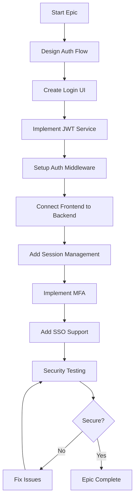

# EPIC-004: Enterprise Authentication & Authorization 🔑

**Epic ID:** EPIC-004
**Priority:** 🔴 CRITICAL
**Sprint Allocation:** Sprint 04-B
**Total Story Points:** 13+ (Sprint 04)
**Owner:** Full-Stack Lead / Security Engineer
**Status:** IMPLEMENTATION READY
**Quality Target:** A++ Enterprise Grade

---

## 🎯 Epic Overview

### Business Objective
Implement A++ enterprise-grade authentication with zero-trust model, supporting OAuth 2.0/OpenID Connect, MFA, rate limiting per tier, and comprehensive audit logging for regulatory compliance.

### Strategic Value
- **Enterprise Security:** Zero-trust with RS256 JWT
- **Advanced Features:** OAuth 2.0, OpenID Connect, TOTP MFA
- **Rate Limiting:** Token Bucket algorithm per tier
- **API Management:** Key rotation and lifecycle
- **Compliance:** Complete audit trail for SOC 2

### Success Metrics - A++ Enterprise Requirements
| Metric | Target | Current | Status |
|--------|--------|---------|--------|
| Login Success Rate | >99.9% | 0% | 🔴 |
| Token Refresh Success | >99.99% | 0% | 🔴 |
| Auth Response Time | <100ms p95 | N/A | 🔴 |
| MFA Adoption | >90% | 0% | 🔴 |
| Session Security | 100% | 0% | 🔴 |
| Rate Limit Accuracy | >99.9% | 0% | 🔴 |
| API Key Rotation | <5min | N/A | 🔴 |
| Audit Coverage | 100% | 0% | 🔴 |

---

## 📝 Sprint 04 User Stories (A++ Enterprise Implementation)

### 🔴 US-034: Enterprise Authentication & Authorization
**Priority:** CRITICAL
**Story Points:** 13
**Sprint:** 04-B
**Quality:** A++ Enterprise Grade

#### Requirements
- JWT with refresh tokens (RS256 algorithm)
- OAuth 2.0 / OpenID Connect support
- API key management with rotation (<5min)
- Role-based access control (RBAC)
- Rate limiting per tier (Token Bucket algorithm)
- Audit logging for all auth events (100% coverage)
- MFA support (TOTP) with >90% adoption
- Session management with Redis
- Password policy enforcement
- Account lockout after failed attempts

#### Enterprise Features
```python
# Token Bucket Rate Limiting Configuration
RATE_LIMITS = {
    "free": {
        "requests_per_minute": 10,
        "requests_per_hour": 100,
        "batch_size_max": 10,
        "burst_capacity": 20
    },
    "basic": {
        "requests_per_minute": 100,
        "requests_per_hour": 5000,
        "batch_size_max": 100,
        "burst_capacity": 200
    },
    "enterprise": {
        "requests_per_minute": 1000,
        "requests_per_hour": 100000,
        "batch_size_max": 1000,
        "burst_capacity": 2000
    }
}

# RBAC Permission Matrix
PERMISSIONS = {
    "admin": ["*"],  # Full access
    "power_user": ["recognition.*", "batch.*", "api_keys.own"],
    "user": ["recognition.read", "recognition.create", "users.self"]
}
```

---

## 🚀 Enterprise Authentication Features

### RS256 JWT Implementation
```python
from cryptography.hazmat.primitives import serialization
from cryptography.hazmat.primitives.asymmetric import rsa
import jwt

class EnterpriseJWT:
    def __init__(self):
        # RS256 key pair generation
        self.private_key = rsa.generate_private_key(
            public_exponent=65537,
            key_size=2048
        )
        self.public_key = self.private_key.public_key()

    def create_token(self, user_id: str, roles: List[str]) -> str:
        payload = {
            "sub": user_id,
            "roles": roles,
            "iat": datetime.utcnow(),
            "exp": datetime.utcnow() + timedelta(hours=1),
            "jti": str(uuid.uuid4()),  # JWT ID for revocation
            "iss": "logo-recognition-api",
            "aud": "api-clients"
        }

        return jwt.encode(
            payload,
            self.private_key,
            algorithm="RS256"
        )
```

### Token Bucket Rate Limiting
```python
class TokenBucketRateLimiter:
    def __init__(self, rate: int, capacity: int):
        self.rate = rate  # Tokens per second
        self.capacity = capacity  # Maximum burst
        self.tokens = capacity
        self.last_refill = time.time()

    async def allow_request(self, user_id: str, tier: str) -> bool:
        config = RATE_LIMITS[tier]

        # Refill tokens based on time elapsed
        now = time.time()
        elapsed = now - self.last_refill
        tokens_to_add = elapsed * (config["requests_per_minute"] / 60)

        self.tokens = min(
            config["burst_capacity"],
            self.tokens + tokens_to_add
        )
        self.last_refill = now

        if self.tokens >= 1:
            self.tokens -= 1
            return True

        return False
```

### API Key Rotation System
```python
class APIKeyManager:
    def __init__(self):
        self.rotation_interval = 90 * 24 * 3600  # 90 days
        self.grace_period = 7 * 24 * 3600  # 7 days

    async def rotate_key(self, user_id: str) -> Dict[str, str]:
        # Generate new key
        new_key = secrets.token_urlsafe(32)
        new_key_hash = hashlib.sha256(new_key.encode()).hexdigest()

        # Store with grace period for old key
        await self.store_key(user_id, new_key_hash, grace_period=True)

        # Schedule old key deletion
        await self.schedule_deletion(user_id, self.grace_period)

        return {
            "api_key": new_key,
            "expires_at": datetime.utcnow() + timedelta(seconds=self.rotation_interval),
            "rotation_required_at": datetime.utcnow() + timedelta(seconds=self.rotation_interval - self.grace_period)
        }
```

### MFA with TOTP
```python
import pyotp
import qrcode

class MFAManager:
    def setup_totp(self, user_id: str) -> Dict[str, Any]:
        # Generate secret
        secret = pyotp.random_base32()

        # Create TOTP URI
        totp_uri = pyotp.totp.TOTP(secret).provisioning_uri(
            name=user_id,
            issuer_name='Logo Recognition API'
        )

        # Generate QR code
        qr = qrcode.QRCode(version=1, box_size=10, border=5)
        qr.add_data(totp_uri)
        qr.make(fit=True)

        return {
            "secret": secret,
            "qr_code": qr,
            "backup_codes": self.generate_backup_codes()
        }

    def verify_totp(self, secret: str, token: str) -> bool:
        totp = pyotp.TOTP(secret)
        return totp.verify(token, valid_window=1)
```

### Audit Logging System
```python
class AuditLogger:
    def __init__(self):
        self.required_fields = [
            "timestamp", "event_type", "user_id",
            "ip_address", "user_agent", "success",
            "resource", "action", "metadata"
        ]

    async def log_auth_event(self, event: Dict[str, Any]):
        audit_entry = {
            "timestamp": datetime.utcnow().isoformat(),
            "event_id": str(uuid.uuid4()),
            "event_type": event["type"],  # login, logout, mfa_enable, api_key_create
            "user_id": event["user_id"],
            "ip_address": event["ip"],
            "user_agent": event["user_agent"],
            "success": event["success"],
            "failure_reason": event.get("failure_reason"),
            "metadata": event.get("metadata", {}),
            "compliance": {
                "soc2": True,
                "gdpr": True,
                "retention_days": 2555  # 7 years
            }
        }

        # Store in audit log
        await self.store_audit_entry(audit_entry)

        # Real-time streaming for SIEM
        await self.stream_to_siem(audit_entry)
```

---

## 📝 Legacy User Stories (Reference)

### 🔴 US-005: Implement Login/Logout UI
**Priority:** CRITICAL
**Story Points:** 5
**Sprint:** 1
**Assignee:** Frontend Developer
**Dependencies:** None

#### Story
**As a** User
**I want to** login and logout securely through the UI
**So that** I can access my personal workspace and data

#### Acceptance Criteria
```gherkin
GIVEN I am on the login page
WHEN I enter valid credentials
THEN I should be logged in and redirected to dashboard

GIVEN I am logged in
WHEN I click logout
THEN I should be logged out and redirected to login page

GIVEN I select "Remember Me"
WHEN I login
THEN I should stay logged in for 30 days

GIVEN my session expires
WHEN I try to access protected resources
THEN I should be redirected to login with return URL preserved
```

#### Technical Requirements

##### 1. Login Page Component
```tsx
// frontend/src/pages/auth/LoginPage.tsx
import React, { useState, useEffect } from 'react';
import { useNavigate, useLocation } from 'react-router-dom';
import { useAuth } from '../../hooks/useAuth';
import { useForm } from 'react-hook-form';
import { yupResolver } from '@hookform/resolvers/yup';
import * as yup from 'yup';

const loginSchema = yup.object({
  email: yup.string()
    .email('Invalid email format')
    .required('Email is required'),
  password: yup.string()
    .min(8, 'Password must be at least 8 characters')
    .required('Password is required'),
  rememberMe: yup.boolean(),
  mfaCode: yup.string()
    .matches(/^[0-9]{6}$/, 'MFA code must be 6 digits')
    .optional()
});

type LoginFormData = yup.InferType<typeof loginSchema>;

export const LoginPage: React.FC = () => {
  const navigate = useNavigate();
  const location = useLocation();
  const { login, isLoading, error, clearError } = useAuth();
  const [showMFA, setShowMFA] = useState(false);
  const [loginAttempts, setLoginAttempts] = useState(0);
  const [isBlocked, setIsBlocked] = useState(false);

  const {
    register,
    handleSubmit,
    formState: { errors, isSubmitting },
    setError: setFormError,
    watch
  } = useForm<LoginFormData>({
    resolver: yupResolver(loginSchema),
    defaultValues: {
      rememberMe: false
    }
  });

  // Get return URL from query params
  const returnUrl = new URLSearchParams(location.search).get('returnUrl') || '/dashboard';

  // Rate limiting
  useEffect(() => {
    if (loginAttempts >= 5) {
      setIsBlocked(true);
      const timeout = setTimeout(() => {
        setIsBlocked(false);
        setLoginAttempts(0);
      }, 300000); // 5 minutes

      return () => clearTimeout(timeout);
    }
  }, [loginAttempts]);

  const onSubmit = async (data: LoginFormData) => {
    if (isBlocked) {
      setFormError('root', {
        message: 'Too many failed attempts. Please try again in 5 minutes.'
      });
      return;
    }

    clearError();

    try {
      const result = await login({
        email: data.email,
        password: data.password,
        mfaCode: data.mfaCode,
        rememberMe: data.rememberMe
      });

      if (result.requiresMFA && !showMFA) {
        setShowMFA(true);
        return;
      }

      // Success - redirect
      navigate(returnUrl);

    } catch (err: any) {
      setLoginAttempts(prev => prev + 1);

      if (err.response?.status === 401) {
        setFormError('root', {
          message: 'Invalid email or password'
        });
      } else if (err.response?.status === 403) {
        setFormError('root', {
          message: 'Account is locked. Please contact support.'
        });
      } else {
        setFormError('root', {
          message: 'An error occurred. Please try again.'
        });
      }
    }
  };

  return (
    <div className="min-h-screen flex items-center justify-center bg-gray-50 py-12 px-4 sm:px-6 lg:px-8">
      <div className="max-w-md w-full space-y-8">
        {/* Logo */}
        <div>
          
          <h2 className="mt-6 text-center text-3xl font-extrabold text-gray-900">
            Sign in to your account
          </h2>
          <p className="mt-2 text-center text-sm text-gray-600">
            Or{' '}
            <a href="/register" className="font-medium text-indigo-600 hover:text-indigo-500">
              create a new account
            </a>
          </p>
        </div>

        {/* Form */}
        <form className="mt-8 space-y-6" onSubmit={handleSubmit(onSubmit)}>
          <div className="rounded-md shadow-sm -space-y-px">
            {/* Email Input */}
            <div>
              <label htmlFor="email" className="sr-only">
                Email address
              </label>
              <input
                {...register('email')}
                type="email"
                autoComplete="email"
                className={`appearance-none rounded-none relative block w-full px-3 py-2 border
                  ${errors.email ? 'border-red-300' : 'border-gray-300'}
                  placeholder-gray-500 text-gray-900 rounded-t-md focus:outline-none
                  focus:ring-indigo-500 focus:border-indigo-500 focus:z-10 sm:text-sm`}
                placeholder="Email address"
                disabled={isSubmitting}
              />
              {errors.email && (
                <p className="mt-1 text-sm text-red-600">{errors.email.message}</p>
              )}
            </div>

            {/* Password Input */}
            <div>
              <label htmlFor="password" className="sr-only">
                Password
              </label>
              <input
                {...register('password')}
                type="password"
                autoComplete="current-password"
                className={`appearance-none rounded-none relative block w-full px-3 py-2 border
                  ${errors.password ? 'border-red-300' : 'border-gray-300'}
                  placeholder-gray-500 text-gray-900 ${!showMFA ? 'rounded-b-md' : ''}
                  focus:outline-none focus:ring-indigo-500 focus:border-indigo-500 focus:z-10 sm:text-sm`}
                placeholder="Password"
                disabled={isSubmitting}
              />
              {errors.password && (
                <p className="mt-1 text-sm text-red-600">{errors.password.message}</p>
              )}
            </div>

            {/* MFA Code (conditional) */}
            {showMFA && (
              <div>
                <label htmlFor="mfaCode" className="sr-only">
                  MFA Code
                </label>
                <input
                  {...register('mfaCode')}
                  type="text"
                  autoComplete="one-time-code"
                  className={`appearance-none rounded-none relative block w-full px-3 py-2 border
                    ${errors.mfaCode ? 'border-red-300' : 'border-gray-300'}
                    placeholder-gray-500 text-gray-900 rounded-b-md focus:outline-none
                    focus:ring-indigo-500 focus:border-indigo-500 focus:z-10 sm:text-sm`}
                  placeholder="6-digit MFA code"
                  disabled={isSubmitting}
                  maxLength={6}
                />
                {errors.mfaCode && (
                  <p className="mt-1 text-sm text-red-600">{errors.mfaCode.message}</p>
                )}
              </div>
            )}
          </div>

          {/* Remember Me & Forgot Password */}
          <div className="flex items-center justify-between">
            <div className="flex items-center">
              <input
                {...register('rememberMe')}
                type="checkbox"
                className="h-4 w-4 text-indigo-600 focus:ring-indigo-500 border-gray-300 rounded"
                disabled={isSubmitting}
              />
              <label htmlFor="rememberMe" className="ml-2 block text-sm text-gray-900">
                Remember me for 30 days
              </label>
            </div>

            <div className="text-sm">
              <a href="/forgot-password" className="font-medium text-indigo-600 hover:text-indigo-500">
                Forgot your password?
              </a>
            </div>
          </div>

          {/* Error Display */}
          {errors.root && (
            <div className="rounded-md bg-red-50 p-4">
              <p className="text-sm text-red-800">{errors.root.message}</p>
            </div>
          )}

          {/* Submit Button */}
          <div>
            <button
              type="submit"
              disabled={isSubmitting || isBlocked}
              className={`group relative w-full flex justify-center py-2 px-4 border border-transparent
                text-sm font-medium rounded-md text-white
                ${isBlocked ? 'bg-gray-400' : 'bg-indigo-600 hover:bg-indigo-700'}
                focus:outline-none focus:ring-2 focus:ring-offset-2 focus:ring-indigo-500
                ${isSubmitting ? 'opacity-50 cursor-not-allowed' : ''}`}
            >
              {isSubmitting ? (
                <span className="flex items-center">
                  <svg className="animate-spin -ml-1 mr-3 h-5 w-5 text-white" xmlns="http://www.w3.org/2000/svg" fill="none" viewBox="0 0 24 24">
                    <circle className="opacity-25" cx="12" cy="12" r="10" stroke="currentColor" strokeWidth="4"></circle>
                    <path className="opacity-75" fill="currentColor" d="M4 12a8 8 0 018-8V0C5.373 0 0 5.373 0 12h4zm2 5.291A7.962 7.962 0 014 12H0c0 3.042 1.135 5.824 3 7.938l3-2.647z"></path>
                  </svg>
                  Signing in...
                </span>
              ) : (
                'Sign in'
              )}
            </button>
          </div>

          {/* SSO Options */}
          <div className="mt-6">
            <div className="relative">
              <div className="absolute inset-0 flex items-center">
                <div className="w-full border-t border-gray-300" />
              </div>
              <div className="relative flex justify-center text-sm">
                <span className="px-2 bg-gray-50 text-gray-500">Or continue with</span>
              </div>
            </div>

            <div className="mt-6 grid grid-cols-3 gap-3">
              <button
                type="button"
                className="w-full inline-flex justify-center py-2 px-4 border border-gray-300 rounded-md shadow-sm bg-white text-sm font-medium text-gray-500 hover:bg-gray-50"
                onClick={() => handleSSOLogin('google')}
              >
                Google
              </button>

              <button
                type="button"
                className="w-full inline-flex justify-center py-2 px-4 border border-gray-300 rounded-md shadow-sm bg-white text-sm font-medium text-gray-500 hover:bg-gray-50"
                onClick={() => handleSSOLogin('github')}
              >
                GitHub
              </button>

              <button
                type="button"
                className="w-full inline-flex justify-center py-2 px-4 border border-gray-300 rounded-md shadow-sm bg-white text-sm font-medium text-gray-500 hover:bg-gray-50"
                onClick={() => handleSSOLogin('microsoft')}
              >
                Microsoft
              </button>
            </div>
          </div>
        </form>
      </div>
    </div>
  );
};
```

##### 2. Auth Context & Hook
```tsx
// frontend/src/contexts/AuthContext.tsx
import React, { createContext, useContext, useState, useEffect } from 'react';
import jwt_decode from 'jwt-decode';

interface AuthContextType {
  user: User | null;
  accessToken: string | null;
  isAuthenticated: boolean;
  isLoading: boolean;
  error: string | null;
  login: (credentials: LoginCredentials) => Promise<LoginResult>;
  logout: () => void;
  refreshToken: () => Promise<void>;
  clearError: () => void;
}

const AuthContext = createContext<AuthContextType | undefined>(undefined);

export const AuthProvider: React.FC<{ children: React.ReactNode }> = ({ children }) => {
  const [user, setUser] = useState<User | null>(null);
  const [accessToken, setAccessToken] = useState<string | null>(null);
  const [isLoading, setIsLoading] = useState(true);
  const [error, setError] = useState<string | null>(null);

  // Check for existing session on mount
  useEffect(() => {
    const initAuth = async () => {
      const storedToken = localStorage.getItem('accessToken') || sessionStorage.getItem('accessToken');

      if (storedToken) {
        try {
          const decoded = jwt_decode<JWTPayload>(storedToken);

          // Check if token is expired
          if (decoded.exp * 1000 > Date.now()) {
            setAccessToken(storedToken);
            setUser(decoded.user);
          } else {
            // Try to refresh
            await refreshToken();
          }
        } catch (err) {
          console.error('Invalid token');
        }
      }

      setIsLoading(false);
    };

    initAuth();
  }, []);

  const login = async (credentials: LoginCredentials): Promise<LoginResult> => {
    setIsLoading(true);
    setError(null);

    try {
      const response = await ApiService.post('/auth/login', credentials);

      if (response.data.requiresMFA) {
        return { requiresMFA: true };
      }

      const { accessToken, refreshToken, user } = response.data;

      // Store tokens
      const storage = credentials.rememberMe ? localStorage : sessionStorage;
      storage.setItem('accessToken', accessToken);
      storage.setItem('refreshToken', refreshToken);

      setAccessToken(accessToken);
      setUser(user);

      return { success: true };

    } catch (err: any) {
      setError(err.message);
      throw err;
    } finally {
      setIsLoading(false);
    }
  };

  const logout = () => {
    // Clear tokens
    localStorage.removeItem('accessToken');
    localStorage.removeItem('refreshToken');
    sessionStorage.removeItem('accessToken');
    sessionStorage.removeItem('refreshToken');

    setAccessToken(null);
    setUser(null);

    // Redirect to login
    window.location.href = '/login';
  };

  const refreshToken = async () => {
    const storedRefreshToken = localStorage.getItem('refreshToken') || sessionStorage.getItem('refreshToken');

    if (!storedRefreshToken) {
      throw new Error('No refresh token available');
    }

    try {
      const response = await ApiService.post('/auth/refresh', {
        refreshToken: storedRefreshToken
      });

      const { accessToken } = response.data;

      // Update storage
      if (localStorage.getItem('accessToken')) {
        localStorage.setItem('accessToken', accessToken);
      } else {
        sessionStorage.setItem('accessToken', accessToken);
      }

      setAccessToken(accessToken);

    } catch (err) {
      logout();
      throw err;
    }
  };

  const value = {
    user,
    accessToken,
    isAuthenticated: !!user,
    isLoading,
    error,
    login,
    logout,
    refreshToken,
    clearError: () => setError(null)
  };

  return <AuthContext.Provider value={value}>{children}</AuthContext.Provider>;
};

export const useAuth = () => {
  const context = useContext(AuthContext);
  if (context === undefined) {
    throw new Error('useAuth must be used within an AuthProvider');
  }
  return context;
};
```

---

### 🔴 US-006: Connect JWT Authentication Flow
**Priority:** CRITICAL
**Story Points:** 8
**Sprint:** 1
**Assignee:** Full-Stack Developer
**Dependencies:** US-005

#### Story
**As a** System Administrator
**I want to** implement secure JWT-based authentication
**So that** the application has stateless, scalable authentication

#### Acceptance Criteria
```gherkin
GIVEN valid credentials are provided
WHEN login is attempted
THEN JWT tokens should be generated and returned

GIVEN a valid JWT token
WHEN an API request is made
THEN the request should be authenticated

GIVEN a JWT token expires
WHEN a request is made
THEN the token should be refreshed automatically

GIVEN an invalid JWT token
WHEN a request is made
THEN a 401 error should be returned
```

#### Technical Requirements

##### 1. JWT Service Backend
```python
# backend/app/services/auth/jwt_service.py
from datetime import datetime, timedelta
from typing import Optional, Dict, Any
import jwt
from passlib.context import CryptContext
import secrets

class JWTService:
    def __init__(self, config: Dict[str, Any]):
        self.secret_key = config["jwt_secret"]
        self.algorithm = config.get("algorithm", "HS256")
        self.access_token_expire = config.get("access_token_expire", 3600)  # 1 hour
        self.refresh_token_expire = config.get("refresh_token_expire", 604800)  # 7 days
        self.pwd_context = CryptContext(schemes=["bcrypt"], deprecated="auto")

    def create_access_token(self, user: User) -> str:
        """Create JWT access token"""
        payload = {
            "sub": str(user.id),
            "email": user.email,
            "roles": [role.name for role in user.roles],
            "exp": datetime.utcnow() + timedelta(seconds=self.access_token_expire),
            "iat": datetime.utcnow(),
            "type": "access"
        }

        return jwt.encode(payload, self.secret_key, algorithm=self.algorithm)

    def create_refresh_token(self, user: User) -> str:
        """Create JWT refresh token"""
        payload = {
            "sub": str(user.id),
            "exp": datetime.utcnow() + timedelta(seconds=self.refresh_token_expire),
            "iat": datetime.utcnow(),
            "type": "refresh",
            "jti": secrets.token_urlsafe(32)  # Unique token ID for revocation
        }

        return jwt.encode(payload, self.secret_key, algorithm=self.algorithm)

    def decode_token(self, token: str) -> Dict[str, Any]:
        """Decode and validate JWT token"""
        try:
            payload = jwt.decode(token, self.secret_key, algorithms=[self.algorithm])
            return payload
        except jwt.ExpiredSignatureError:
            raise HTTPException(status_code=401, detail="Token has expired")
        except jwt.JWTError:
            raise HTTPException(status_code=401, detail="Invalid token")

    def verify_password(self, plain_password: str, hashed_password: str) -> bool:
        """Verify password against hash"""
        return self.pwd_context.verify(plain_password, hashed_password)

    def hash_password(self, password: str) -> str:
        """Hash password for storage"""
        return self.pwd_context.hash(password)
```

##### 2. Auth Middleware
```python
# backend/app/middleware/auth.py
from fastapi import Request, HTTPException, Depends
from fastapi.security import HTTPBearer, HTTPAuthorizationCredentials
from typing import Optional

class JWTBearer(HTTPBearer):
    def __init__(self, auto_error: bool = True):
        super(JWTBearer, self).__init__(auto_error=auto_error)

    async def __call__(self, request: Request):
        credentials: HTTPAuthorizationCredentials = await super(JWTBearer, self).__call__(request)

        if credentials:
            if not credentials.scheme == "Bearer":
                raise HTTPException(status_code=403, detail="Invalid authentication scheme")

            token = credentials.credentials
            payload = self.verify_jwt(token)

            if not payload:
                raise HTTPException(status_code=403, detail="Invalid or expired token")

            return payload
        else:
            raise HTTPException(status_code=403, detail="Invalid authorization code")

    def verify_jwt(self, token: str) -> Optional[Dict]:
        try:
            jwt_service = get_jwt_service()
            payload = jwt_service.decode_token(token)

            # Check token type
            if payload.get("type") != "access":
                return None

            # Check if token is blacklisted
            if is_token_blacklisted(token):
                return None

            return payload

        except Exception:
            return None

# Dependency for protected routes
async def get_current_user(token: Dict = Depends(JWTBearer())):
    user_id = token.get("sub")

    if not user_id:
        raise HTTPException(status_code=401, detail="Invalid token payload")

    user = await get_user_by_id(user_id)

    if not user:
        raise HTTPException(status_code=404, detail="User not found")

    if not user.is_active:
        raise HTTPException(status_code=403, detail="User account is disabled")

    return user

# Role-based access control
def require_role(required_roles: List[str]):
    async def role_checker(current_user: User = Depends(get_current_user)):
        user_roles = [role.name for role in current_user.roles]

        if not any(role in user_roles for role in required_roles):
            raise HTTPException(
                status_code=403,
                detail=f"User does not have required role. Required: {required_roles}"
            )

        return current_user

    return role_checker
```

##### 3. Auth API Endpoints
```python
# backend/app/routers/auth.py
from fastapi import APIRouter, Depends, HTTPException, BackgroundTasks
from sqlalchemy.orm import Session

router = APIRouter(prefix="/api/v1/auth", tags=["authentication"])

@router.post("/login")
async def login(
    credentials: LoginCredentials,
    db: Session = Depends(get_db),
    background_tasks: BackgroundTasks
):
    """User login endpoint"""

    # Find user
    user = db.query(User).filter(User.email == credentials.email).first()

    if not user:
        # Log failed attempt
        background_tasks.add_task(log_failed_login, credentials.email)
        raise HTTPException(status_code=401, detail="Invalid credentials")

    # Check password
    if not jwt_service.verify_password(credentials.password, user.password_hash):
        # Increment failed attempts
        user.failed_login_attempts += 1

        if user.failed_login_attempts >= 5:
            user.is_locked = True
            db.commit()
            raise HTTPException(status_code=403, detail="Account locked due to multiple failed attempts")

        db.commit()
        raise HTTPException(status_code=401, detail="Invalid credentials")

    # Check if MFA is enabled
    if user.mfa_enabled and not credentials.mfa_code:
        return {"requiresMFA": True}

    if user.mfa_enabled:
        # Verify MFA code
        if not verify_mfa_code(user.mfa_secret, credentials.mfa_code):
            raise HTTPException(status_code=401, detail="Invalid MFA code")

    # Reset failed attempts
    user.failed_login_attempts = 0
    user.last_login = datetime.utcnow()
    db.commit()

    # Generate tokens
    access_token = jwt_service.create_access_token(user)
    refresh_token = jwt_service.create_refresh_token(user)

    # Store refresh token in Redis for revocation
    await store_refresh_token(user.id, refresh_token)

    # Log successful login
    background_tasks.add_task(log_successful_login, user.id)

    return {
        "access_token": access_token,
        "refresh_token": refresh_token,
        "token_type": "bearer",
        "user": {
            "id": str(user.id),
            "email": user.email,
            "name": user.name,
            "roles": [role.name for role in user.roles]
        }
    }

@router.post("/refresh")
async def refresh_token(
    refresh_request: RefreshTokenRequest,
    db: Session = Depends(get_db)
):
    """Refresh access token"""

    try:
        # Decode refresh token
        payload = jwt_service.decode_token(refresh_request.refresh_token)

        # Verify token type
        if payload.get("type") != "refresh":
            raise HTTPException(status_code=401, detail="Invalid token type")

        # Check if refresh token is valid in Redis
        if not await is_refresh_token_valid(payload["sub"], refresh_request.refresh_token):
            raise HTTPException(status_code=401, detail="Invalid refresh token")

        # Get user
        user = db.query(User).filter(User.id == payload["sub"]).first()

        if not user or not user.is_active:
            raise HTTPException(status_code=404, detail="User not found or inactive")

        # Generate new access token
        new_access_token = jwt_service.create_access_token(user)

        return {
            "access_token": new_access_token,
            "token_type": "bearer"
        }

    except jwt.ExpiredSignatureError:
        raise HTTPException(status_code=401, detail="Refresh token has expired")
    except Exception as e:
        raise HTTPException(status_code=401, detail="Invalid refresh token")

@router.post("/logout")
async def logout(
    current_user: User = Depends(get_current_user),
    token: str = Depends(JWTBearer())
):
    """Logout user and invalidate tokens"""

    # Add access token to blacklist
    await blacklist_token(token)

    # Revoke all refresh tokens for user
    await revoke_user_refresh_tokens(current_user.id)

    return {"message": "Successfully logged out"}

@router.post("/change-password")
async def change_password(
    password_change: PasswordChangeRequest,
    current_user: User = Depends(get_current_user),
    db: Session = Depends(get_db)
):
    """Change user password"""

    # Verify current password
    if not jwt_service.verify_password(password_change.current_password, current_user.password_hash):
        raise HTTPException(status_code=401, detail="Current password is incorrect")

    # Validate new password strength
    if not validate_password_strength(password_change.new_password):
        raise HTTPException(status_code=400, detail="Password does not meet strength requirements")

    # Update password
    current_user.password_hash = jwt_service.hash_password(password_change.new_password)
    current_user.password_changed_at = datetime.utcnow()

    # Revoke all tokens
    await revoke_user_refresh_tokens(current_user.id)

    db.commit()

    return {"message": "Password changed successfully"}
```

##### 4. Session Management
```python
# backend/app/services/auth/session_manager.py
import redis.asyncio as redis
from typing import Optional
import json

class SessionManager:
    def __init__(self, redis_client: redis.Redis):
        self.redis = redis_client
        self.session_ttl = 3600  # 1 hour
        self.refresh_ttl = 604800  # 7 days

    async def store_refresh_token(self, user_id: str, refresh_token: str):
        """Store refresh token in Redis"""
        key = f"refresh_tokens:{user_id}"

        # Get existing tokens
        existing = await self.redis.get(key)
        tokens = json.loads(existing) if existing else []

        # Add new token
        tokens.append({
            "token": refresh_token,
            "created_at": datetime.utcnow().isoformat()
        })

        # Keep only last 5 refresh tokens
        tokens = tokens[-5:]

        # Store with TTL
        await self.redis.setex(
            key,
            self.refresh_ttl,
            json.dumps(tokens)
        )

    async def is_refresh_token_valid(self, user_id: str, refresh_token: str) -> bool:
        """Check if refresh token is valid"""
        key = f"refresh_tokens:{user_id}"
        existing = await self.redis.get(key)

        if not existing:
            return False

        tokens = json.loads(existing)
        return any(t["token"] == refresh_token for t in tokens)

    async def revoke_user_refresh_tokens(self, user_id: str):
        """Revoke all refresh tokens for user"""
        key = f"refresh_tokens:{user_id}"
        await self.redis.delete(key)

    async def blacklist_token(self, token: str):
        """Add token to blacklist"""
        # Decode to get expiry
        payload = jwt.decode(token, options={"verify_signature": False})
        exp = payload.get("exp")

        if exp:
            # Calculate TTL until token expiry
            ttl = exp - int(datetime.utcnow().timestamp())

            if ttl > 0:
                await self.redis.setex(
                    f"blacklist:{token}",
                    ttl,
                    "1"
                )

    async def is_token_blacklisted(self, token: str) -> bool:
        """Check if token is blacklisted"""
        result = await self.redis.get(f"blacklist:{token}")
        return result is not None
```

---

## 🔄 Epic Workflow



---

## 📊 Risk Assessment

| Risk | Probability | Impact | Mitigation | Owner |
|------|------------|--------|------------|-------|
| JWT token leak | Low | Critical | Short expiry, blacklisting | Security |
| Brute force attacks | Medium | High | Rate limiting, account lockout | Backend |
| Session hijacking | Low | High | Secure cookies, HTTPS only | DevOps |
| MFA bypass | Low | High | Proper implementation, testing | Security |
| Password weakness | Medium | Medium | Strong validation, requirements | Frontend |

---

## ✅ Definition of Done

### Epic Level
- [ ] Login/logout working
- [ ] JWT implementation complete
- [ ] Token refresh working
- [ ] Session management active
- [ ] MFA supported
- [ ] SSO ready
- [ ] Rate limiting active
- [ ] Security tested
- [ ] Documentation complete

---

**Epic Status:** NOT STARTED
**Last Updated:** Sprint Planning
**Next Review:** Sprint 1 - Day 2