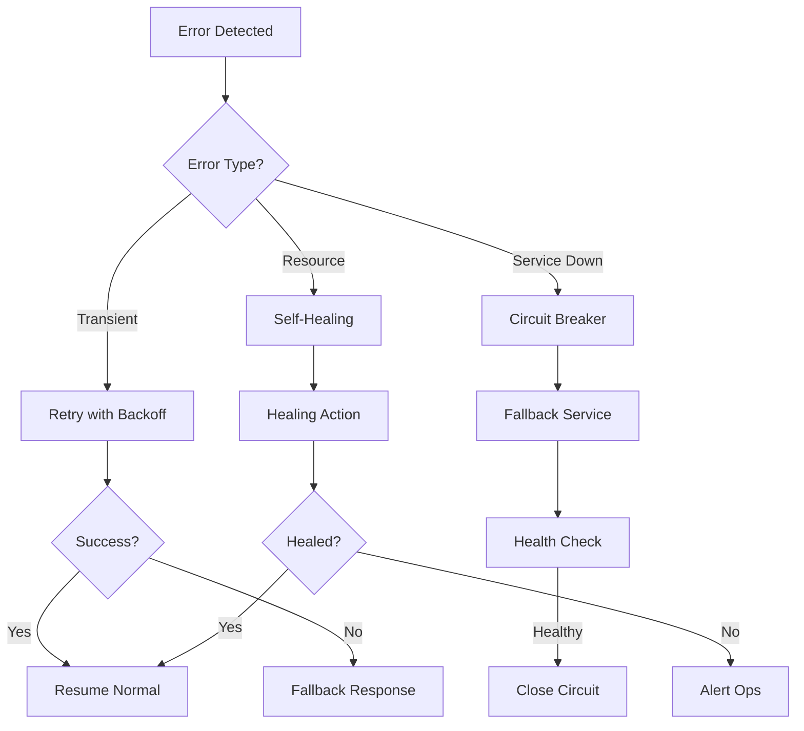

# EPIC-009: Error Handling & Resilience 🛡️

**Epic ID:** EPIC-009
**Priority:** 🔴 CRITICAL
**Sprint Allocation:** Sprint 04-C
**Total Story Points:** 13+
**Owner:** Backend Lead / SRE Lead
**Status:** NOT STARTED
**Resilience Target:** 99.9% Uptime

---

## 🎯 Epic Overview

### Business Objective
Implement intelligent error handling and self-healing mechanisms ensuring graceful degradation, automatic recovery, and maintaining user experience even during system failures.

### Strategic Value
- **Reliability:** 99.9% uptime capability
- **User Experience:** Graceful degradation
- **Operations:** Self-healing reduces manual intervention
- **Cost Savings:** Reduced incident response costs
- **Compliance:** Meet SLA requirements

### Success Metrics
| Metric | Target | Current | Status |
|--------|--------|---------|--------|
| Error Recovery Rate | >95% | 0% | 🔴 |
| MTTR (Mean Time To Recovery) | <5 minutes | N/A | 🔴 |
| Circuit Breaker Effectiveness | >99% | 0% | 🔴 |
| Error Budget Burn Rate | <1%/day | N/A | 🔴 |
| User-Facing Error Rate | <0.1% | N/A | 🔴 |

---

## 📝 User Stories

### 🔴 US-037: Intelligent Error Handling System
**Priority:** CRITICAL
**Story Points:** 13
**Sprint:** 04-C
**Assignee:** Backend Dev 1, Full-stack Dev
**Dependencies:** US-031 (Recognition API), US-033 (Batch System)

#### Story
**As a** system
**I want to** handle all errors gracefully
**So that** users always have a good experience

#### Acceptance Criteria
- [ ] Structured error responses (RFC 7807)
- [ ] Circuit breaker pattern implemented
- [ ] Exponential backoff with jitter
- [ ] Graceful degradation strategies
- [ ] Error budget tracking
- [ ] Self-healing capabilities
- [ ] Detailed error documentation
- [ ] User-friendly error pages
- [ ] Error recovery workflows
- [ ] Fallback mechanisms

#### Technical Implementation
```python
class IntelligentErrorHandler:
    def __init__(self):
        self.circuit_breaker = CircuitBreaker(
            failure_threshold=5,
            recovery_timeout=60,
            expected_exception=Exception,
            fallback_function=self.fallback_response
        )

        self.error_budget = ErrorBudget(
            slo_target=0.999,
            window_minutes=60
        )

    def format_error(self, error: Exception) -> Dict:
        return {
            "type": f"/errors/{self.classify_error(error)}",
            "title": self.get_user_friendly_title(error),
            "status": self.get_status_code(error),
            "detail": self.get_safe_detail(error),
            "instance": f"/errors/{uuid.uuid4()}",
            "suggestions": self.get_recovery_suggestions(error)
        }
```

---

## 🏗️ Features & Capabilities

### 1. Circuit Breaker Implementation
**Description:** Prevent cascading failures through intelligent circuit breaking

**Components:**
- Circuit breaker per service
- State management (Closed, Open, Half-Open)
- Fallback responses
- Health check integration
- Automatic recovery

**Configuration:**
```python
circuit_breaker_config = {
    "failure_threshold": 5,
    "recovery_timeout": 60,
    "half_open_requests": 3,
    "monitored_exceptions": [
        ServiceUnavailable,
        Timeout,
        ConnectionError
    ],
    "excluded_exceptions": [
        ValidationError,
        AuthenticationError
    ]
}
```

### 2. Retry Logic with Backoff
**Description:** Intelligent retry mechanisms with exponential backoff

**Components:**
- Exponential backoff algorithm
- Jitter implementation
- Max retry limits
- Retry policies per operation
- Dead letter queue

**Implementation:**
```python
@backoff.on_exception(
    backoff.expo,
    Exception,
    max_tries=3,
    max_time=30,
    jitter=backoff.full_jitter,
    on_backoff=log_retry,
    on_giveup=send_to_dlq
)
async def with_retry(self, operation):
    return await operation()
```

### 3. Graceful Degradation
**Description:** Maintain partial functionality during failures

**Degradation Strategies:**
```yaml
Recognition Service:
  Primary: Full ML model with GPU
  Degraded: Simplified model on CPU
  Fallback: Cached results only

Database Service:
  Primary: Read/Write to primary
  Degraded: Read from replicas only
  Fallback: In-memory cache only

Cache Service:
  Primary: Redis cluster
  Degraded: Local memory cache
  Fallback: No caching

External APIs:
  Primary: Real-time calls
  Degraded: Cached responses
  Fallback: Static responses
```

### 4. Self-Healing Mechanisms
**Description:** Automatic detection and recovery from common issues

**Self-Healing Actions:**
- Memory leak detection and worker restart
- Connection pool reset on degradation
- Cache inconsistency detection and rebuild
- Stale lock cleanup
- Queue overflow management

**Implementation:**
```python
class SelfHealingSystem:
    async def monitor_and_heal(self):
        healers = [
            self.heal_memory_leaks,
            self.heal_connection_pools,
            self.heal_cache_inconsistency,
            self.heal_stale_locks,
            self.heal_queue_overflow
        ]

        for healer in healers:
            try:
                await healer()
            except Exception as e:
                await self.alert_ops_team(e)
```

### 5. Error Budget Tracking
**Description:** Monitor and manage error budgets for SLO compliance

**Components:**
- SLO definition (99.9% uptime)
- Error budget calculation
- Burn rate monitoring
- Alerting on budget exhaustion
- Automated response triggers

**Metrics:**
```yaml
SLO Configuration:
  Availability: 99.9%
  Error Budget: 43.2 minutes/month

Burn Rate Alerts:
  - 1 hour: >10% budget consumed
  - 6 hours: >30% budget consumed
  - 24 hours: >50% budget consumed

Actions on Budget Exhaustion:
  - Freeze non-critical deployments
  - Escalate to senior engineers
  - Activate incident response
```

### 6. Structured Error Responses
**Description:** Consistent, informative error responses (RFC 7807)

**Error Response Format:**
```json
{
  "type": "/errors/rate-limit-exceeded",
  "title": "Rate Limit Exceeded",
  "status": 429,
  "detail": "You have exceeded the rate limit of 100 requests per minute",
  "instance": "/errors/550e8400-e29b-41d4-a716-446655440000",
  "timestamp": "2024-01-29T10:30:00Z",
  "correlation_id": "req-123456",
  "retry_after": 30,
  "suggestions": [
    "Wait 30 seconds before retrying",
    "Consider upgrading your plan for higher limits",
    "Use batch endpoints for multiple operations"
  ],
  "support_url": "https://docs.api.com/errors/rate-limit"
}
```

---

## 🔄 Error Recovery Workflows

### Automatic Recovery Flows


---

## 📊 Monitoring & Alerting

### Key Metrics
```yaml
Error Metrics:
  - error_rate_by_type
  - error_rate_by_endpoint
  - recovery_success_rate
  - circuit_breaker_state
  - retry_success_rate

Performance Metrics:
  - error_handling_latency
  - recovery_time
  - fallback_usage_rate
  - self_healing_actions

Business Metrics:
  - user_impact_score
  - error_budget_remaining
  - slo_compliance
```

### Alert Configuration
```yaml
Critical Alerts:
  - Error rate > 1% for 5 minutes
  - Circuit breaker open > 10 minutes
  - Error budget < 20%
  - Self-healing failure
  - Cascading failures detected

Warning Alerts:
  - Error rate > 0.5% for 10 minutes
  - Retry rate > 20%
  - Fallback usage > 10%
  - Error budget burn rate high
```

---

## 🚀 Implementation Roadmap

### Phase 1: Foundation (Days 1-3)
- [ ] Error classification system
- [ ] Structured error responses
- [ ] Basic retry logic
- [ ] Error logging enhancement

### Phase 2: Resilience (Days 4-6)
- [ ] Circuit breaker implementation
- [ ] Graceful degradation
- [ ] Fallback mechanisms
- [ ] Health checks

### Phase 3: Intelligence (Days 7-9)
- [ ] Self-healing mechanisms
- [ ] Error budget tracking
- [ ] Advanced retry strategies
- [ ] Recovery workflows

### Phase 4: Optimization (Days 10-12)
- [ ] Performance tuning
- [ ] Alert optimization
- [ ] Documentation
- [ ] Chaos testing

---

## 📈 Success KPIs

| KPI | Target | Measurement |
|-----|--------|-------------|
| Error Recovery Rate | >95% | Successful recoveries / Total errors |
| MTTR | <5 minutes | Average recovery time |
| User Impact | <0.1% | Affected users / Total users |
| SLO Compliance | >99.9% | Uptime percentage |
| Self-Healing Success | >80% | Automated fixes / Total issues |

---

## 🔗 Dependencies

### Technical Dependencies
- py-breaker for circuit breaking
- backoff for retry logic
- Sentry for error tracking
- Redis for state management
- Prometheus for metrics

### Epic Dependencies
- EPIC-002: Core Detection (error sources)
- EPIC-007: Monitoring (metrics and alerts)
- EPIC-005: Performance (degradation strategies)
- EPIC-008: Testing (chaos engineering)

---

## ⚠️ Risks & Mitigations

| Risk | Impact | Probability | Mitigation |
|------|--------|-------------|------------|
| Cascading failures | HIGH | MEDIUM | Circuit breakers, bulkheads |
| Over-aggressive retry | HIGH | MEDIUM | Exponential backoff, limits |
| Hidden failures | HIGH | LOW | Comprehensive monitoring |
| Complex recovery | MEDIUM | MEDIUM | Simple fallback strategies |
| Alert fatigue | MEDIUM | HIGH | Smart alert tuning |

---

## ✅ Definition of Done

### Epic Completion Criteria
- [ ] All error types classified
- [ ] Circuit breakers operational
- [ ] Retry logic implemented
- [ ] Graceful degradation active
- [ ] Self-healing mechanisms deployed
- [ ] Error budget tracking live
- [ ] User error pages created
- [ ] Documentation complete

### Testing Requirements
- [ ] Chaos engineering tests
- [ ] Failure injection tests
- [ ] Recovery time tests
- [ ] Load test with failures
- [ ] Circuit breaker tests

---

## 📚 Documentation Requirements

- Error handling guide
- Recovery runbooks
- Error code reference
- Troubleshooting guide
- Alert response procedures
- Degradation strategies
- Self-healing documentation

---

## 🎯 Business Impact

### Immediate Benefits
- Improved user experience during failures
- Reduced manual intervention
- Faster incident resolution

### Long-term Benefits
- Higher system reliability
- Lower operational costs
- Better SLA compliance
- Increased customer trust

---

**Epic Status:** READY FOR IMPLEMENTATION
**Last Updated:** Sprint 04 Planning
**Next Review:** Sprint 04-C Start