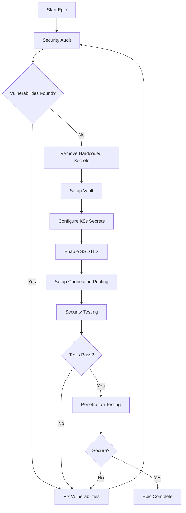

# EPIC-001: Security & Compliance Foundation 🔐

**Epic ID:** EPIC-001
**Priority:** 🔴 CRITICAL
**Sprint Allocation:** Sprint 1 (Primary), Sprint 4 (Security Audit)
**Total Story Points:** 34
**Owner:** Security Team Lead
**Status:** NOT STARTED

---

## 🎯 Epic Overview

### Business Objective
Establish enterprise-grade security foundation ensuring zero vulnerabilities, compliance with industry standards, and protection of customer data. This epic is the cornerstone of production readiness.

### Strategic Value
- **Customer Trust:** Security-first approach builds customer confidence
- **Compliance:** Meet SOC2, GDPR, and industry requirements
- **Risk Mitigation:** Prevent data breaches and security incidents
- **Enterprise Ready:** Enable enterprise customer acquisition

### Success Metrics
| Metric | Target | Current | Status |
|--------|--------|---------|--------|
| Critical Vulnerabilities | 0 | Unknown | 🔴 |
| Security Score (OWASP) | A+ | Unknown | 🔴 |
| Secrets in Code | 0 | 15+ | 🔴 |
| SSL/TLS Grade | A+ | None | 🔴 |
| Audit Compliance | 100% | 0% | 🔴 |

---

## 📝 User Stories

### 🔴 US-001: Implement Secure Configuration Management
**Priority:** CRITICAL
**Story Points:** 5
**Sprint:** 1
**Assignee:** DevOps Engineer
**Dependencies:** Infrastructure setup

#### Story
**As a** DevOps Engineer
**I want to** implement secure configuration management without hardcoded credentials
**So that** our application meets enterprise security standards and prevents credential leaks

#### Background & Context
Currently, the application has 15+ hardcoded passwords and secrets scattered throughout the codebase. This is a critical security vulnerability that could lead to data breaches. We need a centralized, secure configuration management system.

#### Acceptance Criteria
```gherkin
GIVEN the application needs configuration
WHEN it starts up
THEN it should load all configuration from secure sources

GIVEN a developer needs to add a new secret
WHEN they add configuration
THEN they must use the secure configuration system

GIVEN the application is deployed
WHEN configuration changes
THEN it should be able to reload without hardcoded values
```

#### Technical Requirements
1. **Remove all hardcoded credentials**
   - Database passwords
   - API keys
   - JWT secrets
   - Service account credentials
   - Admin passwords

2. **Environment Variable Setup**
   ```bash
   # .env.production.template
   # Database Configuration
   DB_HOST=${DB_HOST}
   DB_PORT=${DB_PORT}
   DB_NAME=${DB_NAME}
   DB_USER=${DB_USER}
   DB_PASSWORD=${DB_PASSWORD}  # Loaded from Vault
   DB_SSL_MODE=require

   # Redis Configuration
   REDIS_HOST=${REDIS_HOST}
   REDIS_PORT=${REDIS_PORT}
   REDIS_PASSWORD=${REDIS_PASSWORD}  # Loaded from Vault

   # MinIO Configuration
   MINIO_ENDPOINT=${MINIO_ENDPOINT}
   MINIO_ACCESS_KEY=${MINIO_ACCESS_KEY}  # Loaded from Vault
   MINIO_SECRET_KEY=${MINIO_SECRET_KEY}  # Loaded from Vault

   # JWT Configuration
   JWT_SECRET=${JWT_SECRET}  # Loaded from Vault
   JWT_EXPIRY=3600
   JWT_REFRESH_EXPIRY=604800

   # Sentry Configuration
   SENTRY_DSN=${SENTRY_DSN}  # Loaded from Vault
   SENTRY_ENVIRONMENT=production
   ```

3. **Kubernetes Secrets Configuration**
   ```yaml
   # k8s/secrets/app-secrets.yaml
   apiVersion: v1
   kind: Secret
   metadata:
     name: logo-recognition-secrets
     namespace: production
   type: Opaque
   data:
     db-password: <base64-encoded>
     jwt-secret: <base64-encoded>
     minio-access-key: <base64-encoded>
     minio-secret-key: <base64-encoded>
   ```

4. **HashiCorp Vault Integration**
   ```python
   # backend/app/config/vault.py
   import hvac
   from typing import Dict, Any

   class VaultManager:
       def __init__(self, vault_url: str, vault_token: str):
           self.client = hvac.Client(url=vault_url, token=vault_token)

       def get_database_credentials(self) -> Dict[str, str]:
           """Fetch database credentials from Vault"""
           response = self.client.secrets.kv.v2.read_secret_version(
               path='database/postgres'
           )
           return response['data']['data']

       def get_jwt_secret(self) -> str:
           """Fetch JWT secret from Vault"""
           response = self.client.secrets.kv.v2.read_secret_version(
               path='auth/jwt'
           )
           return response['data']['data']['secret']
   ```

5. **Configuration Validation Service**
   ```python
   # backend/app/config/validator.py
   from pydantic import BaseSettings, validator
   import sys

   class AppConfig(BaseSettings):
       # Database
       db_host: str
       db_port: int = 5432
       db_name: str
       db_user: str
       db_password: str

       # Security
       jwt_secret: str
       jwt_expiry: int = 3600

       @validator('db_password', 'jwt_secret')
       def validate_not_default(cls, v, field):
           if v in ['password', 'secret', 'admin', '123456']:
               print(f"ERROR: {field.name} contains default/weak value")
               sys.exit(1)
           return v

       class Config:
           env_file = '.env'
           case_sensitive = False
   ```

#### Implementation Tasks
- [ ] Audit codebase for all hardcoded secrets
- [ ] Create .env.production.template file
- [ ] Setup Kubernetes secrets manifests
- [ ] Implement Vault client integration
- [ ] Create configuration validation service
- [ ] Update all services to use secure config
- [ ] Add startup configuration validation
- [ ] Create secret rotation mechanism
- [ ] Document secret management process
- [ ] Test configuration hot-reload

#### Testing Requirements
```python
# tests/test_secure_config.py
def test_no_hardcoded_secrets():
    """Ensure no hardcoded secrets in codebase"""
    secret_patterns = [
        r'password\s*=\s*["\'][^"\']+["\']',
        r'api_key\s*=\s*["\'][^"\']+["\']',
        r'secret\s*=\s*["\'][^"\']+["\']'
    ]
    # Scan all Python files for patterns
    assert no_secrets_found

def test_vault_connection():
    """Test Vault connectivity and secret retrieval"""
    vault = VaultManager(VAULT_URL, VAULT_TOKEN)
    creds = vault.get_database_credentials()
    assert 'password' in creds
    assert creds['password'] != 'default'

def test_config_validation():
    """Test configuration validation on startup"""
    config = AppConfig()
    assert config.validate()
```

#### Security Checklist
- [ ] No secrets in Git history
- [ ] Vault access properly secured
- [ ] Secret rotation implemented
- [ ] Audit logging enabled
- [ ] Encryption at rest configured
- [ ] Network policies restricted
- [ ] Service accounts limited

---

### 🔴 US-002: Implement Database Connection Pooling with Security
**Priority:** CRITICAL
**Story Points:** 3
**Sprint:** 1
**Assignee:** Backend Engineer
**Dependencies:** US-001

#### Story
**As a** Backend Developer
**I want to** implement secure database connection pooling with SSL/TLS
**So that** database connections are secure, efficient, and production-ready

#### Acceptance Criteria
```gherkin
GIVEN the application needs database access
WHEN it connects to the database
THEN it should use encrypted connections with connection pooling

GIVEN high load on the application
WHEN multiple requests arrive
THEN connection pool should handle them efficiently

GIVEN a connection becomes stale
WHEN it's used
THEN it should be automatically refreshed
```

#### Technical Implementation
```python
# backend/app/database/secure_pool.py
from sqlalchemy import create_engine
from sqlalchemy.pool import QueuePool
import ssl
import pgbouncer

class SecureConnectionPool:
    def __init__(self, config: AppConfig):
        self.engine = create_engine(
            config.database_url,
            poolclass=QueuePool,
            pool_size=20,
            max_overflow=40,
            pool_timeout=30,
            pool_recycle=3600,
            pool_pre_ping=True,  # Test connections before use
            connect_args={
                "sslmode": "require",
                "sslcert": "/certs/client-cert.pem",
                "sslkey": "/certs/client-key.pem",
                "sslrootcert": "/certs/ca-cert.pem",
                "connect_timeout": 10,
                "options": "-c statement_timeout=30000"
            }
        )

    def get_connection(self):
        """Get a secure pooled connection"""
        with self.engine.connect() as conn:
            # Enable row-level security
            conn.execute("SET row_security = on")
            return conn
```

#### PgBouncer Configuration
```ini
# pgbouncer/pgbouncer.ini
[databases]
logo_recognition = host=postgres.production port=5432 dbname=logo_recognition

[pgbouncer]
listen_port = 6432
listen_addr = *
auth_type = scram-sha-256
auth_file = /etc/pgbouncer/userlist.txt
pool_mode = transaction
max_client_conn = 1000
default_pool_size = 25
min_pool_size = 10
reserve_pool_size = 5
server_lifetime = 3600
server_idle_timeout = 600
server_connect_timeout = 15
query_wait_timeout = 120
client_tls_sslmode = require
client_tls_cert_file = /certs/server.crt
client_tls_key_file = /certs/server.key
server_tls_sslmode = require
```

---

### 🔴 US-020: Security Audit and Penetration Testing
**Priority:** CRITICAL
**Story Points:** 5
**Sprint:** 4
**Assignee:** Security Team
**Dependencies:** All security stories

#### Story
**As a** Security Engineer
**I want to** conduct comprehensive security audit and penetration testing
**So that** we can identify and fix all security vulnerabilities before production

#### Acceptance Criteria
```gherkin
GIVEN the application is ready for security audit
WHEN security scan is performed
THEN no critical or high vulnerabilities should be found

GIVEN OWASP Top 10 checklist
WHEN each item is tested
THEN all items should pass

GIVEN penetration testing is conducted
WHEN attempts are made to breach security
THEN all attempts should fail
```

#### Security Audit Checklist

##### 1. Dependency Scanning
```bash
# Run Snyk scan
snyk test --all-projects --severity-threshold=high

# Run Trivy scan
trivy image logo-recognition:latest

# Python safety check
safety check --full-report

# npm audit
npm audit --audit-level=moderate
```

##### 2. OWASP Top 10 Testing
| Vulnerability | Test Method | Status | Result |
|--------------|-------------|--------|--------|
| Injection | SQLMap, Burp Suite | ⏳ | - |
| Broken Authentication | Auth bypass tests | ⏳ | - |
| Sensitive Data Exposure | SSL Labs, data scans | ⏳ | - |
| XML External Entities | XXE injection tests | ⏳ | - |
| Broken Access Control | Authorization tests | ⏳ | - |
| Security Misconfiguration | Config audits | ⏳ | - |
| XSS | XSS payloads | ⏳ | - |
| Insecure Deserialization | Pickle tests | ⏳ | - |
| Known Vulnerabilities | CVE scanning | ⏳ | - |
| Insufficient Logging | Log analysis | ⏳ | - |

##### 3. Infrastructure Security
```yaml
# Security Headers Configuration
Content-Security-Policy: default-src 'self'
X-Frame-Options: DENY
X-Content-Type-Options: nosniff
Strict-Transport-Security: max-age=31536000; includeSubDomains
X-XSS-Protection: 1; mode=block
Referrer-Policy: strict-origin-when-cross-origin
Permissions-Policy: geolocation=(), microphone=(), camera=()
```

##### 4. Penetration Test Scenarios
```python
# tests/security/penetration_tests.py
class PenetrationTests:
    def test_sql_injection(self):
        """Test SQL injection vulnerabilities"""
        payloads = [
            "' OR '1'='1",
            "'; DROP TABLE users; --",
            "' UNION SELECT * FROM users --"
        ]

    def test_jwt_tampering(self):
        """Test JWT security"""
        # Try none algorithm
        # Try weak secret
        # Try algorithm confusion

    def test_path_traversal(self):
        """Test directory traversal"""
        payloads = [
            "../../../etc/passwd",
            "..\\..\\..\\windows\\system32\\config\\sam"
        ]

    def test_xxs_attacks(self):
        """Test cross-site scripting"""
        payloads = [
            "<script>alert('XSS')</script>",
            ""
        ]
```

---

## 🔄 Epic Workflow



---

## 📊 Risk Assessment

| Risk | Probability | Impact | Mitigation | Owner |
|------|------------|--------|------------|-------|
| Vault downtime | Low | High | K8s secrets fallback | DevOps |
| Secret leak | Medium | Critical | Git scanning, rotation | Security |
| SSL cert expiry | Low | High | Auto-renewal, monitoring | DevOps |
| Connection pool exhaustion | Medium | High | Monitoring, auto-scaling | Backend |
| Failed pen test | Medium | High | Early testing, iterations | Security |

---

## 📈 Progress Tracking

### Sprint 1 Progress
- [ ] US-001: Secure Configuration (0/5 pts)
- [ ] US-002: Connection Pooling (0/3 pts)

### Sprint 4 Progress
- [ ] US-020: Security Audit (0/5 pts)

### Overall Epic Progress
```
Progress: [░░░░░░░░░░] 0% (0/13 story points)
```

---

## ✅ Definition of Done

### Story Level
- [ ] Code complete and reviewed
- [ ] Unit tests passing (>90% coverage)
- [ ] Integration tests passing
- [ ] Security scan clean
- [ ] Documentation updated
- [ ] Deployed to staging
- [ ] Product owner acceptance

### Epic Level
- [ ] All user stories completed
- [ ] End-to-end security tested
- [ ] Penetration test passed
- [ ] Security audit approved
- [ ] Compliance certified
- [ ] Monitoring configured
- [ ] Runbooks created
- [ ] Team trained
- [ ] Stakeholder sign-off

---

## 📚 Documentation

### Required Documentation
1. Security Architecture Document
2. Secret Management Guide
3. Incident Response Plan
4. Security Runbook
5. Compliance Report

### Training Materials
1. Secure Coding Practices
2. Secret Management Training
3. Incident Response Training
4. Security Tools Guide

---

**Epic Status:** NOT STARTED
**Last Updated:** Sprint Planning
**Next Review:** Sprint 1 - Day 2