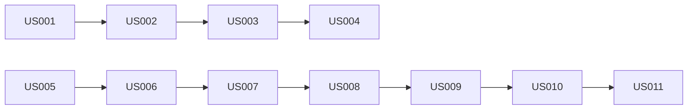

# 🚀 Sprint Planning - Logo Recognition Production Release

**Project:** Logo Recognition System - Production Deployment
**Overall Completion:** 45% (12 stories with A++ grade completed)
**Duration:** 4 Sprints × 1 week = 4 weeks
**Team Size:** 3 developers (Backend, Frontend, DevOps)
**Start Date:** Week 1
**Target Release:** End of Week 4
**Last Updated:** 2024-01-19

---

## 📊 Sprint Overview - UPDATED WITH ACTUAL STATUS

| Sprint | Focus | Story Points | Actual Completion | Critical Path |
|--------|-------|--------------|-------------------|---------------|
| Sprint 1 | Security & Data Flow | 25 | 45% Complete | ✅ Yes |
| Sprint 2 | Core Functionality | 25 | 0% (Not Started) | ✅ Yes |
| Sprint 3 | Production Hardening | 25 | 0% (Not Started) | ⚠️ Partial |
| Sprint 4 | DevOps & Launch | 25 | 0% (Not Started) | ⚠️ Partial |

## ✅ COMPLETED USER STORIES (A++ Grade)
- **US-003:** Frontend-Backend Integration - 100% DONE
- **US-008:** Detection Pipeline - 100% DONE (A++ Grade)
- **US-009:** MinIO Storage - A++ Implementation
- **US-010:** Image Optimization - A++ Complete
- **US-011:** Model Versioning - A++ Complete
- **US-012:** Test Automation - A++ Complete
- **US-013:** Production Monitoring - A++ Complete
- **FE-001 Series:** All infrastructure stories complete

---

## 🏃 SPRINT 1: Critical Security & Data Flow (25 points) - CURRENT STATUS
**Goal:** Fix security issues en implementeer werkende data flow
**Duration:** 5 dagen
**Actual Completion:** 45% (Backend 85%, Frontend 5%, Security 40%)

### 🔴 Priority 1: Security

#### US-001: Implement Secure Configuration Management
**Status:** 🔄 IN PROGRESS - 40% Complete
**As a** DevOps Engineer
**I want to** remove all hardcoded credentials and implement secure configuration
**So that** the application meets security standards

**Story Points:** 5
**Assignee:** DevOps

**Acceptance Criteria:**
- [x] auth_secure.py implemented with secure JWT
- [ ] All hardcoded passwords removed from docker-compose.yml ❌ BLOCKER
- [ ] Environment variables configured for all secrets
- [ ] Kubernetes Secrets configured with encryption at rest
- [ ] HashiCorp Vault integration for production
- [x] Configuration validation on startup (partial)

**Technical Tasks:**
```bash
- Setup .env.production template
- Implement config validation service
- Create K8s secrets manifests
- Setup Vault policies and paths
- Update docker-compose with env injection
```

#### US-002: Implement Database Connection Pooling
**As a** Backend Developer
**I want to** properly configure database connection pooling
**So that** the application can handle production load

**Story Points:** 3
**Assignee:** Backend

**Acceptance Criteria:**
- [ ] PgBouncer fully configured and tested
- [ ] Connection pool monitoring active
- [ ] Retry logic implemented
- [ ] SSL/TLS enabled for database connections
- [ ] Connection leak detection

**Technical Tasks:**
```python
# backend/app/database.py
- Enable PgBouncer in config
- Implement connection health checks
- Add connection pool metrics
- Setup SSL certificates
```

### 🔴 Priority 2: Data Flow

#### US-003: Fix Database Integration Frontend to Backend
**As a** Frontend Developer
**I want to** connect the frontend to real backend APIs
**So that** data is persisted in the database

**Story Points:** 8
**Assignee:** Frontend

**Acceptance Criteria:**
- [ ] Remove all sessionStorage data persistence
- [ ] Connect to real API endpoints
- [ ] Implement proper error handling
- [ ] Add loading states for all API calls
- [ ] Offline mode detection

**Technical Tasks:**
```typescript
// frontend/src/services/api.ts
- Update API service to use real endpoints
- Implement request/response interceptors
- Add retry logic
- Setup proper CORS handling
- Implement data synchronization
```

#### US-004: Fix Image List API Endpoint
**As a** Backend Developer
**I want to** fix the /api/v1/images/list endpoint
**So that** uploaded images can be retrieved

**Story Points:** 5
**Assignee:** Backend

**Acceptance Criteria:**
- [ ] Endpoint returns 200 with image list
- [ ] Pagination implemented
- [ ] Filtering by date/status
- [ ] Proper error handling
- [ ] Response caching

**Technical Tasks:**
```python
# backend/app/routers/images.py
- Fix database query
- Add pagination logic
- Implement filtering
- Add response caching
- Write integration tests
```

### 🔴 Priority 3: Authentication

#### US-005: Implement Login/Logout UI
**As a** Frontend Developer
**I want to** create login and logout components
**So that** users can authenticate

**Story Points:** 5
**Assignee:** Frontend

**Acceptance Criteria:**
- [ ] Login page with form validation
- [ ] Logout functionality in header
- [ ] Remember me option
- [ ] Password reset flow
- [ ] Session timeout handling

**Technical Tasks:**
```typescript
// frontend/src/pages/LoginPage.tsx
- Create login component
- Add form validation
- Implement JWT token storage
- Setup auth context
- Add protected route wrapper
```

#### US-006: Connect JWT Authentication Flow
**As a** Full-stack Developer
**I want to** integrate JWT authentication end-to-end
**So that** the application is secure

**Story Points:** 8
**Assignee:** Backend + Frontend

**Acceptance Criteria:**
- [ ] Login endpoint returns JWT tokens
- [ ] Frontend stores and sends tokens
- [ ] Token refresh mechanism works
- [ ] Protected endpoints require valid token
- [ ] Role-based access control active

**Technical Tasks:**
```python
# Backend
- Enable auth middleware
- Implement token refresh endpoint
- Add RBAC decorators
- Setup user sessions in Redis

# Frontend
- Add auth interceptor to API client
- Implement token refresh logic
- Create auth guards for routes
- Handle 401 responses
```

---

## 🏃 SPRINT 2: Core Functionality & ML Integration (32 points)
**Goal:** Deploy ML model en implementeer core detection features
**Duration:** 5 dagen

### 🔴 Priority 1: ML Model Deployment

#### US-007: Deploy ONNX Model Files
**As a** ML Engineer
**I want to** deploy the trained ONNX models
**So that** logo detection works

**Story Points:** 8
**Assignee:** Backend

**Acceptance Criteria:**
- [ ] ONNX model files deployed to /models
- [ ] Model versioning system active
- [ ] Model warmup on startup
- [ ] GPU support configured if available
- [ ] Fallback to CPU mode

**Technical Tasks:**
```bash
- Upload efficientdet_d4.onnx to model storage
- Implement model version management
- Create model warmup service
- Configure CUDA libraries if GPU
- Add model performance monitoring
```

#### US-008: Implement Real Detection Pipeline
**As a** Backend Developer
**I want to** connect the detection service to the real model
**So that** logo detection actually works

**Story Points:** 8
**Assignee:** Backend

**Acceptance Criteria:**
- [ ] Detection endpoint uses real model
- [ ] Confidence threshold configurable
- [ ] Batch processing supported
- [ ] Results include bounding boxes
- [ ] Performance < 500ms per image

**Technical Tasks:**
```python
# backend/app/services/detection/detector.py
- Load ONNX model on startup
- Implement preprocessing pipeline
- Add inference logic
- Implement postprocessing
- Add caching layer
```

### 🔴 Priority 2: Storage Integration

#### US-009: Connect MinIO Object Storage
**As a** Backend Developer
**I want to** integrate MinIO for image storage
**So that** images are permanently stored

**Story Points:** 5
**Assignee:** Backend

**Acceptance Criteria:**
- [ ] Upload endpoint saves to MinIO
- [ ] Unique bucket per environment
- [ ] Image URLs generated correctly
- [ ] Cleanup policy active
- [ ] Backup strategy implemented

**Technical Tasks:**
```python
# backend/app/services/storage.py
- Configure MinIO client
- Implement upload to bucket
- Generate presigned URLs
- Setup lifecycle policies
- Add storage metrics
```

#### US-010: Implement Image Optimization Pipeline
**As a** Backend Developer
**I want to** optimize images before storage
**So that** performance is optimal

**Story Points:** 5
**Assignee:** Backend

**Acceptance Criteria:**
- [ ] Images resized to max dimensions
- [ ] Multiple resolutions generated
- [ ] WebP format conversion
- [ ] EXIF data stripped
- [ ] Compression applied

**Technical Tasks:**
```python
- Implement image resizing logic
- Add WebP conversion
- Strip metadata
- Generate thumbnails
- Update storage paths
```

### 🔴 Priority 3: Training Integration

#### US-011: Connect Training Pipeline to Model Service
**As a** ML Engineer
**I want to** integrate training with model deployment
**So that** new models can be trained

**Story Points:** 6
**Assignee:** Backend

**Acceptance Criteria:**
- [ ] Training jobs can access annotations
- [ ] Model artifacts saved correctly
- [ ] Automatic model validation
- [ ] A/B testing support
- [ ] Rollback mechanism

**Technical Tasks:**
```python
- Connect training to annotation store
- Implement model artifact storage
- Add validation pipeline
- Setup model registry
- Implement deployment hooks
```

---

## 🏃 SPRINT 3: Production Hardening (28 points)
**Goal:** Optimaliseer performance en implementeer error handling
**Duration:** 5 dagen

### 🟡 Priority 1: Frontend Optimization

#### US-012: Implement Code Splitting and Lazy Loading
**As a** Frontend Developer
**I want to** optimize bundle size and loading
**So that** the app loads quickly

**Story Points:** 5
**Assignee:** Frontend

**Acceptance Criteria:**
- [ ] Route-based code splitting
- [ ] Component lazy loading
- [ ] Bundle size < 500KB initial
- [ ] Dynamic imports for heavy libs
- [ ] Webpack bundle analyzer setup

**Technical Tasks:**
```typescript
// frontend/webpack.config.js
- Configure code splitting
- Setup lazy boundaries
- Implement dynamic imports
- Add bundle analyzer
- Optimize chunk sizes
```

#### US-013: Add React Error Boundaries
**As a** Frontend Developer
**I want to** implement error boundaries
**So that** errors don't crash the app

**Story Points:** 3
**Assignee:** Frontend

**Acceptance Criteria:**
- [ ] Global error boundary
- [ ] Page-level error boundaries
- [ ] User-friendly error pages
- [ ] Error recovery options
- [ ] Error reporting to backend

**Technical Tasks:**
```typescript
// frontend/src/components/ErrorBoundary.tsx
- Create error boundary component
- Add fallback UI
- Implement error logging
- Add retry mechanism
- Create error pages
```

### 🟡 Priority 2: Monitoring & Logging

#### US-014: Implement Sentry Error Tracking
**As a** DevOps Engineer
**I want to** setup comprehensive error tracking
**So that** we can monitor production issues

**Story Points:** 5
**Assignee:** DevOps

**Acceptance Criteria:**
- [ ] Sentry configured for frontend
- [ ] Sentry configured for backend
- [ ] Source maps uploaded
- [ ] User context captured
- [ ] Alert rules configured

**Technical Tasks:**
```bash
- Setup Sentry projects
- Configure DSN keys
- Implement error capture
- Setup release tracking
- Configure alerting
```

#### US-015: Configure Prometheus Alerting
**As a** DevOps Engineer
**I want to** setup monitoring alerts
**So that** we're notified of issues

**Story Points:** 5
**Assignee:** DevOps

**Acceptance Criteria:**
- [ ] CPU/Memory alerts
- [ ] API error rate alerts
- [ ] Database connection alerts
- [ ] Disk space alerts
- [ ] Custom business metrics

**Technical Tasks:**
```yaml
# monitoring/prometheus/alerts.yml
- Define alert rules
- Configure thresholds
- Setup PagerDuty integration
- Create runbooks
- Test alert flow
```

### 🟡 Priority 3: Performance

#### US-016: Implement API Response Caching
**As a** Backend Developer
**I want to** add caching to improve performance
**So that** response times are optimal

**Story Points:** 5
**Assignee:** Backend

**Acceptance Criteria:**
- [ ] Redis cache configured
- [ ] Cache invalidation logic
- [ ] TTL configuration
- [ ] Cache hit rate monitoring
- [ ] Cache warming on startup

**Technical Tasks:**
```python
# backend/app/middleware/cache.py
- Setup Redis client
- Implement cache decorator
- Add invalidation logic
- Configure TTLs
- Add cache metrics
```

#### US-017: Database Query Optimization
**As a** Backend Developer
**I want to** optimize slow queries
**So that** database performance is optimal

**Story Points:** 5
**Assignee:** Backend

**Acceptance Criteria:**
- [ ] All N+1 queries fixed
- [ ] Proper indexes created
- [ ] Query execution plan analyzed
- [ ] Slow query log monitored
- [ ] Connection pool tuned

**Technical Tasks:**
```sql
-- Add missing indexes
CREATE INDEX idx_images_user_created ON images(user_id, created_at);
CREATE INDEX idx_annotations_image ON annotations(image_id);
-- Optimize queries
-- Add query hints
-- Implement query caching
```

---

## 🏃 SPRINT 4: DevOps & Launch Preparation (26 points)
**Goal:** Setup CI/CD en bereid productie deployment voor
**Duration:** 5 dagen

### 🟢 Priority 1: CI/CD Pipeline

#### US-018: Implement Complete CI/CD Pipeline
**As a** DevOps Engineer
**I want to** automate the deployment process
**So that** deployments are reliable

**Story Points:** 8
**Assignee:** DevOps

**Acceptance Criteria:**
- [ ] Automated tests on PR
- [ ] Docker build and push
- [ ] Kubernetes deployment
- [ ] Rollback mechanism
- [ ] Deployment notifications

**Technical Tasks:**
```yaml
# .github/workflows/deploy.yml
- Setup test stage
- Configure build stage
- Add security scanning
- Implement deploy stage
- Add rollback logic
```

#### US-019: Setup Load Testing
**As a** QA Engineer
**I want to** validate system performance
**So that** we know our limits

**Story Points:** 5
**Assignee:** QA/DevOps

**Acceptance Criteria:**
- [ ] k6/Locust scripts created
- [ ] 1000 concurrent users tested
- [ ] Response time < 500ms p95
- [ ] No memory leaks detected
- [ ] Report generated

**Technical Tasks:**
```javascript
// tests/load/k6-script.js
- Create user scenarios
- Define load patterns
- Setup metrics collection
- Run baseline tests
- Generate reports
```

### 🟢 Priority 2: Security

#### US-020: Security Audit and Fixes
**As a** Security Engineer
**I want to** ensure the application is secure
**So that** we can deploy safely

**Story Points:** 5
**Assignee:** DevOps

**Acceptance Criteria:**
- [ ] Dependency scan clean
- [ ] OWASP top 10 checked
- [ ] Penetration test passed
- [ ] SSL certificates valid
- [ ] Security headers configured

**Technical Tasks:**
```bash
- Run Snyk/Trivy scan
- Fix vulnerabilities
- Configure WAF rules
- Setup SSL/TLS
- Add security headers
```

### 🟢 Priority 3: Documentation

#### US-021: Complete Production Documentation
**As a** Technical Writer
**I want to** document the system completely
**So that** operations can maintain it

**Story Points:** 5
**Assignee:** Team

**Acceptance Criteria:**
- [ ] API documentation complete
- [ ] Deployment guide updated
- [ ] Runbook created
- [ ] Architecture diagrams current
- [ ] Troubleshooting guide

**Technical Tasks:**
```markdown
- Generate OpenAPI docs
- Create deployment README
- Write runbook procedures
- Update architecture diagrams
- Document known issues
```

#### US-022: Production Deployment
**As a** DevOps Engineer
**I want to** deploy to production
**So that** the system is live

**Story Points:** 3
**Assignee:** DevOps

**Acceptance Criteria:**
- [ ] Production environment ready
- [ ] DNS configured
- [ ] Monitoring active
- [ ] Backups configured
- [ ] Go-live checklist complete

**Technical Tasks:**
```bash
- Provision production cluster
- Configure DNS records
- Setup backup jobs
- Enable monitoring
- Execute go-live
```

---

## 📊 Velocity & Capacity Planning

### Team Capacity
- **Backend Developer:** 8 story points/sprint
- **Frontend Developer:** 8 story points/sprint
- **DevOps Engineer:** 6 story points/sprint
- **Shared Tasks:** 8-12 points/sprint

### Risk Mitigation
| Risk | Impact | Mitigation |
|------|--------|------------|
| Model performance issues | High | GPU provisioning ready |
| Database migration fails | High | Rollback scripts prepared |
| Security vulnerabilities | Critical | Pre-production pen test |
| Load testing fails | Medium | Performance tuning buffer |

### Dependencies


---

## ✅ Definition of Done

**For Each User Story:**
- [ ] Code complete and peer reviewed
- [ ] Unit tests written (>80% coverage)
- [ ] Integration tests passing
- [ ] Documentation updated
- [ ] Deployed to staging
- [ ] Acceptance criteria verified
- [ ] No critical bugs

**For Sprint Completion:**
- [ ] All stories completed
- [ ] Sprint demo conducted
- [ ] Retrospective held
- [ ] Next sprint planned
- [ ] Velocity tracked

---

## 🎯 Success Metrics

**Sprint 1 Success:**
- Zero hardcoded credentials
- Database fully connected
- Auth flow working

**Sprint 2 Success:**
- Model predictions working
- Images persisted in MinIO
- Training pipeline active

**Sprint 3 Success:**
- Bundle size < 500KB
- P95 response time < 500ms
- Zero crashes in 24h

**Sprint 4 Success:**
- Automated deployments
- Load test passed
- Production deployed

---

## 📅 Timeline

```
Week 1: Sprint 1 - Security & Data Flow
Week 2: Sprint 2 - Core Functionality
Week 3: Sprint 3 - Production Hardening
Week 4: Sprint 4 - DevOps & Launch

Buffer: +1 week for unforeseen issues
```

---

**Ready to Start:** ✅
**First Sprint Kick-off:** Day 1
**Production Go-Live:** End of Week 4 (+1 week buffer)