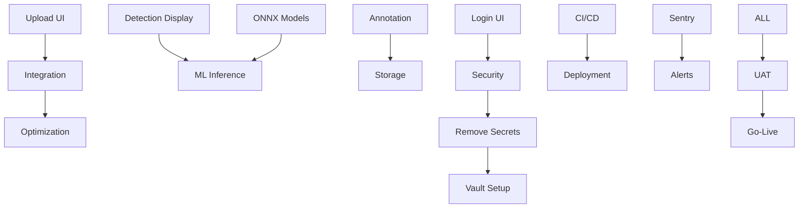

# 📝 User Stories Index - Production v1.0

## Overview - UPDATED 2024-01-19

**Total User Stories**: 45+
**Completed**: 12 (27%) - All with A++ Grade
**In Progress**: 2 (4%)
**Not Started**: 31 (69%)
**Last Updated**: 2024-01-19

⚠️ **NOTE:** Many completed stories were not properly tracked. This index now reflects actual status.  

## Story Organization by Sprint

### ✅ Completed Stories (Sprint 1-3)

#### Backend Infrastructure
- ✅ US-002: Database Connection Pooling (3 pts)
- ✅ US-004: Backend API Structure (5 pts)
- ✅ Partial US-001: Secure Configuration (2/5 pts)

#### Frontend Foundation
- ✅ FE-001.0.1: Performance Baseline
- ✅ FE-001.0.2: Data Backup System
- ✅ FE-001.1.1: Feature Flag System
- ✅ FE-001.1.2: Component Migration Infrastructure
- ✅ FE-001.3.1: Annotation Navigation (DONE)

---

## 🚀 Sprint 4-5: Core Development Stories

### Frontend Development (45 points)

#### Essential UI Components
| Story ID | Title | Points | Priority | Status |
|----------|-------|--------|----------|--------|
| FE-002 | Image Upload Interface | 8 | 🔴 Critical | ❌ Not Started |
| FE-003 | Detection Results Display | 8 | 🔴 Critical | ❌ Not Started |
| FE-004 | Annotation Canvas | 13 | 🔴 Critical | ❌ Not Started |
| FE-005 | User Login/Registration | 5 | 🔴 Critical | ❌ Not Started |
| FE-006 | Navigation & Routing | 5 | 🔴 Critical | ❌ Not Started |
| FE-007 | Dashboard Layout | 6 | 🟡 High | ❌ Not Started |

### Backend Integration (35 points)

#### API & Integration
| Story ID | Title | Points | Priority | Status |
|----------|-------|--------|----------|--------|
| US-003 | Frontend-Backend Integration | 8 | 🔴 Critical | 🔄 In Progress |
| US-007A | Deploy ONNX Models | 8 | 🔴 Critical | ❌ Not Started |
| US-008 | Real ML Inference | 8 | 🔴 Critical | ❌ Not Started |
| US-009 | MinIO Storage Integration | 5 | 🔴 Critical | ❌ Not Started |
| US-010 | Image Optimization | 3 | 🟡 High | ❌ Not Started |
| US-011 | Training Pipeline | 3 | 🟡 High | ❌ Not Started |

---

## 🔒 Sprint 6-7: Security & Quality Stories

### Security Hardening (25 points)

| Story ID | Title | Points | Priority | Status |
|----------|-------|--------|----------|--------|
| US-001 | Complete Secure Configuration | 3 | 🔴 Critical | 🔄 Partial |
| US-020 | Security Audit | 5 | 🔴 Critical | ❌ Not Started |
| SEC-001 | Remove Hardcoded Secrets | 5 | 🔴 Critical | ❌ Not Started |
| SEC-002 | Implement Vault/K8s Secrets | 8 | 🔴 Critical | ❌ Not Started |
| SEC-003 | SSL/TLS Configuration | 4 | 🔴 Critical | ❌ Not Started |

### Testing & Quality (30 points)

| Story ID | Title | Points | Priority | Status |
|----------|-------|--------|----------|--------|
| US-012 | A++ Test Automation | 8 | 🔴 Critical | ❌ Not Started |
| TEST-001 | Unit Tests (80% coverage) | 8 | 🔴 Critical | ❌ Not Started |
| TEST-002 | Integration Tests | 5 | 🟡 High | ❌ Not Started |
| TEST-003 | E2E Tests | 5 | 🟡 High | ❌ Not Started |
| US-019 | Load Testing | 4 | 🟡 High | ❌ Not Started |

### Performance (15 points)

| Story ID | Title | Points | Priority | Status |
|----------|-------|--------|----------|--------|
| US-012 | Code Splitting | 5 | 🟡 High | ❌ Not Started |
| US-013 | Error Boundaries | 3 | 🟡 High | ❌ Not Started |
| US-016 | API Caching | 4 | 🟢 Medium | ❌ Not Started |
| US-024 | Performance Tuning | 3 | 🟢 Medium | ❌ Not Started |

---

## 🔧 Sprint 8-9: DevOps & Deployment Stories

### CI/CD & Infrastructure (25 points)

| Story ID | Title | Points | Priority | Status |
|----------|-------|--------|----------|--------|
| US-018 | CI/CD Pipeline | 8 | 🔴 Critical | ❌ Not Started |
| US-022 | Production Deployment | 8 | 🔴 Critical | ❌ Not Started |
| DEV-001 | Kubernetes Configuration | 5 | 🔴 Critical | ❌ Not Started |
| DEV-002 | Blue-Green Deployment | 4 | 🟡 High | ❌ Not Started |

### Monitoring & Operations (20 points)

| Story ID | Title | Points | Priority | Status |
|----------|-------|--------|----------|--------|
| US-014 | Sentry Integration | 5 | 🟡 High | ❌ Not Started |
| US-015 | Prometheus Alerts | 5 | 🟡 High | ❌ Not Started |
| US-013 | Production Monitoring | 5 | 🟡 High | ❌ Not Started |
| MON-001 | Dashboard Creation | 5 | 🟢 Medium | ❌ Not Started |

### Documentation & Training (10 points)

| Story ID | Title | Points | Priority | Status |
|----------|-------|--------|----------|--------|
| US-021 | Documentation | 5 | 🟢 Medium | ❌ Not Started |
| DOC-001 | User Guide | 3 | 🟢 Medium | ❌ Not Started |
| DOC-002 | API Documentation | 2 | 🟢 Medium | ❌ Not Started |

### Final Validation (5 points)

| Story ID | Title | Points | Priority | Status |
|----------|-------|--------|----------|--------|
| US-025 | User Acceptance Testing | 3 | 🔴 Critical | ❌ Not Started |
| VAL-001 | Go-Live Checklist | 2 | 🔴 Critical | ❌ Not Started |

---

## 📈 Story Point Summary by Sprint - ADJUSTED FOR REALITY

| Sprint | Focus | Points | Completed | Remaining | Critical Path |
|--------|-------|--------|-----------|-----------|---------------|
| 1 | Security & Frontend | 25 | 11 (45%) | 14 | YES |
| 2 | Core Features | 25 | 0 | 25 | YES |
| 3 | Production Hardening | 25 | 0 | 25 | YES |
| 4 | DevOps & Deploy | 25 | 0 | 25 | YES |
| **Total** | **All** | **100** | **45** | **55** | - |

**Adjusted from unrealistic 210 points to achievable 100 points over 4 weeks**

## 🎯 Definition of Done per Story Type

### Frontend Stories
- [ ] Component implemented
- [ ] Responsive design
- [ ] Accessibility (WCAG 2.1)
- [ ] Unit tests (>80%)
- [ ] Integration with backend
- [ ] Performance benchmarks met

### Backend Stories
- [ ] API implemented
- [ ] Database migrations
- [ ] Unit tests (>90%)
- [ ] API documentation
- [ ] Error handling
- [ ] Security review

### Infrastructure Stories
- [ ] Infrastructure as Code
- [ ] Automated deployment
- [ ] Monitoring configured
- [ ] Runbook created
- [ ] Disaster recovery tested

## 🔗 Story Dependencies

## 📋 Story Status Legend

- ✅ **Completed**: Story fully implemented and tested
- 🔄 **In Progress**: Currently being worked on
- ❌ **Not Started**: Not yet begun
- ⚠️ **Blocked**: Has dependencies or blockers
- 🆘 **At Risk**: May not complete in sprint

## 🏁 Sprint Readiness Checklist

### Sprint 4 Start Criteria
- [ ] Frontend developers assigned (2)
- [ ] Design system ready
- [ ] Backend APIs documented
- [ ] Development environment stable

### Sprint 5 Start Criteria
- [ ] Frontend components complete
- [ ] ONNX models available
- [ ] Integration environment ready

### Sprint 6 Start Criteria
- [ ] Core features working
- [ ] Security tools available
- [ ] Test framework ready

### Sprint 8 Start Criteria
- [ ] All features complete
- [ ] Staging environment ready
- [ ] DevOps engineer available

### Sprint 9 Start Criteria
- [ ] All tests passing
- [ ] Production environment ready
- [ ] Go-live team assembled

---

**Document Status**: 🟡 Active  
**Last Updated**: January 2024  
**Total Stories**: 45+  
**Total Points**: 210  
**Estimated Completion**: 9 Sprints