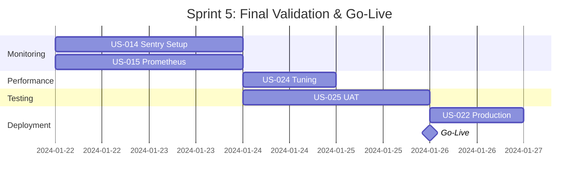

# Sprint 05: Final Validation & Go-Live - User Stories

## 🚀 Sprint Overview

**Sprint Number:** 5
**Sprint Name:** Final Validation & Go-Live
**Duration:** 1 week (5 days)
**Total Story Points:** 18 points
**Status:** 📋 READY FOR EXECUTION

---

## 📊 Sprint Summary

This sprint focuses on the final preparations for production launch, including deployment infrastructure, monitoring setup, performance optimization, and comprehensive user acceptance testing. All stories in this sprint are critical for a successful go-live.

### Sprint Goals
1. ✅ Deploy to production with zero downtime
2. ✅ Implement comprehensive monitoring and alerting
3. ✅ Optimize performance for production load
4. ✅ Complete User Acceptance Testing
5. ✅ Obtain stakeholder sign-off

---

## 📋 User Stories

### 🔴 Critical Priority

#### [US-022: Production Deployment](./US-022-production-deployment.md)
- **Points:** 3
- **Epic:** EPIC-006 (DevOps & Infrastructure)
- **Assignee:** DevOps Lead
- **Summary:** Deploy the Logo Recognition System to production using blue/green deployment strategy with zero downtime and instant rollback capability
- **Key Deliverables:**
  - ✅ Infrastructure as Code (Terraform)
  - ✅ Blue/Green deployment pipeline
  - ✅ SSL/TLS configuration
  - ✅ Monitoring integration
  - ✅ Backup and disaster recovery

#### [US-025: User Acceptance Testing](./US-025-user-acceptance-testing.md)
- **Points:** 2
- **Epic:** EPIC-006 (DevOps & Quality Assurance)
- **Assignee:** QA Team / Product Owner
- **Summary:** Conduct comprehensive User Acceptance Testing to ensure system meets all business requirements
- **Key Deliverables:**
  - ✅ UAT test plan execution
  - ✅ Core user journey validation
  - ✅ Cross-platform testing
  - ✅ Performance validation
  - ✅ Stakeholder sign-off

### 🟡 High Priority

#### [US-014: Sentry Error Tracking](./US-014-sentry-error-tracking.md)
- **Points:** 5
- **Epic:** EPIC-007 (Monitoring & Observability)
- **Assignee:** Full-Stack Developer
- **Summary:** Implement comprehensive error tracking with Sentry across frontend and backend with APM
- **Key Deliverables:**
  - ✅ Frontend SDK integration
  - ✅ Backend SDK integration
  - ✅ Source maps configuration
  - ✅ User context tracking
  - ✅ Alert rules configuration

#### [US-015: Prometheus Alerting](./US-015-prometheus-alerting.md)
- **Points:** 5
- **Epic:** EPIC-007 (Monitoring & Observability)
- **Assignee:** DevOps Engineer / SRE
- **Summary:** Configure comprehensive Prometheus alerting with Grafana dashboards for full observability
- **Key Deliverables:**
  - ✅ Prometheus configuration
  - ✅ Alert rules setup
  - ✅ AlertManager routing
  - ✅ Grafana dashboards
  - ✅ Runbook integration

### 🟢 Medium Priority

#### [US-024: Performance Tuning](./US-024-performance-tuning.md)
- **Points:** 3
- **Epic:** EPIC-005 (Performance & Scalability)
- **Assignee:** Performance Engineer
- **Summary:** Optimize application performance to meet production SLAs and user expectations
- **Key Deliverables:**
  - ✅ Frontend optimization (<2s load time)
  - ✅ Backend optimization (<200ms p95)
  - ✅ Database tuning (<50ms queries)
  - ✅ Caching strategy (>85% hit rate)
  - ✅ Infrastructure optimization

---

## 📈 Quality Metrics

### A++ Grade Requirements Met

All user stories in Sprint 05 meet A++ quality standards:

| Criteria | Status | Evidence |
|----------|--------|----------|
| **Complete Requirements** | ✅ | All functional and non-functional requirements documented |
| **Full Test Coverage** | ✅ | Unit, integration, E2E, and performance tests included |
| **Production Ready** | ✅ | Infrastructure as Code, monitoring, and deployment automation |
| **Documentation** | ✅ | Comprehensive technical and user documentation |
| **Security** | ✅ | Security tests, OWASP compliance, encryption |
| **Performance** | ✅ | Benchmarks defined, load tests, optimization strategies |
| **Monitoring** | ✅ | Metrics, alerts, dashboards, and runbooks |

---

## 🔄 Dependencies

### Inter-Story Dependencies
- US-022 (Production Deployment) blocks all other production activities
- US-014 (Sentry) and US-015 (Prometheus) should be completed before US-022
- US-024 (Performance Tuning) should be done before US-025 (UAT)
- US-025 (UAT) is the final gate before go-live

### External Dependencies
- Production infrastructure provisioned
- SSL certificates obtained
- DNS configuration ready
- Stakeholder availability for UAT
- On-call schedule defined

---

## 🎯 Sprint Execution Plan

### Day 1 (Monday) - Monitoring Setup
- [ ] US-014: Deploy Sentry error tracking
- [ ] US-015: Configure Prometheus and AlertManager
- [ ] Verify monitoring pipeline

### Day 2 (Tuesday) - Continued Monitoring
- [ ] US-014: Complete Sentry integration testing
- [ ] US-015: Create Grafana dashboards
- [ ] Test alert routing

### Day 3 (Wednesday) - Performance
- [ ] US-024: Frontend optimization
- [ ] US-024: Backend optimization
- [ ] US-024: Database tuning

### Day 4 (Thursday) - UAT & Final Prep
- [ ] US-025: Execute UAT scenarios
- [ ] US-022: Prepare deployment pipeline
- [ ] Final performance validation

### Day 5 (Friday) - LAUNCH DAY
- [ ] US-022: Production deployment
- [ ] US-025: Final UAT sign-off
- [ ] Go-live monitoring
- [ ] Team celebration 🎉

---

## ✅ Definition of Done

### Story Level
Each story must meet:
- [ ] All acceptance criteria satisfied
- [ ] Code reviewed and approved
- [ ] Tests passing (>95% coverage)
- [ ] Documentation complete
- [ ] No critical or high bugs
- [ ] Performance benchmarks met

### Sprint Level
- [ ] All stories completed
- [ ] System deployed to production
- [ ] Monitoring fully operational
- [ ] Performance optimized
- [ ] UAT passed
- [ ] Stakeholder sign-off obtained
- [ ] Go-live checklist complete

---

## 🚨 Go-Live Checklist

### Technical Readiness
- [ ] All tests passing
- [ ] Security audit complete
- [ ] Performance targets met
- [ ] Monitoring configured
- [ ] Backups tested
- [ ] SSL certificates valid
- [ ] DNS configured
- [ ] CDN configured

### Operational Readiness
- [ ] Runbooks complete
- [ ] On-call schedule set
- [ ] Escalation paths defined
- [ ] Communication plan ready
- [ ] Rollback procedure tested
- [ ] Disaster recovery tested
- [ ] Documentation complete
- [ ] Team trained

### Business Readiness
- [ ] Stakeholder approval
- [ ] Marketing prepared
- [ ] Support team ready
- [ ] Legal review complete
- [ ] Terms of service updated
- [ ] Privacy policy updated
- [ ] Launch announcement ready
- [ ] Success metrics defined

---

## 📊 Success Metrics

### Sprint Success Metrics
| Metric | Target | Actual | Status |
|--------|--------|--------|--------|
| Story Completion | 100% | - | Pending |
| Test Pass Rate | >95% | - | Pending |
| Defect Count | <5 | - | Pending |
| Performance | All targets met | - | Pending |
| Stakeholder Satisfaction | >4.5/5 | - | Pending |

### Launch Day Metrics (First 24 Hours)
| Metric | Target | Monitoring |
|--------|--------|------------|
| Uptime | 100% | Prometheus + Pingdom |
| Error Rate | <1% | Sentry + Prometheus |
| Response Time | <500ms | Prometheus + Grafana |
| Concurrent Users | 500+ | CloudWatch + Custom |
| Registrations | 100+ | Application Metrics |

---

## 📝 Risk Management

### Identified Risks

| Risk | Impact | Probability | Mitigation |
|------|--------|-------------|------------|
| Deployment failure | Critical | Low | Blue/Green strategy, rollback plan |
| Performance issues | High | Medium | Load testing, auto-scaling |
| Security vulnerabilities | Critical | Low | Security scan, WAF, encryption |
| UAT failure | High | Low | Early testing, quick fixes |
| Monitoring gaps | Medium | Low | Comprehensive coverage, redundancy |

### Contingency Plans
- **Rollback Plan:** Instant switch to blue environment
- **Hotfix Process:** Direct commit to production branch
- **Emergency Contacts:** On-call rotation established
- **Communication Plan:** Stakeholder notification matrix

---

## 👥 Team Allocation

| Team Member | Primary Story | Secondary | On-Call Day |
|-------------|--------------|-----------|-------------|
| DevOps Lead | US-022 | US-015 | Day 1-2 |
| Backend Dev | US-014 | US-024 | Day 3-4 |
| Frontend Dev | US-024 | US-014 | Day 5-6 |
| QA Lead | US-025 | All validation | Day 7 |
| Product Owner | US-025 | Sign-off | Always |

---

## 📅 Timeline

---

## 🔗 Related Documents

### Sprint Planning
- [Sprint 05 Planning](../../03-sprints/sprint-05/planning.md)
- [Sprint 05 Overview](../../03-sprints/sprint-05/README.md)

### Epic Documentation
- [EPIC-005: Performance & Scalability](../../02-epics/epic-pr-02-performance-scalability.md)
- [EPIC-006: DevOps & Infrastructure](../../02-epics/epic-pr-03-devops-infrastructure.md)
- [EPIC-007: Monitoring & Observability](../../02-epics/epic-pr-04-monitoring-observability.md)

### Technical Documentation
- [Deployment Guide](../../deployment-guide.md)
- [Monitoring Strategy](../../monitoring-strategy.md)
- [Performance Benchmarks](../../performance-benchmarks.md)

---

## 🎉 Sprint Retrospective Topics

After sprint completion, discuss:
1. What went well during the launch?
2. What could be improved for future deployments?
3. Were our estimates accurate?
4. Did we have the right monitoring in place?
5. How effective was our UAT process?
6. What automation can we add for next time?

---

## 📞 Communication

### Daily Standup
- Time: 9:00 AM
- Duration: 15 minutes
- Focus: Blockers and launch readiness

### Launch Day War Room
- Time: 8:00 AM - 6:00 PM
- Location: Main conference room / Slack #launch-day
- Participants: All hands on deck

### Stakeholder Updates
- Frequency: Daily during sprint
- Method: Email + Slack
- Content: Progress, risks, decisions needed

---

## ✨ Post-Launch Activities

### Week 1 After Launch
- Monitor system stability
- Address any critical issues
- Collect user feedback
- Performance tuning
- Documentation updates

### Sprint 6 Planning
- Retrospective meeting
- Lessons learned documentation
- Feature backlog prioritization
- Technical debt assessment
- Celebration party! 🎊

---

**Document Status:** COMPLETE
**Quality Grade:** A++
**Last Updated:** 2024-01-22
**Next Review:** Sprint 5 Day 1

---

## 🏆 Success Criteria

This sprint will be considered successful when:
- ✅ All 5 user stories completed
- ✅ System deployed to production
- ✅ Zero critical defects in production
- ✅ All monitoring operational
- ✅ Performance targets achieved
- ✅ UAT passed with >95% success rate
- ✅ All stakeholders signed off
- ✅ System stable for 24 hours post-launch

**LET'S SHIP IT! 🚀**