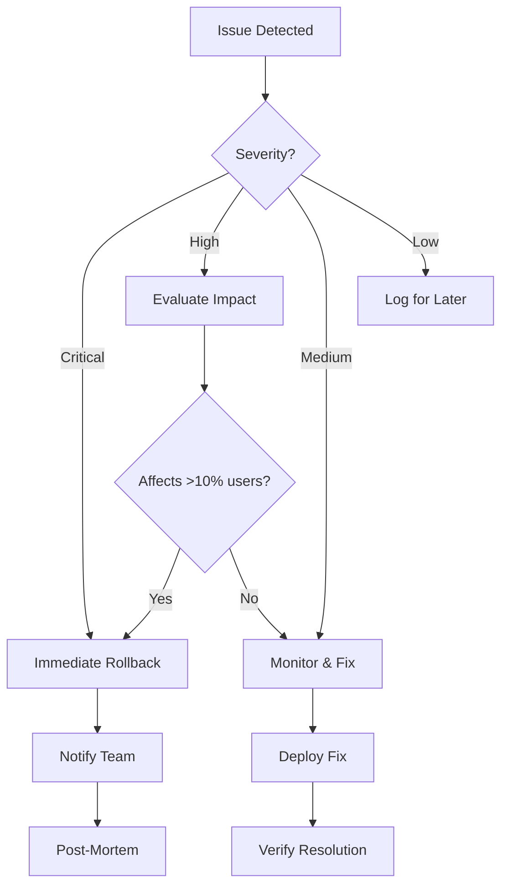

# Migration Supplements: Critical Additions
**Version:** 1.0
**Date:** 2025-09-20
**Purpose:** Address gaps identified in EPIC and Technical Design review

---

## 🔴 Critical Gaps to Address

### 1. Store Implementation Verification

**BLOCKER:** ImageStore implementation must be verified before Sprint 2

**Action Required:**
```bash
# Verify store existence
find frontend/src -name "*store*" -type f | grep -E "(image|Image)"

# If not exists, create adapter:
frontend/src/store/imageStoreAdapter.ts
```

**Fallback Implementation:**
```typescript
// frontend/src/store/imageStoreAdapter.ts
import { create } from 'zustand';
import { devtools, persist } from 'zustand/middleware';

interface ImageStoreState {
  images: UploadedImage[];
  currentImageIndex: number;
  uploadImage: (file: File, onProgress?: (progress: number) => void) => Promise<UploadedImage>;
  uploadMultipleImages: (files: File[], onProgress?: (index: number, progress: number) => void) => Promise<UploadedImage[]>;
  setCurrentImageIndex: (index: number) => void;
  fetchRecentImages: () => Promise<void>;
  // ... other methods
}

// If store doesn't exist, create wrapper around existing functionality
export const useImageStore = create<ImageStoreState>()(
  devtools(
    persist(
      (set, get) => ({
        images: [],
        currentImageIndex: 0,

        uploadImage: async (file, onProgress) => {
          // Wrap existing upload logic
          const formData = new FormData();
          formData.append('file', file);

          const response = await fetch('/api/v1/logos/upload', {
            method: 'POST',
            body: formData,
            // Track progress if XMLHttpRequest available
          });

          const result = await response.json();
          set(state => ({
            images: [...state.images, result]
          }));

          return result;
        },

        // ... implement other methods
      }),
      { name: 'image-store' }
    )
  )
);
```

---

## 2. Data Migration & Backup Strategy

### 2.1 Pre-Migration Data Backup

**Implementation Required Before Sprint 1:**

```typescript
// frontend/src/migration/DataBackup.ts
export class DataBackupService {
  private readonly BACKUP_KEY = 'migration_backup_v1';

  async createBackup(): Promise<string> {
    const backup = {
      timestamp: Date.now(),
      version: '1.0.0',
      data: {
        localStorage: this.backupLocalStorage(),
        indexedDB: await this.backupIndexedDB(),
        sessionStorage: this.backupSessionStorage(),
      }
    };

    const backupId = `backup_${Date.now()}`;
    await this.saveToIndexedDB(backupId, backup);

    // Also create downloadable backup
    this.createDownloadableBackup(backup);

    return backupId;
  }

  private backupLocalStorage(): Record<string, any> {
    const backup: Record<string, any> = {};
    for (let i = 0; i < localStorage.length; i++) {
      const key = localStorage.key(i);
      if (key) {
        backup[key] = localStorage.getItem(key);
      }
    }
    return backup;
  }

  private async backupIndexedDB(): Promise<any> {
    // Backup all IndexedDB databases
    const databases = await indexedDB.databases();
    const backups = [];

    for (const dbInfo of databases) {
      if (dbInfo.name) {
        const db = await this.openDatabase(dbInfo.name);
        const backup = await this.backupDatabase(db);
        backups.push({ name: dbInfo.name, data: backup });
      }
    }

    return backups;
  }

  async restore(backupId: string): Promise<void> {
    const backup = await this.loadFromIndexedDB(backupId);

    if (!backup) {
      throw new Error('Backup not found');
    }

    // Restore localStorage
    Object.entries(backup.data.localStorage).forEach(([key, value]) => {
      localStorage.setItem(key, value as string);
    });

    // Restore IndexedDB
    for (const db of backup.data.indexedDB) {
      await this.restoreDatabase(db.name, db.data);
    }

    window.location.reload(); // Reload to apply changes
  }
}

// Add to migration framework
export const initiateMigration = async () => {
  const backupService = new DataBackupService();
  const backupId = await backupService.createBackup();

  console.log(`Backup created: ${backupId}`);
  sessionStorage.setItem('migration_backup_id', backupId);

  // Proceed with migration...
};
```

### 2.2 Data Format Versioning

```typescript
// frontend/src/migration/DataVersioning.ts
interface VersionedData<T> {
  version: string;
  data: T;
  migrationHistory: MigrationEntry[];
}

interface MigrationEntry {
  fromVersion: string;
  toVersion: string;
  timestamp: number;
  changes: string[];
}

export class DataVersionManager {
  private migrations: Map<string, (data: any) => any> = new Map();

  constructor() {
    // Register migrations
    this.migrations.set('1.0.0->2.0.0', this.migrateV1ToV2);
    this.migrations.set('2.0.0->3.0.0', this.migrateV2ToV3);
  }

  async migrateData(data: VersionedData<any>, targetVersion: string): Promise<VersionedData<any>> {
    let currentData = data;
    const path = this.findMigrationPath(data.version, targetVersion);

    for (const step of path) {
      const migrationKey = `${step.from}->${step.to}`;
      const migration = this.migrations.get(migrationKey);

      if (!migration) {
        throw new Error(`No migration found for ${migrationKey}`);
      }

      currentData = {
        version: step.to,
        data: migration(currentData.data),
        migrationHistory: [
          ...currentData.migrationHistory,
          {
            fromVersion: step.from,
            toVersion: step.to,
            timestamp: Date.now(),
            changes: step.changes
          }
        ]
      };
    }

    return currentData;
  }

  private migrateV1ToV2(data: any): any {
    // Specific migration logic
    return {
      ...data,
      newField: 'default',
      // Transform old structure to new
    };
  }
}
```

---

## 3. Communication & Training Plan

### 3.1 Stakeholder Communication Timeline

| Week | Audience | Message | Channel |
|------|----------|---------|---------|
| -1 | All Users | "Upcoming UI improvements" | Email, In-app banner |
| 1 | Beta Users | "Join beta testing program" | Email invitation |
| 2 | All Users | "New features rolling out" | Blog post, Email |
| 3 | Support Team | "Training on new features" | Training session |
| 4 | All Users | "Migration progress update" | In-app notification |
| 5 | All Users | "Migration complete" | Email, Blog, Banner |

### 3.2 User Notification Templates

```typescript
// frontend/src/components/MigrationNotifications.tsx
export const MigrationNotifications = {
  preMigration: {
    title: "Exciting Updates Coming!",
    message: "We're upgrading our interface for better performance. You may notice gradual improvements over the next few weeks.",
    type: "info"
  },

  duringMigration: {
    title: "Using New Features",
    message: "You're now using our improved {component}. If you experience any issues, please let us know.",
    type: "success",
    showFeedbackButton: true
  },

  rollback: {
    title: "Temporary Reversion",
    message: "We've temporarily reverted to the previous version while we address an issue. Your work is safe.",
    type: "warning"
  },

  complete: {
    title: "Migration Complete!",
    message: "All improvements are now live. Enjoy faster load times and enhanced features.",
    type: "success",
    showTour: true
  }
};
```

### 3.3 Training Materials

```markdown
## Quick Start Guides

### For Upload Component:
1. New drag-and-drop area (GIF demonstration)
2. Bulk upload progress tracking (Screenshot)
3. Enhanced error handling (Video walkthrough)

### For Annotation Component:
1. Keyboard navigation shortcuts (Cheat sheet PDF)
2. Auto-save indicators (Interactive tutorial)
3. Version history access (Step-by-step guide)

### For Navigation:
1. Collapsible menu (Animated demonstration)
2. Mobile navigation (Video guide)
3. Quick access shortcuts (Reference card)
```

---

## 4. Performance Baseline Measurements

### 4.1 Current Baseline Script

```typescript
// frontend/src/migration/BaselineMetrics.ts
export class BaselineMetrics {
  async captureBaseline(): Promise<MetricsReport> {
    const metrics = {
      timestamp: Date.now(),
      environment: process.env.NODE_ENV,

      performance: {
        bundleSize: await this.measureBundleSize(),
        pageLoad: {
          upload: await this.measurePageLoad('/upload'),
          annotation: await this.measurePageLoad('/annotate'),
          home: await this.measurePageLoad('/')
        },
        apiLatency: await this.measureAPILatency(),
        memoryUsage: await this.measureMemoryUsage()
      },

      functionality: {
        uploadSuccess: await this.testUploadSuccess(),
        annotationSave: await this.testAnnotationSave(),
        navigationSpeed: await this.testNavigationSpeed()
      },

      errors: {
        jsErrors: await this.countJSErrors(),
        apiErrors: await this.countAPIErrors(),
        consoleWarnings: await this.countConsoleWarnings()
      }
    };

    // Save baseline
    localStorage.setItem('migration_baseline', JSON.stringify(metrics));

    return metrics;
  }

  private async measurePageLoad(route: string): Promise<number> {
    const navigation = performance.getEntriesByType('navigation')[0] as PerformanceNavigationTiming;
    return navigation.loadEventEnd - navigation.fetchStart;
  }

  private async measureBundleSize(): Promise<BundleSizeMetrics> {
    // webpack-bundle-analyzer integration
    const stats = await import('./bundle-stats.json');
    return {
      total: stats.assets.reduce((sum, asset) => sum + asset.size, 0),
      byChunk: stats.chunks.map(chunk => ({
        name: chunk.names[0],
        size: chunk.size
      }))
    };
  }
}

// Run baseline before migration
const baseline = new BaselineMetrics();
baseline.captureBaseline().then(report => {
  console.log('Baseline captured:', report);
  // Send to monitoring service
});
```

---

## 5. Security Review Checklist

### 5.1 Pre-Migration Security Audit

```typescript
// frontend/src/migration/SecurityAudit.ts
export class SecurityAudit {
  async runPreMigrationAudit(): Promise<SecurityReport> {
    const report: SecurityReport = {
      timestamp: Date.now(),
      checks: []
    };

    // XSS Prevention
    report.checks.push(await this.checkXSSPrevention());

    // Input Sanitization
    report.checks.push(await this.checkInputSanitization());

    // CORS Configuration
    report.checks.push(await this.checkCORSConfig());

    // Authentication Flow
    report.checks.push(await this.checkAuthFlow());

    // Dependency Vulnerabilities
    report.checks.push(await this.checkDependencies());

    // Content Security Policy
    report.checks.push(await this.checkCSP());

    return report;
  }

  private async checkXSSPrevention(): Promise<SecurityCheck> {
    // Check for dangerous innerHTML usage
    const dangerousPatterns = [
      'dangerouslySetInnerHTML',
      'innerHTML',
      'eval(',
      'new Function('
    ];

    // Scan codebase
    const issues = await this.scanForPatterns(dangerousPatterns);

    return {
      name: 'XSS Prevention',
      passed: issues.length === 0,
      issues,
      severity: 'critical'
    };
  }

  private async checkInputSanitization(): Promise<SecurityCheck> {
    // Verify DOMPurify or similar is used
    const hasSanitizer = await this.checkDependency('dompurify');

    return {
      name: 'Input Sanitization',
      passed: hasSanitizer,
      issues: hasSanitizer ? [] : ['No input sanitization library found'],
      severity: 'high'
    };
  }
}
```

### 5.2 Runtime Security Monitoring

```typescript
// frontend/src/migration/SecurityMonitor.ts
export class SecurityMonitor {
  private suspiciousPatterns = [
    /<script\b[^<]*(?:(?!<\/script>)<[^<]*)*<\/script>/gi,
    /javascript:/gi,
    /on\w+\s*=/gi // Event handlers in strings
  ];

  monitorUserInput(input: string, source: string): void {
    for (const pattern of this.suspiciousPatterns) {
      if (pattern.test(input)) {
        this.reportSuspiciousActivity({
          type: 'suspicious_input',
          source,
          pattern: pattern.toString(),
          input: input.substring(0, 100) // Truncate for logging
        });
        break;
      }
    }
  }

  monitorAPIResponses(response: any, endpoint: string): void {
    // Check for unexpected data types
    if (this.containsSuspiciousContent(response)) {
      this.reportSuspiciousActivity({
        type: 'suspicious_api_response',
        endpoint,
        timestamp: Date.now()
      });
    }
  }

  private reportSuspiciousActivity(activity: any): void {
    // Log to monitoring service
    console.error('[SECURITY]', activity);

    // Send to backend
    fetch('/api/security/report', {
      method: 'POST',
      body: JSON.stringify(activity)
    }).catch(console.error);
  }
}
```

---

## 6. Dependency Management

### 6.1 Required Dependencies

```json
{
  "dependencies": {
    "react": "^18.2.0",
    "react-dom": "^18.2.0",
    "react-router-dom": "^6.8.0",
    "antd": "^5.12.0",
    "zustand": "^4.4.0",
    "typescript": "^5.3.0"
  },
  "devDependencies": {
    "@testing-library/react": "^14.1.0",
    "@testing-library/jest-dom": "^6.1.0",
    "@types/react": "^18.2.0",
    "@types/react-dom": "^18.2.0",
    "webpack-bundle-analyzer": "^4.10.0"
  },
  "migrationDependencies": {
    "@unleash/proxy-client-react": "^3.5.0",
    "dompurify": "^3.0.0",
    "localforage": "^1.10.0"
  }
}
```

### 6.2 Dependency Update Strategy

```bash
#!/bin/bash
# Pre-migration dependency check

# Audit current dependencies
npm audit

# Update minor versions only
npm update

# Check for breaking changes
npm outdated

# Test after updates
npm test

# Lock versions for migration
npm shrinkwrap
```

---

## 7. Emergency Response Plan

### 7.1 Incident Response Flowchart



### 7.2 Emergency Contacts

```yaml
Emergency Response Team:
  - Technical Lead: [Name] - [Phone] - Primary
  - DevOps Lead: [Name] - [Phone] - Infrastructure
  - Product Owner: [Name] - [Phone] - Business decisions
  - QA Lead: [Name] - [Phone] - Testing coordination

Escalation Path:
  Level 1: Technical Lead (0-15 min)
  Level 2: Engineering Manager (15-30 min)
  Level 3: CTO (30+ min)

Communication Channels:
  Primary: Slack #migration-emergency
  Secondary: Email migration-team@company.com
  War Room: Zoom link [URL]
```

---

## 8. Success Validation

### 8.1 Go/No-Go Criteria Per Sprint

```typescript
interface SprintGateCriteria {
  sprint: number;
  criteria: {
    testsPass: number; // Percentage
    performanceWithin: number; // Percentage of baseline
    errorsBelow: number; // Count
    userFeedback: number; // Satisfaction score
  };
  decision: 'go' | 'no-go' | 'conditional';
}

const sprintGates: SprintGateCriteria[] = [
  {
    sprint: 1,
    criteria: {
      testsPass: 100,
      performanceWithin: 110,
      errorsBelow: 0,
      userFeedback: 0 // Not applicable yet
    },
    decision: 'go'
  },
  {
    sprint: 2,
    criteria: {
      testsPass: 95,
      performanceWithin: 105,
      errorsBelow: 5,
      userFeedback: 7
    },
    decision: 'go'
  }
  // ... etc
];
```

---

## Implementation Priority

1. **IMMEDIATE (Before Sprint 1):**
   - Verify/Create ImageStore adapter
   - Setup data backup system
   - Capture performance baselines

2. **SPRINT 1 ADDITIONS:**
   - Security audit implementation
   - Communication templates
   - Emergency response setup

3. **ONGOING:**
   - Monitoring dashboard
   - User feedback collection
   - Performance tracking

---

**Document Status:** Critical additions for migration success
**Action Required:** Implement IMMEDIATE items before starting Sprint 1