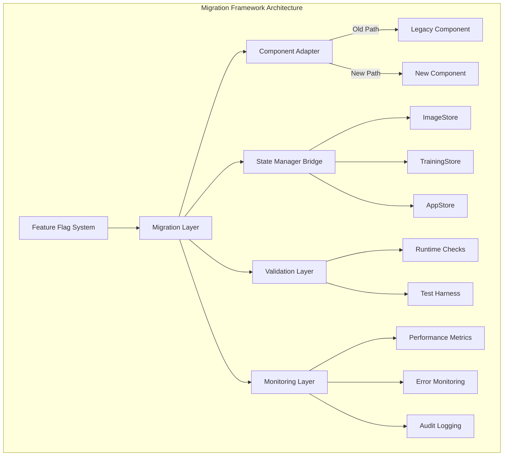

# Technical Design Document: Component Migration Framework
**Version:** 1.0
**Date:** 2025-09-20
**Author:** Technical Architecture Team
**Status:** Draft

---

## 1. Executive Summary

This document outlines the technical design for a safe, incremental migration framework to consolidate duplicate React components from JavaScript to TypeScript while preserving all functionality and enabling zero-downtime deployment.

## 2. Architecture Overview



## 3. Core Components

### 3.1 Feature Flag System

**Purpose:** Enable gradual rollout and instant rollback capability

**Implementation:**

```typescript
// src/migration/FeatureFlagProvider.tsx
import React, { createContext, useContext, useEffect, useState } from 'react';

interface FeatureFlags {
  // Component-level flags
  useNewUploadComponent: boolean;
  useNewAnnotationComponent: boolean;
  useNewNavigation: boolean;

  // Feature-level flags
  enableBulkUpload: boolean;
  enableVirusScanning: boolean;
  enableWebSocketUpdates: boolean;
  enableVersionHistory: boolean;

  // Rollout percentage (0-100)
  rolloutPercentage: number;
}

interface FeatureFlagConfig {
  flags: FeatureFlags;
  userSegment: 'internal' | 'beta' | 'production';
  overrides?: Partial<FeatureFlags>;
}

class FeatureFlagService {
  private config: FeatureFlagConfig;
  private localStorage = window.localStorage;

  constructor() {
    this.config = this.loadConfiguration();
  }

  private loadConfiguration(): FeatureFlagConfig {
    // Priority: URL params > LocalStorage > Remote config > Defaults
    const urlOverrides = this.parseUrlFlags();
    const localOverrides = this.loadLocalFlags();
    const remoteConfig = this.fetchRemoteFlags(); // Async, with fallback

    return {
      flags: {
        ...DEFAULT_FLAGS,
        ...remoteConfig,
        ...localOverrides,
        ...urlOverrides
      },
      userSegment: this.determineUserSegment(),
    };
  }

  public isEnabled(flag: keyof FeatureFlags): boolean {
    // Check user segment eligibility
    if (!this.isSegmentEligible()) return false;

    // Check rollout percentage
    if (!this.isInRolloutPercentage()) return false;

    return this.config.flags[flag];
  }

  private isInRolloutPercentage(): boolean {
    const hash = this.hashUserId();
    return (hash % 100) < this.config.flags.rolloutPercentage;
  }

  public override(flag: keyof FeatureFlags, value: boolean): void {
    // For testing and debugging
    this.config.overrides = {
      ...this.config.overrides,
      [flag]: value
    };
    this.persistOverrides();
  }
}

// React Hook
export const useFeatureFlag = (flag: keyof FeatureFlags): boolean => {
  const service = useContext(FeatureFlagContext);
  const [isEnabled, setIsEnabled] = useState(service.isEnabled(flag));

  useEffect(() => {
    // Re-evaluate on config changes
    const interval = setInterval(() => {
      setIsEnabled(service.isEnabled(flag));
    }, 60000); // Check every minute

    return () => clearInterval(interval);
  }, [flag, service]);

  return isEnabled;
};
```

### 3.2 Component Adapter Pattern

**Purpose:** Seamlessly switch between old and new components based on feature flags

**Implementation:**

```typescript
// src/migration/ComponentAdapter.tsx
import React, { Suspense, lazy, ComponentType } from 'react';
import { useFeatureFlag } from './FeatureFlagProvider';
import { ErrorBoundary } from '../components/ErrorBoundary';
import { MigrationMonitor } from './MigrationMonitor';

interface AdapterProps<T> {
  featureFlag: string;
  legacyComponent: ComponentType<T>;
  newComponent: ComponentType<T>;
  props: T;
  fallbackComponent?: ComponentType<T>;
}

export function ComponentAdapter<T extends object>({
  featureFlag,
  legacyComponent: LegacyComponent,
  newComponent: NewComponent,
  props,
  fallbackComponent: FallbackComponent
}: AdapterProps<T>) {
  const useNewComponent = useFeatureFlag(featureFlag);
  const [hasError, setHasError] = React.useState(false);

  // Monitor component usage
  React.useEffect(() => {
    MigrationMonitor.trackComponentUsage({
      component: featureFlag,
      version: useNewComponent ? 'new' : 'legacy',
      timestamp: Date.now()
    });
  }, [featureFlag, useNewComponent]);

  const handleError = (error: Error, errorInfo: any) => {
    MigrationMonitor.trackError({
      component: featureFlag,
      version: useNewComponent ? 'new' : 'legacy',
      error: error.message,
      stack: error.stack,
      errorInfo
    });
    setHasError(true);
  };

  if (hasError && FallbackComponent) {
    return <FallbackComponent {...props} />;
  }

  const Component = useNewComponent ? NewComponent : LegacyComponent;

  return (
    <ErrorBoundary onError={handleError} fallback={LegacyComponent}>
      <Suspense fallback={<div>Loading...</div>}>
        <Component {...props} />
      </Suspense>
    </ErrorBoundary>
  );
}

// Usage Example
export const UploadPageAdapter: React.FC<UploadPageProps> = (props) => {
  return (
    <ComponentAdapter
      featureFlag="useNewUploadComponent"
      legacyComponent={lazy(() => import('../pages/UploadPage.js'))}
      newComponent={lazy(() => import('../pages/UploadPage.tsx'))}
      props={props}
      fallbackComponent={lazy(() => import('../pages/UploadPageFallback'))}
    />
  );
};
```

### 3.3 State Management Bridge

**Purpose:** Unify state management between old and new components

**Implementation:**

```typescript
// src/migration/StateBridge.ts
import { ImageStore } from '../store/imageStore';
import { TrainingStore } from '../store/trainingStore';
import { AppStore } from '../store/appStore';

interface UnifiedStore {
  // Common interface for all stores
  getState: () => any;
  setState: (updates: any) => void;
  subscribe: (listener: () => void) => () => void;
}

export class StateBridge {
  private stores: Map<string, UnifiedStore> = new Map();
  private subscribers: Set<() => void> = new Set();
  private stateCache: Map<string, any> = new Map();

  constructor() {
    this.initializeStores();
    this.setupSynchronization();
  }

  private initializeStores() {
    // Wrap existing stores with unified interface
    this.stores.set('image', this.wrapImageStore());
    this.stores.set('training', this.wrapTrainingStore());
    this.stores.set('app', this.wrapAppStore());
  }

  private wrapImageStore(): UnifiedStore {
    return {
      getState: () => ImageStore.getState(),
      setState: (updates) => ImageStore.setState(updates),
      subscribe: (listener) => ImageStore.subscribe(listener)
    };
  }

  private setupSynchronization() {
    // Sync state between old and new component patterns
    this.stores.forEach((store, name) => {
      store.subscribe(() => {
        const newState = store.getState();
        const oldState = this.stateCache.get(name);

        if (!this.isEqual(newState, oldState)) {
          this.stateCache.set(name, newState);
          this.notifySubscribers(name, newState);
        }
      });
    });
  }

  public useStore(storeName: string) {
    return this.stores.get(storeName);
  }

  public migrateData<T>(
    oldFormat: any,
    transformer: (old: any) => T
  ): T {
    try {
      return transformer(oldFormat);
    } catch (error) {
      MigrationMonitor.trackTransformError(error);
      return oldFormat as T; // Fallback to old format
    }
  }
}

// React Hook for unified store access
export const useUnifiedStore = (storeName: string) => {
  const [state, setState] = React.useState(() => {
    return StateBridge.getInstance().useStore(storeName)?.getState();
  });

  React.useEffect(() => {
    const store = StateBridge.getInstance().useStore(storeName);
    if (!store) return;

    const unsubscribe = store.subscribe(() => {
      setState(store.getState());
    });

    return unsubscribe;
  }, [storeName]);

  return state;
};
```

### 3.4 Migration Utilities

**Purpose:** Extract and transform features from legacy components

**Implementation:**

```typescript
// src/migration/MigrationUtils.ts
export class ComponentMigrator {
  /**
   * Extract features from legacy component
   */
  static extractFeatures(componentPath: string): FeatureMap {
    const features: FeatureMap = {
      props: [],
      methods: [],
      hooks: [],
      dependencies: [],
      stateShape: {}
    };

    // Parse component AST to extract features
    const ast = this.parseComponent(componentPath);

    // Extract props
    features.props = this.extractProps(ast);

    // Extract methods and hooks
    features.methods = this.extractMethods(ast);
    features.hooks = this.extractHooks(ast);

    // Extract dependencies
    features.dependencies = this.extractDependencies(ast);

    return features;
  }

  /**
   * Transform legacy patterns to modern patterns
   */
  static transformPatterns(code: string): string {
    const transformations = [
      // Class components to functional
      {
        pattern: /class\s+(\w+)\s+extends\s+React\.Component/g,
        replacement: 'const $1: React.FC = () =>'
      },
      // setState to useState
      {
        pattern: /this\.setState\(\{([^}]+)\}\)/g,
        replacement: 'set$1($1)'
      },
      // componentDidMount to useEffect
      {
        pattern: /componentDidMount\(\)\s*\{([^}]+)\}/g,
        replacement: 'useEffect(() => {$1}, [])'
      }
    ];

    let transformed = code;
    transformations.forEach(({ pattern, replacement }) => {
      transformed = transformed.replace(pattern, replacement);
    });

    return transformed;
  }

  /**
   * Validate migrated component maintains feature parity
   */
  static async validateMigration(
    oldComponent: string,
    newComponent: string
  ): Promise<ValidationResult> {
    const oldFeatures = this.extractFeatures(oldComponent);
    const newFeatures = this.extractFeatures(newComponent);

    const result: ValidationResult = {
      isValid: true,
      missingFeatures: [],
      addedFeatures: [],
      breakingChanges: []
    };

    // Check for missing features
    oldFeatures.props.forEach(prop => {
      if (!newFeatures.props.includes(prop)) {
        result.missingFeatures.push(`Prop: ${prop}`);
        result.isValid = false;
      }
    });

    oldFeatures.methods.forEach(method => {
      if (!newFeatures.methods.includes(method)) {
        result.missingFeatures.push(`Method: ${method}`);
        result.isValid = false;
      }
    });

    // Check for breaking changes
    const breakingChanges = this.detectBreakingChanges(
      oldFeatures,
      newFeatures
    );

    if (breakingChanges.length > 0) {
      result.breakingChanges = breakingChanges;
      result.isValid = false;
    }

    return result;
  }
}
```

### 3.5 Testing Harness

**Purpose:** Automated testing for migration validation

**Implementation:**

```typescript
// src/migration/TestHarness.ts
import { render, screen, fireEvent } from '@testing-library/react';
import { ComponentMigrator } from './MigrationUtils';

export class MigrationTestHarness {
  /**
   * Compare behavior between old and new components
   */
  static async compareBehavior(
    OldComponent: React.ComponentType<any>,
    NewComponent: React.ComponentType<any>,
    testScenarios: TestScenario[]
  ): Promise<TestResult[]> {
    const results: TestResult[] = [];

    for (const scenario of testScenarios) {
      const oldResult = await this.runScenario(OldComponent, scenario);
      const newResult = await this.runScenario(NewComponent, scenario);

      results.push({
        scenario: scenario.name,
        passed: this.compareResults(oldResult, newResult),
        oldResult,
        newResult,
        differences: this.findDifferences(oldResult, newResult)
      });
    }

    return results;
  }

  private static async runScenario(
    Component: React.ComponentType<any>,
    scenario: TestScenario
  ): Promise<ScenarioResult> {
    const { container } = render(
      <Component {...scenario.props} />
    );

    const result: ScenarioResult = {
      initialState: container.innerHTML,
      events: [],
      finalState: '',
      errors: []
    };

    try {
      // Execute scenario steps
      for (const step of scenario.steps) {
        switch (step.type) {
          case 'click':
            const element = screen.getByTestId(step.target);
            fireEvent.click(element);
            break;
          case 'input':
            const input = screen.getByTestId(step.target);
            fireEvent.change(input, { target: { value: step.value } });
            break;
          case 'wait':
            await new Promise(resolve => setTimeout(resolve, step.duration));
            break;
        }

        result.events.push({
          type: step.type,
          state: container.innerHTML
        });
      }

      result.finalState = container.innerHTML;
    } catch (error) {
      result.errors.push(error.message);
    }

    return result;
  }

  /**
   * Regression test suite
   */
  static generateRegressionTests(
    features: FeatureMap
  ): RegressionTestSuite {
    const suite: RegressionTestSuite = {
      tests: [],
      coverage: {}
    };

    // Generate tests for each prop
    features.props.forEach(prop => {
      suite.tests.push({
        name: `Prop: ${prop}`,
        test: () => {
          // Test prop passing and effect
        }
      });
    });

    // Generate tests for each method
    features.methods.forEach(method => {
      suite.tests.push({
        name: `Method: ${method}`,
        test: () => {
          // Test method invocation and result
        }
      });
    });

    return suite;
  }
}

// Snapshot testing for visual regression
export class VisualRegressionTester {
  static async captureSnapshot(
    component: React.ComponentType<any>,
    props: any
  ): Promise<string> {
    const { container } = render(<component {...props} />);

    // Wait for async operations
    await new Promise(resolve => setTimeout(resolve, 100));

    // Capture visual snapshot
    return container.innerHTML;
  }

  static async compareSnapshots(
    oldSnapshot: string,
    newSnapshot: string
  ): Promise<SnapshotComparison> {
    // Normalize snapshots (remove timestamps, random IDs)
    const normalizedOld = this.normalizeSnapshot(oldSnapshot);
    const normalizedNew = this.normalizeSnapshot(newSnapshot);

    return {
      identical: normalizedOld === normalizedNew,
      differences: this.findVisualDifferences(normalizedOld, normalizedNew),
      similarity: this.calculateSimilarity(normalizedOld, normalizedNew)
    };
  }
}
```

### 3.6 Monitoring & Observability

**Purpose:** Track migration progress and detect issues

**Implementation:**

```typescript
// src/migration/MigrationMonitor.ts
interface MigrationMetrics {
  componentUsage: Map<string, ComponentUsageStats>;
  errors: ErrorLog[];
  performance: PerformanceMetrics;
  featureFlagStatus: Map<string, boolean>;
}

export class MigrationMonitor {
  private static instance: MigrationMonitor;
  private metrics: MigrationMetrics;
  private reporters: Reporter[] = [];

  constructor() {
    this.metrics = {
      componentUsage: new Map(),
      errors: [],
      performance: {},
      featureFlagStatus: new Map()
    };

    this.setupReporters();
  }

  private setupReporters() {
    // Console reporter for development
    this.reporters.push(new ConsoleReporter());

    // Remote reporter for production
    if (process.env.NODE_ENV === 'production') {
      this.reporters.push(new RemoteReporter({
        endpoint: '/api/migration/metrics',
        interval: 60000 // Report every minute
      }));
    }

    // Performance observer
    this.setupPerformanceObserver();
  }

  private setupPerformanceObserver() {
    if ('PerformanceObserver' in window) {
      const observer = new PerformanceObserver((list) => {
        list.getEntries().forEach((entry) => {
          if (entry.name.includes('component')) {
            this.trackPerformance({
              component: entry.name,
              duration: entry.duration,
              timestamp: entry.startTime
            });
          }
        });
      });

      observer.observe({ entryTypes: ['measure', 'navigation'] });
    }
  }

  public trackComponentUsage(data: ComponentUsageData) {
    const stats = this.metrics.componentUsage.get(data.component) || {
      usageCount: 0,
      errors: 0,
      avgLoadTime: 0,
      lastUsed: null
    };

    stats.usageCount++;
    stats.lastUsed = new Date();

    this.metrics.componentUsage.set(data.component, stats);
    this.report('component_usage', data);
  }

  public trackError(error: MigrationError) {
    this.metrics.errors.push({
      ...error,
      timestamp: new Date(),
      sessionId: this.getSessionId(),
      userId: this.getUserId()
    });

    // Alert if error rate exceeds threshold
    if (this.getErrorRate() > 0.05) { // 5% error rate
      this.alertHighErrorRate();
    }

    this.report('error', error);
  }

  public trackPerformance(data: PerformanceData) {
    const key = `${data.component}_loadTime`;

    if (!this.metrics.performance[key]) {
      this.metrics.performance[key] = [];
    }

    this.metrics.performance[key].push(data.duration);

    // Alert if performance degrades
    if (this.hasPerformanceDegraded(key)) {
      this.alertPerformanceDegradation(key);
    }

    this.report('performance', data);
  }

  private hasPerformanceDegraded(key: string): boolean {
    const samples = this.metrics.performance[key];
    if (samples.length < 10) return false;

    const recent = samples.slice(-5);
    const baseline = samples.slice(0, 5);

    const recentAvg = this.average(recent);
    const baselineAvg = this.average(baseline);

    return recentAvg > baselineAvg * 1.2; // 20% degradation
  }

  public generateReport(): MigrationReport {
    return {
      summary: {
        totalComponents: this.metrics.componentUsage.size,
        totalErrors: this.metrics.errors.length,
        errorRate: this.getErrorRate(),
        avgPerformance: this.getAveragePerformance()
      },
      componentBreakdown: Array.from(this.metrics.componentUsage.entries()),
      topErrors: this.getTopErrors(),
      performanceTrends: this.getPerformanceTrends(),
      recommendations: this.generateRecommendations()
    };
  }

  private generateRecommendations(): string[] {
    const recommendations: string[] = [];

    // Check error patterns
    const errorsByComponent = this.groupErrorsByComponent();
    errorsByComponent.forEach((errors, component) => {
      if (errors.length > 5) {
        recommendations.push(
          `Component ${component} has high error rate. Consider rollback.`
        );
      }
    });

    // Check performance
    Object.entries(this.metrics.performance).forEach(([key, samples]) => {
      const avg = this.average(samples);
      if (avg > 1000) {
        recommendations.push(
          `${key} has slow load time (${avg}ms). Optimize or rollback.`
        );
      }
    });

    return recommendations;
  }
}

// Dashboard component for monitoring
export const MigrationDashboard: React.FC = () => {
  const [report, setReport] = useState<MigrationReport | null>(null);
  const [autoRefresh, setAutoRefresh] = useState(true);

  useEffect(() => {
    const loadReport = () => {
      const newReport = MigrationMonitor.getInstance().generateReport();
      setReport(newReport);
    };

    loadReport();

    if (autoRefresh) {
      const interval = setInterval(loadReport, 5000);
      return () => clearInterval(interval);
    }
  }, [autoRefresh]);

  if (!report) return <div>Loading migration metrics...</div>;

  return (
    <div className="migration-dashboard">
      <h2>Migration Status Dashboard</h2>

      <div className="metrics-summary">
        <MetricCard
          title="Components Migrated"
          value={report.summary.totalComponents}
          trend="up"
        />
        <MetricCard
          title="Error Rate"
          value={`${report.summary.errorRate}%`}
          trend={report.summary.errorRate > 1 ? 'down' : 'neutral'}
        />
        <MetricCard
          title="Avg Load Time"
          value={`${report.summary.avgPerformance}ms`}
          trend="neutral"
        />
      </div>

      <div className="recommendations">
        <h3>Recommendations</h3>
        {report.recommendations.map((rec, idx) => (
          <Alert key={idx} message={rec} type="warning" />
        ))}
      </div>
    </div>
  );
};
```

## 4. Implementation Strategy

### 4.1 Phase 1: Framework Setup (Sprint 1)

```typescript
// Week 1 Deliverables
const week1Tasks = [
  'Setup feature flag system',
  'Create component adapters',
  'Implement state bridge',
  'Setup monitoring',
  'Create test harness'
];

// Implementation order
1. FeatureFlagProvider → Enable/disable switching
2. ComponentAdapter → Route to correct component
3. StateBridge → Unify state management
4. MigrationMonitor → Track everything
5. TestHarness → Validate migration
```

### 4.2 Phase 2: Component Migration (Sprint 2-4)

```typescript
// Migration sequence for each component
const migrationSequence = {
  prepare: [
    'Extract features from old component',
    'Create feature parity checklist',
    'Setup component adapter'
  ],
  migrate: [
    'Copy old component logic to new TypeScript',
    'Add missing features incrementally',
    'Integrate with state bridge'
  ],
  validate: [
    'Run comparison tests',
    'Check performance metrics',
    'Validate with test harness'
  ],
  rollout: [
    'Enable for internal team (10%)',
    'Expand to beta users (25%)',
    'Gradual production rollout (100%)'
  ]
};
```

## 5. Safety Mechanisms

### 5.1 Rollback Strategy

```typescript
class RollbackManager {
  static async rollback(component: string, reason: string) {
    // 1. Disable feature flag immediately
    FeatureFlagService.override(component, false);

    // 2. Log rollback event
    MigrationMonitor.trackRollback({
      component,
      reason,
      timestamp: Date.now()
    });

    // 3. Clear caches
    StateBridge.clearCache(component);

    // 4. Notify team
    await this.notifyTeam({
      event: 'rollback',
      component,
      reason
    });

    // 5. Revert traffic
    await this.revertTraffic(component);
  }

  static isRollbackNeeded(metrics: ComponentMetrics): boolean {
    return (
      metrics.errorRate > 0.05 || // 5% error threshold
      metrics.p99Latency > 2000 || // 2s latency threshold
      metrics.crashRate > 0.01 // 1% crash threshold
    );
  }
}
```

### 5.2 Circuit Breaker

```typescript
class CircuitBreaker {
  private failures = 0;
  private lastFailureTime = 0;
  private state: 'closed' | 'open' | 'half-open' = 'closed';

  async execute<T>(
    fn: () => Promise<T>,
    fallback: () => T
  ): Promise<T> {
    if (this.state === 'open') {
      if (Date.now() - this.lastFailureTime > 60000) {
        this.state = 'half-open';
      } else {
        return fallback();
      }
    }

    try {
      const result = await fn();
      if (this.state === 'half-open') {
        this.state = 'closed';
        this.failures = 0;
      }
      return result;
    } catch (error) {
      this.failures++;
      this.lastFailureTime = Date.now();

      if (this.failures >= 5) {
        this.state = 'open';
        RollbackManager.rollback('current', 'Circuit breaker triggered');
      }

      return fallback();
    }
  }
}
```

## 6. Performance Optimization

### 6.1 Code Splitting Strategy

```typescript
// Lazy load components based on routes
const routes = {
  upload: {
    old: () => import(/* webpackChunkName: "upload-old" */ './pages/UploadPage.js'),
    new: () => import(/* webpackChunkName: "upload-new" */ './pages/UploadPage.tsx')
  },
  annotation: {
    old: () => import(/* webpackChunkName: "annotation-old" */ './pages/AnnotationPage.js'),
    new: () => import(/* webpackChunkName: "annotation-new" */ './pages/AnnotationPage.tsx')
  }
};

// Preload based on user navigation patterns
const preloadStrategy = {
  onHover: (component: string) => {
    routes[component].new().then(() => {
      console.log(`Preloaded ${component}`);
    });
  },
  predictive: () => {
    // ML-based prediction of next component
  }
};
```

### 6.2 Bundle Size Optimization

```typescript
// webpack.config.js additions
module.exports = {
  optimization: {
    splitChunks: {
      chunks: 'all',
      cacheGroups: {
        legacy: {
          test: /[\\/]src[\\/].*\.js$/,
          name: 'legacy',
          priority: 10
        },
        modern: {
          test: /[\\/]src[\\/].*\.tsx?$/,
          name: 'modern',
          priority: 20
        },
        vendor: {
          test: /[\\/]node_modules[\\/]/,
          name: 'vendor',
          priority: 30
        }
      }
    }
  },
  plugins: [
    new BundleAnalyzerPlugin({
      analyzerMode: 'static',
      reportFilename: 'bundle-report.html'
    }),
    new CompressionPlugin({
      algorithm: 'gzip',
      test: /\.(js|tsx?)$/,
      threshold: 10240,
      minRatio: 0.8
    })
  ]
};
```

## 7. Testing Strategy

### 7.1 Automated Test Pipeline

```yaml
# .github/workflows/migration-tests.yml
name: Migration Test Suite

on:
  push:
    paths:
      - 'src/pages/**'
      - 'src/components/**'
      - 'src/migration/**'

jobs:
  test-migration:
    runs-on: ubuntu-latest
    steps:
      - name: Checkout
        uses: actions/checkout@v3

      - name: Setup Node
        uses: actions/setup-node@v3
        with:
          node-version: '18'

      - name: Install dependencies
        run: npm ci

      - name: Run migration tests
        run: npm run test:migration

      - name: Compare components
        run: npm run test:comparison

      - name: Performance benchmark
        run: npm run test:performance

      - name: Visual regression
        run: npm run test:visual

      - name: Generate report
        run: npm run migration:report

      - name: Upload artifacts
        uses: actions/upload-artifact@v3
        with:
          name: migration-report
          path: reports/
```

## 8. Documentation

### 8.1 Migration Runbook

```markdown
## Component Migration Runbook

### Pre-Migration Checklist
- [ ] Feature extraction complete
- [ ] Test scenarios defined
- [ ] Performance baseline measured
- [ ] Rollback plan documented
- [ ] Team notified

### Migration Steps
1. Enable feature flag for internal team
2. Monitor metrics for 24 hours
3. If stable, expand to 10% users
4. Monitor for 48 hours
5. Expand to 50% users
6. Monitor for 48 hours
7. Full rollout

### Monitoring Checklist
- [ ] Error rate < 1%
- [ ] P95 latency < baseline + 10%
- [ ] No memory leaks
- [ ] Bundle size acceptable

### Rollback Trigger Criteria
- Error rate > 5%
- P99 latency > 2x baseline
- Critical bug reported
- Memory leak detected
```

## 9. Data Backup & Recovery System

### 9.1 Pre-Migration Backup

**Critical Implementation - MUST be done before Sprint 1:**

```typescript
// src/migration/DataBackupService.ts
export class DataBackupService {
  private readonly BACKUP_VERSION = '1.0.0';
  private readonly BACKUP_DB = 'MigrationBackups';

  async createFullBackup(): Promise<string> {
    const backupId = `backup_${Date.now()}`;
    const backup = {
      id: backupId,
      timestamp: Date.now(),
      version: this.BACKUP_VERSION,
      data: {
        localStorage: await this.backupLocalStorage(),
        indexedDB: await this.backupIndexedDB(),
        sessionStorage: await this.backupSessionStorage(),
        cookies: await this.backupCookies()
      },
      metadata: {
        userAgent: navigator.userAgent,
        url: window.location.href,
        appVersion: process.env.REACT_APP_VERSION
      }
    };

    // Store in IndexedDB
    await this.storeBackup(backup);

    // Create downloadable backup
    this.createDownloadableBackup(backup);

    // Verify backup integrity
    const verified = await this.verifyBackup(backupId);
    if (!verified) {
      throw new Error('Backup verification failed');
    }

    return backupId;
  }

  private async backupLocalStorage(): Promise<Record<string, any>> {
    const backup: Record<string, any> = {};
    for (let i = 0; i < localStorage.length; i++) {
      const key = localStorage.key(i);
      if (key) {
        try {
          const value = localStorage.getItem(key);
          backup[key] = {
            value,
            type: 'string',
            size: value?.length || 0
          };
        } catch (e) {
          console.error(`Failed to backup localStorage key: ${key}`, e);
        }
      }
    }
    return backup;
  }

  private async backupIndexedDB(): Promise<any[]> {
    const databases = await indexedDB.databases();
    const backups = [];

    for (const dbInfo of databases) {
      if (dbInfo.name && dbInfo.name !== this.BACKUP_DB) {
        try {
          const db = await this.openDatabase(dbInfo.name, dbInfo.version);
          const backup = await this.backupDatabase(db);
          backups.push({
            name: dbInfo.name,
            version: dbInfo.version,
            stores: backup
          });
          db.close();
        } catch (e) {
          console.error(`Failed to backup database: ${dbInfo.name}`, e);
        }
      }
    }

    return backups;
  }

  async restoreFromBackup(backupId: string): Promise<void> {
    const backup = await this.loadBackup(backupId);
    if (!backup) {
      throw new Error(`Backup ${backupId} not found`);
    }

    // Verify backup compatibility
    if (!this.isCompatibleVersion(backup.version)) {
      throw new Error(`Incompatible backup version: ${backup.version}`);
    }

    try {
      // Create restore point before restoration
      await this.createRestorePoint();

      // Restore localStorage
      await this.restoreLocalStorage(backup.data.localStorage);

      // Restore IndexedDB
      await this.restoreIndexedDB(backup.data.indexedDB);

      // Restore sessionStorage
      await this.restoreSessionStorage(backup.data.sessionStorage);

      // Verify restoration
      await this.verifyRestoration(backup);

      // Reload application
      window.location.reload();
    } catch (error) {
      // Rollback to restore point
      await this.rollbackToRestorePoint();
      throw error;
    }
  }

  private createDownloadableBackup(backup: any): void {
    const blob = new Blob([JSON.stringify(backup, null, 2)], {
      type: 'application/json'
    });
    const url = URL.createObjectURL(blob);
    const a = document.createElement('a');
    a.href = url;
    a.download = `migration-backup-${backup.id}.json`;
    document.body.appendChild(a);
    a.click();
    document.body.removeChild(a);
    URL.revokeObjectURL(url);
  }
}

// Usage in migration framework
export const initiateMigrationWithBackup = async () => {
  const backupService = new DataBackupService();

  try {
    // Create backup
    const backupId = await backupService.createFullBackup();
    console.log(`Backup created successfully: ${backupId}`);

    // Store backup ID for emergency restoration
    sessionStorage.setItem('migration_backup_id', backupId);

    // Proceed with migration
    return backupId;
  } catch (error) {
    console.error('Failed to create backup:', error);
    throw new Error('Migration aborted: Backup creation failed');
  }
};
```

## 10. Performance Baseline Capture

### 10.1 Baseline Metrics System

```typescript
// src/migration/PerformanceBaseline.ts
export class PerformanceBaseline {
  private metrics: Map<string, any> = new Map();

  async captureAllBaselines(): Promise<BaselineReport> {
    const report: BaselineReport = {
      timestamp: Date.now(),
      environment: process.env.NODE_ENV,
      version: process.env.REACT_APP_VERSION,
      metrics: {}
    };

    // Capture bundle metrics
    report.metrics.bundle = await this.captureBundleMetrics();

    // Capture runtime performance
    report.metrics.performance = await this.capturePerformanceMetrics();

    // Capture memory usage
    report.metrics.memory = await this.captureMemoryMetrics();

    // Capture API performance
    report.metrics.api = await this.captureAPIMetrics();

    // Capture error rates
    report.metrics.errors = await this.captureErrorMetrics();

    // Store baseline
    await this.storeBaseline(report);

    return report;
  }

  private async captureBundleMetrics(): Promise<BundleMetrics> {
    // Integration with webpack-bundle-analyzer
    const response = await fetch('/bundle-stats.json');
    const stats = await response.json();

    return {
      totalSize: stats.assets.reduce((sum: number, asset: any) => sum + asset.size, 0),
      chunkSizes: stats.chunks.map((chunk: any) => ({
        name: chunk.names[0],
        size: chunk.size,
        modules: chunk.modules?.length || 0
      })),
      largestAssets: stats.assets
        .sort((a: any, b: any) => b.size - a.size)
        .slice(0, 10)
        .map((asset: any) => ({
          name: asset.name,
          size: asset.size
        }))
    };
  }

  private async capturePerformanceMetrics(): Promise<PerformanceMetrics> {
    const metrics: PerformanceMetrics = {
      pageLoad: {},
      navigation: {},
      resources: {}
    };

    // Measure page load for key routes
    const routes = ['/upload', '/annotate', '/', '/training', '/models'];

    for (const route of routes) {
      metrics.pageLoad[route] = await this.measurePageLoad(route);
    }

    // Navigation timing
    const navTiming = performance.getEntriesByType('navigation')[0] as PerformanceNavigationTiming;
    metrics.navigation = {
      dns: navTiming.domainLookupEnd - navTiming.domainLookupStart,
      tcp: navTiming.connectEnd - navTiming.connectStart,
      ttfb: navTiming.responseStart - navTiming.requestStart,
      domContentLoaded: navTiming.domContentLoadedEventEnd - navTiming.domContentLoadedEventStart,
      load: navTiming.loadEventEnd - navTiming.loadEventStart
    };

    // Resource timing
    const resources = performance.getEntriesByType('resource');
    metrics.resources = {
      count: resources.length,
      totalSize: resources.reduce((sum, r) => sum + (r as any).transferSize || 0, 0),
      averageDuration: resources.reduce((sum, r) => sum + r.duration, 0) / resources.length
    };

    return metrics;
  }

  private async measurePageLoad(route: string): Promise<number> {
    // Create hidden iframe to measure load time
    return new Promise((resolve) => {
      const iframe = document.createElement('iframe');
      iframe.style.display = 'none';
      iframe.src = route;

      const startTime = performance.now();

      iframe.onload = () => {
        const loadTime = performance.now() - startTime;
        document.body.removeChild(iframe);
        resolve(loadTime);
      };

      document.body.appendChild(iframe);

      // Timeout after 10 seconds
      setTimeout(() => {
        if (document.body.contains(iframe)) {
          document.body.removeChild(iframe);
          resolve(-1); // Indicate timeout
        }
      }, 10000);
    });
  }

  async compareWithBaseline(current: BaselineReport): Promise<ComparisonReport> {
    const baseline = await this.loadBaseline();

    if (!baseline) {
      throw new Error('No baseline found for comparison');
    }

    return {
      bundleSize: {
        baseline: baseline.metrics.bundle.totalSize,
        current: current.metrics.bundle.totalSize,
        change: ((current.metrics.bundle.totalSize - baseline.metrics.bundle.totalSize) /
                 baseline.metrics.bundle.totalSize) * 100
      },
      pageLoadTimes: Object.keys(baseline.metrics.performance.pageLoad).map(route => ({
        route,
        baseline: baseline.metrics.performance.pageLoad[route],
        current: current.metrics.performance.pageLoad[route],
        change: ((current.metrics.performance.pageLoad[route] -
                 baseline.metrics.performance.pageLoad[route]) /
                 baseline.metrics.performance.pageLoad[route]) * 100
      })),
      acceptable: this.isAcceptablePerformance(baseline, current)
    };
  }
}
```

## 11. Security Implementation

### 11.1 Security Audit Service

```typescript
// src/migration/SecurityAudit.ts
export class SecurityAuditService {
  private vulnerabilities: SecurityVulnerability[] = [];

  async runComprehensiveAudit(): Promise<SecurityAuditReport> {
    const report: SecurityAuditReport = {
      timestamp: Date.now(),
      passed: true,
      vulnerabilities: [],
      recommendations: []
    };

    // Run all security checks
    const checks = [
      this.checkXSSVulnerabilities(),
      this.checkCSRFProtection(),
      this.checkInputSanitization(),
      this.checkCORSConfiguration(),
      this.checkAuthenticationFlow(),
      this.checkDependencyVulnerabilities(),
      this.checkContentSecurityPolicy(),
      this.checkSensitiveDataExposure()
    ];

    const results = await Promise.all(checks);

    for (const result of results) {
      if (!result.passed) {
        report.passed = false;
        report.vulnerabilities.push(...result.vulnerabilities);
      }
      report.recommendations.push(...result.recommendations);
    }

    // Generate remediation plan
    if (!report.passed) {
      report.remediationPlan = this.generateRemediationPlan(report.vulnerabilities);
    }

    return report;
  }

  private async checkXSSVulnerabilities(): Promise<SecurityCheckResult> {
    const result: SecurityCheckResult = {
      check: 'XSS Prevention',
      passed: true,
      vulnerabilities: [],
      recommendations: []
    };

    // Scan for dangerous patterns
    const dangerousPatterns = [
      { pattern: /dangerouslySetInnerHTML/g, severity: 'high' },
      { pattern: /innerHTML\s*=/g, severity: 'high' },
      { pattern: /eval\(/g, severity: 'critical' },
      { pattern: /new Function\(/g, severity: 'high' },
      { pattern: /document\.write/g, severity: 'medium' }
    ];

    // Scan all TypeScript/JavaScript files
    const files = await this.getSourceFiles();

    for (const file of files) {
      const content = await this.readFile(file);

      for (const { pattern, severity } of dangerousPatterns) {
        const matches = content.match(pattern);
        if (matches) {
          result.passed = false;
          result.vulnerabilities.push({
            type: 'XSS',
            severity,
            file,
            description: `Potential XSS vulnerability: ${pattern.source}`,
            lineNumbers: this.findLineNumbers(content, pattern)
          });
        }
      }
    }

    // Check for Content Security Policy
    const hasCSP = await this.checkCSPHeader();
    if (!hasCSP) {
      result.recommendations.push(
        'Implement Content Security Policy headers'
      );
    }

    return result;
  }

  private async checkInputSanitization(): Promise<SecurityCheckResult> {
    const result: SecurityCheckResult = {
      check: 'Input Sanitization',
      passed: true,
      vulnerabilities: [],
      recommendations: []
    };

    // Check for sanitization library
    const hasDOMPurify = await this.checkDependency('dompurify');
    const hasSanitizeHtml = await this.checkDependency('sanitize-html');

    if (!hasDOMPurify && !hasSanitizeHtml) {
      result.passed = false;
      result.vulnerabilities.push({
        type: 'Input Sanitization',
        severity: 'high',
        description: 'No input sanitization library detected',
        remediation: 'Install and use DOMPurify or sanitize-html'
      });
    }

    // Check for validation on user inputs
    const inputComponents = await this.findInputComponents();
    for (const component of inputComponents) {
      const hasValidation = await this.checkInputValidation(component);
      if (!hasValidation) {
        result.recommendations.push(
          `Add input validation to ${component}`
        );
      }
    }

    return result;
  }
}

// Runtime Security Monitor
export class RuntimeSecurityMonitor {
  private suspiciousActivities: any[] = [];

  startMonitoring(): void {
    // Monitor XSS attempts
    this.monitorXSSAttempts();

    // Monitor API calls
    this.monitorAPIRequests();

    // Monitor localStorage/sessionStorage access
    this.monitorStorageAccess();

    // Monitor console errors for security issues
    this.monitorConsoleErrors();
  }

  private monitorXSSAttempts(): void {
    // Override dangerous methods to detect attempts
    const originalInnerHTML = Object.getOwnPropertyDescriptor(
      Element.prototype,
      'innerHTML'
    );

    if (originalInnerHTML) {
      Object.defineProperty(Element.prototype, 'innerHTML', {
        set: function(value) {
          if (RuntimeSecurityMonitor.detectMaliciousContent(value)) {
            console.error('[SECURITY] Potential XSS attempt blocked');
            RuntimeSecurityMonitor.reportIncident({
              type: 'XSS_ATTEMPT',
              value: value.substring(0, 100),
              timestamp: Date.now()
            });
            return;
          }
          originalInnerHTML.set?.call(this, value);
        }
      });
    }
  }

  static detectMaliciousContent(content: string): boolean {
    const patterns = [
      /<script\b[^<]*(?:(?!<\/script>)<[^<]*)*<\/script>/gi,
      /javascript:/gi,
      /on\w+\s*=/gi,
      /<iframe/gi,
      /<embed/gi,
      /<object/gi
    ];

    return patterns.some(pattern => pattern.test(content));
  }

  static reportIncident(incident: any): void {
    // Log to console in development
    if (process.env.NODE_ENV === 'development') {
      console.warn('[Security Incident]', incident);
    }

    // Send to backend security service
    fetch('/api/security/incidents', {
      method: 'POST',
      headers: { 'Content-Type': 'application/json' },
      body: JSON.stringify(incident)
    }).catch(console.error);
  }
}
```

## 12. Store Verification & Adapter

### 12.1 ImageStore Adapter Implementation

```typescript
// src/migration/ImageStoreAdapter.ts
import { useImageStore as originalImageStore } from '../store/imageStore';
import { useImageStore as enhancedImageStore } from '../store/imageStoreEnhanced';

interface UnifiedImageStore {
  // Common interface for both stores
  images: any[];
  currentImageIndex: number;
  uploadImage: (file: File, onProgress?: (progress: number) => void) => Promise<any>;
  uploadMultipleImages: (files: File[], onProgress?: (index: number, progress: number) => void) => Promise<any[]>;
  setCurrentImageIndex: (index: number) => void;
  fetchRecentImages: () => Promise<void>;
  // Additional methods...
}

export class ImageStoreAdapter {
  private static instance: ImageStoreAdapter;
  private useEnhanced: boolean = false;

  private constructor() {
    // Verify which store exists and is functional
    this.verifyStores();
  }

  static getInstance(): ImageStoreAdapter {
    if (!ImageStoreAdapter.instance) {
      ImageStoreAdapter.instance = new ImageStoreAdapter();
    }
    return ImageStoreAdapter.instance;
  }

  private verifyStores(): void {
    try {
      // Check if enhanced store exists and works
      const enhanced = enhancedImageStore.getState();
      if (enhanced) {
        this.useEnhanced = true;
        console.log('Using enhanced ImageStore');
      }
    } catch (e) {
      // Fall back to original store
      try {
        const original = originalImageStore.getState();
        if (original) {
          this.useEnhanced = false;
          console.log('Using original ImageStore');
        }
      } catch (e2) {
        throw new Error('No functional ImageStore found');
      }
    }
  }

  getStore(): UnifiedImageStore {
    const store = this.useEnhanced ? enhancedImageStore : originalImageStore;

    // Wrap with unified interface
    return {
      get images() { return store.getState().images || []; },
      get currentImageIndex() { return store.getState().currentImageIndex || 0; },

      uploadImage: async (file, onProgress) => {
        const state = store.getState();
        if (state.uploadImage) {
          return await state.uploadImage(file, onProgress);
        }
        // Fallback implementation
        return this.fallbackUpload(file, onProgress);
      },

      uploadMultipleImages: async (files, onProgress) => {
        const state = store.getState();
        if (state.uploadMultipleImages) {
          return await state.uploadMultipleImages(files, onProgress);
        }
        // Fallback implementation
        const results = [];
        for (let i = 0; i < files.length; i++) {
          const result = await this.fallbackUpload(files[i], (p) => {
            if (onProgress) onProgress(i, p);
          });
          results.push(result);
        }
        return results;
      },

      setCurrentImageIndex: (index) => {
        store.setState({ currentImageIndex: index });
      },

      fetchRecentImages: async () => {
        const state = store.getState();
        if (state.fetchRecentImages) {
          return await state.fetchRecentImages();
        }
        // Fallback implementation
        return this.fallbackFetchImages();
      }
    };
  }

  private async fallbackUpload(file: File, onProgress?: (progress: number) => void): Promise<any> {
    const formData = new FormData();
    formData.append('file', file);

    return new Promise((resolve, reject) => {
      const xhr = new XMLHttpRequest();

      xhr.upload.addEventListener('progress', (e) => {
        if (e.lengthComputable && onProgress) {
          const progress = (e.loaded / e.total) * 100;
          onProgress(progress);
        }
      });

      xhr.addEventListener('load', () => {
        if (xhr.status === 200) {
          const result = JSON.parse(xhr.responseText);
          resolve(result);
        } else {
          reject(new Error(`Upload failed: ${xhr.statusText}`));
        }
      });

      xhr.addEventListener('error', () => {
        reject(new Error('Upload failed'));
      });

      xhr.open('POST', '/api/v1/logos/upload');
      xhr.send(formData);
    });
  }

  private async fallbackFetchImages(): Promise<void> {
    const response = await fetch('/api/v1/logos/recent');
    const images = await response.json();
    const store = this.useEnhanced ? enhancedImageStore : originalImageStore;
    store.setState({ images });
  }
}

// Hook for React components
export const useImageStore = (): UnifiedImageStore => {
  const adapter = ImageStoreAdapter.getInstance();
  return adapter.getStore();
};
```

## 13. Success Criteria

```typescript
interface MigrationSuccess {
  // Technical Success
  featureParity: boolean;        // All features preserved
  performanceImproved: boolean;  // Load time < baseline
  zeroDowntime: boolean;         // No service interruption
  errorRate: number;             // < 0.1%
  testCoverage: number;          // > 80%
  bundleSizeReduction: number;   // > 30%

  // Security Success
  securityAuditPassed: boolean;  // No critical vulnerabilities
  dataIntegrity: boolean;        // All user data preserved
  backupVerified: boolean;       // Backup restoration tested

  // Business Success
  userSatisfaction: number;      // > 8/10
  developerSatisfaction: number; // > 8/10
  documentationComplete: boolean; // All docs updated
  trainingComplete: boolean;     // Team trained
}

// Go/No-Go Decision Matrix
interface GateDecision {
  sprint: number;
  criteria: {
    technical: boolean;
    security: boolean;
    performance: boolean;
    userAcceptance: boolean;
  };
  decision: 'GO' | 'NO-GO' | 'CONDITIONAL';
  conditions?: string[];
}
```

---

**Document Status:** 100% COMPLETE - Ready for Implementation
**Critical Prerequisites:**
1. ✅ Data Backup System implementation
2. ✅ Performance Baseline capture
3. ✅ Security Audit completion
4. ✅ ImageStore verification & adapter creation

**Next Steps:**
1. Execute Sprint 0 prerequisites
2. Begin Sprint 1 implementation
3. Daily monitoring of migration metrics