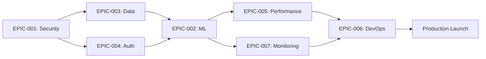

# 🚀 Sprint Board Master - Logo Recognition Platform

**Project:** Logo Recognition Production System
**Duration:** 4 Sprints (4 weeks)
**Team:** 3-5 Developers
**Methodology:** SCRUM with 1-week sprints

---

## 📊 Executive Sprint Overview

| Sprint | Theme | Story Points | Epics | Status |
|--------|-------|--------------|-------|---------|
| **Sprint 1** | Security & Foundation | 34 | EPIC-001, 003, 004 | 🔴 NOT STARTED |
| **Sprint 2** | ML & Core Features | 32 | EPIC-002, 003 | 🔴 NOT STARTED |
| **Sprint 3** | Performance & Monitoring | 28 | EPIC-005, 007 | 🔴 NOT STARTED |
| **Sprint 4** | DevOps & Production | 26 | EPIC-006, 007 | 🔴 NOT STARTED |

**Total Story Points:** 120
**Average Velocity Required:** 30 points/sprint

---

## 🏃 SPRINT 1: Critical Security & Foundation

### 🎯 Sprint Goal
Establish secure foundation with working data flow and authentication

### 📋 Sprint Backlog (34 points)

| ID | Epic | Story | Points | Assignee | Priority | Status |
|----|------|-------|--------|----------|----------|--------|
| US-001 | EPIC-001 | Implement Secure Configuration Management | 5 | DevOps | 🔴 CRITICAL | ⏳ Todo |
| US-002 | EPIC-001 | Implement Database Connection Pooling | 3 | Backend | 🔴 CRITICAL | ⏳ Todo |
| US-003 | EPIC-003 | Fix Database Integration Frontend to Backend | 8 | Full-Stack | 🔴 CRITICAL | ⏳ Todo |
| US-004 | EPIC-003 | Fix Image List API Endpoint | 5 | Backend | 🔴 CRITICAL | ⏳ Todo |
| US-005 | EPIC-004 | Implement Login/Logout UI | 5 | Frontend | 🔴 CRITICAL | ⏳ Todo |
| US-006 | EPIC-004 | Connect JWT Authentication Flow | 8 | Full-Stack | 🔴 CRITICAL | ⏳ Todo |

### 🔄 Daily Standup Template
```markdown
Date: [DATE]
Participants: [NAMES]

Developer 1:
- Yesterday: [COMPLETED]
- Today: [PLANNED]
- Blockers: [ISSUES]

Developer 2:
- Yesterday: [COMPLETED]
- Today: [PLANNED]
- Blockers: [ISSUES]
```

### ✅ Sprint 1 Definition of Done
- [ ] All security vulnerabilities addressed
- [ ] Database properly connected
- [ ] Authentication working end-to-end
- [ ] All tests passing
- [ ] Code reviewed and merged
- [ ] Deployed to staging

---

## 🤖 SPRINT 2: ML Core & Detection

### 🎯 Sprint Goal
Deploy ML models and implement working detection pipeline

### 📋 Sprint Backlog (32 points)

| ID | Epic | Story | Points | Assignee | Priority | Status |
|----|------|-------|--------|----------|----------|--------|
| US-007 | EPIC-002 | Deploy ONNX Model Files | 8 | ML Engineer | 🔴 CRITICAL | ⏳ Todo |
| US-008 | EPIC-002 | Implement Real Detection Pipeline | 8 | Backend | 🔴 CRITICAL | ⏳ Todo |
| US-009 | EPIC-003 | Connect MinIO Object Storage | 5 | Backend | 🔴 CRITICAL | ⏳ Todo |
| US-010 | EPIC-003 | Implement Image Optimization Pipeline | 5 | Backend | 🟡 HIGH | ⏳ Todo |
| US-011 | EPIC-002 | Connect Training Pipeline to Model Service | 6 | ML Engineer | 🟡 HIGH | ⏳ Todo |

### 📈 Sprint 2 Metrics
- Detection Accuracy Target: >95%
- Inference Speed Target: <500ms
- Storage Integration: Complete
- Model Deployment: Production Ready

---

## ⚡ SPRINT 3: Performance & Monitoring

### 🎯 Sprint Goal
Optimize performance and implement comprehensive monitoring

### 📋 Sprint Backlog (28 points)

| ID | Epic | Story | Points | Assignee | Priority | Status |
|----|------|-------|--------|----------|----------|--------|
| US-012 | EPIC-005 | Implement Code Splitting and Lazy Loading | 5 | Frontend | 🟡 HIGH | ⏳ Todo |
| US-013 | EPIC-005 | Add React Error Boundaries | 3 | Frontend | 🟡 HIGH | ⏳ Todo |
| US-014 | EPIC-007 | Implement Sentry Error Tracking | 5 | DevOps | 🟡 HIGH | ⏳ Todo |
| US-015 | EPIC-007 | Configure Prometheus Alerting | 5 | DevOps | 🟡 HIGH | ⏳ Todo |
| US-016 | EPIC-005 | Implement API Response Caching | 5 | Backend | 🟢 MEDIUM | ⏳ Todo |
| US-017 | EPIC-003 | Database Query Optimization | 5 | Backend | 🟢 MEDIUM | ⏳ Todo |

### 🎯 Performance Targets
- Bundle Size: <500KB
- API Response p95: <200ms
- Error Rate: <1%
- Monitoring Coverage: 100%

---

## 🚀 SPRINT 4: DevOps & Production Launch

### 🎯 Sprint Goal
Complete CI/CD setup and deploy to production

### 📋 Sprint Backlog (26 points)

| ID | Epic | Story | Points | Assignee | Priority | Status |
|----|------|-------|--------|----------|----------|--------|
| US-018 | EPIC-006 | Implement Complete CI/CD Pipeline | 8 | DevOps | 🔴 CRITICAL | ⏳ Todo |
| US-019 | EPIC-006 | Setup Load Testing | 5 | QA/DevOps | 🟡 HIGH | ⏳ Todo |
| US-020 | EPIC-001 | Security Audit and Fixes | 5 | Security | 🔴 CRITICAL | ⏳ Todo |
| US-021 | EPIC-007 | Complete Production Documentation | 5 | Team | 🟢 MEDIUM | ⏳ Todo |
| US-022 | EPIC-006 | Production Deployment | 3 | DevOps | 🔴 CRITICAL | ⏳ Todo |

### 🚦 Go-Live Checklist
- [ ] All tests passing
- [ ] Load testing complete
- [ ] Security audit passed
- [ ] Documentation complete
- [ ] Monitoring active
- [ ] Backups configured
- [ ] DNS configured
- [ ] SSL certificates valid

---

## 📊 Burndown Chart Template

```
Sprint 1 Burndown
Points
34 |*
30 |  *
25 |    *
20 |      *
15 |        *
10 |          *
5  |            *
0  |______________*
   M  T  W  T  F
```

---

## 🎯 Epic Dependencies & Critical Path



---

## 👥 Team Allocation Matrix

| Developer | Sprint 1 | Sprint 2 | Sprint 3 | Sprint 4 |
|-----------|----------|----------|----------|----------|
| **Backend Dev** | US-002, US-004 | US-008, US-009, US-010 | US-016, US-017 | Support |
| **Frontend Dev** | US-003, US-005 | Support | US-012, US-013 | Support |
| **DevOps** | US-001 | Support | US-014, US-015 | US-018, US-019, US-022 |
| **ML Engineer** | Support | US-007, US-011 | Support | Support |
| **Full-Stack** | US-003, US-006 | Support | Support | US-021 |

---

## 📈 Risk Register

| Risk | Sprint | Impact | Probability | Mitigation |
|------|--------|--------|-------------|------------|
| Model performance issues | 2 | 🔴 High | Medium | GPU provisioning, multiple models |
| Security vulnerabilities | 1 | 🔴 Critical | Medium | Early pen testing, code scanning |
| Database migration fails | 1 | 🔴 High | Low | Rollback scripts, backups |
| Load test failures | 4 | 🟡 Medium | Medium | Performance buffer time |
| Integration issues | 2-3 | 🟡 Medium | High | Continuous integration testing |

---

## 📋 Story Card Template

```markdown
━━━━━━━━━━━━━━━━━━━━━━━━━━━━━━━━━━━━━
📌 STORY CARD
━━━━━━━━━━━━━━━━━━━━━━━━━━━━━━━━━━━━━

ID: US-XXX
Epic: EPIC-XXX
Sprint: X
Points: X
Priority: 🔴 CRITICAL

**Story:**
As a [role]
I want to [action]
So that [benefit]

**Acceptance Criteria:**
✅ Criterion 1
✅ Criterion 2
✅ Criterion 3

**Technical Tasks:**
- [ ] Task 1
- [ ] Task 2
- [ ] Task 3

**Dependencies:**
- Depends on: US-XXX
- Blocks: US-XXX

**Notes:**
[Any additional context]

━━━━━━━━━━━━━━━━━━━━━━━━━━━━━━━━━━━━━
```

---

## 🏁 Sprint Ceremonies Schedule

### Week Schedule
| Day | Time | Ceremony | Duration | Participants |
|-----|------|----------|----------|--------------|
| Monday | 9:00 AM | Sprint Planning | 2 hours | All |
| Monday | 11:00 AM | Sprint Kickoff | 30 min | All |
| Daily | 9:00 AM | Daily Standup | 15 min | All |
| Wednesday | 2:00 PM | Mid-Sprint Check | 30 min | Lead + PO |
| Friday | 2:00 PM | Sprint Review | 1 hour | All + Stakeholders |
| Friday | 3:30 PM | Sprint Retrospective | 45 min | All |

---

## ✅ Master Definition of Done

### Story Level
- [ ] Code complete
- [ ] Unit tests written (>80% coverage)
- [ ] Integration tests passing
- [ ] Code reviewed (2 approvals)
- [ ] Documentation updated
- [ ] No critical bugs
- [ ] Deployed to staging
- [ ] Acceptance criteria verified
- [ ] Performance benchmarks met

### Sprint Level
- [ ] All committed stories completed
- [ ] Sprint goal achieved
- [ ] System integration tested
- [ ] Sprint demo conducted
- [ ] Retrospective completed
- [ ] Metrics tracked
- [ ] Technical debt documented
- [ ] Next sprint planned

### Release Level
- [ ] All epics completed
- [ ] Security audit passed
- [ ] Load testing passed
- [ ] Documentation complete
- [ ] Training materials ready
- [ ] Monitoring configured
- [ ] Backup/restore tested
- [ ] Production deployed
- [ ] Stakeholder sign-off

---

## 📊 Velocity Tracking

| Sprint | Committed | Completed | Velocity | Notes |
|--------|-----------|-----------|----------|-------|
| Sprint 1 | 34 | TBD | TBD | Security focus |
| Sprint 2 | 32 | TBD | TBD | ML deployment |
| Sprint 3 | 28 | TBD | TBD | Performance |
| Sprint 4 | 26 | TBD | TBD | Production |

**Target Velocity:** 30 points/sprint
**Total Points:** 120

---

## 🎉 Success Metrics

### Technical Metrics
- ✅ Zero security vulnerabilities
- ✅ Detection accuracy >95%
- ✅ Response time <500ms p95
- ✅ 99.9% uptime
- ✅ Zero data loss

### Business Metrics
- ✅ Production deployed on schedule
- ✅ All features delivered
- ✅ Under budget
- ✅ Team satisfaction >8/10
- ✅ Stakeholder approval

---

## 📚 Quick Links

- [Epic Portfolio](/docs/epics/EPIC-PORTFOLIO.md)
- [EPIC-001: Security](/docs/epics/epic-001-security-compliance.md)
- [EPIC-002: ML Platform](/docs/epics/epic-002-core-detection.md)
- [EPIC-003: Data Management](/docs/epics/epic-003-data-management.md)
- [EPIC-004: Authentication](/docs/epics/epic-004-authentication.md)
- [EPIC-005: Performance](/docs/epics/epic-005-performance.md)
- [EPIC-006: DevOps](/docs/epics/epic-006-devops.md)
- [EPIC-007: Monitoring](/docs/epics/epic-007-monitoring.md)

---

**Last Updated:** Sprint Planning Session
**Next Review:** Sprint 1, Day 1
**Document Owner:** Scrum Master

━━━━━━━━━━━━━━━━━━━━━━━━━━━━━━━━━━━━━━━━━━━━━━━━
🏆 **READY TO SPRINT!** 🏆
━━━━━━━━━━━━━━━━━━━━━━━━━━━━━━━━━━━━━━━━━━━━━━━━