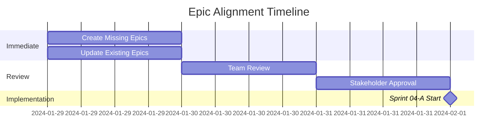

# Sprint 04 - Epic Alignment Analysis 📊

## Executive Summary
Sprint 04 bevat 9 user stories (139 story points) verdeeld over 3 sub-sprints. De huidige epic structuur dekt de meeste stories, maar er zijn significante gaps en inconsistenties die aangepast moeten worden.

---

## 🔍 Mapping Analysis: Sprint 04 Stories → Existing Epics

### Sprint 04-A: Core Recognition Foundation (42 points)

| Story ID | Story Title | Points | Mapped Epic | Status | Gap Analysis |
|----------|------------|--------|-------------|---------|--------------|
| **US-031** | Production-Grade Recognition REST API | 13 | EPIC-02: Core Detection Platform | ✅ Partial | Epic mentions REST API (RC-003) but lacks A++ quality specs |
| **US-032** | Enterprise Base64 Image Processing | 8 | EPIC-02: Core Detection Platform | ✅ Covered | Base64 support mentioned in RC-003 |
| **US-033** | Scalable Batch Recognition System | 21 | EPIC-02: Core Detection Platform | ⚠️ Partial | Batch API (RC-005) mentioned but not detailed |

**Alignment Score: 70%**

### Sprint 04-B: Testing & Quality Assurance (42 points)

| Story ID | Story Title | Points | Mapped Epic | Status | Gap Analysis |
|----------|------------|--------|-------------|---------|--------------|
| **US-034** | Enterprise Authentication & Authorization | 13 | EPIC-004: Authentication | ✅ Covered | JWT, RBAC, MFA all mentioned |
| **US-035** | Professional Recognition UI | 21 | EPIC-02: Core Detection | ⚠️ Partial | Web interface (RC-002) mentioned but lacks detail |
| **US-036** | Distributed Tracing & Monitoring | 8 | EPIC-007: Monitoring & Observability | ✅ Covered | APM and distributed tracing included |

**Alignment Score: 75%**

### Sprint 04-C: Performance & Production Readiness (55 points)

| Story ID | Story Title | Points | Mapped Epic | Status | Gap Analysis |
|----------|------------|--------|-------------|---------|--------------|
| **US-037** | Intelligent Error Handling System | 13 | ❌ **NO EPIC** | 🔴 Missing | No epic covers error handling comprehensively |
| **US-038** | Performance Optimization Suite | 21 | EPIC-005: Performance & Scalability | ✅ Covered | Performance targets align |
| **US-039** | Comprehensive Test Automation | 21 | ❌ **NO EPIC** | 🔴 Missing | No dedicated testing/quality epic |

**Alignment Score: 35%**

---

## 🚨 Critical Gaps Identified

### 1. **Missing Epic: Quality Assurance & Testing**
- **Impact:** 21 story points (US-039) not covered
- **Required Coverage:**
  - Test automation framework
  - 95%+ test coverage requirements
  - E2E, performance, security testing
  - CI/CD quality gates

### 2. **Missing Epic: Error Handling & Resilience**
- **Impact:** 13 story points (US-037) not covered
- **Required Coverage:**
  - Circuit breaker patterns
  - Graceful degradation
  - Self-healing mechanisms
  - Error budget tracking

### 3. **Incomplete Recognition System Epic (EPIC-02)**
- **Current State:** Basic features listed
- **Missing A++ Requirements:**
  - <200ms p99 response time specs
  - 1000+ RPS throughput requirements
  - ONNX optimization details
  - GPU management strategies

### 4. **Authentication Epic (EPIC-004) Lacks Enterprise Features**
- **Missing:**
  - Rate limiting per tier (Token Bucket)
  - API key rotation mechanisms
  - OAuth 2.0/OpenID Connect details
  - Session management with Redis

---

## 📈 Epic Coverage Analysis

```
Epic Coverage by Sprint 04 Stories:
━━━━━━━━━━━━━━━━━━━━━━━━━━━━━━━━━━━━

EPIC-002 (Core Detection):     ████████████░░░░ 75% (3 stories, partial)
EPIC-004 (Authentication):     ████████████████ 100% (1 story, full)
EPIC-005 (Performance):        ████████████████ 100% (1 story, full)
EPIC-007 (Monitoring):         ████████████████ 100% (1 story, full)
NO EPIC (Error Handling):      ░░░░░░░░░░░░░░░░ 0% (1 story, missing)
NO EPIC (Test Automation):     ░░░░░░░░░░░░░░░░ 0% (1 story, missing)

Overall Coverage: 66% (6 of 9 stories have epics)
```

---

## 🔧 Recommended Epic Adjustments

### 1. **Create New Epic: EPIC-008 - Quality Assurance & Testing**
```yaml
Epic: Quality Assurance & Testing
Priority: CRITICAL
Sprint: 04-C
Points: 21+
Features:
  - Comprehensive test automation (US-039)
  - 95%+ code coverage requirements
  - E2E test suite with Playwright
  - Performance testing with K6/Locust
  - Security testing (OWASP ZAP)
  - Visual regression testing
  - Contract testing (Pact)
  - Mutation testing
```

### 2. **Create New Epic: EPIC-009 - Error Handling & Resilience**
```yaml
Epic: Error Handling & Resilience
Priority: CRITICAL
Sprint: 04-C
Points: 13+
Features:
  - Intelligent error handling (US-037)
  - Circuit breaker implementation
  - Exponential backoff with jitter
  - Graceful degradation strategies
  - Self-healing mechanisms
  - Error budget tracking
  - Structured error responses (RFC 7807)
```

### 3. **Update EPIC-002: Core Detection Platform**
Add A++ quality specifications:
- Performance requirements (<200ms p99, 1000+ RPS)
- ONNX runtime optimization details
- GPU memory management
- Caching strategy (multi-layer)
- Batch processing optimization (1-1000 images)
- WebSocket real-time updates

### 4. **Update EPIC-004: Authentication**
Add enterprise features:
- Rate limiting implementation (Token Bucket algorithm)
- API key rotation and management
- OAuth 2.0 / OpenID Connect support
- MFA with TOTP
- Audit logging for all auth events

---

## 📋 Action Items

### Immediate Actions (Priority 1)
1. **Create EPIC-008**: Quality Assurance & Testing
2. **Create EPIC-009**: Error Handling & Resilience
3. **Update EPIC-002**: Add A++ performance requirements
4. **Update EPIC-004**: Add enterprise auth features

### Follow-up Actions (Priority 2)
1. **Review Epic Dependencies**: Ensure new epics integrate with existing ones
2. **Update Sprint Planning**: Assign epics to appropriate sprints
3. **Adjust Story Points**: Recalculate based on epic scope
4. **Update EPIC-PORTFOLIO.md**: Include new epics in master list

### Documentation Updates (Priority 3)
1. **Update epic files**: Add missing user stories
2. **Create epic dependency diagram**: Show relationships
3. **Update success metrics**: Include A++ grade requirements

---

## 🎯 Success Criteria for Alignment

### Complete Alignment Achieved When:
- [ ] 100% of Sprint 04 stories mapped to epics
- [ ] All A++ quality requirements documented in epics
- [ ] No conflicting requirements between epics and stories
- [ ] Epic dependencies clearly defined
- [ ] Resource allocation aligned with epic priorities

### Current Status:
- **Coverage:** 66% → Target: 100%
- **Quality Specs:** Partial → Target: Complete
- **Dependencies:** Unclear → Target: Documented
- **Resources:** Not aligned → Target: Allocated

---

## 📊 Risk Assessment

### High Risk Items
1. **Test Automation Gap**: No epic ownership for 95% test coverage requirement
2. **Error Handling Gap**: Critical for production readiness, not covered
3. **Performance Specs**: A++ requirements not fully documented in epics

### Mitigation Strategy
1. Immediate epic creation for gaps
2. Assign epic owners before Sprint 04-A starts
3. Review and approve updates in next planning session

---

## 📅 Timeline for Alignment



---

## Conclusion

**Critical Finding:** Sprint 04's A++ grade requirements are NOT fully reflected in the current epic structure. Two major epics are missing (Quality Assurance and Error Handling), and existing epics lack the detailed performance and quality specifications required.

**Recommendation:** IMMEDIATE action required to create missing epics and update existing ones before Sprint 04-A begins. This will ensure proper resource allocation, clear ownership, and achievement of A++ grade quality.

---

*Analysis Date: Current Sprint Planning*
*Next Review: Before Sprint 04-A Start*
*Status: ACTION REQUIRED 🚨*