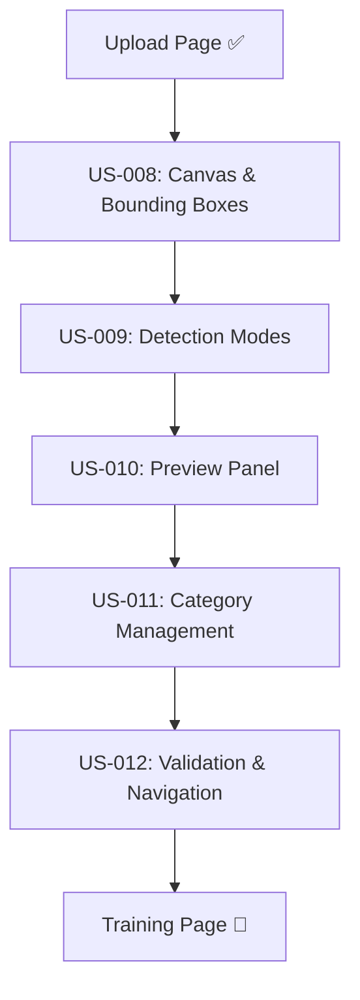

# Sprint 8-9: Complete Annotation Workflow - Story Summary

**Sprint Period:** Sprint 8-9
**Epic:** EPIC-01 Training System
**Total Story Points:** 39
**Status:** 📋 Ready for Development

---

## 🎯 **Overview**

Dit document presenteert een complete breakdown van de Smart Annotation System requirements in **5 logische user stories** die samen de gewenste UI flow implementeren:

1. **Upload images** ✅ (Reeds geïmplementeerd)
2. **Smart/Manual bounding box detection**
3. **Visual logo preview panel**
4. **Category & value assignment**
5. **Validation & training navigation**

---

## 📋 **User Stories Breakdown**

### **US-008: Interactive Canvas with Bounding Boxes**
- **Story Points:** 8
- **Priority:** Critical
- **Sprint:** 8

**Features:**
- Canvas met zoom functionaliteit (50%-400%)
- Bounding box creation en manipulation
- Visual feedback (hover states, delete icons)
- Drag & drop, resize functionaliteit
- Color coding systeem voor multiple boxes

### **US-009: Detection Modes (Smart & Manual)**
- **Story Points:** 13
- **Priority:** Critical
- **Sprint:** 8
- **Dependencies:** US-008

**Features:**
- Toggle switch tussen Smart Detection ⭄ Manual Mode
- Smart click detection met AI API integration
- Preview state met Accept/Reject/Adjust opties
- Manual drawing mode met real-time preview
- Fallback mechanism bij lage confidence

### **US-010: Cropped Preview Panel**
- **Story Points:** 5
- **Priority:** High
- **Sprint:** 8
- **Dependencies:** US-008, US-009

**Features:**
- Automatic preview generation van bounding boxes
- Rechterpanel met cropped logo images
- Bidirectional synchronization (canvas ↔ panel)
- Delete functionality van beide kanten
- Real-time updates bij bounding box changes

### **US-011: Category & Value Management**
- **Story Points:** 8
- **Priority:** High
- **Sprint:** 9
- **Dependencies:** US-010

**Features:**
- Category dropdown met autocomplete filter
- Value input met suggestions
- "Add new category" functionality
- Category-value validation en duplicate prevention
- Historical suggestions gebaseerd op eerdere gebruik

### **US-012: Validation & Training Navigation**
- **Story Points:** 5
- **Priority:** High
- **Sprint:** 9
- **Dependencies:** US-011

**Features:**
- Real-time validation van alle annotations
- Progress tracking en visual indicators
- "Continue to Training" button met validation checks
- Auto-save functionaliteit
- Navigation guards tegen data verlies

---

## 🔄 **Dependencies Flow**



---

## 🎨 **Complete UI Flow Overview**

### **Step 1: Smart Click Detection**
```
Canvas met afbeelding → Gebruiker klikt op logo → AI detecteert boundaries →
Preview met confidence → Accept/Reject/Adjust → Finale bounding box
```

### **Step 2: Preview & Categorization**
```
Bounding box created → Cropped preview verschijnt rechts →
Category dropdown → Value input → Auto-suggestions → Validation
```

### **Step 3: Multiple Logos**
```
Herhaal stap 1-2 voor elk logo → Progress tracking →
Visual indicators (✅/⚠️) → Real-time validation
```

### **Step 4: Training Preparation**
```
Alle logos gecategoriseerd → Progress 100% →
Continue button enabled → Navigate naar training
```

---

## 🛠️ **Technical Architecture**

### **Component Hierarchy**
```
AnnotationPage
├── CanvasContainer
│   ├── InteractiveCanvas (US-008)
│   ├── DetectionModeToggle (US-009)
│   └── ZoomControls
├── PreviewPanel (US-010)
│   ├── PreviewCard[]
│   └── CategoryValueAssignment (US-011)
└── ValidationSummary (US-012)
    ├── ProgressTracker
    └── ContinueButton
```

### **State Management**
```typescript
interface AnnotationState {
  // US-008: Canvas state
  boundingBoxes: BoundingBox[];
  selectedBox: string | null;
  zoom: number;

  // US-009: Detection state
  detectionMode: 'smart' | 'manual';
  previewBoundary: BoundingBox | null;
  confidence: number;

  // US-010: Preview state
  previews: LogoPreview[];

  // US-011: Category state
  annotations: LogoAnnotation[];
  categories: Category[];
  values: CategoryValue[];

  // US-012: Validation state
  validationState: ValidationState;
  canProceedToTraining: boolean;
}
```

### **API Integration Points**
```typescript
// US-009: Smart Detection
POST /api/v1/training/smart-detect

// US-011: Category Management
GET  /api/v1/training/categories
POST /api/v1/training/categories
GET  /api/v1/training/categories/{id}/values

// US-012: Validation & Save
POST /api/v1/training/annotations/autosave
GET  /api/v1/training/annotations/validate
```

---

## 📊 **Sprint Planning Recommendations**

### **Sprint 8 (Foundational - 21 SP)**
- ✅ **US-008:** Interactive Canvas (8 SP)
- ✅ **US-009:** Detection Modes (13 SP)

**Deliverable:** Working canvas met smart/manual detection

### **Sprint 9 (Completion - 18 SP)**
- ✅ **US-010:** Preview Panel (5 SP)
- ✅ **US-011:** Category Management (8 SP)
- ✅ **US-012:** Validation & Navigation (5 SP)

**Deliverable:** Complete annotation workflow ready voor training

---

## 🧪 **Testing Strategy**

### **Integration Testing Priority**
1. **Canvas ↔ Preview synchronization** (US-008 + US-010)
2. **Smart detection → categorization flow** (US-009 → US-011)
3. **Complete workflow validation** (All stories)

### **E2E Testing Scenarios**
- [ ] Upload → Smart detect → Categorize → Validate → Continue
- [ ] Upload → Manual draw → Categorize → Validate → Continue
- [ ] Multiple logos per image workflow
- [ ] Error recovery en validation scenarios

---

## 🎯 **Success Criteria**

### **Functional Requirements Met**
- [ ] Smart click detection met 80%+ accuracy
- [ ] Bidirectional canvas-preview synchronization
- [ ] Complete category/value management
- [ ] 100% validation before training navigation
- [ ] Auto-save en data recovery

### **UX Requirements Met**
- [ ] Intuitive single-click logo selection
- [ ] Clear visual feedback voor alle states
- [ ] Smooth transitions tussen detection modes
- [ ] Real-time progress tracking
- [ ] Error prevention en helpful messaging

### **Performance Requirements Met**
- [ ] Smart detection <2 seconden response
- [ ] Canvas operations 60fps smooth
- [ ] Preview generation <100ms
- [ ] Real-time validation <50ms
- [ ] Auto-save non-blocking

---

## 📋 **Definition of Done (Collective)**

### **Development Complete**
- [ ] Alle 5 user stories implemented en tested
- [ ] Cross-story integration working
- [ ] Performance requirements satisfied
- [ ] API integration complete met fallbacks
- [ ] Error handling comprehensive

### **Quality Assurance**
- [ ] Unit tests ≥85% coverage across all stories
- [ ] Integration tests voor critical paths
- [ ] E2E tests voor complete workflows
- [ ] Cross-browser compatibility verified
- [ ] Mobile responsiveness tested

### **Production Ready**
- [ ] Feature flags configured voor gradual rollout
- [ ] Monitoring en alerting setup
- [ ] Documentation complete (user + technical)
- [ ] Rollback plan documented
- [ ] Stakeholder acceptance received

---

## 🔗 **Related Documents**

- [Epic-01: Training System](../prd/epic-01-training-system.md)
- [Technical Architecture](../architecture.md)
- [Original Analysis](./sprint-07-complete-annotation-flow.md)

---

Deze 5 user stories implementeren exact de requirements die je beschreven hebt en vormen samen een complete, productie-ready annotation workflow die gebruikers in staat stelt om efficiënt logo's te detecteren, categoriseren en voor te bereiden voor model training.